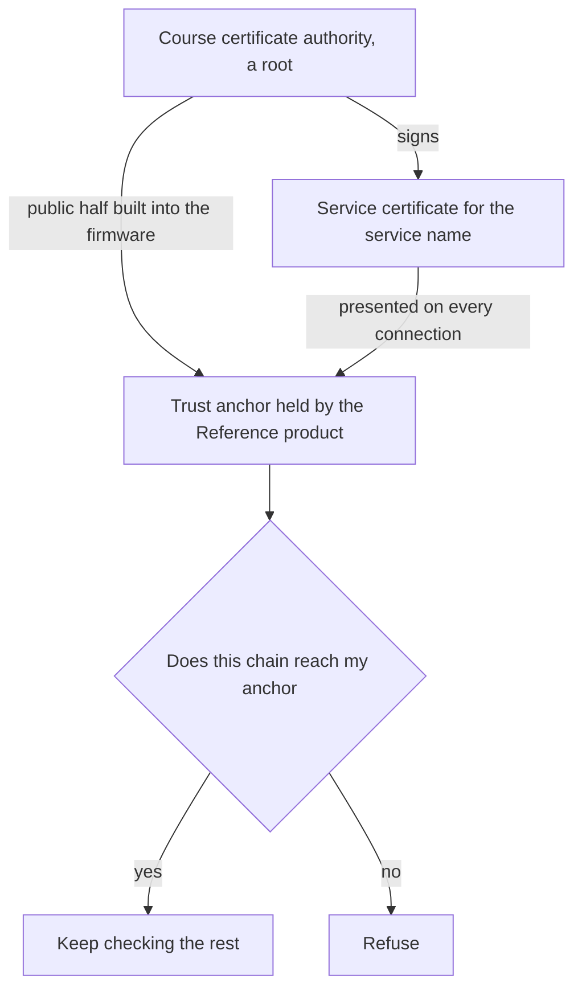

# Cryptography primer

This page defines the cryptography words that the rest of this course uses. It is a companion page and not a tier. Reading it takes about twenty minutes.

Read it once before [Tier 2: Authenticate and encrypt the server connection](tiers/tier-02-authenticated-https/index.md), which is the first tier that needs these words. Later tiers link back to single sections here, so you can return for one definition without reading the page again.

Back to the [course landing page](index.md).

## What this page is

This page has one job. It gives you the meaning of a word before a tier uses it, so that you never have to guess what a tier is talking about.

Every section does the same four things. It names a term. It gives you a plain definition. It says what this course uses the term for. It says where in the course you first meet it.

What is deliberately absent matters as much. There is no mathematics here, and no description of how any algorithm works inside. There is no advice about choosing algorithms for a product of your own, because that decision needs the context of your product and cannot come from a primer. There is also no explanation of which attack any of this stops. Working that out is what the tiers are for, and a tier that hands you its own conclusion in advance has nothing left to teach you.

You will not implement anything on this page. From Tier 2 onward you will read output that uses these words, and that is what this page prepares you for.

## Bytes, hashes and digests

A hash function takes any amount of data and produces a short value of a fixed length. That short value is called a digest.

Three properties make it useful. The same bytes always produce the same digest. A change anywhere in the bytes, even of one bit, produces a completely different digest. And you cannot work backwards from a digest to the data it came from.

A digest is therefore a short, checkable name for a large amount of data. Two parties who each hold the same digest can agree that they hold the same bytes, without sending the bytes to each other.

A digest on its own says nothing about who produced the data. Anyone can compute the digest of anything, so anyone who changes the data can also compute the new digest to match it.

**What the course uses it for.** The release record has named the digest of a firmware image since Tier 0. From Tier 3 a signature is computed over a digest rather than over the whole image, because the digest is short and the image is not. From Tier 4 the device checks the digest of what it downloaded against the signed Release manifest. `SHA-256` is the hash function this course uses.

**Where you first meet it.** Tier 0.

## A key pair

A key pair is two keys that are generated together and belong together.

One of them is kept secret and never leaves its holder. That is the private key, also called the private half. The other is handed out to anyone who wants it. That is the public key, also called the public half.

The two halves are not interchangeable. What one half does, only the other half can undo. Everything else on this page is built on that one property.

You cannot work out the private half from the public half. This is why publishing the public half costs you nothing, and that is the whole trick. Two parties who have never met can work together, because one of them can publish something in the open and still keep a secret.

One consequence is worth stating plainly. Every control in this course that uses a key pair depends on whether the private half stayed private, and nothing else on this page repairs the loss of a private key.

**What the course uses it for.** The Release signing key in Tier 3 is a key pair whose private half stays offline. Each device generates a key pair of its own in Tier 6, and another one in Tier 7. Every certificate in the course is a statement about the public half of some key pair.

**Where you first meet it.** Tier 2. From Tier 3 onward it is the central object of the course.

## Signing and verifying

Signing takes some bytes and a private key, and produces a short value called a signature.

Verifying takes three inputs: the same bytes, the signature, and the public half of the key that signed. It answers one question, with yes or no. Were these exact bytes signed by the holder of that private key?

A signature therefore proves two things at once. It proves origin, which is that the signer held the private half. It proves integrity, which is that the bytes have not changed since they were signed. Change one byte and verification fails.

Be just as clear about what a signature does not prove. It does not make the bytes secret. It does not say when they were signed. It does not say that they are the bytes you wanted. Tier 3 and Tier 4 are each built on one part of that sentence, so keep it in mind rather than working it out now.

**What the course uses it for.** From Tier 3 the bootloader verifies an Image signature before it runs an image. From Tier 4 the application verifies a signed Release manifest. A certificate is checked the same way, because a certificate is signed data.

**Where you first meet it.** Tier 3. It is used again in Tiers 4, 6 and 7.

## Encrypting and authenticating

Encrypting data makes it unreadable to anyone who does not hold the right key. Decrypting turns it back into the original data.

Authenticating means establishing who you are dealing with. On an authenticated connection you know which party answered you.

These are two separate properties. Separate mechanisms provide them, and a system can have one of them without the other.

This page stops there on purpose. Tier 2 asks you to write down what follows from those two properties being separate, before it shows you, and an answer printed here would take that exercise away from you.

**What the course uses it for.** Tier 2 adds both properties to the connection between the Reference product and the OTA service. Tier 6 encrypts a record stored on the device.

**Where you first meet it.** Tier 2.

## A certificate

A certificate is a public key and a name, signed by somebody else. It adds a signed statement about who the key belongs to and until when.

On its own, a public key is an anonymous number. A certificate attaches a name to that number and has somebody else put their signature under the claim.

Every certificate in this course carries at least these parts.

| Part | What it says |
| --- | --- |
| Subject | The name this certificate is about |
| Public key | The public half of the subject's key pair |
| Issuer | The name of whoever signed this certificate |
| Validity period | The dates between which the issuer intends it to be used |
| Signature | The issuer's signature over all of the above |

A certificate is public and holds no secret. The matching private half is never inside it and never leaves its holder. Sending somebody a certificate is safe. Sending them the matching private key ends every guarantee the certificate provided.

`X.509` is the certificate format that every certificate in this course uses. The name that a client checks is held in the subject alternative name field, usually written `SAN`, rather than in the subject alone.

**What the course uses it for.** From Tier 2 the OTA service presents a certificate, so the device can tell which service answered. From Tier 6 each device holds a certificate of its own, and from Tier 7 a second one that names an owner.

**Where you first meet it.** Tier 2.

## Certificate authorities, chains and trust anchors

A certificate authority is a party that signs certificates for other parties. The usual abbreviation is CA.

A chain is what you get when the certificate you were given was signed by an authority whose own certificate was signed by another authority, and so on. You check one link at a time, by verifying each signature with the public key in the certificate above it.

A chain has to stop somewhere, and where it stops is a decision rather than a discovery. A trust anchor is public material that you already hold and already believe, so that a chain reaching it is a chain you can stop checking. A trust anchor can be a certificate, and it can also be a bare public key with no certificate at all. In this course the trust anchors are built into the firmware image rather than fetched over the network, which is what makes them hard for an attacker on the network to replace.

The topmost authority in a chain signs its own certificate. Its subject and its issuer are the same name, and that is what the course means by a root. Nothing vouches for a root. It is believed because you put it there yourself.

The diagram is not the answer, so here it is in words. The device holds the authority's public half. The service presents a certificate that the authority signed. The device decides for itself whether the presented certificate leads back to what it already holds.

One consequence is worth carrying into Tier 2. The device holds the authority and not the service's own certificate. That is why the service can be given a new certificate without every board being reflashed, and it is also why the authority's private half is the most valuable secret in the whole arrangement.

**What the course uses it for.** From Tier 2 the Course certificate authority signs the certificate that the OTA service presents. Tier 6 adds an authority that issues Factory identities, and Tier 7 adds a separate one that issues Operational identities.

**Where you first meet it.** Tier 2, and again at every tier that deals with identity.

## Asking for a certificate

You do not ask an authority for a key pair. You generate the pair yourself, keep the private half, and ask for a certificate for the public half.

The message you send is a certification request. It is usually abbreviated CSR, from the older name certificate signing request. It carries the public half of your key pair and the name you are asking for, and it is signed by the matching private half.

That self-signature is the point of the message. It is proof of possession: evidence, carried inside the request itself, that the sender holds the private half of the key the request presents. The authority verifies the request with the public key the request carries, and refuses the request when that check fails.

Without the check, anyone could take a public key belonging to somebody else, put their own name beside it, and be issued a certificate naming them over a key they cannot use. Every later check that trusted that certificate would then be checking the wrong party.

A certification request is not a certificate and grants nothing on its own. The authority still decides separately whether the requester may have the name they asked for, because proof of possession answers only the narrower question of whether the key is theirs.

**What the course uses it for.** In Tier 6 the device generates a key pair on the board and sends a certification request to the provisioning station, which issues its Factory identity. In Tier 7 it does the same for its Operational identity.

**Where you first meet it.** Tier 6.

## Freshness and the nonce

A signature does not get old. A message that verified correctly a year ago still verifies correctly today, and a copy of a signed message is exactly as valid as the original. Nothing inside a signature says when it was made or how many times it has been used.

Freshness is the property that a message belongs to the exchange happening now rather than to an earlier one. Signing does not provide it. It has to be arranged separately.

A nonce is a number used once. The usual arrangement is that one party chooses a value that is new and hard to predict, sends it, and requires it back inside the answer. An answer copied from an earlier exchange does not carry the new value, so the receiver can tell the two apart.

The course uses the word for two unrelated jobs, and it helps to keep them apart. A Claim nonce in Tier 7 is a one-use secret that a device prints on its console, so that whoever presents it has to have been standing at the device. A nonce in encrypted storage in Tier 6 is a per-record value that must never repeat under the same key, and it is not a secret at all. The only idea they share is that a value is used once.

**What the course uses it for.** In Tier 6 every encrypted storage record carries a nonce, and the tier records a limit about how that nonce is chosen. Tier 7 builds a two-party claim around the Claim nonce.

**Where you first meet it.** Tier 6, then throughout Tier 7.

## Names you will meet

These names appear in course output and in tier text. You need to know what kind of thing each one is. You do not need to know how any of them works, and this table does not tell you.

| Name | What kind of thing it is |
| --- | --- |
| SHA-256 | The hash function this course uses |
| ECDSA | The signature scheme this course signs with |
| P-256 | The elliptic curve that the course's ECDSA keys use |
| AES-GCM | The encryption the course uses for stored records, and one of the choices inside TLS |
| AEAD | The general name for encryption that also detects tampering. AES-GCM is one |
| TLS | Transport Layer Security, the protocol that authenticates and encrypts a connection |
| HTTPS | HTTP carried over TLS |
| Mutual TLS | A TLS connection on which both ends present a certificate |
| OTA | Over the air, the software update path that this whole course hardens |
| X.509 | The certificate format |
| ASN.1 | The description language that X.509 is written in |
| DER | The exact byte encoding in which a certificate is stored and sent |
| PKCS#8, SEC1 | Two file formats that a private key can be stored in |
| SAN | Subject alternative name, the certificate field that holds the name a client checks |

## Where each idea is used

Use this table if you arrived here from a link inside a tier and want to know what else you were meant to have read.

| Idea | Section on this page | First needed in |
| --- | --- | --- |
| Hash, digest | [Bytes, hashes and digests](#bytes-hashes-and-digests) | Tier 0 |
| Key pair, public and private halves | [A key pair](#a-key-pair) | Tier 2 |
| Encryption, authentication | [Encrypting and authenticating](#encrypting-and-authenticating) | Tier 2 |
| Certificate | [A certificate](#a-certificate) | Tier 2 |
| Certificate authority, chain, trust anchor | [Certificate authorities, chains and trust anchors](#certificate-authorities-chains-and-trust-anchors) | Tier 2 |
| Signing, verifying | [Signing and verifying](#signing-and-verifying) | Tier 3 |
| Certification request, proof of possession | [Asking for a certificate](#asking-for-a-certificate) | Tier 6 |
| Nonce, freshness | [Freshness and the nonce](#freshness-and-the-nonce) | Tier 6 |

### Further reading

Every reading here is optional. The course does not require any of them, and no tier assumes you have read them. Read one when a definition above left you wanting the precise version.

| Reading | Level | Type | Learning question it answers | Where to read |
| --- | --- | --- | --- | --- |
| [RFC 5280, Internet X.509 Public Key Infrastructure Certificate and CRL Profile](https://www.rfc-editor.org/rfc/rfc5280) | Optional | Normative | What is inside a certificate, and what does it mean to follow a chain to a trust anchor? | Section 1 for the overview and Section 3.2 for certification paths. Do not read the whole document. |
| [RFC 2986, PKCS #10 Certification Request Syntax Specification](https://www.rfc-editor.org/rfc/rfc2986) | Optional | Normative | What does a certification request actually carry, and where does the proof of possession sit? | Section 3 and Section 4. |
| [RFC 4949, Internet Security Glossary, Version 2](https://www.rfc-editor.org/rfc/rfc4949) | Optional | Explanatory | What is the precise meaning of a security term that a tier uses in passing? | Look up single terms. It is a dictionary and it is not read from start to finish. |

### Where to go next

Go to [Tier 2: Authenticate and encrypt the server connection](tiers/tier-02-authenticated-https/index.md), which is the first tier that uses everything above.

Back to the [course landing page](index.md).
