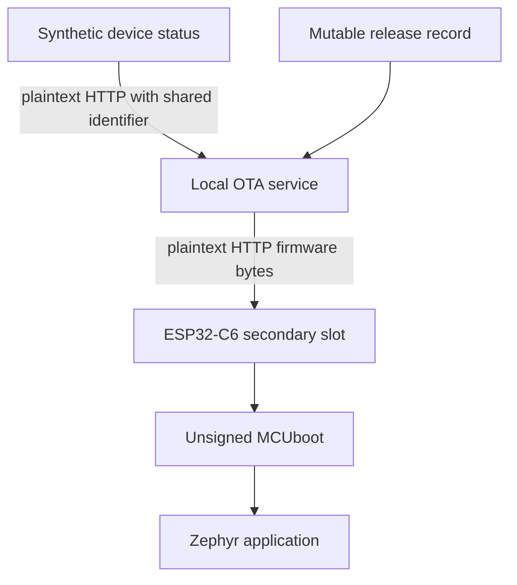

# Tier 0: Build the unsecured reference product

## Incident brief

An industrial status beacon downloads firmware and reports a machine state over the local network.

The product works, but the network and update path have no security controls.

A local actor can read the HTTP exchange, claim another synthetic device identifier, imitate the OTA service, and provide an altered unsigned image.

Your task is to build this baseline, reproduce each safe fixture, and record what is absent.

## Learning result

After this tier, you can:

- Build the ESP32-C6 Reference product with unsigned MCUboot.
- Run the local HTTP OTA service.
- Explain why functional behavior is not secure behavior.
- Demonstrate seven controlled Tier 0 weaknesses with four fixtures.
- Keep hardware-only results pending when no physical board is available.
- Create the first Lab artifacts and Weakness ledger.

## Safety boundary

Run this tier only against the disposable Course environment created by `./course setup`.

Use only synthetic identifiers and generated firmware.

The fixtures target loopback inside the dev container and refuse public addresses, ranges, wildcards, discovery, redirects, and DNS names other than `localhost`.

Every fixture is a dry run unless you provide `--execute` with the exact fixture identifier.

## Starting state

You need the dev container running, as described on the course landing page. All commands in this tier run inside it, from the repository root.

You need the local update service running. Check it:

```text
./course service status
```

Expected result:

```text
Process: ota running as pid <number>
+ curl --fail http://127.0.0.1:8080/health
Result: OTA service is healthy
Reachable by the Reference product at http://192.168.0.10:8080
```

The address on the last line is the one you gave to `./course setup --bind`. It is the address a physical board will use.

The pinned toolchain is Zephyr 4.4.2, MCUboot 2.4.0, and Zephyr SDK 1.0.1. The container provides all three.

A physical ESP32-C6 is optional for the host work and required for flash, serial, LED, Wi-Fi, and altered-image execution evidence. A board needs a Linux machine.

## Weakness ledger before the work

| Identifier | Weakness | Attack vector | Expected Tier 0 result | Planned tier |
| --- | --- | --- | --- | --- |
| T0-W-01 | HTTP has no confidentiality | Read the local release record and firmware response | Fields and bytes are readable | Tier 2 |
| T0-W-02 | The service trusts the device identifier in the request body | Submit the second manifest-owned identifier | Spoofed status is accepted | Tier 7 |
| T0-W-03 | The device trusts an unauthenticated service | Use the marker-matching local impersonation service | Hostile release data is accepted | Tier 2 |
| T0-W-04 | MCUboot accepts unsigned images | Serve the generated altered image | The device installs and runs it | Tier 3 |
| T0-W-05 | The release record is mutable | Replace the current release record | The new record is served | Tier 4 |
| T0-W-06 | No anti-rollback policy exists | Assign an older release after a newer one | The device installs the older release | Tier 4 |
| T0-W-07 | No test boot or recovery proof exists | Install any image | The install is a permanent overwrite with no revert | Tier 5 |

Seven weaknesses, four fixtures. One fixture can expose more than one weakness, and two of them are shown by the reset step rather than the attack step.

## Reproduce the controlled attacks

### Predict

Before you run anything, write down:

1. Which asset does each fixture expose?
2. Which component decides whether downloaded firmware may run?
3. Which observation cannot be made without a physical device?

### Inspect the fixture plan

Every fixture is a dry run until you add `--execute`. Look before you act:

```text
./course attack list
./course attack run tier-00/plaintext-inspection
```

Expected result ends with:

```text
Marker matched: course_id=learning-cyber-security environment_id=<identifier> tier=00 synthetic_data=true
Expected insecure effect: HTTP release fields and firmware bytes are readable.
Changes: artifacts/generated/attacks/tier-00/plaintext-inspection
Reset: ./course attack reset tier-00/plaintext-inspection
Result: dry run only
Execute: ./course attack run tier-00/plaintext-inspection --execute tier-00/plaintext-inspection
```

The marker line matters. A fixture refuses to run unless the target announces the same disposable Course environment that your own `./course setup` created. That is what keeps these attacks pointed at your own lab.

Repeat the dry run for the other three fixtures.

## Investigate the missing boundaries

Answer:

1. Which component supplies firmware bytes?
2. Which component decides whether those bytes may run?
3. What proves the service identity?
4. What proves the device identity?
5. What proves the firmware publisher identity?
6. Which result cannot be claimed without physical hardware?

This is the Tier 0 path:



Read the diagram as a list of decisions nobody makes. Nothing proves who the service is. Nothing proves who the device is. Nothing proves who built the firmware. MCUboot runs whatever arrives.

No authenticated trust boundary exists anywhere in this path.

## Build and run the baseline

### The network address is compiled in

The Reference product joins one Wi-Fi network and talks to one service address. You supplied both to `./course setup` on the landing page.

Both values are compiled into the firmware image. Tier 0 has no way to change them on the device. That is itself a limitation worth noticing: a device that cannot be reconfigured also cannot be recovered by reconfiguring it.

If you gave a loopback address, a physical board cannot reach the service. Run setup again with your machine's private address before you build.

### Build the pinned firmware

```text
./course build firmware
```

Expected result:

```text
Generated: .course-state/firmware/baseline.conf for 192.168.0.10:8080, network "course-lab"
+ COURSE_FIRMWARE_CONF=<path> ZEPHYR_BUILD_DIR=<path> ./scripts/build-zephyr-baseline.sh
Result: built baseline release tier-00-baseline, 590396 bytes
```

`ZEPHYR_WORKSPACE` needs no prefix. The container already sets it.

The build copies the finished image to `artifacts/generated/releases/tier-00-baseline.bin` and makes it the release the service assigns.

The firmware models steady, fast-blink, and slow-blink states and reports the state on the serial console. The onboard LED of the validated board cannot be driven, so there is no LED output to observe.

The firmware joins the Wi-Fi network, reports its status over plain HTTP, reads its update assignment, and installs any release the service names.

Flash, serial logs, and OTA installation stay pending until you test them on a physical ESP32-C6.

### Flash the board and watch it work

This step needs a physical ESP32-C6 on a Linux machine. Skip it otherwise and keep the hardware fields pending.

Attach one board, then run:

```text
./course device flash
```

The command refuses to continue when no board is attached, or when more than one Espressif board is attached. It writes normal flash only. It runs no eFuse, secure boot, or flash encryption command.

Watch the device:

```text
./course device logs
```

Press the board's reset button. Expected result:

```text
ESP32-C6 Reference product: intentionally unsecured Tier 0
Image label: baseline
Running release: tier-00-baseline
wifi.connecting ssid=course-lab security=wpa2-psk band=2.4GHz
wifi.association succeeded ssid=course-lab
wifi.address 192.168.0.34 assigned by DHCP
ota.assignment release_id=tier-00-baseline version=0.0.0-insecure image=tier-00-baseline.bin
ota.assignment matches the running release, nothing to install
```

Leave the log view with Ctrl-].

The device repeats this exchange every 30 seconds. Every status report crosses the network in plain text and names the shared device identifier.

## Run the fixtures

Run each one:

```text
./course attack run tier-00/plaintext-inspection --execute tier-00/plaintext-inspection
./course attack run tier-00/device-id-spoofing --execute tier-00/device-id-spoofing
./course attack run tier-00/service-impersonation --execute tier-00/service-impersonation
./course attack run tier-00/altered-image --execute tier-00/altered-image
```

Expected final line of each:

| Fixture | Expected result line |
| --- | --- |
| `tier-00/plaintext-inspection` | `Result: plaintext release version 0.0.0-insecure and 47 firmware bytes were readable` |
| `tier-00/device-id-spoofing` | `Result: service accepted the spoofed manifest-owned device identifier` |
| `tier-00/service-impersonation` | `Result: marker-matching HTTP service impersonation supplied a hostile mutable release record` |
| `tier-00/altered-image` | `Result: altered unsigned image was built for the board and delivered by the service` |

Each run prints `Reset result: passed` and writes a JSON record under `artifacts/generated/attacks/`.

Each run resets the service to the Tier 0 seed when it finishes. The insecure state does not persist by accident.

Without a board, the altered-image record must state that physical acceptance and execution are pending.

### Watch the device accept the altered image

This step needs a physical ESP32-C6. Skip it when you have no board, and keep the hardware fields pending.

Build the altered image. It is a complete, runnable firmware image that reports a different label and a different machine state:

```text
./course build firmware --variant altered
```

Start the log view in a second terminal:

```text
./course device logs
```

Then publish the altered image as the current release. The fixture holds the insecure state only while it runs, so give the device time to poll:

```text
./course attack run tier-00/altered-image --execute tier-00/altered-image --hold 200
```

Within one poll interval the device reads the new assignment and installs it. Expected result:

```text
ota.assignment release_id=tier-00-altered version=0.0.0-altered image=tier-00-altered.bin
ota.assignment differs from running release tier-00-baseline, installing without any check
ota.install starting release_id=tier-00-altered version=0.0.0-altered size=590396
ota.install declared_sha256=... (Tier 0 does not check it)
ota.install wrote 590396 bytes to the secondary slot
ota.upgrade requested permanent overwrite, no test boot, no rollback
Rebooting into the newly installed image
```

MCUboot then overwrites the running image with the downloaded one:

```text
I: Image index: 0, Swap type: perm
I: Image 0 upgrade secondary slot -> primary slot
I: Erasing the primary slot
I: Image 0 copying the secondary slot to the primary slot: 0x90240 bytes
I: Jumping to the first image slot
```

After the reboot the board runs the altered image:

```text
Image label: altered
Running release: tier-00-altered
Beacon state: fast, toggle period: 200 ms
```

The device accepted firmware from an unauthenticated service, with no signature and no publisher identity. Nothing in Tier 0 could have stopped it. That is `T0-W-04`.

The permanent overwrite is `T0-W-07`. There was no test boot and no way back.

Return the device to the baseline:

```text
./course attack reset tier-00/altered-image
```

The service assigns the baseline release again. The device installs it on its next poll and reports `Image label: baseline`.

Notice what the reset just proved. The device accepted an older release over a newer one without complaint, because Tier 0 has no anti-rollback policy. That is `T0-W-06`, and you demonstrated it by undoing your own attack.

Record what you observed in the accepted-image record. Set `device_flash`, `device_boot`, and `serial_record` to your observation. Keep `led_behavior` pending, because the validated board cannot drive its onboard LED.

## Replay the original observation

No security control is added in Tier 0.

The same fixtures still produce the same insecure effects after reset. Nothing you did in this tier changed that, because this tier adds nothing to change it.

Tier 1 will turn these observations into threats, requirements, Security claims, and planned controls. It will not make the attacks fail either. The first tier that stops an attack is Tier 2.

## Test safety and failure behavior

The fixtures are supposed to refuse unsafe instructions. Confirm that they do.

Point a fixture at a third-party address:

```text
./course attack run tier-00/plaintext-inspection --target http://example.com --execute tier-00/plaintext-inspection
```

Expected result:

```text
refused: DNS names other than localhost are refused
```

Run a fixture with the wrong execution identifier:

```text
./course attack run tier-00/plaintext-inspection --execute tier-00/altered-image
```

Expected result:

```text
refused: --execute value must exactly match the fixture identifier
```

If a reset fails, the fixture is blocked and refuses to run again. Run the exact reset command it names before another attempt.

Record these three refusals. A control that refuses correctly is evidence, exactly like an attack that succeeds.

## Weakness ledger after the work

| Identifier | Observed result | Status | Evidence |
| --- | --- | --- | --- |
| T0-W-01 | Metadata and image bytes were readable | Open | Plaintext fixture JSON |
| T0-W-02 | The spoofed identifier was accepted | Open | Device-ID fixture JSON |
| T0-W-03 | The impersonation record was accepted | Open | Impersonation fixture JSON |
| T0-W-04 | The altered image was delivered and run | Open | Altered-image fixture JSON, accepted-image record |
| T0-W-05 | The replaced release record was served | Open | Altered-image fixture JSON |
| T0-W-06 | The device installed the older release | Open | Serial record after reset |
| T0-W-07 | The install overwrote the running image with no revert | Open | Serial record during install |

Every weakness stays open. Tier 0 closes nothing, by design.

This table states the result you should expect to observe. If you observed something different, record what you actually saw and raise it with a Mentor. Do not edit the observation to match the table.

## Security claim and evidence status

Tier 0 makes no positive Security claim.

The supported statement is limited to what you observed: the local service and fixtures reproduce the intended insecure effects.

Without a board, the firmware build supports only a build claim for the pinned target. Physical flash, serial output, Wi-Fi behavior, and altered-image execution stay pending.

With a board, you can record flash, serial output, Wi-Fi association, the HTTP exchange, the OTA download, and altered-image execution as observed. LED behavior stays pending, because the validated board cannot drive its onboard LED.

Run `./course device status` to see which hardware results the course currently claims.

## Update the Security evidence pack

Create the Learner evidence directory and copy the four templates:

```text
mkdir -p evidence/learner/tier-00
cp evidence/templates/tier-00/*.json evidence/learner/tier-00/
./course evidence context
```

The context command prints the current source revision, Course environment identifier, marker fingerprint, and latest fixture evidence paths.

Do not edit the files under `evidence/examples/`. They show the shape only.

Update:

- The baseline architecture.
- The captured HTTP exchange.
- The accepted-image record, with hardware fields still pending when not observed.
- The deliberately absent controls.
- `created_at`, `source_revision`, `environment.environment_id`, and `environment.marker_fingerprint` in every record.
- The fixture evidence paths.

Set the architecture, HTTP exchange, and absent-controls records to `observed`. Keep the accepted-image record `pending` when no physical ESP32-C6 was used. Never replace a pending hardware field with a host-only result.

Then run:

```text
./course evidence check
```

Expected result:

```text
Learner Tier 0 evidence is complete and bound to the current revision and Course environment
```

## Troubleshooting

| Observation | First check |
| --- | --- |
| The service does not start | Run `./course service status`, then read `.course-state/ota.log` |
| The service is already running | Run `./course service stop` first |
| Marker mismatch | Stop the service, run `./course setup` again, then start the service |
| A fixture stays blocked | Run `./course attack reset <fixture>` exactly as the fixture printed it |
| The board never reaches the service | Confirm `./course setup --bind` used your machine's private address, not loopback |
| No serial device exists | Keep hardware results pending |
| The container refuses to start | Attach the board before opening the editor, or remove the `--device` line |

## Informal Mentor conversation

Tier 0 has no required Mentor review gate.

You may still ask a Mentor to review the architecture and one uncomfortable limitation.

Show the fixture evidence and explain why it does not prove physical device behavior.

Explain which of the seven weaknesses you demonstrated directly, and which you inferred from a reset.

## Continue

Keep this Course workspace. Tier 1 continues on the same branch.

Next: **Tier 1: Model the product and its risks**.

Tier 1 adds no control and changes no code. It turns everything you just observed into a model of the product, its assets, its actors, and its risks, and it ends at the first Mentor review gate.

## Primary references

| Reading | Level | Type | Learning question | Where to read |
| --- | --- | --- | --- | --- |
| [Zephyr device management, OTA overview](https://docs.zephyrproject.org/4.4.2/services/device_mgmt/ota.html) | Required | Explanatory | What are the parts of an OTA update path, and where can it fail when nothing is secured? | The whole page |
| [MCUboot, readme for Zephyr](https://docs.mcuboot.com/readme-zephyr.html) | Required | Explanatory | How does MCUboot pick and run an image, and what does an unsigned configuration allow? | The Building and Signing the application sections |
| [Zephyr device firmware upgrade with MCUboot](https://docs.zephyrproject.org/4.4.2/services/device_mgmt/dfu.html) | Optional | Explanatory | How does Zephyr hand a downloaded image to MCUboot? | The MCUboot and image management sections |
