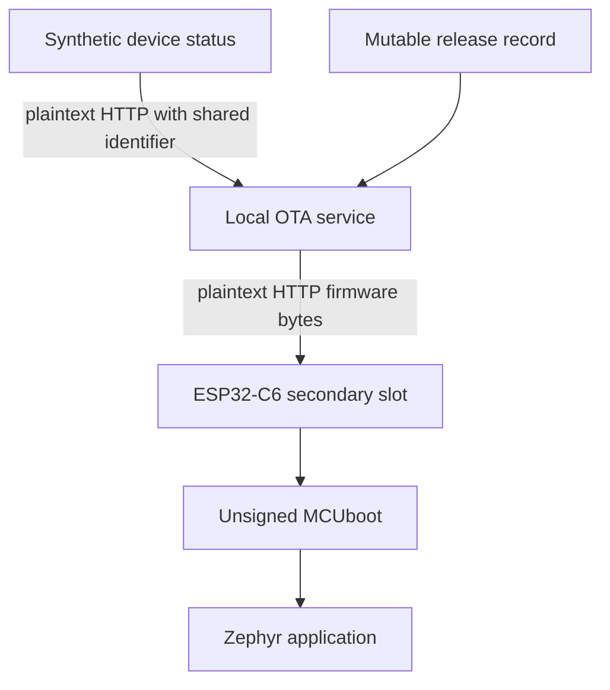

# Tier 0: Build the unsecured reference product

## Scenario

You have joined a team that makes an industrial status beacon. It sits on a machine in a factory, shows the machine state with one light, reports that state over Wi-Fi, and receives its software updates over Wi-Fi.

The product works. It builds, it boots, it connects, and it updates. By every functional measure the team is finished.

It also has no security at all. The status reports travel in plain text. Every device shares one identity. The update service proves nothing about who it is. The firmware carries no signature, so the device runs whatever arrives.

That is where this course starts, and the choice is deliberate. It is much easier to understand why a control exists after you have watched what happens without it. So you are going to build the insecure version first, attack it yourself, and see each weakness with your own eyes before you fix anything.

In this tier you will:

- Build the Reference product and run the local update service.
- Run four safe attacks against your own device and watch all four succeed.
- Write down seven specific weaknesses, and which later tier closes each one.
- Start the two records you will carry through the whole course: the Weakness ledger and the Security evidence pack.

Nothing here is a trick and nothing is hidden. Every attack runs against your own hardware, on your own isolated network, using synthetic data. The tools refuse to point anywhere else.

You will fix none of it in this tier. Tier 0 ends with a working product and an honest list of everything wrong with it. That list is what the rest of the course works through.

## Learning result

After this tier, you can:

- Build the ESP32-C6 Reference product with unsigned MCUboot.
- Run the local HTTP OTA service.
- Explain why functional behavior is not secure behavior.
- Demonstrate seven controlled Tier 0 weaknesses with four fixtures.
- Keep hardware-only results pending when no physical board is available.
- Create the first Lab artifacts and Weakness ledger.

## Safety boundary

Run this tier only against the disposable Course environment created by `./course setup`.

Use only synthetic identifiers and generated firmware.

The fixtures target loopback inside the dev container and refuse public addresses, ranges, wildcards, discovery, redirects, and DNS names other than `localhost`.

Every fixture is a dry run unless you provide `--execute` with the exact fixture identifier.

## Starting state

You need the dev container running, as described on the course landing page. All commands in this tier run inside it, from the repository root.

You need the local update service running. Check it:

```text
./course service status
```

Expected result:

```text
Process: ota running as pid <number>
+ curl --fail http://127.0.0.1:8080/health
Result: OTA service is healthy
Reachable by the Reference product at http://192.168.0.10:8080
```

The address on the last line is the one you gave to `./course setup --bind`. It is the address a physical board will use.

The pinned toolchain is Zephyr 4.4.2, MCUboot 2.4.0, and Zephyr SDK 1.0.1. The container provides all three.

A physical ESP32-C6 is optional for the host work and required for flash, serial, LED, Wi-Fi, and altered-image execution evidence. A board needs a Linux machine.

## Weakness ledger before the work

| Identifier | Weakness | Attack vector | Expected Tier 0 result | Planned tier |
| --- | --- | --- | --- | --- |
| T0-W-01 | HTTP has no confidentiality | Read the local release record and firmware response | Fields and bytes are readable | Tier 2 |
| T0-W-02 | The service trusts the device identifier in the request body | Submit the second manifest-owned identifier | Spoofed status is accepted | Tier 7 |
| T0-W-03 | The device trusts an unauthenticated service | Use the marker-matching local impersonation service | Hostile release data is accepted | Tier 2 |
| T0-W-04 | MCUboot accepts unsigned images | Serve the generated altered image | The device installs and runs it | Tier 3 |
| T0-W-05 | The release record is mutable | Replace the current release record | The new record is served | Tier 4 |
| T0-W-06 | No anti-rollback policy exists | Assign an older release after a newer one | The device installs the older release | Tier 4 |
| T0-W-07 | No test boot or recovery proof exists | Install any image | The install is a permanent overwrite with no revert | Tier 5 |

Seven weaknesses, four fixtures. One fixture can expose more than one weakness, and two of them are shown by the reset step rather than the attack step.

## Reproduce the controlled attacks

### Predict

Before you run anything, write down:

1. Which asset does each fixture expose?
2. Which component decides whether downloaded firmware may run?
3. Which observation cannot be made without a physical device?

### Look before you act

Every attack is a dry run until you add `--execute`. Always look first:

```text
./course attack list
./course attack run tier-00/plaintext-inspection
```

A dry run prints four things and changes nothing:

```text
Marker matched: course_id=learning-cyber-security environment_id=<identifier> tier=00 synthetic_data=true
Expected insecure effect: HTTP release fields and firmware bytes are readable.
Changes: artifacts/generated/attacks/tier-00/plaintext-inspection
Reset: ./course attack reset tier-00/plaintext-inspection
Plan:
  1. Ask the service which firmware release it is currently handing out.
  2. Download that firmware image and read its bytes.
Weaknesses this demonstrates:
  T0-W-01  HTTP has no confidentiality. Everything above was readable by anyone on this network.
Result: dry run only
Execute: ./course attack run tier-00/plaintext-inspection --execute tier-00/plaintext-inspection
```

Read those lines before running anything. `Changes` tells you what will be touched. `Reset` tells you how to undo it. `Plan` tells you what the attack will actually do, step by step.

The marker line matters most. A fixture refuses to run unless the target announces the same disposable Course environment that your own `./course setup` created. That is what keeps these attacks pointed at your own lab and nowhere else.

Repeat the dry run for the other three fixtures before you continue.

## Investigate the missing boundaries

Answer:

1. Which component supplies firmware bytes?
2. Which component decides whether those bytes may run?
3. What proves the service identity?
4. What proves the device identity?
5. What proves the firmware publisher identity?
6. Which result cannot be claimed without physical hardware?

This is the Tier 0 path:



Read the diagram as a list of decisions nobody makes. Nothing proves who the service is. Nothing proves who the device is. Nothing proves who built the firmware. MCUboot runs whatever arrives.

No authenticated trust boundary exists anywhere in this path.

## Build and run the baseline

### The network address is compiled in

The Reference product joins one Wi-Fi network and talks to one service address. You supplied both to `./course setup` on the landing page.

Both values are compiled into the firmware image. Tier 0 has no way to change them on the device. That is itself a limitation worth noticing: a device that cannot be reconfigured also cannot be recovered by reconfiguring it.

If you gave a loopback address, a physical board cannot reach the service. Run setup again with your machine's private address before you build.

### Build the pinned firmware

```text
./course build firmware
```

Expected result:

```text
Generated: .course-state/firmware/baseline.conf for 192.168.0.10:8080, network "course-lab"
+ COURSE_FIRMWARE_CONF=<path> ZEPHYR_BUILD_DIR=<path> ./scripts/build-zephyr-baseline.sh
Result: built baseline release tier-00-baseline, 590396 bytes
```

`ZEPHYR_WORKSPACE` needs no prefix. The container already sets it.

The build copies the finished image to `artifacts/generated/releases/tier-00-baseline.bin` and makes it the release the service assigns.

The firmware models steady, fast-blink, and slow-blink states and reports the state on the serial console. The onboard LED of the validated board cannot be driven, so there is no LED output to observe.

The firmware joins the Wi-Fi network, reports its status over plain HTTP, reads its update assignment, and installs any release the service names.

Flash, serial logs, and OTA installation stay pending until you test them on a physical ESP32-C6.

### Flash the board and watch it work

This step needs a physical ESP32-C6 on a Linux machine. Skip it otherwise and keep the hardware fields pending.

Attach one board, then run:

```text
./course device flash
```

The command refuses to continue when no board is attached, or when more than one Espressif board is attached. It writes normal flash only. It runs no eFuse, secure boot, or flash encryption command.

Watch the device:

```text
./course device logs
```

Press the board's reset button. Expected result:

```text
ESP32-C6 Reference product: intentionally unsecured Tier 0
Image label: baseline
Running release: tier-00-baseline
wifi.connecting ssid=course-lab security=wpa2-psk band=2.4GHz
wifi.association succeeded ssid=course-lab
wifi.address 192.168.0.34 assigned by DHCP
ota.assignment release_id=tier-00-baseline version=0.0.0-insecure image=tier-00-baseline.bin
ota.assignment matches the running release, nothing to install
```

Leave the log view with Ctrl-].

The device repeats this exchange every 30 seconds. Every status report crosses the network in plain text and names the shared device identifier.

## Run the fixtures

Four attacks follow. Each one runs against your own service, and each one prints what it is doing as it does it: the request it sends, the answer it gets, and what that answer means.

Read the output. The command does the typing, but the learning is in what comes back.

Every attack has the same shape. Run it once with no `--execute` to see its plan, then again with `--execute` to run it.

### Attack 1: read everything on the wire

The Reference product talks to the update service over plain HTTP. Find out what that means in practice.

```text
./course attack run tier-00/plaintext-inspection
```

The plan appears first, then the weaknesses it demonstrates, then `Result: dry run only`. Nothing has happened yet. Run it for real:

```text
./course attack run tier-00/plaintext-inspection --execute tier-00/plaintext-inspection
```

The attack asks the service which firmware it is handing out, and the service answers without asking who wants to know:

```text
Step 1. Ask the service which firmware release it is handing out.
     No credential is sent, because the service asks for none.
  -> GET http://127.0.0.1:8080/v1/releases/current
  <- 200 OK, and the whole record came back readable:
     {
       "image_path": "tier-00-baseline.bin",
       "image_sha256": "f28a01...",
       "release_id": "tier-00-baseline",
       "signed": false,
       "version": "0.0.0-insecure"
     }
     This is plain HTTP. Anyone who can see this network sees exactly these fields.
```

Then it downloads the image itself and prints the first bytes.

Look at what you just learned about a product you did not write: its version, its board, the exact size and digest of its firmware, and the fact that `signed` is `false`. An attacker learns the same things, in one request, without touching the device.

This is `T0-W-01`. Tier 2 closes it with HTTPS.

### Attack 2: report a machine state as another device

Every device shares one identity in Tier 0, and the service decides who is reporting by reading the request body.

```text
./course attack run tier-00/device-id-spoofing --execute tier-00/device-id-spoofing
```

Watch the mismatch. The URL names one device. The body names a different one:

```text
  -> POST http://127.0.0.1:8080/v1/devices/beacon-development-shared/events
     with this body:
     {
       "device_id": "beacon-development-clone",
       "machine_state": "fast",
       ...
     }
  <- 202 Accepted, and the service recorded this:
     {
       "accepted_device_id": "beacon-development-clone",
       "warning": "Tier 0 trusts the JSON body device_id"
     }
```

The service stored the identifier from the body. Nothing asked the sender to prove it was that device.

Think about what this costs in a real factory. The machine that is actually failing reports nothing, and a healthy machine appears to be in an error state. The maintenance team is sent to the wrong floor, and the audit record says it was right to send them.

This is `T0-W-02`. Tier 7 closes it by binding each report to a per-device identity.

### Attack 3: become the update service

The device finds its update service at one address, compiled into its firmware. That address is the whole of its trust.

```text
./course attack run tier-00/service-impersonation --execute tier-00/service-impersonation
```

The attack starts a second service on another port, points the device configuration at it, and asks for a release:

```text
Step 2. Point the device configuration at the imposter.
     Was: ota_url = http://127.0.0.1:8080
     Now: ota_url = http://127.0.0.1:18080
     In Tier 0 this address is the entire basis for trust. Whoever answers it, wins.
```

The imposter answers, and its reply is indistinguishable from a real one.

No certificate was checked, because there is none. No name was verified, because nothing carries a name. The real service was never contacted and never knew.

On a real network an attacker does not need to edit a configuration file to achieve this. ARP spoofing, a rogue DHCP server, or simply owning the access point puts them at that address.

This is `T0-W-03`. Tier 2 closes it by making the device check who answered.

### Attack 4: replace the firmware everyone installs

The last attack is the one that matters most, because it ends with the device running code an attacker chose.

```text
./course attack run tier-00/altered-image --execute tier-00/altered-image
```

Three steps. First it takes an altered, unsigned image. Then it overwrites the record that decides what every device installs:

```text
Step 2. Overwrite the record that decides which firmware every device installs.
     The record is mutable and the service does not ask who is changing it.
  -> PUT http://127.0.0.1:8080/v1/releases/current
  <- 200 OK. The service now hands out the altered image to every device that asks.
```

Then it downloads the image back, the way a device would, and confirms the altered bytes arrive unchanged.

Two separate failures combine here. The release record can be rewritten by anyone who can reach the service, which is `T0-W-05`. The image carries no signature, so the device cannot tell a genuine release from a hostile one, which is `T0-W-04`.

Either failure alone would be serious. Together they mean one HTTP request decides what code runs on every device in the fleet.

Tier 3 closes `T0-W-04` with signed images. Tier 4 closes `T0-W-05` with signed release metadata.

### What the attacks share

Each run prints `Reset result: passed` and writes a JSON record under `artifacts/generated/attacks/`. That record is your evidence. You will reference it in the Security evidence pack.

Each run resets the service to the Tier 0 seed when it finishes, so the insecure state never persists by accident.

Notice what none of these attacks needed. No exploit, no memory corruption, no cryptography, no unusual skill. Every one of them is an ordinary HTTP request that the system was happy to answer. That is what the absence of a security boundary looks like.

Without a board, the altered-image record must state that physical acceptance and execution are pending.

### Watch the device accept the altered image

This step needs a physical ESP32-C6. Skip it when you have no board, and keep the hardware fields pending.

Build the altered image. It is a complete, runnable firmware image that reports a different label and a different machine state:

```text
./course build firmware --variant altered
```

Start the log view in a second terminal:

```text
./course device logs
```

Then publish the altered image as the current release. The fixture holds the insecure state only while it runs, so give the device time to poll:

```text
./course attack run tier-00/altered-image --execute tier-00/altered-image --hold 200
```

Within one poll interval the device reads the new assignment and installs it. Expected result:

```text
ota.assignment release_id=tier-00-altered version=0.0.0-altered image=tier-00-altered.bin
ota.assignment differs from running release tier-00-baseline, installing without any check
ota.install starting release_id=tier-00-altered version=0.0.0-altered size=590396
ota.install declared_sha256=... (Tier 0 does not check it)
ota.install wrote 590396 bytes to the secondary slot
ota.upgrade requested permanent overwrite, no test boot, no rollback
Rebooting into the newly installed image
```

MCUboot then overwrites the running image with the downloaded one:

```text
I: Image index: 0, Swap type: perm
I: Image 0 upgrade secondary slot -> primary slot
I: Erasing the primary slot
I: Image 0 copying the secondary slot to the primary slot: 0x90240 bytes
I: Jumping to the first image slot
```

After the reboot the board runs the altered image:

```text
Image label: altered
Running release: tier-00-altered
Beacon state: fast, toggle period: 200 ms
```

The device accepted firmware from an unauthenticated service, with no signature and no publisher identity. Nothing in Tier 0 could have stopped it. That is `T0-W-04`.

The permanent overwrite is `T0-W-07`. There was no test boot and no way back.

Return the device to the baseline:

```text
./course attack reset tier-00/altered-image
```

The service assigns the baseline release again. The device installs it on its next poll and reports `Image label: baseline`.

Notice what the reset just proved. The device accepted an older release over a newer one without complaint, because Tier 0 has no anti-rollback policy. That is `T0-W-06`, and you demonstrated it by undoing your own attack.

Record what you observed in the accepted-image record. Set `device_flash`, `device_boot`, and `serial_record` to your observation. Keep `led_behavior` pending, because the validated board cannot drive its onboard LED.

## Replay the original observation

No security control is added in Tier 0.

The same fixtures still produce the same insecure effects after reset. Nothing you did in this tier changed that, because this tier adds nothing to change it.

Tier 1 will turn these observations into threats, requirements, Security claims, and planned controls. It will not make the attacks fail either. The first tier that stops an attack is Tier 2.

## Test safety and failure behavior

The fixtures are supposed to refuse unsafe instructions. Confirm that they do.

Point a fixture at a third-party address:

```text
./course attack run tier-00/plaintext-inspection --target http://example.com --execute tier-00/plaintext-inspection
```

Expected result:

```text
refused: DNS names other than localhost are refused
```

Run a fixture with the wrong execution identifier:

```text
./course attack run tier-00/plaintext-inspection --execute tier-00/altered-image
```

Expected result:

```text
refused: --execute value must exactly match the fixture identifier
```

If a reset fails, the fixture is blocked and refuses to run again. Run the exact reset command it names before another attempt.

Record these three refusals. A control that refuses correctly is evidence, exactly like an attack that succeeds.

## Weakness ledger after the work

| Identifier | Observed result | Status | Evidence |
| --- | --- | --- | --- |
| T0-W-01 | Metadata and image bytes were readable | Open | Plaintext fixture JSON |
| T0-W-02 | The spoofed identifier was accepted | Open | Device-ID fixture JSON |
| T0-W-03 | The impersonation record was accepted | Open | Impersonation fixture JSON |
| T0-W-04 | The altered image was delivered and run | Open | Altered-image fixture JSON, accepted-image record |
| T0-W-05 | The replaced release record was served | Open | Altered-image fixture JSON |
| T0-W-06 | The device installed the older release | Open | Serial record after reset |
| T0-W-07 | The install overwrote the running image with no revert | Open | Serial record during install |

Every weakness stays open. Tier 0 closes nothing, by design.

This table states the result you should expect to observe. If you observed something different, record what you actually saw and raise it with a Mentor. Do not edit the observation to match the table.

## Security claim and evidence status

Tier 0 makes no positive Security claim.

The supported statement is limited to what you observed: the local service and fixtures reproduce the intended insecure effects.

Without a board, the firmware build supports only a build claim for the pinned target. Physical flash, serial output, Wi-Fi behavior, and altered-image execution stay pending.

With a board, you can record flash, serial output, Wi-Fi association, the HTTP exchange, the OTA download, and altered-image execution as observed. LED behavior stays pending, because the validated board cannot drive its onboard LED.

Run `./course device status` to see which hardware results the course currently claims.

## Update the Security evidence pack

Create the Learner evidence directory and copy the four templates:

```text
mkdir -p evidence/learner/tier-00
cp evidence/templates/tier-00/*.json evidence/learner/tier-00/
./course evidence context
```

The context command prints the current source revision, Course environment identifier, marker fingerprint, and latest fixture evidence paths.

Do not edit the files under `evidence/examples/`. They show the shape only.

Update:

- The baseline architecture.
- The captured HTTP exchange.
- The accepted-image record, with hardware fields still pending when not observed.
- The deliberately absent controls.
- `created_at`, `source_revision`, `environment.environment_id`, and `environment.marker_fingerprint` in every record.
- The fixture evidence paths.

Set the architecture, HTTP exchange, and absent-controls records to `observed`. Keep the accepted-image record `pending` when no physical ESP32-C6 was used. Never replace a pending hardware field with a host-only result.

Then run:

```text
./course evidence check
```

Expected result:

```text
Learner Tier 0 evidence is complete and bound to the current revision and Course environment
```

## Troubleshooting

| Observation | First check |
| --- | --- |
| The service does not start | Run `./course service status`, then read `.course-state/ota.log` |
| The service is already running | Run `./course service stop` first |
| Marker mismatch | Stop the service, run `./course setup` again, then start the service |
| A fixture stays blocked | Run `./course attack reset <fixture>` exactly as the fixture printed it |
| The board never reaches the service | Confirm `./course setup --bind` used your machine's private address, not loopback |
| No serial device exists | Keep hardware results pending |
| The container refuses to start | Attach the board before opening the editor, or remove the `--device` line |

## Informal Mentor conversation

Tier 0 has no required Mentor review gate.

You may still ask a Mentor to review the architecture and one uncomfortable limitation.

Show the fixture evidence and explain why it does not prove physical device behavior.

Explain which of the seven weaknesses you demonstrated directly, and which you inferred from a reset.

## Continue

Keep this Course workspace. Tier 1 continues on the same branch.

Next: **Tier 1: Model the product and its risks**.

Tier 1 adds no control and changes no code. It turns everything you just observed into a model of the product, its assets, its actors, and its risks, and it ends at the first Mentor review gate.

## Primary references

| Reading | Level | Type | Learning question | Where to read |
| --- | --- | --- | --- | --- |
| [Zephyr device management, OTA overview](https://docs.zephyrproject.org/4.4.2/services/device_mgmt/ota.html) | Required | Explanatory | What are the parts of an OTA update path, and where can it fail when nothing is secured? | The whole page |
| [MCUboot, readme for Zephyr](https://docs.mcuboot.com/readme-zephyr.html) | Required | Explanatory | How does MCUboot pick and run an image, and what does an unsigned configuration allow? | The Building and Signing the application sections |
| [Zephyr device firmware upgrade with MCUboot](https://docs.zephyrproject.org/4.4.2/services/device_mgmt/dfu.html) | Optional | Explanatory | How does Zephyr hand a downloaded image to MCUboot? | The MCUboot and image management sections |
