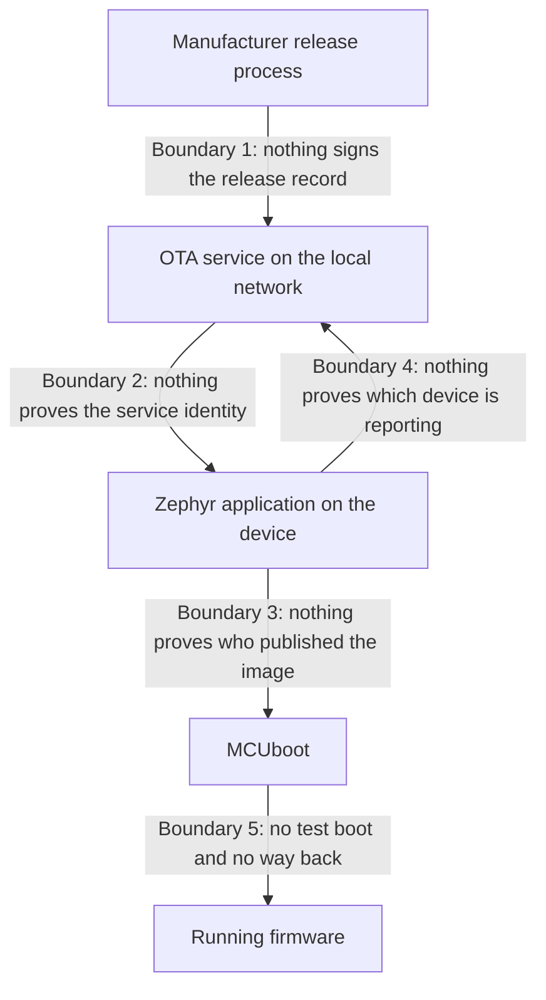

# Tier 1: Model the product and its risks

## Scenario

You finished Tier 0 with a working product and seven demonstrated weaknesses. You know exactly what happens. You do not yet know what any of it is worth.

A team in this position usually does one of two things. It fixes whatever it watched break most recently, in the order things broke. Or it argues about which control to add first and settles the argument by seniority.

Both skip the same step. Nobody has said what the product is protecting, who it is protecting it from, or how anyone would know a control had worked.

That step is this tier. You will turn seven observations into a model: what the product holds that is worth taking, who could take it, what they would achieve, which control stops them, and which tier adds it.

Tier 1 changes no code and adds no control. When you finish, the device behaves exactly as it did when you started, and every Tier 0 attack still succeeds. Nothing here makes the product safer. It makes the work that follows decidable.

This tier also works differently from the others. Most of it is thinking, not typing. You are asked a question, you write your own answer first, and only then do you open a second page that holds a finished answer and compare the two.

The comparison is the whole method. An answer you read before you tried teaches you nothing, so do not open the answers page early. A partial answer that you wrote is worth more here than a complete one that you read.

In this tier you will:

- Read your own Tier 0 evidence as an analyst rather than as the person who produced it.
- Turn one observation into one complete chain: asset, actor, misuse scenario, risk, claim, requirement, planned control, Residual risk.
- Write your own threat model, then compare it against a finished one.
- Find which assets and which actors your model missed, and work out which kind of gap each one is.
- State the five Security claims the Reference product will have to earn, and record every one of them as unsupported.
- Prepare for the first required Mentor review gate.

Expect about an hour of reading and thinking, plus the time you spend writing your own answers and the Mentor conversation at the end.

## Learning result

After this tier, you can:

- Name the assets the Reference product protects and the actors that threaten them.
- Turn an observed insecure behavior into a misuse scenario and a risk register entry.
- Tell a risk apart from a missing control, and a requirement apart from a technology choice.
- Write a Security claim with an acceptance criterion that another engineer could test.
- Explain why Tier 1 adds no control and changes no device behavior.
- Say which parts of your analysis are still missing, and why that is a result rather than a failure.

## Safety boundary

Tier 1 runs no attack, sends no request, and changes no device. Nothing in this tier can damage your lab.

Keep your Tier 0 Course environment as it is. You will read the evidence it already produced. You do not need the update service running and you do not need a board attached.

If you choose to rerun a Tier 0 fixture to refresh your memory, the Tier 0 safety boundary still applies in full: look at the dry run first, pass `--execute` with the exact fixture identifier, use synthetic data only, and target loopback only.

Use only the synthetic identifiers from Tier 0 in your analysis. Never write a real customer name, a real network name, or a real credential into an evidence record.

## Starting state

You need your finished Tier 0 work. Tier 1 continues in the same Course workspace, on the same branch. Do not create a new workspace.

You need three things from Tier 0:

- Your Weakness ledger with its seven entries.
- Your four completed Tier 0 evidence records.
- The fixture evidence the attacks wrote under `artifacts/generated/attacks/`.

Check the evidence records, from the repository root inside the dev container:

```text
ls -1 evidence/learner/tier-00
```

Expected result:

```text
absent-controls.json
accepted-image-record.json
baseline-architecture.json
http-exchange.json
```

If that directory is empty, go back and finish the Tier 0 section on the Security evidence pack before you continue. This tier reads those records constantly.

All seven Tier 0 weaknesses are still present and all seven still work. Tier 1 closes none of them.

## Weakness ledger before the work

| Identifier | Weakness | Attack vector | Expected result | Planned treatment |
| --- | --- | --- | --- | --- |
| T0-W-01 | HTTP has no confidentiality | Read the local release record and firmware response | Fields and bytes are readable | Encrypted transport in Tier 2 |
| T0-W-02 | The service trusts the device identifier in the request body | Submit the second manifest-owned identifier | Spoofed status is accepted | Per-device identity in Tier 6, bound to the connection in Tier 7 |
| T0-W-03 | The device trusts an unauthenticated service | Use the marker-matching local impersonation service | Hostile release data is accepted | Service authentication in Tier 2 |
| T0-W-04 | MCUboot accepts unsigned images | Serve the generated altered image | The device installs and runs it | Signed images in Tier 3 |
| T0-W-05 | The release record is mutable | Replace the current release record | The new record is served | Signed release metadata in Tier 4 |
| T0-W-06 | No anti-rollback policy exists | Assign an older release after a newer one | The device installs the older release | Security counter in Tier 4 |
| T0-W-07 | No test boot or recovery proof exists | Install any image | The install is a permanent swap with no test boot and no revert | Test boot and revert in Tier 5 |

This table is inherited context, not your work. It is the same ledger you closed Tier 0 with, and the last column is the only part this tier will change.

## Reread the Tier 0 evidence

### Predict

Before you read anything, write down your answers to these four questions. **[Tier 1 answers](answers.md)** opens with a section called Predict answers that answers all four. Do not open it until your own model is written, and then read it beside your own answers and mark every place the two differ.

1. Which of the seven weaknesses would a factory customer notice first, and which one would they never notice at all?
2. Which weakness costs an attacker the least effort to use?
3. Which single weakness, closed on its own, removes the most attacker outcomes?
4. Which asset on the product list did no Tier 0 attack touch at all, and why not?

Nothing runs in this tier. There is no fixture to launch and no output to wait for. You are not reproducing anything, because you already produced all of it. You are reading it back as someone who did not run it.

### What a fixture record says

Every fixture you ran with `--execute` wrote one JSON record under `artifacts/generated/attacks/` in a directory named after the fixture. Open one now and read it field by field.

| Field | What it tells an analyst |
| --- | --- |
| `fixture_id` | Which attack this was |
| `command` | The exact command, so someone else can repeat it |
| `target` and `selected_interface` | Where the attack was pointed, and over which interface |
| `expected_effect` | What the course said would happen |
| `observed_effect` | What actually happened |
| `result` | The one-line summary, which is the least useful field here |
| `reset_result` | Whether the lab was returned to its Tier 0 state |
| `marker_fingerprint` | Proof the attack ran against your own disposable Course environment |
| `artifact_hashes` | What the attack touched, by content |
| `started_at` and `ended_at` | When, so the record can be tied to a state of the repository |
| `hardware_limitation` | What this record does not prove because no board was involved |

Read `expected_effect` and `observed_effect` next to each other. Those two fields together are the whole of what you are allowed to claim from that run. Everything else in your analysis is reasoning built on top of them, and it has to be labeled as reasoning.

`hardware_limitation` is the field analysts skip and reviewers do not. A record that says the altered image was delivered is not a record that says a device ran it.

### What the four Tier 0 evidence records say

| Record | What it holds |
| --- | --- |
| `baseline-architecture.json` | The update path and the components on it |
| `http-exchange.json` | What crossed the network in the clear |
| `accepted-image-record.json` | Whether physical acceptance and execution were observed or are still pending |
| `absent-controls.json` | The list of controls this product deliberately does not have |

Open `absent-controls.json` and look at it carefully, because it is the closest thing you already have to a threat model, and it is not one.

It lists what is missing. It does not say what any of it costs, who it costs, who benefits, or what would count as proof that one of them had been fixed. A list of absent controls is an inventory. A threat model is an argument.

### What none of these records tell you

- Who the attacker was. Every fixture ran as you, on your own lab, with no opponent.
- What the attack would have cost outside the lab, in money, downtime, or trust.
- Which asset was harmed, as opposed to which component was involved.
- What would count as proof that the weakness is closed.

Those four questions are the work of this tier.

## Investigate the missing boundaries

Answer these before you continue:

1. At which points in the update path does somebody decide whether to trust what just arrived?
2. Which of those decisions is made by the device, and which is made by the service?
3. What identity does each side present, and what checks it?
4. Which single boundary, if it held, would make three of the seven weaknesses unusable?
5. Where must a check run so that an attacker standing on the network cannot simply remove it?

This is the Tier 0 path again, with the boundaries named:



| Boundary | Who should prove what, to whom | What proves it in Tier 0 | Weakness | Built in |
| --- | --- | --- | --- | --- |
| 1 | The manufacturer proves to the device that this release record is the approved one | Nothing | T0-W-05, T0-W-06 | Tier 4 |
| 2 | The service proves its identity to the device before the device believes it | Nothing | T0-W-01, T0-W-03 | Tier 2 |
| 3 | The publisher proves authorship of the image to the bootloader | Nothing | T0-W-04 | Tier 3 |
| 4 | The device proves its identity to the service before the service records a report | Nothing | T0-W-02 | Tier 6 and Tier 7 |
| 5 | The new image proves it can run before it replaces the old one | Nothing | T0-W-07 | Tier 5 |

Every boundary above is drawn in the same place in a hardened product as in this one. The difference is not where the line sits. It is that in Tier 0 nothing is asked at the line, so everything crosses.

Responsibility falls out of the table. Boundary 3 belongs to MCUboot and to nothing else, because MCUboot is the last component that can refuse. Boundary 2 belongs to the device, not to the service, because a service cannot prove its own honesty to a device that will believe anything. Boundary 4 belongs to the service, because the service is the party keeping the record. A check placed anywhere else is a check the attacker can stand in front of.

## Exercise 1: turn one observation into one threat

Work this in your own worksheet, or on paper. Write your answer first. Do not open the answers page until all seven hops are written, even badly.

Here is the observation. It is the second step of the altered-image fixture, exactly as it printed in Tier 0:

```text
Step 2. Overwrite the record that decides which firmware every device installs.
     The record is mutable and the service does not ask who is changing it.
  -> PUT http://127.0.0.1:8080/v1/releases/current
  <- 200 OK. The service now hands out the altered image to every device that asks.
```

Answer these seven questions about that one exchange:

1. **Asset.** What of value was harmed? Name it as a property of the product, not as a component.
2. **Actor.** Which actor could do this outside your lab, and what access do they need first?
3. **Misuse scenario.** Write one sentence in the form: a given actor, with given access, does something, so that some outcome follows.
4. **Risk.** What does the actor achieve, and what does that cost the customer? Write it so that the person paying for the fix would understand it.
5. **Security claim.** What would have to be true of the product for this to fail? Write it as a sentence another engineer could attack.
6. **Requirement.** What must the product do, stated so that somebody else could test it without asking you what you meant? Include how they would know it passed.
7. **Planned control.** Which design choice meets that requirement, and which tier adds it?

Two of these hops go wrong for almost everyone, so give them longer. Hop 4 is where a missing control gets written down as if it were a risk. Hop 6 is where a technology gets written down as if it were a requirement.

When all seven are written, open **[Tier 1 answers](answers.md)** and read the section **Exercise 1 answer**. It shows a wrong version of each hop beside the right one, and then the whole chain end to end.

Compare hop by hop. Mark every difference in your worksheet. Where you disagree with the answer, write down why, and keep it for the Mentor review gate.

## Exercise 2: find what your model is missing

The product definition, the asset list, and the actor list are fixed by the course. You do not derive them, and you do not need to argue with them. They are supplied here so that your analysis and everyone else's rest on the same base.

These are the seven protected assets:

| ID | Asset |
| --- | --- |
| A-01 | Firmware authenticity and integrity |
| A-02 | The firmware signing key |
| A-03 | The device private identity key |
| A-04 | Trust anchors and update policy |
| A-05 | The installed firmware version and anti-rollback state |
| A-06 | Configuration and reported status integrity |
| A-07 | Device availability and recovery access |

Firmware confidentiality is not on that list. It is deliberately not a core requirement of this product, and it is taught later as an advanced topic with its operational cost.

These are the actors and attackers:

| Role | Description |
| --- | --- |
| Manufacturer | Creates releases and supports the product |
| Provisioning operator | Gives each device its identity |
| Customer operator | Installs and manages the device |
| Mentor | Reviews selected Learner results |
| OTA service | Publishes approved releases |
| Device | Downloads, verifies, installs, and confirms an update |
| Remote attacker | Can reach exposed network services |
| Local attacker | Shares Wi-Fi or the local network |
| Physical opportunist | Briefly accesses the device, serial port, or flash pins |
| Thief | Steals a deployed device |
| Hosting attacker | Compromises OTA hosting but never holds the offline firmware signing key |
| Operational failure | Operator error, failed download, power loss, or a wrong release |

The last row is not an attacker and belongs in the analysis anyway. Some of the worst outcomes in a fleet have nobody behind them.

Now do four things, in this order:

1. Repeat the first four hops of exercise 1 for each of the other six weaknesses. One line each is enough: asset, actor, what the actor achieves.
2. Go through the asset list. Mark every asset that none of your scenarios touches.
3. Go through the actor list. Mark every actor that none of your scenarios names.
4. For every mark, write one sentence saying which of three reasons applies: the product does not have that thing yet, the actor cannot reach it, or you did not think of it.

Step 4 is the exercise. Those three reasons look identical in a table and mean completely different things. One is a finding about the product, one is a scope boundary, and one is a gap in your analysis. Only the third is a mistake.

When you have finished, open **[Tier 1 answers](answers.md)** and read the section **Exercise 2 answer**. It holds the finished threat model: eight misuse scenarios, the full risk register, the coverage tables, the five Security claims, the numbered requirements, the planned controls, and the Residual risks.

Do not copy it into your worksheet. Record the differences instead, because the differences are the only part that is yours.

## Reclassify the same observations

The same seven weaknesses, now carrying names instead of descriptions:

| Weakness | Asset harmed | Risk | Claim it breaks | Requirement | Control lands in |
| --- | --- | --- | --- | --- | --- |
| T0-W-01 | None directly | R-01 | SC-03 | REQ-03 | Tier 2 |
| T0-W-02 | A-06 | R-02 | SC-04 | REQ-04 | Tier 6 and Tier 7 |
| T0-W-03 | A-04 | R-03 | SC-03 | REQ-03 | Tier 2 |
| T0-W-04 | A-01 | R-04 | SC-01 | REQ-01 and REQ-06 | Tier 3 |
| T0-W-05 | A-01 and A-04 | R-04 and R-08 | SC-01 | REQ-01 and REQ-06 | Tier 4 |
| T0-W-06 | A-05 | R-05 | SC-02 | REQ-02 | Tier 4 |
| T0-W-07 | A-07 | R-06 | SC-05 | REQ-05 | Tier 5 |

Nothing was technically rejected in this tier, and you must not write that anything was. The release record is still mutable. The service still answers anyone. MCUboot still runs whatever arrives. If you reran every Tier 0 fixture right now, all four would succeed exactly as before, and that is the correct outcome for an analysis tier.

What changed is smaller and more useful than a control. Each observation now has an asset it harmed, an actor who could cause it, a claim it currently breaks, a requirement that says what closing it would mean, and a tier that owns the work. A weakness with those five things attached can be scheduled, argued about, and eventually proved closed. A weakness without them can only be complained about.

## Test the completeness of the analysis

These tests check your analysis, not the product. Run them against your own worksheet and register before the Mentor review gate, and fill in the Actual result column as you go.

| Evidence ID | Test | Expected result | Actual result |
| --- | --- | --- | --- |
| E-1-01 | Every one of the seven Tier 0 weaknesses appears in at least one misuse scenario | Seven weaknesses, none unaccounted for |  |
| E-1-02 | Every misuse scenario names one asset and at least one actor | No scenario missing either |  |
| E-1-03 | Every asset is either cited by a register entry or recorded with the reason it is not | No asset silently absent |  |
| E-1-04 | Every actor is either cited by a register entry or recorded with the reason it is not | No actor silently absent |  |
| E-1-05 | No requirement names a product, library, protocol, or key length, and every requirement states an observable acceptance criterion | No requirement that only names a technology |  |
| E-1-06 | Every Security claim has status `unsupported` and names the tier that could change it | No claim marked supported or partly supported |  |
| E-1-07 | Every Residual risk names an owner and either a treatment or a recorded acceptance | No unowned Residual risk |  |

The course does not run these checks for you. Tier 0 has `./course evidence check`, which reads JSON records against a schema. Tier 1 has no equivalent, because its records are Markdown written for a human reviewer and no checker reads them yet. You run this table by hand, and your Mentor will ask about the rows you filled in.

If a row does not pass, write down what you actually found before you fix it. An analysis that was incomplete and got corrected is a better record than one that was never wrong. Do not mark any Security claim supported to make a row pass.

## Weakness ledger after the work

| Weakness | Result after this tier | Status | Evidence or next action |
| --- | --- | --- | --- |
| T0-W-01 | Unchanged. Named as R-01, reconnaissance that lowers the cost of R-03 and R-04 | Open | Risk register. Closed by Tier 2 |
| T0-W-02 | Unchanged. Named as R-02 against A-06 | Open | Risk register. Closed by Tier 6 and Tier 7 |
| T0-W-03 | Unchanged. Named as R-03 against A-04 | Open | Risk register. Closed by Tier 2 |
| T0-W-04 | Unchanged. Named as R-04 against A-01 | Open | Risk register. Closed by Tier 3 |
| T0-W-05 | Unchanged. Named as R-04 and R-08 against A-01 and A-04 | Open | Risk register. Closed by Tier 4 |
| T0-W-06 | Unchanged. Named as R-05 against A-05 | Open | Risk register. Closed by Tier 4 |
| T0-W-07 | Unchanged. Named as R-06 against A-07 | Open | Risk register. Closed by Tier 5 |
| T1-W-08 | New. The shared device identifier can be read from flash or the serial console, and no Tier 0 fixture tested it | Open | Found by analysis, not by attack. Reduced by Tier 6, treated in Advanced Tier A |

This table states the result you should expect. Every inherited weakness is still open, because Tier 1 closes none of them, and a ledger that showed anything else after an analysis tier would be wrong.

The last row is the one to notice. T1-W-08 was found by thinking, not by attacking, and it is the first entry in your ledger that no fixture produced. An analysis that only restates what you already attacked is not worth the hour it took. Add any other weakness your own model found, and mark clearly that it came from analysis rather than observation.

## Security claim and evidence status

Tier 1 makes no positive Security claim about the Reference product, and it cannot. No control was added, no test was run, and no device behavior changed.

What Tier 1 produces is the claim set the rest of the course has to earn. All five open at `unsupported`:

**SC-01: Only firmware authored by the manufacturer runs on the Reference product.** Unsupported. Tier 3 can change this.

**SC-02: The device installs only the release the manufacturer currently approves, and never an earlier one.** Unsupported. Tier 4 can change this.

**SC-03: The device exchanges updates and status only with the genuine update service, and the network can neither read nor change what they exchange.** Unsupported. Tier 2 can change this.

**SC-04: A status report can only be produced by the device it names.** Unsupported. Tier 6 and Tier 7 can change this.

**SC-05: An interrupted or failed update never leaves the device without a working image.** Unsupported. Tier 5 can change this.

A claim becomes supported only when a control exists, a test exercised it, and the stated acceptance criterion was met on the hardware the claim is about. It becomes partly supported when some of that exists and the gap is written down next to it. It stays unsupported when no control exists or when the evidence failed.

Three statements you must not make at the end of this tier:

- That the product is more secure than it was in Tier 0. Nothing changed.
- That a risk is reduced because a control is planned. A planned control has reduced nothing. `planned` is a lifecycle state, not a mitigation.
- That the model is complete. You will find something missing in every later tier, and the model is designed to be revised rather than finished.

The first claim in this course that can change status is SC-03, in Tier 2.

## Update the Security evidence pack

Create the Tier 1 evidence directory and copy the templates, from the repository root:

```text
mkdir -p evidence/learner/tier-01
cp evidence/templates/tier-01/*.md evidence/learner/tier-01/
```

Check the result:

```text
ls -1 evidence/learner/tier-01
```

Expected result:

```text
claim-record.md
mentor-review-record.md
risk-register.md
threat-model-worksheet.md
```

Tier 1 records are Markdown, not JSON. Tier 0 produced machine-checkable observations, so its records are machine-readable. Tier 1 produces reasoning for a human reviewer to challenge, so its records are written for that reviewer.

Record the following:

- Your exercise 1 answers and the differences you found, in the threat model worksheet.
- Your misuse scenarios, your risk register, your coverage table, and your Residual risks, in the risk register.
- The five Security claims, your requirements, and your planned controls, in the claim record.
- The Mentor conversation, after the gate, in the Mentor review record.

Fill in the metadata table at the top of each file. Get the source revision with:

```text
git rev-parse --short HEAD
```

Expected result: a short commit hash, such as `d925098`. Put that value in the `source_revision` field of every record, so a reviewer can tell which state of the repository your reasoning was based on.

No Tier 1 record is ever marked `observed`, because nothing was observed in this tier. Every Learner-authored record starts at `draft` and moves to `reviewed` after the Mentor review gate. Observation belongs to Tier 0, and a Tier 1 record that claims an observation has borrowed it from a record that actually earned it.

Do not edit your Tier 0 records to match your new model. If your analysis contradicts something you recorded in Tier 0, that contradiction is a finding, and it belongs in the open questions field of your Mentor review record.

Check the structure of what you wrote with `./course evidence check --tier 01`. It reports an uncopied template, an empty metadata field, a placeholder left standing, and a row marked `observed` with no observation under it. It never reads what you wrote, because whether your reasoning is right is what the Mentor review is for.

## Troubleshooting

| Observation | First check |
| --- | --- |
| You cannot tell whether something is a risk or a missing control | Ask what the attacker achieves. A control is what you add. A risk is what happens while you have not added it |
| Your requirement names a technology and you cannot see the problem | Rewrite it as what the product must refuse to do, then add how somebody else would watch it refuse |
| A weakness maps to no asset on the list | Check whether it is reconnaissance that makes another scenario cheaper, and record it that way |
| An asset has no scenario at all | Check whether the product has that asset yet. An asset that does not exist has no risk today and a large one later |
| Every risk looks equally serious | Compare reach, not difficulty. One request that affects every device outranks a hard attack on one device |
| You disagree with the answers page | Write down why and bring it to the gate. It is one worked model, not a list of correct answers |
| `./course evidence check` refuses because the Course environment is missing or expired | The environment marker expires after 24 hours. Run `./course setup` again. Tier 1 itself needs no service and no board |

Involve a Mentor early when your model and your Tier 0 evidence disagree about what happened. That disagreement is worth more than a tidy table, and it is much easier to resolve in conversation than in writing.

## Informal Mentor conversation

Tier 1 ends at the first required Mentor review gate. It is the readiness gate, held before the implementation-heavy tiers begin.

It is still a conversation. There is no grade, no percentage, no pass and no fail. Its purpose is to check that the foundation you are about to build on is one you understand, and the Mentor's job is to ask questions and give hints, not to look for your mistakes.

**Show.** Your Tier 0 evidence records and one fixture record. Your threat model worksheet, your risk register, and your claim record. The completeness table with your own Actual result column filled in.

**Explain.** How one Tier 0 observation became a risk, a claim, a requirement, and a planned control. Why your requirements name no technologies. Which asset has no risk today and why that is the most important row in your coverage table. What you disagreed with on the answers page.

**Diagnose.** Your Mentor picks one prepared failure and works through it with you. It will be one of these: a requirement that names a technology instead of a property, a claim marked partly supported because a control is planned, a risk that is really a missing control, an actor list with no operational failure in it, or a Residual risk with no owner. You may use your notes, this page, and the Mentor's hints.

**Plan.** Agree which entries in your Weakness ledger changed, record any corrections and open questions, and confirm that Tier 2 can start from your current workspace.

Write the conversation into `evidence/learner/tier-01/mentor-review-record.md` while it is fresh. The outcome is one of three values: `ready_to_continue`, `continue_with_notes`, or `resolve_safety_prerequisite_first`. There is no score field and there never will be one.

Only a safety or dependency problem blocks you from continuing. An incomplete model, a table you would write differently tomorrow, or a first attempt you are not proud of is never a reason to stop.

## Continue

Next: **[Tier 2: Authenticate and encrypt the server connection](../tier-02-authenticated-https/index.md)**.

Tier 2 is where the course stops analyzing and starts refusing. You will give the update service an identity the device can check, and teach the device to check it before it believes anything the service says.

The two attacks you will replay there are the two you named as R-01 and R-03: reading everything on the wire, and answering at the address the device was built to trust. This is also where SC-03 gets its first chance to stop being unsupported.

## Primary references

| Reading | Level | Type | Learning question | Where to read |
| --- | --- | --- | --- | --- |
| [OWASP Threat Modeling](https://owasp.org/www-community/Threat_Modeling) | Required | Explanatory | What are the four questions a threat model answers, and in what order? | The whole page |
| [OWASP Threat Modeling Cheat Sheet](https://cheatsheetseries.owasp.org/cheatsheets/Threat_Modeling_Cheat_Sheet.html) | Required | Practical | How is a misuse scenario written so that it can be tested rather than argued about? | The sections on decomposition and on threat identification |
| [The Threat Modeling Manifesto](https://www.threatmodelingmanifesto.org/) | Optional | Explanatory | Which habits make a threat model stay useful after the first workshop? | The values and principles |
| [NIST SP 800-30 Revision 1, Guide for Conducting Risk Assessments](https://csrc.nist.gov/pubs/sp/800/30/r1/final) | Optional | Reference | How do assets, threat sources, and impact combine into a risk statement? | Chapter 2 and Appendix I |
