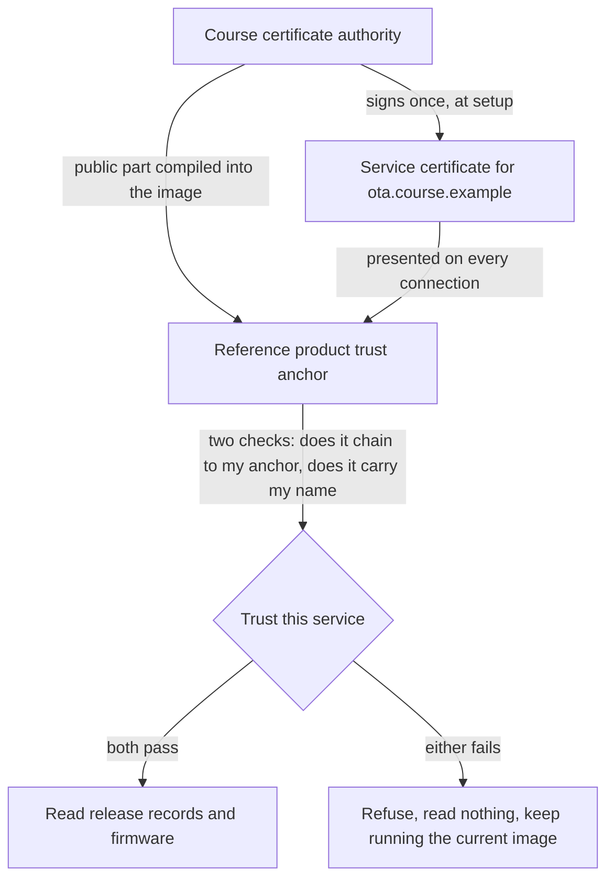

# Tier 2: Authenticate and encrypt the server connection

## Scenario

A maintenance engineer sits down in the factory canteen, joins the same Wi-Fi network as the beacons, and runs one command.

In ninety seconds she has the exact firmware version every beacon is running, the size and digest of the image, and the fact that nothing is signed. She did not attack anything. She asked, and the service answered, because in Tier 0 the service answers anyone.

Then she does the second thing. She starts her own service on her laptop, at the address the beacons were built to trust, and every beacon that asks takes its update instructions from her.

Neither of those needed a password, an exploit, or any unusual skill. Both worked because nothing in the conversation between a beacon and the update service proves who is speaking.

This tier fixes exactly that, and nothing else. The device will check who answered before it believes anything, and the conversation will be encrypted so that nobody in the canteen can read it.

Be clear about what that does not do. After this tier the update service is authenticated, and a firmware image is still just bytes the service happened to send. If someone takes over the real service, it will hand out hostile firmware over a perfectly valid, fully encrypted, correctly verified connection, and the device will install it. Transport trust and publisher trust are different things, and this tier buys only the first one. Tier 3 buys the second.

In this tier you will:

- Replay the two Tier 0 attacks against a device that now checks who answered.
- Create a Course certificate authority and a certificate for the update service.
- Write the device-side code that decides whether to trust what answered.
- Watch the same attacks fail, and read exactly which check refused them.
- Try two ways around the check: a well-formed certificate from the wrong authority, and a genuine certificate for the wrong name.
- Record what the control protects, and write down plainly what it does not.

## Learning result

After this tier, you can:

- Explain what an authenticated, encrypted connection protects and what it leaves untouched.
- Set up a small certificate authority and issue a service certificate for a named service.
- Make an embedded device verify a certificate chain and a service name, and refuse when either fails.
- Read a verification failure and say which check failed and what it compared.
- Explain why a device that connects to an address can still verify a name, and why no name lookup is involved.
- State why Tier 2 makes no claim about firmware authenticity.

## Safety boundary

Run this tier only against the disposable Course environment created by `./course setup`.

Every key and certificate in this tier is generated for your Course environment and lives in `.course-secrets/pki`. Git ignores that directory. Never commit it, never copy it anywhere, and never reuse any of it outside this lab.

The two certificates used by the bypass tests exist to fail. Do not install either of them into any trust store on your machine.

The fixtures target loopback inside the dev container and refuse public addresses, ranges, wildcards, discovery, redirects, and DNS names other than `localhost`. Every fixture is a dry run unless you provide `--execute` with the exact fixture identifier.

The packet capture in this tier is bounded: one interface, only the two course service ports, a filter the course builds and prints, five seconds, and no promiscuous mode. It never captures anything else on your machine.

## Starting state

You need your finished Tier 1 work. Tier 2 continues in the same Course workspace, on the same branch.

You need the dev container. Tier 2 needs two things Tier 0 did not, so rebuild the container before you start: a published TLS port, and the `NET_RAW` capability that packet capture needs. Both are already in whichever dev container configuration you opened; you only have to rebuild.

You need a Course environment with certificate material. Run setup again, from the repository root inside the container:

```text
./course setup --bind <this host's private address>
```

Expected result includes these two lines:

```text
Wrote: Course certificate authority 9287bc8a7ad1339e in .course-secrets/pki
Wrote: service certificate for ota.course.example, and the two certificates the Tier 2 bypass tests need
```

Your fingerprint will differ. It is generated for your Course environment and nothing else in the world trusts it.

Setup keeps an existing authority rather than replacing it. That matters more than it looks: the authority becomes part of every firmware image you build, so replacing it silently would leave a flashed board refusing a service it used to trust, with no obvious reason. If you ever do need a new one, ask for it by name with `--replace-certificate-authority`, and rebuild and reflash every board afterwards.

One note about the device output quoted in this module. Every serial line in it was recorded on the board the course used before, a nanoESP32-C6 1.0, and no tier has yet been run on the ESP32-C6-DevKitC-1 this course now targets. Treat the quoted lines as what to expect rather than as a result on your board, record what you actually see, and raise any difference with a Mentor instead of editing your observation to match the page.

All seven Tier 0 weaknesses are still present when this tier starts. This tier closes two of them.

## Weakness ledger before the work

| Identifier | Weakness | Attack vector | Expected result | Planned treatment |
| --- | --- | --- | --- | --- |
| T0-W-01 | HTTP has no confidentiality | Read the local release record and firmware response | Fields and bytes are readable | Encrypted transport in this tier |
| T0-W-02 | The service trusts the device identifier in the request body | Submit the second manifest-owned identifier | Spoofed status is accepted | Per-device identity in Tier 6, bound to the connection in Tier 7 |
| T0-W-03 | The device trusts an unauthenticated service | Use the marker-matching local impersonation service | Hostile release data is accepted | Service authentication in this tier |
| T0-W-04 | MCUboot accepts unsigned images | Serve the generated altered image | The device installs and runs it | Signed images in Tier 3 |
| T0-W-05 | The release record is mutable | Replace the current release record | The new record is served | Signed release metadata in Tier 4 |
| T0-W-06 | No anti-rollback policy exists | Assign an older release after a newer one | The device installs the older release | Security counter in Tier 4 |
| T0-W-07 | No test boot or recovery proof exists | Install any image | The install is a permanent swap with no test boot and no revert | Test boot and revert in Tier 5 |

This table is inherited context. Tier 2 changes the first and third rows and leaves the rest exactly as they are.

## Reproduce the attacks against the unsecured product

### Predict

Before you run anything, write down:

1. Which of these two attacks would a customer notice, and which leaves no trace at all?
2. The device is built to talk to one address. What would an attacker have to control to answer at that address?
3. If the connection were encrypted but nobody checked who answered, which of the two attacks would still work?
4. If the device checked who answered but the connection were readable, which would still work?

Questions 3 and 4 are the point of this tier. Encryption and authentication are two different properties, they fail separately, and a control that provides one is regularly described as if it provided both.

### Look before you act

Start the service in its Tier 0 shape and confirm the two attacks still succeed:

```text
./course service start
./course attack run tier-00/plaintext-inspection --execute tier-00/plaintext-inspection
./course attack run tier-00/service-impersonation --execute tier-00/service-impersonation
```

Both succeed, exactly as they did in Tier 0. The release record comes back readable, and the imposter is believed. Read the output again now that you have a threat model: you named these R-01 and R-03 in Tier 1, against assets A-04 and A-06.

Stop the service before you continue:

```text
./course service stop
```

## Investigate the missing boundary

Answer:

1. What does the device actually know about the thing at the other end of its connection?
2. What could it know, and what would it have to carry in order to check it?
3. If the device is built to connect to an address, what exactly should it verify: the address, or something else?
4. Where must that check run so that an attacker on the same network cannot remove it?
5. Once the check passes, what has been proved, and what has not?

This is the boundary Tier 2 builds:



Read it as two questions the device asks and must answer for itself. Does a chain lead from this certificate back to the anchor I carry? And does this certificate carry the name I was told to require? Both have to pass. A device that checks the chain and skips the name accepts any certificate the authority ever issued, for anything.

The check belongs on the device, and only on the device. The service cannot prove its own honesty to something that will believe whatever it is told, and a check placed anywhere else on the network is a check the attacker can stand in front of.

One thing this boundary does not touch: the firmware image. The device is now sure who it is talking to. It still has no way to tell whether the bytes that arrive were built by the manufacturer.

## Create the certificate authority and the service certificate

The course generated all of this during setup. Look at it before you use it:

```text
./course service certificate
```

Expected result, with your own fingerprints:

```text
The Course certificate authority. Generated for this Course environment, and nothing else trusts it:
  Subject:      Learning Cyber Security Course CA
  Issuer:       Learning Cyber Security Course CA
  DNS names:    none
  IP addresses: none
  Valid from:   2026-09-13T22:05:36Z
  Valid until:  2036-09-10T23:05:36Z
  Key:          ECDSA
  Fingerprint:  9287bc8a7ad1339e
```

The subject and the issuer are the same, which is what makes it a root. Nothing signed it, so nothing vouches for it, and the only reason your device will ever believe it is that you are about to compile it into the image yourself.

Then the certificate the service presents:

```text
The certificate the service presents:
  Subject:      ota.course.example
  Issuer:       Learning Cyber Security Course CA
  DNS names:    [ota.course.example]
  IP addresses: none
  Valid from:   2026-09-13T22:05:36Z
  Valid until:  2036-09-10T23:05:36Z
  Key:          ECDSA
```

Two details in that block decide how the rest of this tier behaves.

The name is `ota.course.example`. The `.example` domain is reserved and can never resolve anywhere on the internet, which is deliberate: this name exists to be compared, not to be looked up. Your device has no DNS resolver, and this tier does not give it one. It connects to a literal address, exactly as it did in Tier 0, and then requires the certificate presented there to carry this name.

The IP address list is empty, and that is also deliberate. A certificate can name addresses as well as names, and this one does not. So a client that connects by address and never states the name it expects has nothing to match, and fails. That failure is not friction to work around. It is the mistake this tier is about, and you will watch it happen on purpose.

### The one thing you must never do with this material

Every private key lives in `.course-secrets/pki`. The directory is ignored by Git and the repository checks for committed secrets on every run.

The authority you just made can issue a certificate for any name at all. In this lab that is harmless, because exactly one device trusts it. The habit of knowing where a signing key lives, and who could use it, is the habit Tier 3 will hold you to when the key in question decides what code runs.

## Add the check to the device

This is the tier's real work and it is about twenty lines. The device already opens a socket and speaks HTTP over it. You are changing what kind of socket it opens, and what it demands before it sends a single byte.

The Tier 2 application is `firmware/tier-02-authenticated-service`. It is a copy of the Tier 0 application, because each tier owns its own firmware and a published tier never changes underneath a Learner. The shared beacon and Wi-Fi code lives in `firmware/common` and is identical in both.

Open `firmware/tier-02-authenticated-service/src/ota_client.c` and read `ota_connect`. Three things are different from Tier 0.

First, the socket is a TLS socket rather than a plain one:

```text
sock = zsock_socket(AF_INET, SOCK_STREAM, IPPROTO_TLS_1_2);
```

Second, three options say what verification means. The anchor to check against, the name to require, and the demand that verification actually succeed:

```text
zsock_setsockopt(sock, SOL_TLS, TLS_SEC_TAG_LIST, tags, sizeof(tags));
zsock_setsockopt(sock, SOL_TLS, TLS_HOSTNAME, CONFIG_COURSE_OTA_SERVICE_NAME,
                 sizeof(CONFIG_COURSE_OTA_SERVICE_NAME));
zsock_setsockopt(sock, SOL_TLS, TLS_PEER_VERIFY, &required, sizeof(required));
```

Zephyr already requires verification for clients, and sets an empty hostname when the application sets none, so a forgotten option here fails loudly instead of quietly accepting anything. The code states both requirements anyway. A control that depends on a default is a control nobody can see, and the next person to read this file should not have to know the default to know what it does.

Third, the trust anchor. `tls_credential_add` registers the Course certificate authority under a tag, and the socket options above point at that tag. The authority is compiled into the image, in the same way the Wi-Fi passphrase already is, by `./course build firmware`.

Note what the credential store does, because it catches people: it keeps a pointer to your certificate rather than a copy, so the array has to have static storage. If you moved it onto a stack, the handshake would read freed memory.

One option in `prj.conf` is worth naming: `CONFIG_MBEDTLS_SSL_MAX_CONTENT_LEN` is set to 16384, the largest size a TLS record may have, because the peer decides how large a record it sends and [Tier 3 found what happens when this buffer is smaller](../tier-03-signed-images/index.md#what-this-tier-found-in-tier-2).

Build the image:

```text
./course build firmware --tier 02
```

Expected result:

```text
Result: built baseline release tier-02-baseline, 663292 bytes
```

Your size will be close to that rather than identical, because the Wi-Fi network name is compiled into the image and yours is a different length from the one this was measured on. Compare it with Tier 0's 590428 from the same environment: TLS costs about seventy thousand bytes of flash on this target, and takes static RAM from roughly 37 percent to roughly 50 percent. That is not free, it fits the existing flash map with room to spare, and it is worth knowing the number rather than guessing it.

Then flash it and watch it start:

```text
./course device flash --tier 02
./course device logs
```

Press the board's reset button. Expected result:

```text
ESP32-C6 Reference product: Tier 2, authenticated service connection
Image label: baseline
Running release: tier-02-baseline
Board: esp32c6_devkitc/esp32c6/hpcore
Tier 2 boot mode: unsigned MCUboot, swap using offset, no test boot, no rollback
Tier 2 protects the connection. It does not make an image authentic.
Synthetic shared device identifier: beacon-development-shared
OTA service: https://ota.course.example:8443 at address 192.168.68.81
Trust anchor: 9287bc8a7ad1339e
```

Two lines there are worth a second look.

The service line names both: `ota.course.example` is what the certificate must say, and `192.168.68.81` is where the socket goes. They are different things and this device needs both.

The trust anchor line is the fingerprint of the authority compiled into this image. Compare it with the one `./course service certificate` printed. If they ever differ, the board was built against a different Course environment, and every connection will fail for a reason that otherwise looks like a broken network.

Leave the log view with Ctrl-].

### What the device does not check, and why

The board has no real-time clock, so it has no idea what day it is. Certificate validity dates are therefore not compared: the image is built with `CONFIG_MBEDTLS_HAVE_TIME_DATE=n`, and the option is independent of chain and name checking, so leaving it off costs neither of those.

The consequence is real and belongs in your ledger. This device would accept an expired certificate. If you turned date checking on without giving the device a clock, the clock would read 1970, every certificate would be "not yet valid", and every connection would fail forever, which is a worse failure and a silent one.

Write that down as a Residual risk with an owner. It is the honest output of this tier, and Tier 8 is where credential lifetime becomes the subject.

## Replay the attacks against the control

Start the service with the switch that moves release data behind TLS:

```text
./course service start --https
```

Expected result:

```text
Result: OTA service is healthy
Release records, firmware, and events: https://ota.course.example:8443
Health and the Course environment marker stay on http://<your address>:8080
```

Two listeners, and the split is deliberate. Release records, firmware bytes, and status events moved. Health and the Course environment marker did not.

That last part is worth a paragraph, because it will look like a gap. The marker is what a fixture checks before it does anything, to prove it is pointed at your own disposable lab. If that check ran over TLS, a fixture would have to verify a certificate before it was allowed to find out whether it was aimed at the right place, which makes the control a precondition for testing the control. Worse, the impersonation fixture presents a deliberately untrusted certificate, so a TLS marker check would refuse the very fixture it exists to guard. The marker carries only synthetic identifiers and is not a credential, so it stays in the clear, in every tier, on purpose.

### Replay 1: read everything on the wire

```text
./course attack run tier-02/plaintext-inspection --execute tier-02/plaintext-inspection
```

The same request that worked in Tier 0 now finds nothing:

```text
  -> GET http://127.0.0.1:8080/v1/releases/current
  <- 404 Not Found. The same request that worked in Tier 0 returns nothing readable:
     {
       "error": "this endpoint is no longer served over plain HTTP",
       "moved_to": "https://ota.course.example:8443",
       "still_here": [
         "/health",
         "/.well-known/course-environment"
       ],
       "why": "Tier 2 moved release records, firmware, and events to an authenticated, encrypted connection",
       "why_still_here": "the Course environment marker is a fail-closed targeting check, not a credential, and it must not depend on the control it is used to test"
     }
```

Then the fixture asks again, the way the device does, and the record is still there for a client that can verify it:

```text
Step 2. Ask the TLS port, checking the certificate the way the device does.
     Trust anchor: the Course certificate authority in .course-secrets/pki.
     Required name: ota.course.example. The connection still goes to the literal address 127.0.0.1:8443.
  -> GET https://ota.course.example:8443/v1/releases/current
  <- 200 OK. The record is still there, and now only a verified client can read it:
```

And then it makes the mistake, on purpose:

```text
Step 3. Ask the same TLS port by address, without stating the name.
     This is the mistake the tier is about, so it is worth watching fail.
  -> GET https://127.0.0.1:8443/v1/releases/current
  <- refused: Get "https://127.0.0.1:8443/v1/releases/current": tls: failed to verify certificate: x509: cannot validate certificate for 127.0.0.1 because it doesn't contain any IP SANs
     The certificate carries the name ota.course.example and no address at all, so an address can never match it.
```

Read that error slowly. The connection reached the right machine, on the right port, and presented a certificate issued by the authority the client trusts. It still failed, because the client asked "is this 127.0.0.1?" and the certificate only ever claimed to be `ota.course.example`.

`T0-W-01` is closed for release data. The marker exchange is still readable, by design, and your ledger should say so rather than claiming more than you did.

### Replay 2: become the update service

```text
./course attack run tier-02/service-impersonation --execute tier-02/service-impersonation
```

The imposter starts, and the first thing it proves is that the safety check still works:

```text
  <- The imposter answers the marker check, in the clear, exactly as the contract expects.
     That check never depended on the certificate, which is why it still works here.
```

It holds a certificate for the right name. The device configuration is pointed at it, exactly as in Tier 0. Then:

```text
  -> GET https://ota.course.example:18443/v1/releases/current
  <- refused: Get "https://ota.course.example:18443/v1/releases/current": tls: failed to verify certificate: x509: certificate signed by unknown authority
     The check that ran: does a chain lead from this certificate to the trust anchor in this image.
     What it compared: the issuer of the presented certificate against the Course certificate authority.
     What it rejected: a certificate signed by an authority nobody told the device to trust.
     The name was right. The address was right. Neither was enough, and that is the whole point.
```

In Tier 0 this attack needed nothing but an address. Now it needs a private key that does not exist outside `.course-secrets/pki`, and an attacker who has that has already won a different game.

`T0-W-03` is closed.

### Replay 3: watch the device itself

The two replays above are the host checking a certificate. The check that matters runs on the device, and nothing on the host can stand in for it.

With the service running normally, watch the board:

```text
./course device logs
```

Expected result:

```text
ota.tls verified ota.course.example at 192.168.68.81:8443, connection established
ota.tls verified ota.course.example at 192.168.68.81:8443, connection established
ota.assignment release_id=tier-02-baseline version=0.2.0-authenticated image=tier-02-baseline.bin
ota.assignment matches the running release, nothing to install
```

That is the whole exchange it used to do in the clear, now done over a connection it verified for itself. The device named the service, checked the certificate against the anchor it carries, and only then asked for its update assignment.

## Test bypass attempts

Two ways around the check, each isolating one half of it.

The first is the impersonation replay you just ran: a well-formed certificate, for the right name, from an authority the device does not trust. The chain check refuses it.

The second isolates the other half:

```text
./course attack run tier-02/name-mismatch --execute tier-02/name-mismatch
```

This certificate was genuinely issued by the authority your device trusts. Everything about it is real. Only the name is different:

```text
  -> GET https://ota.course.example:18443/v1/releases/current
  <- refused: Get "https://ota.course.example:18443/v1/releases/current": tls: failed to verify certificate: x509: certificate is valid for ota-not-this-one.course.example, not ota.course.example
     The check that ran: does the certificate carry the name this device was told to require.
     What it compared: the certificate's dNSName entries against ota.course.example.
     What it rejected: a certificate the trusted authority really did issue, for something else.
```

Notice which check did not fail. The chain was fine. The authority was the right one. Only the name was wrong, and a device that verified the issuer and skipped the name would have accepted this without complaint. That is the single most common way this control is deployed broken in real products.

### The device's own refusals

Both bypasses above ran on the host. Now make the device refuse, which is the only result that supports a claim about the device.

The course can make the service present the wrong certificate on purpose. Stop it and start it again holding the untrusted one:

```text
./course service stop
./course service start --https --present untrusted
./course device logs
```

Within one poll interval the board says exactly which check refused it:

```text
ota.tls refused the connection to 192.168.68.81:8443 errno=113
ota.tls required name ota.course.example issued by the trust anchor in this image
ota.tls verification flags 0x00000008
ota.tls  the certificate was not issued by the trust anchor in this image
ota.tls  compared: the certificate issuer against the Course certificate authority
ota.tls no release data was read, and the running image is unchanged
```

Then the other half:

```text
./course service stop
./course service start --https --present wrong-name
```

```text
ota.tls refused the connection to 192.168.68.81:8443 errno=113
ota.tls required name ota.course.example issued by the trust anchor in this image
ota.tls verification flags 0x00000004
ota.tls  the certificate does not carry the name this device requires
ota.tls  compared: the certificate names against ota.course.example
ota.tls no release data was read, and the running image is unchanged
```

Compare the two flag values. `0x08` is the chain check failing and `0x04` is the name check failing. They are different bits because they are different checks, and the device tells you which one ran out of patience with you.

Read the last line of each block. The device refused, read nothing, and kept running the image it already had. A device that fails an update check and keeps working is behaving correctly. One that stops is a different bug.

Now put the real certificate back and watch it recover:

```text
./course service stop
./course service start --https
```

The board returns to `ota.tls verified` on its next poll. The refusal was not a state the device got stuck in, and that matters: a control that cannot recover from a bad day in the field is an availability problem wearing a security badge.

Record your results:

| Evidence ID | Test | Expected result | Actual result |
| --- | --- | --- | --- |
| E-2-01 | A verified client reads the release record over TLS | The record is returned |  |
| E-2-02 | The plain HTTP port is asked for the release record | Refused, and it says where the data went |  |
| E-2-03 | A client connects by address without stating the name | Refused: no address in the certificate |  |
| E-2-04 | A certificate for the right name from an untrusted authority | Refused: signed by unknown authority |  |
| E-2-05 | A certificate from the trusted authority for another name | Refused: valid for a different name |  |
| E-2-06 | The device is offered an untrusted certificate | The device refuses and keeps running its current image |  |
| E-2-07 | The device is offered a certificate for the wrong name | The device refuses and keeps running its current image |  |

Record an unexpected actual result before you troubleshoot it. Do not mark the Security claim supported because the host tests passed. The last two rows are about the device, and only the device can answer them.

## Weakness ledger after the work

| Weakness | Result after this tier | Status | Evidence or next action |
| --- | --- | --- | --- |
| T0-W-01 | Release records, firmware, and events are no longer readable on the wire. The Course environment marker still is, by design | Reduced | Plaintext replay evidence and the packet capture |
| T0-W-02 | Unchanged. The service still trusts the device identifier in the request body, now over an encrypted connection | Open | Tier 6 and Tier 7 |
| T0-W-03 | The device refuses any service it cannot verify, by chain and by name | Closed | Impersonation replay, name mismatch, and the device's own serial record |
| T0-W-04 | Unchanged. A verified service can still hand out any image at all | Open | Tier 3 |
| T0-W-05 | Unchanged. The release record is still mutable by anyone who can reach the service | Open | Tier 4 |
| T0-W-06 | Unchanged | Open | Tier 4 |
| T0-W-07 | Unchanged | Open | Tier 5 |
| T1-W-08 | Unchanged. The shared identifier is still readable from flash | Open | Tier 6, and Advanced Tier A |
| T2-W-09 | New. The device does not check certificate validity dates, because it has no clock | Open | Residual risk with an owner. Tier 8 |

This table states the result you should expect to observe. `T0-W-01` is reduced rather than closed, and the difference matters: something is still readable, you know exactly what it is, and you chose it.

## Security claim and evidence status

**SC-03: The device exchanges updates and status only with the genuine update service, and the network can neither read nor change what they exchange.**

This is the claim you wrote in Tier 1 and recorded as `unsupported`. Tier 2 is the first tier in this course that can move a claim at all.

It becomes **partly supported**. Supported for the update and release path, which is now verified by chain and by name and encrypted end to end, with both bypass attempts refused on the device. Not supported for the status path, because the service still believes whatever device identifier appears in a request body: the connection is authenticated, the sender is not. That gap is `T0-W-02`, it closes in Tier 7, and it is why the claim does not reach supported here.

Three claims you must not make at the end of this tier:

- That firmware is now authentic. It is not. A compromised but trusted service will hand out hostile firmware over a perfectly valid connection, and this device will install it. That is `T0-W-04` and it is Tier 3's subject.
- That the device is protected against an attacker who obtains the Course certificate authority's private key. It is not, and that key now matters enormously.
- That certificates are checked for expiry. They are not, on this device, and `T2-W-09` records it.

Run `./course device status` to see which hardware results the course currently claims.

## What this tier found in Tier 1

Nothing, and the reason is worth a line. Tier 1 produced a threat model rather than an implementation, so this tier had nothing in it to break. A reasoning tier hands you a plan to check your own work against, and a plan has no code in it that a later tier can exercise and find wrong.

## Update the Security evidence pack

Create the Tier 2 evidence directory and copy the templates:

```text
mkdir -p evidence/learner/tier-02
cp evidence/templates/tier-02/*.md evidence/learner/tier-02/
```

Record:

- The before and after packet evidence, including which endpoint is still readable and why.
- The certificate-validation tests, as the table above, with your own actual results.
- The updated trust-boundary diagram, showing where the check now runs.
- The Residual risk for a compromised but trusted service, with an owner.
- The Residual risk for unchecked certificate dates, with an owner.
- The `SC-03` claim record, moved from `unsupported` to `partly_supported`, with the stated gap.
- Your `control` records for CTL-03, moved from `planned` to `implemented`.

Set the host results to observed. Keep the two device rows, `E-2-06` and `E-2-07`, pending until you have watched the board refuse both certificates with your own eyes. A host result never stands in for a device result, and this is the tier where that distinction stops being theoretical.

## Troubleshooting

| Observation | First check |
| --- | --- |
| The board reports `errno=116` and prints no verification flags | A timeout, not a refusal: the connection never reached the service, so nothing was verified. Check that the TLS port is published by the container and open in the host firewall. On Fedora, `sudo firewall-cmd --add-port=8443/tcp` |
| The board reports `ota.request failed url=/v1/firmware/... err=-113` | The response was too large for the device's TLS buffer, whatever the handshake line above it says. `CONFIG_MBEDTLS_SSL_MAX_CONTENT_LEN` must be 16384. Check that the image on the board was built from this tree rather than an older checkout |
| The board says it trusts nothing | Its image was built without a trust anchor. Run `./course setup`, then `./course build firmware --tier 02`, then flash again |
| The board's trust anchor fingerprint differs from `./course service certificate` | The image was built against a different Course environment. Rebuild and reflash |
| A host tool fails with "doesn't contain any IP SANs" | It connected by address without stating the name. That is correct behavior, not a fault |
| The packet capture produces no file | Rebuild the dev container. Podman drops `NET_RAW` from its defaults and the capture needs it |
| The plain HTTP port returns 404 for a release record | That is the expected Tier 2 result. Read the body: it names where the data went |
| A fixture refuses because the marker does not match | Stop the service, run `./course setup` again, start the service again |

Involve a Mentor when the device refuses a certificate you believe it should accept. Bring the output of `./course service certificate` and the board's serial record, because the two together usually answer it in a minute.

## Informal Mentor conversation

Tier 2 has no required Mentor review gate. The next one is after Tier 3.

If you do ask for a conversation, show the board refusing both bypass certificates and explain which check refused each one.

Then explain the thing this tier is most often got wrong: why an authenticated connection says nothing about whether the firmware on it is genuine. If you can explain that clearly, you are ready for Tier 3. If you cannot, Tier 3 will be a list of steps rather than a lesson.

One prepared failure worth working through together: a device that verifies the certificate chain but never sets a hostname. Ask what it would accept, and how you would notice.

## Continue

Next: **[Tier 3: Require authentic firmware images](../tier-03-signed-images/index.md)**.

Tier 2 made the device sure about who it is talking to. Tier 3 starts from the uncomfortable half of that: the service is now trusted, and a trusted service that gets compromised can still hand your fleet any code it likes.

You will create an offline signing key, sign a release with it, and make MCUboot refuse an image that does not verify. Then you will attack it: unsigned, modified, wrong key, and truncated images. Tier 3 ends at a required Mentor review gate, because it is where firmware publisher trust first exists.

## Primary references

| Reading | Level | Type | Learning question | Where to read |
| --- | --- | --- | --- | --- |
| [Zephyr TLS sockets](https://docs.zephyrproject.org/4.4.2/connectivity/networking/api/sockets.html) | Required | Reference | Which socket options turn a socket into a verified connection, and what are their defaults? | The secure sockets section |
| [Zephyr TLS credentials](https://docs.zephyrproject.org/4.4.2/connectivity/networking/api/tls_credentials.html) | Required | Reference | How does a trust anchor reach a device, and what does the credential store hold? | The whole page |
| [RFC 6125, service identity in TLS](https://www.rfc-editor.org/rfc/rfc6125) | Optional | Standard | What is a client supposed to compare a certificate against, and why is the name not the address? | Sections 1 and 6 |
| [Mbed TLS x509 verification](https://mbed-tls.readthedocs.io/en/latest/) | Optional | Reference | What do the verification result flags mean, and how do chain and name failures differ? | The x509 pages |
