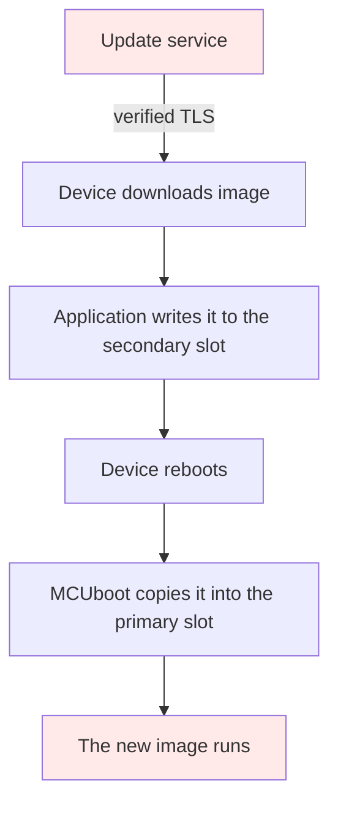

# Tier 3: Require authentic firmware images

## Scenario

The update service you built in Tier 2 works. It presents a certificate your device checks, by chain and by name, and every beacon refuses anything else. Nobody in the cafeteria can read the traffic or impersonate the service any more.

On a Tuesday morning, someone who is allowed to deploy releases pushes a firmware image that nobody reviewed.

They do not need to break anything. They do not forge a certificate, poison a name, or sit on the network. They use the service exactly as it was designed to be used, over the connection you spent Tier 2 making trustworthy, and every beacon in the building installs what they published.

It does not matter for this story whether they are an attacker who stole a deploy credential, a contractor who was given more access than anyone remembers granting, or a tired engineer who ran the right command against the wrong directory. The device cannot tell those apart, because the device cannot tell anything about the bytes it is given. It checks who is speaking. It has never checked who wrote what they are saying.

That is the gap this tier closes. Transport trust and publisher trust are different things, and Tier 2 gave you only the first.

In this tier you will create your own signing key, sign a release with it, and build a bootloader that carries the matching public key and refuses everything else. Then you will attack it from the strongest position an attacker can have: from inside your own update service, publishing hostile firmware through a service that passes every check Tier 2 added.

If signing, verifying and the two halves of a key pair are new words to you, read [Signing and verifying](../../cryptography-primer.md#signing-and-verifying) in the cryptography primer first.

This tier also prints three short names, `ECDSA`, `P-256` and `PKCS#8`. The primer's [Names you will meet](../../cryptography-primer.md#names-you-will-meet) table says what each one is.

At the end you will have a device that installs only firmware you published, four recorded refusals that each say something different, and a clear statement of the large things this still does not protect you from.

Tier 3 ends at a required Mentor review gate. It is the first one after Tier 1, and it is here because this is where publisher trust first exists.

## Learning result

After this tier, you can:

- Explain the difference between trusting a connection and trusting the code that arrives over it.
- Create an image signing key, keep it out of your build and out of Git, and say what "offline" really means on a single laptop.
- Build a bootloader that carries a public key and verifies an image signature before it runs it.
- Publish a release through a service you fully control and watch a device refuse it anyway.
- Read a bootloader refusal and say which of four different things went wrong.
- Explain why an image signed by an equally valid key is refused, and what that tells you about where the boundary actually is.
- State plainly what signing does not protect, including the things an attacker who owns your update service can still do.

## Safety boundary

Run this tier only against the disposable Course environment created by `./course setup`.

Both signing keys in this tier are generated on your machine for this lab and live in `.course-secrets/signing`. Git ignores that directory. Never commit either one, never copy them anywhere, and never reuse them outside this lab.

One of the two keys is labeled `attacker`. It is a real, valid ECDSA P-256 key made by the same command as your own. Nothing about it is weaker or broken. Treat it with the same care as the other one.

The four hostile images are generated on your machine from your own good image, when you ask for them. None of them is shipped with this course, and none is committed. A firmware image built to fail is still a firmware image, so keep them inside `artifacts/generated/` where the course put them.

This tier changes no eFuse, enables no secure boot, and makes no irreversible change to any board. Everything here is normal flash and can be undone by flashing again.

## Starting state

You have finished Tier 2. Your device verifies the update service by chain and by name, and refuses anything it cannot verify.

The [course landing page](../../index.md) carries the environment setup, the glossary and the list of every tier, if you need to go back to any of them.

Check that the service and the board are where you left them:

```text
./course service start --https
./course device logs
```

You should see the Tier 2 banner and a verified connection. If you do not, finish Tier 2 before starting this tier.

One thing to be clear about before you begin, because this tier is built on it. The Tier 2 product installs updates perfectly well. It downloads a firmware image over its verified connection, writes it to the secondary slot, and swaps it in, and its own log says what it is doing while it does it: `installing without any check`. Nothing on that path asks who produced the image. That is the weakness you still carry into this tier, and it is the one this tier closes.

## Weakness ledger before the work

| Weakness | What it is | Status entering this tier |
| --- | --- | --- |
| T0-W-04 | MCUboot accepts unsigned images. Anything the service offers will install and run | Open. This tier closes it |
| T0-W-05 | The release record is mutable by anyone who can reach the service | Open. Tier 4 |
| T0-W-06 | Nothing stops an older release being installed over a newer one | Open. Tier 4 |
| T0-W-07 | An installed image is permanent. There is no trial boot and no way back | Open. Tier 5 |
| T0-W-02 | The service believes the device identifier in a request body | Open. Tier 6 and Tier 7 |
| T2-W-09 | The device does not check certificate validity dates, because it has no clock | Open. Tier 8 |

`T0-W-04` is the one this tier is about. Read its wording again before you start, because the rest of the tier is an argument about exactly what "accepts" means.

## Reproduce the compromised publisher

### Predict

Before running anything, write down your answers. The Reveal section, after Test bypass attempts, answers all three.

1. Your update service is genuine, its certificate verifies, and the connection is encrypted. If someone publishes hostile firmware through it, what stops the device installing it?
2. If you sign your firmware, what exactly does the signature prove? Write the sentence out.
3. Your attacker has a signing key of their own. What makes yours different from theirs?

Now publish a firmware image that nobody approved, through your own service, and see what it takes.

Build the Tier 3 application and the bootloader that goes with it. You need a key first, which is the next section's subject, so for now just look at what the service will do with any bytes it is handed:

```text
./course attack list
```

The reproduction is the same mechanism as Tier 0's altered image, with one difference that matters: in Tier 0 you stood beside the service with an imposter, and here you are inside the real one. Tier 0 already recorded what an unsigned image does to a device that does not check, and that result is `T0-W-04` in your ledger. This tier does not need to prove it again. What it needs to show you is that nothing between the publisher and the flash is looking.

## Investigate the missing boundary

The device performs exactly one check on an update today, and it is the one Tier 2 added: is this the service I was told to talk to.

Follow what happens after that check passes.



There is no point on that path where anything asks who produced the image. The application does not, and says so at every install:

```text
ota.assignment differs from running release tier-03-baseline, installing without any check
```

MCUboot does not either, because the bootloader you have been running was built without a key to check against. It reads the image header, finds a valid image, and copies it.

So the boundary you are missing is not on the network. It is at the last moment before code runs, inside the bootloader, and it is the only place that can still say no after everything else has said yes.

That is worth a moment of thought. Every control in Tier 2 sits between two machines. This one sits between a set of bytes and the processor that would execute them, and it does not care how those bytes arrived.

## Sign your releases and make the bootloader require it

### Create a key that is yours

```text
./course keys create release
```

Expected result:

```text
The Release signing key. The bootloader trusts the public half of this one.
Generating it with MCUboot's own tool, not with anything this course wrote:
+ imgtool.py keygen -k .course-secrets/signing/release.pem -t ecdsa-p256
Result: release key created, fingerprint 2f5fe5123abe8715ecde8cde2cac0e734969e5c0110d71eb839a15ceebd6c1e4
Taking out the public half, which is the only part a build ever reads:
+ imgtool.py getpub -k .course-secrets/signing/release.pem -e pem > artifacts/generated/signing/release.pub.pem
Result: public key written to artifacts/generated/signing/release.pub.pem
This key is private. It stays in .course-secrets/signing, it never reaches the OTA service, and it is never committed.
```

Your fingerprint will differ from the one above. It is yours.

Two details in that output are the whole custody lesson.

The command prints the real `imgtool` invocation before running it. Nothing about this key was invented for this course: it is a 241 byte PKCS#8 file made by MCUboot's own tool, and you could have typed the command yourself.

The public half is extracted once, into a different directory. MCUboot's default is to point the bootloader build at the private key and let the build take the public half out for itself. That would put your signing key into a firmware build command, and a build server is exactly where a signing key should never be. So the course extracts it once and the build reads only the public file. You will see the consequence of that in a moment, because it is why this tier builds the bootloader and the application separately.

If you run the command again it refuses, tells you the fingerprint of the key that already exists, and makes you type the removal yourself. There is no flag for it. A key you can destroy in one keystroke is a key you will eventually destroy by accident.

### Build a bootloader that carries the public half

```text
./course build firmware --tier 03
```

This runs two builds, and the reason is worth reading rather than skipping.

Sysbuild has a single setting for a signing key, and it feeds two different jobs: the bootloader runs `imgtool getpub` on it, which needs only the public half, and the application build runs `imgtool sign` on it, which needs the private half. One value cannot be both. Pointing it at the private key would work, and would name your signing key in a firmware build command.

So Tier 3 splits them. The first build produces the application **unsigned** and throws away the bootloader it makes. The second builds the bootloader that ships, against the public key alone. The two were compared: the separately built bootloader resolves to an identical configuration and the same size, so nothing is lost.

The build finishes by telling you it published nothing:

```text
Result: built an unsigned Tier 3 image in <build directory>
Nothing has been published. This image is unsigned, so the bootloader would refuse it.
Sign and publish it yourself with:
  ./course release sign
```

An unsigned image is not a release. From this tier on, the build cannot hand you one.

### Sign it

```text
./course release sign
```

Expected result:

```text
Signing with the release key, fingerprint 2f5fe5123abe8715ecde8cde2cac0e734969e5c0110d71eb839a15ceebd6c1e4
+ imgtool.py sign --version 0.3.0+0 --header-size 0x20 --slot-size 1835008 --align 4 --key .course-secrets/signing/release.pem <image> artifacts/generated/releases/tier-03-baseline.bin
  digest: 905fe0ac2411694fef420678b398f3c605069859c8500bf4c0601240b18db3ba
Result: published tier-03-baseline, 664139 bytes, signed
The device will run this one, because its bootloader holds the matching public key.
```

Write that digest down. You will want it shortly.

This is the only command in the course that names your private key. Note how small the change is: Tier 0 already ran `imgtool sign` on every image it built. The entire difference between firmware anyone can forge and firmware only you can publish is one `--key` argument and a file you keep to yourself.

### Install it and read the boot line

```text
./course device flash --tier 03
./course device logs
```

Expected result:

```text
I: course: slot=primary header=ok tlv=ok signature=present key=match counter=none
I: Bootloader chainload address offset: 0x20000
I: Image version: v0.3.0
I: Jumping to the first image slot
...
*** Booting Zephyr OS build v4.4.2 ***
ESP32-C6 Reference product: Tier 3, signed firmware images
Image label: baseline
Running release: tier-03-baseline
Board: esp32c6_devkitc/esp32c6/hpcore
Tier 3 boot mode: signed MCUboot images, swap using offset, no test boot, no rollback
Image verification key this build trusted: 2f5fe5123abe8715ecde8cde2cac0e734969e5c0110d71eb839a15ceebd6c1e4
That is the key the build used. This application cannot read what the bootloader holds.
Tier 3 checks who published this image. It does not check the bytes it downloads.
```

The fingerprint on that line should match the one `./course keys create release` printed. If it does not, the image and the bootloader came from different Course environments, and the Troubleshooting table says what to do.

Read the line underneath it carefully, because it is the more honest one. The application is telling you which key its own build used. It cannot see inside the bootloader and does not know what key is actually compiled in there. That is a claim about the build, not an observation of the device, and the course says so rather than letting you read more into it than it can support.

### What the bootloader now prints, and why it has to

Stock MCUboot prints one line for every kind of bad image:

```text
E: Image in the secondary slot is not valid!
```

It never says why. Inside MCUboot, the function that validates an image returns a single value with no cause attached, and every failure inside it leaves silently. That is deliberate and it is good engineering: one return value is harder to skip past with a fault injection glitch than a set of them, and a bootloader is exactly where that trade is worth making.

It also means you cannot tell four different failures apart, which is no good for learning. So this course adds a small module that reports what it can see in an image before MCUboot judges it:

```text
I: course: slot=primary header=ok tlv=ok signature=present key=match counter=none
```

Four observable facts: does it have an image header, does it have a signature area, is there a signature in it, and does that signature name the key this bootloader was built with. The line ends with a fifth field, `counter`. It stays `none` in this tier, because a Tier 3 image carries no security counter. Tier 4 adds one.

Two things about that module are worth your attention as an engineer.

It does not decide anything. It reports and then returns a value that tells MCUboot to carry on and perform its normal validation, so every accept and reject is still MCUboot's. Course written code in a boot path that could veto a decision would be worse than an unhelpful error message.

It does not modify MCUboot. It is a separate Zephyr module in this repository that reaches the bootloader through MCUboot's own published hook interface, whose documentation says that supplying the source file is the downstream project's job. If you fork this repository you get upstream MCUboot plus our module, and the next MCUboot upgrade has nothing of ours to merge. Extending a vendored dependency through the extension points it offers, instead of forking it and carrying the diff forever, is a skill worth more than this tier's actual control.

## Replay the attack against the control

Now attack it properly. Not from the network, and not with an imposter. From inside your own service, which is the strongest position anyone could have.

### Build four images that should fail

```text
./course keys create attacker
./course release hostile
```

Expected result:

```text
attacker key fingerprint 0b581c41543488edd57d2f8330a5b136c30bd2c92613cc963b16efadb673daa9, as valid as yours and trusted by nothing
```

```text
unsigned: Nobody signed it. The bootloader finds no signature at all.
modified: Signed correctly, then one byte was changed afterwards.
wrong-key: Signed properly, by a key the bootloader was not built to trust.
truncated: The download stopped before the signature arrived.
```

All four are built from the good image you just signed, on your machine, now. None is shipped with the course.

Check what you have:

```text
./course keys list
```

```text
attacker  0b581c41543488edd57d2f8330a5b136c30bd2c92613cc963b16efadb673daa9
          .course-secrets/signing/attacker.pem
release   2f5fe5123abe8715ecde8cde2cac0e734969e5c0110d71eb839a15ceebd6c1e4
          .course-secrets/signing/release.pem

The bootloader is built against artifacts/generated/signing/release.pub.pem, and nothing else.

Both keys are ECDSA P-256 and both are equally valid.
Only the fingerprint compiled into the bootloader decides which one the device will run.
```

Stop and think about that for a moment. The attacker key is not weaker. It was made by the same command, by the same tool, to the same standard. The only thing that makes one of them yours is the name you typed and the fact that the other one is not the fingerprint in your bootloader.

### Publish one and watch the board

```text
./course attack run tier-03/hostile-image --execute tier-03/hostile-image --image wrong-key --hold 250
```

Watch the board in another terminal with `./course device logs`.

The fixture narrates every step, and every step succeeds:

```text
Step 2. Publish it through your own update service.
     Not an imposter. The real service, with the certificate your device verifies.
     This record claims "signed": true. The service refuses to store that claim, and nothing verifies it either way.
  -> PUT https://ota.course.example:8443/v1/releases/current
  <- The service now offers this image to every device that asks.

Step 3. Confirm it comes back, the way the device will fetch it.
  -> GET https://ota.course.example:8443/v1/firmware/tier-03-hostile-wrong-key.bin
  <- 664138 bytes, byte for byte what you published, over a connection the device verified.

Step 4. Stop. Nothing here can refuse this image.
     Every check Tier 2 added passed. The service is authentic, the connection is private,
     the name matched, and the bytes arrived intact. All of that is true of hostile firmware.
     The only thing that can still refuse it is the bootloader on the board.
```

That last step is the point of this tier. There is nothing on your computer that can refuse this. The attack is complete and successful right up to the moment the device tries to run the result.

Then the board:

```text
ota.tls verified ota.course.example at 192.168.68.77:8443, connection established
ota.assignment differs from running release tier-03-baseline, installing without any check
ota.install wrote 664138 bytes to the secondary slot
I: Image index: 0, Swap type: perm
I: course: slot=secondary header=ok tlv=ok signature=present key=other counter=none
E: Image in the secondary slot is not valid!
I: course: slot=primary header=ok tlv=ok signature=present key=match counter=none
I: Jumping to the first image slot
```

Read those seven lines in order, because together they are the whole argument of Tier 3.

The connection was verified. The service was genuine. The application downloaded the image without a complaint and wrote all 664,138 bytes to flash, announcing as it went that it was doing so without any check. The bootloader asked one question the rest of the system never asks, got the answer `key=other`, and refused. Then it verified the image already in the primary slot and started that instead.

The device is still running the release you approved. `REQ-01` does not ask the device to detect an attack. It asks the device to keep running what it was running, and that is what you just watched.

### The other three

Run the same command with `--image unsigned`, `--image modified`, and `--image truncated`. Nothing needs resetting in between: a refused image is erased along with the request to install it, so the board refuses once and then boots normally until the next one arrives.

Here is what each one prints on the board:

| Image | The bootloader's facts line | What it means |
| --- | --- | --- |
| unsigned | `header=ok tlv=ok signature=none key=n/a counter=none` | Nobody signed it at all |
| truncated | `header=ok tlv=truncated signature=none key=n/a counter=none` | It never finished arriving |
| wrong key | `header=ok tlv=ok signature=present key=other counter=none` | Signed properly, by somebody else |
| modified | `header=ok tlv=ok signature=present key=match counter=none` | Everything looks right, and it is refused anyway |
| your good image | `header=ok tlv=ok signature=present key=match counter=none` | The same line, followed by `Jumping to the first image slot` |

The last two rows are identical, and that is not a defect in the reporting.

A modified image carries your signature, over your key, with everything named correctly. The only thing wrong with it is that the bytes no longer match what you signed, and finding that out means hashing the whole image, which is precisely the work MCUboot is about to do anyway. So the facts line says everything it can see, MCUboot does the expensive part, and the refusal you see is the combination: every fact correct, and refused regardless.

That combination is how a tampered image shows itself, and learning to read it is more useful than a fifth error string would be.

You still have one way to tell, on your own machine, which the device does not: the digest. Compare the one `./course release sign` printed with the one the fixture shows for the modified image. They differ, and you can see that because you have both files. The bootloader has only the one it was handed.

## Test bypass attempts

The control has two halves, and each has its own way around.

### Bypass 1: sign it with a valid key

You already ran it. `--image wrong-key` is signed correctly, by a real ECDSA P-256 key, made by the same command as yours. It is refused with `key=other`.

This is the bypass that teaches the most, because nothing about the attacker's cryptography is wrong. They did everything right. What they do not have is the one fingerprint compiled into your bootloader, and that is the entire boundary. Signing is not a property an image has. It is a relationship between an image and a specific key that a specific device was built to expect.

### Bypass 2: change the key the device expects

The device refuses the attacker's image because the bootloader holds your public key. So do not attack the image. Attack the bootloader.

Anyone who can build and flash a bootloader can compile in whatever key they like, and the device will then happily run firmware signed by that key. You can prove it to yourself in two minutes by removing your key, creating a new one, and rebuilding without reflashing the bootloader.

That is not a flaw in what you built. It is the boundary of it, and you need to be able to say where that boundary is. Standard Zephyr MCUboot on this board is a software chain: the bootloader checks the application, and nothing checks the bootloader. Anyone with physical access and a USB cable replaces the bootloader and the key together.

The course does not fix that, and must not pretend to. Making the hardware refuse to start a bootloader it does not recognize needs ESP32-C6 Secure Boot v2 and burned eFuses, which is Advanced Tier A and is irreversible on real hardware. Until then, the honest sentence is: this device runs only firmware signed by the key its bootloader carries, and the bootloader is trusted because it is there.

### The custody bypass, which needs no device at all

There is a third way in and it does not involve the device.

Your signing key is a file on the laptop that also builds the firmware, runs the update service, and browses the internet. The course keeps it in `.course-secrets/signing`, keeps it out of Git, and never sends it to the service. That is good practice, and it is worth doing. It is not a boundary.

On one laptop, "offline" is a convention you are choosing to respect. A real manufacturer does not rely on a convention: the signing key lives in a hardware security module or on a machine with no network, signing is a request that someone approves, and every signature is logged. None of that fits in a course on one computer, and pretending otherwise would teach you a habit rather than a control.

What this tier can honestly claim is the thing you just watched: an operator with complete control of the update service, who can publish anything they like over a perfectly valid connection, still cannot make your device run their code. That is `REQ-06`, and it is demonstrable rather than assertable because you just did it yourself.

## Reveal

Compare these against what you predicted.

1. Before this tier, nothing stops it. The hostile-image fixture publishes through your own genuine service and its last step says so: `Stop. Nothing here can refuse this image.` Every check Tier 2 added passed, and the application announced on the board that it was installing `without any check`. After this tier one thing stops it, and only one: the bootloader, at the last moment before the code would run.
2. The signature proves that this image was produced by whoever holds the private half of the key the bootloader carries. It proves nothing else. It does not say that the bytes are the release you meant to ship, that the release is the current one, or that the service that delivered it is honest. The `modified` image is the proof: it prints `header=ok tlv=ok signature=present key=match counter=none`, the same line your good image prints, and it is refused anyway, because the bytes no longer match what was signed.
3. Nothing about the keys themselves. `./course keys list` prints the answer in two lines: "Both keys are ECDSA P-256 and both are equally valid. Only the fingerprint compiled into the bootloader decides which one the device will run." Yours is the one whose fingerprint is compiled into your bootloader, and that is the whole difference. The attacker's key is refused with `key=other`, not because it is weaker, but because it is not that one.

If you answered question 2 with something like "the image is safe" or "the image has not been tampered with", you are giving the answer most engineers give, and it is the one this tier is built to correct. Signing is not a property an image has. It is a relationship between an image and one specific key that one specific device was built to expect. That is why Bypass 2 defeats the control without touching the image at all: anyone who can flash a bootloader compiles in whatever key they like, and the device then runs firmware signed by that key. The honest sentence is the one in Bypass 2: this device runs only firmware signed by the key its bootloader carries, and the bootloader is trusted because it is there. That gap is `T3-W-10`, and it stays open.

This section was added after Tier 3 was published. If you worked the tier before it existed, your three written answers are checkable now.

## Weakness ledger after the work

| Weakness | Result after this tier | Status | Evidence or next action |
| --- | --- | --- | --- |
| T0-W-04 | The device installs only images signed by the key its bootloader carries. Four kinds of bad image were refused on hardware, on the earlier nanoESP32-C6 1.0 | Closed | The four refusal observations and the good install |
| T0-W-05 | Unchanged. The release record is still mutable by anyone who can reach the service, and the device still believes what it says | Open | Tier 4 |
| T0-W-06 | Unchanged. A correctly signed older release still installs over a newer one | Open | Tier 4 |
| T0-W-07 | Unchanged. An installed image is still permanent, and the fallback path is still unused | Open | Tier 5 |
| T0-W-02 | Unchanged | Open | Tier 6 and Tier 7 |
| T2-W-09 | Unchanged | Open | Tier 8 |
| T3-W-10 | New. The bootloader is not itself verified by anything. Whoever can flash a bootloader chooses the key | Open | Residual risk with an owner. Advanced Tier A |
| T3-W-11 | New. The Release signing key lives on the same machine as the build and the service. Its custody is a convention, not a control | Open | Residual risk with an owner. Tier 8 for lifecycle, and out of scope for the course otherwise |

Two new rows, both about limits rather than achievements. A tier that only adds closed rows is usually a tier that was not read carefully.

## Security claim and evidence status

**SC-01: Only firmware authored by the manufacturer runs on the Reference product.**

You wrote this in Tier 1 and recorded it as `unsupported`. This is the tier that moves it.

It becomes **partly supported**. Supported for the update path: an image that is unsigned, modified, signed by another key, or incomplete is refused by the bootloader, and the device continues running the release it already had. That was observed on the board the course used before, a nanoESP32-C6 1.0, and it is owed a run on the ESP32-C6-DevKitC-1 this course now targets. Not supported against an attacker with physical access, because the bootloader that holds the key is not itself verified by anything, and replacing it replaces the key. That gap is `T3-W-10`, it needs ESP32-C6 Secure Boot v2, and it is Advanced Tier A.

Tier 3 is the first tier in this course to carry two controls, because the claim needs both:

| Control | What it does | Requirement | Status after this tier |
| --- | --- | --- | --- |
| CTL-01 | MCUboot verifies an image signature against the public key compiled into the bootloader | REQ-01 | Implemented |
| CTL-06 | The release signing key is held away from the update service, which holds only public material | REQ-06 | Implemented as far as one machine allows, and recorded as `T3-W-11` |

Four claims you must not make at the end of this tier:

- That the downloaded image is checked by the application. It is not. The application writes whatever it is given to flash and says so on every install. Only the bootloader looks, and only at the last moment. Tier 4 is where the downloaded bytes start being checked before they are written.
- That an old release cannot be reinstalled. A correctly signed release from last year is still correctly signed. That is `T0-W-06` and it is Tier 4's subject.
- That this is a hardware root of trust. It is not. Standard Zephyr MCUboot on the ESP32-C6 is a software chain and nothing authenticates the bootloader itself.
- That your signing key is safe because it is in `.course-secrets`. It is out of the way, which is not the same thing.

Run `./course device status` to see which hardware results the course currently claims.

## What this tier found in Tier 2

This is the first tier that can find anything in the tier before it, so it is the tier that sets the count. Tier 2 found nothing in Tier 1, because Tier 1 produced a threat model rather than an implementation. The count in this course therefore runs over control tiers whose predecessor built something, and it starts here, at one out of one.

**A buffer sized for the traffic you have seen fails on the traffic you have not.** Tier 2's HTTPS client could not receive a response larger than 2 KB, because `CONFIG_MBEDTLS_SSL_MAX_CONTENT_LEN` was 2048. Every response Tier 2 fetched was small JSON, so nothing ever noticed. But the peer decides how large a TLS record it sends, and a firmware image arrives in full sized ones, so this tier, the first to download an image over that connection, was refused before one byte reached the flash. The symptom points nowhere near the cause: the transfer fails with `err=-113`, a transport error, on the line after a handshake the same log reports as successful. Tier 2's published behavior was never wrong. Both tiers now set the option to 16384, so a Learner working in order never meets the limit.

## Update the Security evidence pack

Create the Tier 3 evidence directory and copy the templates:

```text
mkdir -p evidence/learner/tier-03
cp evidence/templates/tier-03/*.md evidence/learner/tier-03/
```

Record:

- The signed release evidence: your key fingerprint, the digest of the release you signed, and the boot line showing which key the build trusted.
- The four refusal observations, each with the bootloader's facts line and the verdict line, quoted from your own board.
- The good install, including the swap completing and the device running the image afterwards.
- The updated trust-boundary diagram, showing the check at the last moment before code runs.
- The Residual risk for an unverified bootloader, with an owner.
- The Residual risk for signing key custody on a shared machine, with an owner.
- The `SC-01` claim record, moved from `unsupported` to `partly_supported`, with the stated gap.
- Your `control` records for `CTL-01` and `CTL-06`, moved from `planned` to `implemented`.

Every refusal row must come from a board you watched. A host result never stands in for a device result, and in this tier the host cannot refuse anything at all, so there is nothing on the host that could stand in even if you wanted it to.

Check the structure of what you wrote with `./course evidence check --tier 03`. It reports an uncopied template, an empty metadata field, a placeholder left standing, and a row marked `observed` with no observation under it. It never reads what you wrote, because whether your reasoning is right is what the Mentor review is for.

## Troubleshooting

| Observation | First check |
| --- | --- |
| `ota.request failed url=/v1/firmware/... err=-113` | The response was too large for the device's TLS buffer, whatever the handshake line above it says. Tier 2 and Tier 3 both set `CONFIG_MBEDTLS_SSL_MAX_CONTENT_LEN` to 16384 for exactly this reason. Check that the image on the board was built from this tree and not from an older checkout |
| The board refuses an image you are sure you signed, printing `key=other` | The bootloader holds a different key from the one you signed with. This usually means you regenerated a key after flashing. Compare `./course keys list` with the fingerprint on the boot line, then rebuild and reflash |
| The board stops at `E: Unable to find bootable image` and does nothing | The image in the primary slot does not verify, so there is nothing to run. This needs a full reflash of both images with `./course device flash --tier 03`, not an application reflash |
| The board refuses every image including the good one | Its bootloader and its application came from different builds. Run `./course build firmware --tier 03`, then `./course release sign`, then flash again |
| `no public signing key yet` when building | The build reads only the public half, and it does not exist until you create a key. Run `./course keys create release` |
| The device downloads the same hostile image over and over | Expected. The service is still offering it. The fixture restores the good release when its hold expires |
| The device says `nothing to install` after you publish | The hostile release reused the identifier of the running release. Each release needs its own, or the device correctly concludes there is nothing new |
| `refusing to replace the existing release key` | Deliberate. Remove it yourself with the exact command printed, and understand that anything signed with it can never be signed again |

Involve a Mentor when the board refuses an image you believe it should accept. Bring `./course keys list` and the board's boot line. Those two together answer it almost every time, because the question is nearly always which key is where.

## Informal Mentor conversation

Tier 3 ends at a **required Mentor review gate**. It is here because this is the tier where publisher trust first exists, and where a Learner who misreads what they built will carry that misreading into four more tiers.

It is a coaching conversation. There is no grade, no score, and no pass mark. The Mentor's job is to help you understand the boundary and leave accurate evidence, not to look for your mistakes.

**Show.** Run the Reference product and demonstrate one good install. Then demonstrate **one** refusal, and let the Mentor choose which of the four. Bring the evidence records for the other three. The Mentor picks so that the demonstration is not one you rehearsed.

**Explain.** Which asset and which threat this tier is about, which trust boundary moved, why the attack worked before the change, and what still remains. Then the question that matters most:

> An attacker owns your OTA service completely, TLS and all. Name three things they can still do to this device.

If you cannot name any, you have read more into the control than it does. There are several good answers, and the ledger above contains most of them.

**Diagnose.** The Mentor selects one prepared failure. Two are published for this tier:

- A device that refuses an image you know is yours, printing `key=other`. Everything about the image is correct. Work out why, and notice how strongly the symptom points at the image when the cause is somewhere else entirely.
- A board that stops at `E: Unable to find bootable image` on every boot. Work out what state it is in and what the recovery is.

You may use the course material, the logs, and the Mentor's hints.

**Plan.** Update the weakness ledger and the Residual risks, record corrections and open questions, and agree the starting state for Tier 4.

## Continue

Next: **[Tier 4: Protect release metadata and block downgrade](../tier-04-release-policy/index.md)**.

Tier 3 made the device sure about who wrote its firmware. It left the release record completely unprotected, and the device still believes everything that record says about which release it should be running.

An attacker who owns your service cannot make you run their code any more. They can still tell your whole fleet to install last year's correctly signed release, the one with the bug you fixed in March, and every device will do it happily. Tier 4 signs the release metadata, makes the device check what a release claims about itself before it writes anything, and adds a security counter it refuses to move backwards.

## Primary references

| Reading | Level | Type | Learning question | Where to read |
| --- | --- | --- | --- | --- |
| [MCUboot design](https://docs.mcuboot.com/design.html) | Required | Reference | What does MCUboot verify, when does it verify it, and what does it deliberately not check? | The image format and validation sections |
| [MCUboot image signing](https://docs.mcuboot.com/readme-zephyr.html) | Required | Guide | How does a public key reach a bootloader, and what does imgtool put in an image? | The signing and key sections |
| [Zephyr MCUboot integration](https://docs.zephyrproject.org/4.4.2/services/device_mgmt/mcumgr.html) | Optional | Reference | How does an application hand an image to the bootloader, and what does it not do? | The image management section |
| [NIST SP 800-147, BIOS protection guidelines](https://csrc.nist.gov/pubs/sp/800/147/final) | Optional | Standard | Why does firmware authenticity need a root that cannot be replaced by the thing it authenticates? | Sections 3 and 4 |
