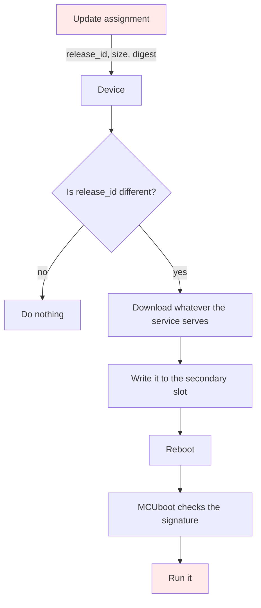

# Tier 4: Protect release metadata and block downgrade

## Scenario

Your Reference product is in good shape. It talks only to a service whose certificate it verifies, and it runs only firmware signed by a key you keep to yourself. Tier 2 closed the question of who it is talking to. Tier 3 closed the question of who wrote the code.

In March you shipped a release that fixed a real hole. The device was accepting a certificate for any name when the configured name was empty, so anything on the network could impersonate your service. You found it, you fixed it, you signed the fix with your own key, and every device installed it.

This morning someone with access to your update service assigned the February release instead.

It is correctly signed. It is your firmware, built by you, signed by your key, and the bootloader is perfectly happy with it. Every check Tier 3 added passes, because there is nothing wrong with the image. The thing that is wrong is that it is the wrong one, and nothing in your product has an opinion about which release it should be running.

The fleet went back to February. The hole is open again on every device you own.

Nothing was forged. That is the part worth sitting with, because it means no signature check anywhere could have stopped it. Tier 3 asks who published an image. It has nothing to say about a release that is authentic and wrong.

This tier gives the device something to reason with. You will publish a Release manifest, signed with the same key, that says what a release actually is: which hardware it is for, which channel it belongs to, how big the image is, what its digest is, and a security counter that only ever moves forwards. Then you will make the application verify that manifest before it believes a single byte of it, and watch it refuse seven releases that Tier 3 would have installed without complaint.

By the end you will have a device that refuses an authentic image, for six different stated reasons, and you will be able to say exactly which of those refusals is a security boundary and which is merely a convenience.

## Learning result

After this tier, you can:

- Explain why an authentic image can still be the wrong image, and give an example that involves no attacker at all.
- Publish a Release manifest whose exact bytes are signed with an offline key, and say why the bytes are the artifact rather than the values.
- Make a device verify a detached signature over downloaded bytes before it parses them, and say what would go wrong if it parsed first.
- Distinguish a release an outsider could have forged from one only the key holder could have produced, and explain why the device cannot tell them apart.
- Decide when a release should raise the security counter and when it must not, and defend the answer.
- Name which of your two verifiers refused a given release, and why passing one is never evidence for the other.
- State plainly which checks happen before any byte reaches flash and which cannot.

## Safety boundary

Everything in this tier runs against the disposable Course environment on your own machine and the board on your desk. The fixtures act only on the local OTA service, never on a network you do not own.

This tier signs hostile releases with your own Release signing key. That is deliberate and it is explained where it happens. Five of the seven releases you are about to build cannot exist any other way, because nobody without your key can produce a manifest that verifies. Your key has not leaked, and the commands say so as they run.

Both signing keys still live in `.course-secrets/signing`. Git ignores that directory. Never commit either one, never copy them anywhere, and never reuse them outside this lab.

Nothing in this tier runs an eFuse command, and nothing here is irreversible. Every hostile release is generated from your own good one at the moment you ask for it, and none of them is shipped with this course.

## Starting state

You have finished Tier 3. Your device runs only firmware signed by the key its bootloader carries, and it refused four kinds of bad image on hardware.

Check that the service and the board are where you left them:

```text
./course service start --https
./course device logs
```

You should see the Tier 3 banner and a verified connection. If you do not, finish Tier 3 before starting this tier.

One note about the device output quoted in this module. Every serial line in it was recorded on the board the course used before, a nanoESP32-C6 1.0, and no tier has yet been run on the ESP32-C6-DevKitC-1 this course now targets. Treat the quoted lines as what to expect rather than as a result on your board, record what you actually see, and raise any difference with a Mentor instead of editing your observation to match the page.

One thing to carry in clearly, because this tier is built on it. Tier 3 told you, in as many words, that the application checks nothing about the bytes it downloads. It writes whatever it is handed and says so on every install, and only the bootloader looks, and only at the last moment. That is still true when you start, and it is the weakness this tier closes.

## Weakness ledger before the work

This table is what you carry in from Tier 3. It is inherited context, not your own work.

| Identifier | Weakness | Attack vector | Expected result | Planned treatment |
| --- | --- | --- | --- | --- |
| T0-W-05 | The release record is mutable by anyone who can reach the service, and the device believes what it says | Replace the current release record | The new record is served and acted on | This tier |
| T0-W-06 | Nothing stops a correctly signed older release being installed over a newer one | Assign an older release after a newer one | The device installs the older release | This tier |
| T0-W-07 | An installed image is permanent and the fallback path is unused | Install an image that does not work | The device has no way back | Tier 5 |
| T0-W-02 | The service trusts the device identifier in the request body | Claim to be another device | The service accepts it | Tier 6 and Tier 7 |
| T2-W-09 | The device does not check certificate validity dates, because it has no clock | Present an expired certificate | It is accepted | Tier 8 |
| T3-W-10 | The bootloader is not itself verified by anything | Flash a bootloader holding another key | The device runs firmware signed by that key | Advanced Tier A |
| T3-W-11 | The Release signing key lives on the same machine as the build and the service | Take the key | Everything this tier adds is defeated | Tier 8 for lifecycle |

Note the last row before you begin. Everything this tier builds rests on that key staying yours, and this tier does not improve its custody at all.

## Reproduce the replayed release

### Predict

Before running anything, write down your answers. The Reveal section, after Test bypass attempts, answers all three.

1. An attacker who owns your update service has no signing key. Name something damaging they can still do to a fleet of Tier 3 devices.
2. Your device checks the signature on every image it installs. What does that signature tell it about whether the image is the right one to be running?
3. If you wanted a device to refuse an older release, what would it have to remember, and where could it keep that?

### Look before you act

Every fixture in this course shows you what it will do before it does it. Run it without executing:

```text
./course attack run tier-04/replay-release
```

It prints its target, the changes it will make, the command that undoes them, and a numbered plan. Read the plan before you run it for real.

### Replay a release that nobody forged

This is the attack from the Scenario, and it is the only one in this tier that requires no forgery of any kind. The attacker re-assigns a release you published yourself, unedited, still signed by your key.

You need two signed releases for it, which the work below produces. Come back to this once you have them.

```text
./course attack run tier-04/replay-release --execute tier-04/replay-release --hold 75
```

The part of the output that carries the lesson:

```text
Step 1. Read the release the service is offering now.
  -> GET https://ota.course.example:8443/v1/releases/current
  <- release_id tier-04-security-fix, version 0.4.1-security-fix
     Its manifest is signed by your key and carries security_counter 2.

Step 2. Find an older release this environment actually produced.
  <- tier-04-baseline, security_counter 1, signed 2026-09-14T15:02:48Z
     Its signature verifies. Nothing about this release is forged, edited, or expired,
```

Sit with step 2. There is no attack in it. The release is yours, the signature verifies, the bytes are untouched, and every check Tier 3 added would pass. The only thing wrong with it is that it is older than the one the device is running, and on a Tier 3 device nothing anywhere knows that.

That is `T0-W-06`, and it is why a signature is not a release policy.

The fixture names its own precondition, which is worth reading twice because it is the honest limit of what this tier builds:

```text
Section 6: the counter is compared, never remembered, and the comparison lives in flash an attacker can rewrite.
B4 from issue #68: across the transition, before any counter-carrying image is primary, this succeeds.
```

## Investigate the missing boundary

Answer these before you write any code.

1. When the device receives an assignment, which of the fields in it has it ever had a reason to believe?
2. The image signature is checked by the bootloader, at boot, after the whole image is already in flash. What decisions are impossible to make at that point?
3. Where would a device have to learn "this release is for hardware revision 2" from, and could that fact ever live in the image itself?
4. If the device kept a record of the highest release it had ever installed, where would it keep it, and who could change it?

Follow what the device believes today.



One comparison decides everything on that path, and it is a string comparison on an identifier the attacker chooses. Everything else the assignment says is taken on trust or ignored entirely. The only real check on the whole path happens at the very end, in the bootloader, and it can answer exactly one question: was this signed by the key I hold.

The responsibility that is missing has a name. Nobody is stating, in a form the device can verify, what this release *is*. The service says what to install and the image says who made it, and between those two there is no signed description of the release itself.

## Publish a signed Release manifest and make the device check it

This is the tier's work. It is one new signed artifact, one new check in the application, and two Kconfig options in the bootloader.

### Build and sign the first release

Build the Tier 4 application, which is the Tier 3 application plus a release policy:

```text
./course build firmware --tier 04
```

It ends by refusing to publish, the same way Tier 3 does:

```text
Result: built an unsigned Tier 4 image in /opt/zephyr-workspace/build/tier-04-release-policy-baseline
Nothing has been published. This image is unsigned, so the bootloader would refuse it.
Sign and publish it yourself with:
  ./course release sign --tier 04 --variant baseline
That step signs the image and the Release manifest with the same key,
puts security counter 1 in both, and publishes the release.
```

Now sign it. This is the command worth reading closely, because it is doing two different things with one key:

```text
./course release sign --tier 04 --variant baseline
```

```text
Signing with the release key, fingerprint 2f5fe5123abe8715ecde8cde2cac0e734969e5c0110d71eb839a15ceebd6c1e4
+ .../imgtool.py sign --version 0.4.0+0 --header-size 0x20 --slot-size 1835008 --align 4 --security-counter 1 --key .course-secrets/signing/release.pem ...
+ signed 487 manifest bytes with ECDSA P-256 over SHA-256
  manifest:  artifacts/generated/releases/tier-04-baseline.manifest.json
  signature: artifacts/generated/releases/tier-04-baseline.manifest.sig, 71 bytes of ASN.1 DER
  digest:    1c21fe03565e71066f47891ad6002da509622769a98be6c40daffacc88a378e1
  counter:   1, in the image TLV and in the manifest
The signature covers these exact bytes. Reformatting the file breaks it,
which is why the device verifies the bytes before it parses them.
```

Three things in that output are the whole tier.

**One key, two signatures, two different claims.** The same `release.pem` signs the image through `imgtool` and the manifest through a plain ECDSA operation. The image signature says who built this code. The manifest signature says who described this release. They are different sentences about different bytes, and the device checks them with two separate verifiers that never consult each other.

**The counter appears twice, from one source.** `--security-counter 1` puts it in the image's protected TLV area, and the same value goes in the manifest. They cannot disagree, because the course reads them from one constant. Section 6 of the specification requires both, and the reason is the two verifiers: the application reads the manifest's copy and MCUboot reads the image's, and neither can see the other's.

**The signature covers bytes, not values.** Reformatting that JSON without changing a single value breaks the signature. That is not a flaw to work around, it is the reason the specification says the exact downloaded bytes are verified before parsing, rather than inventing a canonical form to compare. The bytes are the artifact. The service stores them and hands them back untouched, and anything on the path that parsed and re-encoded a manifest would destroy signatures on releases nobody had touched.

Look at what you signed:

```text
cat artifacts/generated/releases/tier-04-baseline.manifest.json
```

Every field in it is something the device is about to check, or something a later tier will need. The hardware revision range, the channel, the size and the digest are checked on every install. The creation and support dates are not, and cannot be, because this board has no clock. They are signed so that nobody can change them afterwards, reported in status events, and read by Tier 9. The module says that plainly rather than letting a date field imply a check that does not happen.

### Flash it and read the banner

```text
./course device flash --tier 04
./course device logs
```

Press reset. The banner now states the policy the device is carrying:

```text
Running release: tier-04-baseline
Security counter of the running image: 1
Release channel this device follows: stable
Board: esp32c6_devkitc/esp32c6/hpcore
Silicon revision read from eFuse: v0.1
Product hardware revision asserted by this build: 1
The first is read from the chip. The second is asserted and signed, because
nothing on this part reports which product a board was built into.
Tier 4 boot mode: signed MCUboot images, swap using offset, permanent upgrade
Tier 4 downgrade prevention: by security counter, enforced by the bootloader
```

Those two hardware lines are worth a minute. The silicon revision is real and readable: `efuse_hal_chip_revision()` asks the chip and it answers `v0.1`. The product hardware revision is not readable at all, on this part or any other, because nothing in the silicon knows which board it was soldered into. So it is asserted by the build and signed into the manifest.

That is the general shape of product identity. It is something you assert and then protect, not something you read. A device that trusted a hardware revision it discovered at runtime would be trusting whatever could set it.

Then watch what the device now says about the assignment it is offered:

```text
ota.assignment release_id=tier-04-baseline version=0.4.0-release-policy image=tier-04-baseline.bin
ota.assignment it also claims size=668744 sha256=1c21fe03565e71066f47891ad6002da509622769a98be6c40daffacc88a378e1
ota.assignment this device believes neither; they are the service's claims
ota.assignment about itself. Only release_id is used, to know what to ask about.
```

The record has not changed since Tier 0. It is still mutable, still writable by one unauthenticated request, and it still carries `"signed": true`, which Tier 3 pointed at and called the service's claim about itself. What changed is that the device stopped believing it. It reads one field, to know which release to go and ask about, and gets every fact from the signed manifest instead.

### Build the second release

The replay needs something to fall from, so build a second release carrying a higher counter:

```text
./course build firmware --tier 04 --variant security-fix
./course release sign --tier 04 --variant security-fix
```

That one carries `counter: 2`. Watch the device install it, because this is the accept path and every refusal later in the tier is a departure from it:

```text
ota.assignment release_id=tier-04-security-fix version=0.4.1-security-fix image=tier-04-security-fix.bin
ota.assignment it also claims size=668744 sha256=39fd5cd269121163873ce22762e6fcd1c697ddd03702353f8e5fcfdf219fac30
ota.assignment this device believes neither; they are the service's claims
ota.assignment about itself. Only release_id is used, to know what to ask about.
ota.assignment offers tier-04-security-fix instead of the running tier-04-baseline; asking for its signed manifest
ota.manifest fetched 493 manifest bytes and a 71 byte detached signature
release.verified signature over 493 manifest bytes, ECDSA P-256 over SHA-256
release.verified nothing has parsed these bytes yet; that is the point
release.admitted release_id=tier-04-security-fix version=0.4.1-security-fix counter=2 channel=stable
release.admitted board=esp32c6_devkitc/esp32c6/hpcore hardware_revision 1..1 covers this product's 1
release.admitted created_at=2026-09-14T20:23:49Z supported_until=2031-09-14T20:23:49Z, carried and signed, not checked: this device has no clock
ota.install starting release_id=tier-04-security-fix version=0.4.1-security-fix size=668744
ota.install every value above came from the signed manifest
release.accepted sha256=39fd5cd269121163873ce22762e6fcd1c697ddd03702353f8e5fcfdf219fac30 matches the signed manifest
ota.install wrote 668744 bytes to the secondary slot
ota.install six checks ran and none refused
ota.upgrade requested a permanent swap, no test boot, no rollback
ota.upgrade the bootloader now checks the signature and the security counter itself, and its refusal is the one that stops a downgrade
Rebooting into the newly installed image
I: course: slot=secondary header=ok tlv=ok signature=present key=match counter=2
I: course: slot=primary   header=ok tlv=ok signature=present key=match counter=2
```

Four lines in there are the tier in miniature.

`release.verified nothing has parsed these bytes yet; that is the point` is the ordering the specification requires. The signature is checked against the bytes exactly as they arrived, before any field is read out of them. A device that parsed first and verified afterwards would already have acted on attacker-controlled structure.

`release.admitted ... created_at ... carried and signed, not checked: this device has no clock` is the tier refusing to pretend. Those dates are real, they are signed so nobody can change them afterwards, and nothing on this device can tell whether they have passed. Tier 9 reads them. This tier carries them honestly and says it.

`ota.install every value above came from the signed manifest` is the difference from Tier 3. Every number the installer acts on is one the manufacturer signed, not one the service offered.

And the two slot lines at the end are both `counter=2`, which is what an accepted upgrade looks like from the bootloader. Keep them in mind: the only thing that changes in the refusal at the end of this tier is one of those numbers.

The device is now running a release that a replay of the first one would take it backwards from.

Your digests and sizes will not match the ones printed here. You built and signed these images yourself, and the Wi-Fi network name and service address are compiled into them, so every value derived from the bytes is yours. Compare the shapes and the reasons, never the hex.

### Decide your version policy

This is the tier's other artifact, and it is reasoning rather than commands. You have just published two releases and moved the counter once. Now decide the rule you will follow every time.

Section 6 fixes the rule itself: a security counter is increased only when a release closes a security boundary that must not be reopened. A candidate counter may equal the confirmed one for an ordinary release, but never be lower. What it does not do is decide any particular case for you.

Your device is running `0.4.0-release-policy` at security counter 1. For each of these, write down the version you would publish and whether the counter moves:

1. A log message says `recieved`. Someone fixes the spelling.
2. The beacon gains a second blink pattern, requested by the product owner.
3. A malformed status response from the service makes the device reboot. No data is exposed and nothing is bypassed, but a hostile service can keep a fleet rebooting indefinitely.
4. The service name comparison is skipped when the configured name is the empty string, so a certificate for any name is accepted. Fixed.
5. An Mbed TLS advisory is published. The vulnerable code path is not reachable in this product, and the dependency is updated anyway.
6. A second Mbed TLS advisory. This path is reachable and can leak private key material. The dependency is updated.

Commit to all six before you read anything. Then compare against [the worked model](answers.md), which shows two wrong tables beside the right one, because the wrong ones are what careful engineers actually write.

One of the six is genuinely arguable and the worked page says which. If you disagree with it, that disagreement is the artifact worth recording, not the table.

## Replay the attacks against the control

Build the releases your device should refuse. They are made here, now, from the release you just signed, and none of them ships with this course:

```text
./course release hostile --tier 04
```

Read the paragraph it prints before it signs anything, because it is about to use your own key:

```text
Read this before the fingerprints below alarm you.
Two of these seven are forgeries: one edited after signing, one signed by another key.
The other five are about to be signed with YOUR Release signing key, 2f5fe512...
Your key has not leaked.
```

That split is the sharpest idea in this tier. Nobody without your key can produce a manifest that verifies. So a wrong hardware range, a wrong channel, a wrong size, a wrong digest and a manifest that points at the wrong image can only be signed by whoever holds the key. They are not outsider attacks. They are the manufacturer publishing something wrong, which is exactly what the specification lists as this tier's threat alongside replay.

The device cannot tell the difference between those two situations, and it refuses either way.

### The two forgeries

Publish one and watch the board:

```text
./course attack run tier-04/hostile-release --execute tier-04/hostile-release --release modified --hold 75
```

```text
release.refused check=manifest-signature
release.refused   compared: the detached signature against SHA-256 of the 497 manifest bytes exactly as they arrived, using the key compiled into this image
release.refused   rejected: the signature does not verify, status=-149; either these bytes are not what was signed, or they were signed by another key
release.refused   consequence: no image bytes were requested, and the running image is unchanged
```

`wrong-key` produces the same refusal, and that is the point of having both. One was signed correctly and then edited; the other was signed perfectly by a key that is cryptographically identical to yours and trusted by nothing. The device has one answer for both, because from where it stands they are the same event: these bytes are not vouched for by the key I hold.

Note what did not happen. No image bytes were requested. The refusal came from 497 bytes of JSON and a 71 byte signature, before anything parsed a field or opened a socket for the firmware.

### The four the key holder signed

Each of these verifies perfectly and is refused for what it says.

```text
release.refused check=hardware-compatibility
release.refused   compared: this product's asserted hardware revision 1 against the manifest's hardware_revision_min..max 2..3
release.refused   rejected: a release that does not cover this hardware revision
release.refused   consequence: no image bytes were requested, and the running image is unchanged
```

```text
release.refused check=release-channel
release.refused   compared: the manifest's channel candidate against the channel stable this device was configured for
release.refused   rejected: a release published to a channel this device does not follow
release.refused   consequence: no image bytes were requested, and the running image is unchanged
```

```text
release.refused check=image-size
release.refused   compared: the length this transfer declared before any byte was written, 668758 bytes, against the manifest's signed image_size of 668694 bytes
release.refused   rejected: an image that is not the size the signed manifest declared, for release tier-04-hostile-size
release.refused   consequence: no image bytes were requested, and the running image is unchanged
```

```text
release.refused check=image-digest
release.refused   compared: SHA-256 of the delivered bytes, 97827ac8260fb8a8bf7950e986a521453d942f054a3841a57a5bf6afcb313e53, against the manifest's signed image_sha256
release.refused   rejected: bytes that are not the image the manifest describes; it declared 478507be8e2c4f45570a7c5126355dddebc256937618b7e3a7d93a7adf4804ba
release.refused   consequence: no upgrade was requested, so the bytes in the secondary slot are never booted, and the running image is unchanged
```

Read the last consequence line against the other three. This is the one honest limit in the tier's install path, and the module will not pretend otherwise.

The first five checks all happen before a byte reaches flash. The digest cannot. The image is 668 kilobytes and streams into a 1.75 megabyte slot through a device that cannot hold it in memory, so the digest is accumulated as the bytes pass and checked once they have all arrived. The write happens, and then the refusal happens, and the upgrade is never requested, so the bytes in the secondary slot are never selected and never booted.

That is why the size is checked twice: once against the declared length before anything is written, and once against the delivered count afterwards. The first protects the write. The second protects the upgrade.

### The replayed release

Now the attack from the Scenario, with the control in place:

```text
release.refused check=security-counter
release.refused   compared: the manifest's security_counter 1 against the counter 2 this running image was built with
release.refused   rejected: a release that would take this device backwards, version 0.4.0-release-policy
release.refused   consequence: no image bytes were requested, and the running image is unchanged
```

Nothing was forged. The signature verified. The device refused on policy alone, which is the whole reason the counter exists and the reason it is separate from the human readable version.

### The one the application accepts

The seventh release is different from all of them, and it is the only way to see the second half of this tier's control.

Its manifest is true about everything the application can check. The signature verifies. The hardware matches. The channel matches. The counter is the one this device is already running. The size and digest describe the delivered bytes exactly. Every check passes, and the bytes are written.

What it points at is the image of the older release, whose own security counter lives in the signed image TLV. The application never reads that. MCUboot does.

```text
./course attack run tier-04/hostile-release --execute tier-04/hostile-release --release counter-mismatch --hold 110
```

```text
ota.install starting release_id=tier-04-hostile-counter-mismatch version=0.4.1-security-fix size=668744
ota.install every value above came from the signed manifest
release.accepted sha256=1c21fe03565e71066f47891ad6002da509622769a98be6c40daffacc88a378e1 matches the signed manifest
ota.install wrote 668744 bytes to the secondary slot
ota.install six checks ran and none refused
ota.upgrade the bootloader now checks the signature and the security counter itself, and its refusal is the one that stops a downgrade
```

Then the device reboots, and the bootloader answers:

```text
I: course: slot=secondary header=ok tlv=ok signature=present key=match counter=1
I: Image 0 in slot 1 erased due to downgrade prevention
I: course: slot=primary   header=ok tlv=ok signature=present key=match counter=2
```

Every field on the candidate says the image is genuine, because it is. `signature=present key=match` is the same thing Tier 3 printed for a good image. It was refused for what it claims about itself, not for who signed it.

This is what section 18 of the specification means when it says that passing one verifier never counts as evidence for the other. You have just watched the application pass a release and the bootloader refuse the same release, using the same key, because they were checking different things about different bytes.

It is also the honest answer to which of your two checks is the security boundary. **The bootloader's is.** The application's counter check refuses a downgrade earlier and more legibly, and it saves a pointless download and flash write, but if you removed it the device would still refuse the downgrade. If you removed the bootloader's, nothing would.

## Test bypass attempts

Record the actual result yourself. If one surprises you, write down what you saw before you troubleshoot it, and do not mark the Security claim supported.

| Evidence ID | Test | Expected result | Actual result |
| --- | --- | --- | --- |
| E-4-01 | Publish `modified` and `wrong-key` | Both refused at `manifest-signature`, no image bytes requested | |
| E-4-02 | Publish `hardware`, `channel`, `size`, `digest` | Each refused at its own named check, and the running release is unchanged | |
| E-4-03 | Replay a genuinely signed older release | Refused at `security-counter` with every signature verifying | |
| E-4-04 | Publish `counter-mismatch` | The application accepts, the bytes are written, and MCUboot erases the slot for downgrade prevention | |
| E-4-05 | Rebuild the application with the attacker's public key compiled in, then publish a manifest signed by the attacker key | The manifest verifies and the image is still refused by the bootloader | |
| E-4-06 | Install a release onto a device whose primary image carries no security counter | The swap is allowed. Downgrade prevention does not protect the first install | |
| E-4-07 | Take the Release signing key and sign anything you like | Everything in this tier is defeated. No device result is needed to know this | |

`E-4-05` is the one that changes how you read the tier. It defeats the application's manifest check completely, and the device still refuses the image, because MCUboot's key is a different trust store that the application cannot influence.

`E-4-06` is a bypass that succeeds, and it is published rather than hidden. MCUboot allows the swap outright when the image in the primary slot carries no security counter, and every image built before this tier is like that. So the first install after the transition is unprotected, and anyone who can reflash a device over serial to a pre-Tier-4 image restores that window.

`E-4-07` needs no device at all. It is `T3-W-11`, unchanged by this tier.

## Reveal

Compare these against what you predicted.

1. They can put an old release back. The replay fixture re-assigns a release you published yourself, and step 2 of its output is the answer: `tier-04-baseline, security_counter 1`, whose "signature verifies. Nothing about this release is forged, edited, or expired". On a Tier 3 device every check passes, because the only check is who signed the image, and a release you signed last year is still signed by you. That is `T0-W-06`, and a fleet sent back to a version whose defects are published is the damage.
2. Nothing at all. The signature says who made the image. It says nothing about whether this is the release the device should be running now, for this hardware, on this channel, at this size. Before the work in this tier, "one comparison decides everything on that path, and it is a string comparison on an identifier the attacker chooses", and the bootloader "can answer exactly one question: was this signed by the key I hold". A signature is not a release policy.
3. The device remembers nothing, and this tier gives it nowhere to remember. The security counter travels inside the signed image and inside the signed Release manifest, and the bootloader compares the candidate against the counter in the image that is in the primary slot right now. You watch it happen in the `counter-mismatch` run: `slot=secondary` reports `counter=1`, the bootloader prints `Image 0 in slot 1 erased due to downgrade prevention`, and `slot=primary` reports `counter=2`. The fixture states the same fact as its own precondition: "the counter is compared, never remembered, and the comparison lives in flash an attacker can rewrite."

The wrong answer most engineers give is to question 3, and it is that the device keeps a stored high-water mark, a number written to non-volatile storage after every successful install. It is the design most people have seen, and it is not this one, which is why the tier is built around watching the comparison rather than around a stored value. Two rows in the ledger only make sense once you have let that go. `T4-W-12` exists because a device whose primary image carries no counter has nothing to compare against, so the first install after the transition is unprotected, which is `E-4-06`. `T4-W-13` exists because both copies of the number live in flash, so whoever can rewrite the primary slot chooses what the device thinks it is running. A remembered counter would have different weaknesses. This one has these.

This section was added after Tier 4 was published. If you worked the tier before it existed, your three written answers are checkable now.

## Weakness ledger after the work

This is the result you should expect to observe. If you observed something else, record that instead and work out why.

| Weakness | Result after this tier | Status | Evidence or next action |
| --- | --- | --- | --- |
| T0-W-05 | The release record is still mutable, and the device no longer believes it. Every fact now comes from a signed manifest, and the record is read for one field | Closed | The seven refusals and the banner lines naming what the device does not believe |
| T0-W-06 | A correctly signed older release is refused, by the application on its manifest counter and by the bootloader on the image counter | Closed | `E-4-03` and `E-4-04` |
| T0-W-07 | Unchanged. The upgrade is still permanent and the fallback path is still unused | Open | Tier 5 |
| T0-W-02 | Unchanged | Open | Tier 6 and Tier 7 |
| T2-W-09 | Unchanged, and now it has a second instance. The manifest carries creation and support dates that this device cannot check either | Open | Tier 8 |
| T3-W-10 | Unchanged | Open | Advanced Tier A |
| T3-W-11 | Unchanged, and this tier leans on it harder. The same key now signs two things, and taking it defeats both | Open | Tier 8 for lifecycle |
| T4-W-12 | New. Downgrade prevention does not protect the first install, because MCUboot allows a swap when the primary image carries no counter | Open | Accepted for the core course. `E-4-06` |
| T4-W-13 | New. The security counter is compared, never remembered. Both copies live in flash, and a physical attacker who can rewrite the primary slot chooses what the device thinks it is running | Open | Residual risk with an owner. Advanced Tier A |

Two of the three new rows are limits rather than achievements. `T4-W-13` is the one to understand: this is software downgrade prevention, and the specification says so in as many words, because the reference the bootloader compares against is a field inside an image in flash rather than anything the device remembers.

## Security claim and evidence status

**SC-02: The device installs only the release the manufacturer currently approves, and never an earlier one.**

You wrote this in Tier 1 and recorded it as `unsupported`. This is the tier that moves it.

It becomes **partly supported**. Supported against anyone who can reach or own the update service: they cannot forge a release the device accepts, and they cannot replay an older one. That was observed on the board the course used before, a nanoESP32-C6 1.0, and it is owed a run on the ESP32-C6-DevKitC-1 this course now targets. Not supported against an attacker with physical access, because the counter the bootloader compares against lives in flash that such an attacker can rewrite, which is `T4-W-13`. Not supported for the first install after the transition, which is `T4-W-12`.

The claim needs two controls, and a Learner who sees only the first has understood half of it:

| Control | What it does | Requirement | Status after this tier |
| --- | --- | --- | --- |
| CTL-02 | The device verifies a signed Release manifest before it believes any of it, and refuses a lower security counter | REQ-02 | Implemented in the application, and it is not the boundary |
| CTL-01 | MCUboot refuses to swap in an image whose signed counter is lower than the running one | REQ-02, REQ-06 | Implemented in the bootloader, and it is the boundary |

Four claims you must not make at the end of this tier:

- That the device checks everything before writing to flash. It does not. The digest is checked after the write, before the upgrade is requested, and the module shows you the line that says so.
- That the device remembers which release it is on. It does not remember anything. It compares two fields in two images in flash.
- That downgrade is impossible. It is refused. A physical attacker who can rewrite the primary slot chooses the reference the comparison uses.
- That a signed manifest makes a release correct. It makes it authentic. Five of the seven releases you just refused were signed by your own key, and the device could not tell them from a leaked one.

## Update the Security evidence pack

```text
./course evidence init --tier 04
```

Record:

- The seven refusal observations and the good install, each with the check that refused it. These become `observed` only when you watched them on the board.
- Your version policy decision table, which is your own work. The companion page has one worked model to compare against, not a marking scheme.
- The `SC-02` claim record, moved from `unsupported` to `partly_supported`, with both gaps named.
- Your `control` records for `CTL-02`, moved from `planned` to `implemented`.
- The two new weaknesses, `T4-W-12` and `T4-W-13`, with owners.

Every refusal row must come from a board you watched. A host result never stands in for a device result, and in this tier the distinction has teeth: the fixtures deliberately cannot tell you what the device did, and they say so.

## Troubleshooting

| Observation | First check |
| --- | --- |
| The device installs a release you expected it to refuse | Check the release identifier. The device only looks at an assignment whose identifier differs from the one it is running, so a hostile release that reused the good identifier is ignored and looks like a refusal that never happened |
| `release.refused check=manifest-signature` on a release you just signed | The manifest bytes changed after signing. Anything that parses and re-encodes the JSON produces different bytes and breaks a genuine signature |
| The replay fixture refuses to run | It requires a signed Tier 4 release to be assigned and an older one with a strictly lower counter to exist. Build and sign the second variant |
| `counter-mismatch: skipped` | Only one signed release exists, so there is no older image for it to point at. Sign the second variant |
| A downgrade installs when you expected the bootloader to stop it | The image in the primary slot carries no security counter, so MCUboot allowed the swap. This is `T4-W-12` and it is expected before the first counter-carrying image is primary |
| The board reports `ota.request failed err=-113` | The response was too large for the device's TLS buffer, whatever the handshake line above it says. `CONFIG_MBEDTLS_SSL_MAX_CONTENT_LEN` must be 16384 |

Involve a Mentor when a refusal names a check you did not expect. Bring the board's serial record and the manifest the service served, because the two together usually answer it in a minute.

## Informal Mentor conversation

Tier 4 has no required Mentor review gate. Section 13 of the specification names the six tiers that do, and this is not one of them, so this is an optional conversation and there is no grade.

If you want one, the most useful thing to show is `counter-mismatch`: the application accepting a release and the bootloader refusing the same release. Then explain, in your own words, which of the two is the security boundary and what would still be true if you deleted the other.

The question worth being asked is the same one every control tier should ask. Name three things an attacker who completely owns your update service can still do to your fleet. A Learner who cannot name one has overread the control.

## Continue

Next: **Tier 5: Make installation recoverable**.

Your device now refuses the wrong release. It still has no way back from a bad one. Every install in this tier is permanent, requested as `BOOT_UPGRADE_PERMANENT` on purpose, and an image that verifies perfectly and then fails to work leaves the device with nothing to fall back to.

Tier 5 adds the test boot, the health gate, confirmation and revert, and it is where the sixth rejection condition this tier deliberately skipped, an image the device has already confirmed, finally has something to mean.

## Primary references

| Reading | Level | Type | Learning question | Where to read |
| --- | --- | --- | --- | --- |
| MCUboot image format and TLVs | Required | Specification | What is covered by the image signature, and what is not | `bootloader/mcuboot/docs/design.md` |
| MCUboot downgrade prevention | Required | Source | Where does the bootloader read the counter it compares against | `boot/bootutil/src/loader.c`, `check_downgrade_prevention` |
| TUF, The Update Framework | Optional | Specification | Why do real systems separate the role that signs images from the role that signs metadata | theupdateframework.io |
| Section 6 and 7 of the course specification | Required | Specification | What does this course fix about counters and manifests, and what did it leave open | `docs/course-specification.md` |
| Uptane, for vehicles | Optional | Specification | What does a manifest need when one device runs many independently updated parts | uptane.org |
