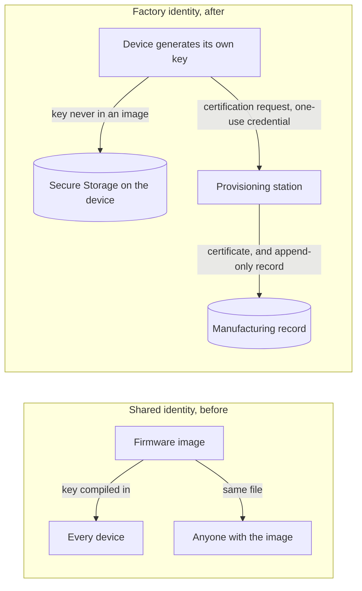

# Tier 6: Replace shared identity with per-device factory identity

## Scenario

The status beacon works. It talks to the update service over verified HTTPS, it installs only signed releases the manufacturer currently approves, and it recovers from a bad update on its own. Five tiers of hardening, and every one of them holds.

There is one thing it does not have: a name of its own. Every device you have built reports the same identifier, `beacon-development-shared`, because every device was flashed from the same image, and the image is where the identity lives.

That was fine while an identifier was only a label. It stops being fine the moment the identifier becomes a credential. In the tiers ahead the service decides what a device may download and whose reports it believes, and it decides that by identity. An identity that every device shares, and that travels inside a file anyone can copy, is not an identity. It is a shared password printed on the side of the box.

This tier is unusual, and it is worth saying so plainly. Every hardening tier so far inherited a working product and made an attack against it fail. This one has to make the product vulnerable first. There is no shared credential at the end of Tier 5 to attack, because the shared identifier is a build-time string and cloning a string is what Tier 0 already did. So you will build the insecure thing on purpose, clone it, and only then replace it.

You will give the fleet a single shared cryptographic credential, extract that credential out of an image you built, and use it to register devices that were never manufactured. Then you will replace it: generate a private key on the device itself, enroll a per-device Factory certificate against a one-use Bootstrap credential, and store the key through the limited Secure Storage the specification pins in section 8. Along the way you will read that key back out of a flash dump, because the honest version of this tier says exactly what the new storage does and does not do.

At the end you will have a device whose private key was generated where it lives, a manufacturing record that never held a private key, and a clear-eyed account of the one boundary this design does not close.

## Learning result

After this tier, you can:

- Explain why a shared fleet credential permits cloning, and why possession has to be device-specific.
- Extract a private key from a firmware image and use it to impersonate an entire fleet against the provisioning station.
- Generate a P-256 key on the ESP32-C6 and enroll a Factory certificate against a one-use Bootstrap credential.
- Read the same private key out of a flash dump, and say precisely what the Secure Storage configuration protects and what it does not.
- Test the enrollment bypasses, including the two that are meant to succeed.
- Update the weakness ledger and the Security evidence pack, and state the one claim this tier supports and the one it does not.

## Safety boundary

Run everything against the local reference product and the course provisioning station on the isolated lab network. Use only disposable course credentials and images.

The shared identity you build in this tier exists to be cloned. The fleet private key ends up in generated state under `.course-secrets/`, and the extraction command reads it back out of an image you built. Do not put a real key anywhere near this, and do not reuse a shared credential outside the lab. A shared credential is the thing this tier exists to argue against.

Two steps touch the device in ways that do not undo:

- `./course provision erase` **destroys the device's private key and deletes its certificate.** It is the device half of remanufacturing. The manufacturing record is append only, so nothing removes the record of the identity that was erased, and the device comes back under a new identifier. Read the step before you run it.
- The flash dump reads **only the `storage` partition**. `./course device dump` takes no range for that reason: a dump that read the whole flash would read slot 0, which carries the real Wi-Fi credential the board was flashed with. Keep it bounded.

## Starting state

You need:

- A working Tier 5 device running a confirmed image.
- The local HTTPS OTA service and the course provisioning station.
- The isolated course network.
- The Tier 5 Security evidence pack.

The device recovers from a bad release, and it still answers to the same name as every other device you own.

One note about the device output quoted in this module. Every serial line in it was recorded on the board the course used before, a nanoESP32-C6 1.0, and no tier has yet been run on the ESP32-C6-DevKitC-1 this course now targets. Treat the quoted lines as what to expect rather than as a result on your board, record what you actually see, and raise any difference with a Mentor instead of editing your observation to match the page.

## Weakness ledger before the work

Inherited from Tier 5. Not your own work yet.

| Weakness | What it means today | How you would see it | Where it is addressed |
| --- | --- | --- | --- |
| T0-W-02 | The service trusts the device identifier in the request body, and any device can claim another's name | Report as a device you are not | This tier reduces it, Tier 7 closes it |
| T2-W-09 | The device has no clock and checks no dates | An expired certificate is accepted | Tier 8 |
| T3-W-10 | The bootloader itself is unverified | Nothing checks MCUboot before it runs | Advanced Tier A |
| T3-W-11 | One key signs the image and the manifest, so taking it defeats both | Sign anything with the release key | Tier 8 for lifecycle |
| T4-W-12 | Downgrade prevention does not protect the first install | Install onto a device whose primary image carries no counter | Accepted for the core course |
| T4-W-13 | The security counter is compared, never remembered | Rewrite the primary slot and the device forgets what it was running | Advanced Tier A |
| T5-W-14 | A power cut during the health window forces a revert indefinitely | Power-cycle the board during the sixty second window | Residual availability risk |
| T5-W-15 | The watchdog depends on a driver quirk that an upstream fix would change | Recheck on any Zephyr upgrade | Recorded limit |
| T5-W-26 | A revert is reported once and nothing acknowledges it, so a board that reverts while it cannot reach the service never tells the fleet | Revert with the service stopped, then start it | Tier 8 revisits delivery |

The row that this tier is about is `T0-W-02`. Every device shares one name, so the service cannot tell them apart even in principle. Nothing here has ever required a device to prove which one it is.

## Give the fleet its shared credential

This section has no equivalent in the tiers before it, and that is the point. Every earlier tier attacked the product it inherited. This tier inherits a product with no shared credential to attack, so you build one.

A shared identity is one certificate and one private key, minted once and compiled into every device's image. Create it, and build the shared variant of the firmware:

```text
./course keys create shared-identity
./course build firmware --tier 06 --variant shared
```

The key is written into generated state and named into the shared build through an environment variable, never committed and never placed on the factory build's include path. That separation is real, and it is worth checking rather than trusting: the whole `ECPrivateKey` structure lives in the shared image, and its bytes do not appear in the factory image at all.

What you have now is the reference product's insecure starting point for this tier: a fleet where every device holds the same credential, and the credential travels in every image built the same way. That is the thing you are about to defeat, and the thing you are about to replace.

## Predict

Before you run anything, write down your answers. The Reveal section near the end of this tier checks them.

1. Where does the shared identity's private key physically live, and who can read that place?
2. The provisioning station checks that whoever registers holds the fleet key. Why does that check pass for a device that was never manufactured?
3. When you replace the shared key with a per-device key generated on the board, which of the two problems above does that fix, and which does it not?

## Reproduce the clone

### Look before you act

Every attack fixture supports a dry run that prints its plan and changes nothing. Read it first:

```text
./course attack run tier-06/clone-shared-identity
```

It reports what it will read, what it will register, and the one certificate fingerprint all of it will carry. Then run it for real with the two-part confirmation the fixture prints.

### Extract the fleet credential from an image

The shared key is not stored anywhere secret. It is compiled into a firmware image, and a firmware image is a file. The extraction command reads it back out:

```text
./course provision extract
```

```text
Reading the shared image you built: artifacts/generated/releases/tier-06-shared-identity.bin (744312 bytes)
This is a firmware image, not a secret store. It is the same file you would
flash to a board, and anyone who has the image has everything in it.

Searching for a SEC1 P-256 private key, which begins 30770201010420.
Found it at offset 0xa7f48. The next 121 bytes are the fleet's private key.
...
  certificate fingerprint: sha256:d07fb116bdf51533e547d92456e9c7cae86d9f4a961dc08ac4fc37bcf498b83d
  certificate subject:     beacon-development-shared
```

The command never prints the key, because it does not need to. The fingerprint proves the key is present, and the point is made: everything the fleet identity is made of travels in every image built the same way. Outside the lab, the image is on the update server, in the build pipeline, and on every device you can desolder a flash chip from. There is nothing to steal that has not already been handed out.

This demonstrates `T0-W-02`: the identity is a value that anyone with an image holds.

### Register devices that were never manufactured

The clone fixture reads that same key and acts as the fleet against the provisioning station, entirely on the host with no board attached, which is itself the lesson: a copied credential does not need the hardware it was copied from.

```text
./course attack run tier-06/clone-shared-identity --execute tier-06/clone-shared-identity
```

```text
Step 2. Register a second time under an identifier the record already holds.
  <- the station accepted it. There are now two entries for beacon-development-shared, both sha256:d07fb116...
Step 3. Register devices that were never manufactured.
  <- registered beacon-phantom-0001, a device that does not exist, under sha256:d07fb116...
  <- registered beacon-phantom-0002, a device that does not exist, under sha256:d07fb116...
  <- registered beacon-phantom-0003, a device that does not exist, under sha256:d07fb116...
```

The station accepted a second registration under a name it already held, and three more under names no board ever carried, all proving possession of the one fleet key. It cannot tell any of them apart, because in the shared model there is nothing to tell apart. That is the threat this tier is named for: one extracted shared credential impersonates every device.

Both halves ran on the host, with no board involved. Record the certificate fingerprint that every entry carries and the fact that a device that does not exist is now in the manufacturing record.

## Investigate the missing boundary

Answer these before you build the replacement:

1. When the station accepts a registration, what has it actually checked? Possession of a key, or the identity of the holder?
2. If every device holds the same key, can any check the station performs distinguish one device from another?
3. Where would a private key have to be generated for the station to be sure that no two devices could ever hold the same one?
4. The device and the station talk over a USB cable that authenticates neither end. What can the station rely on, and what can it not?

The trust boundary this tier changes is the one around the private key.



Before, the manufacturer holds the fleet key and every device and every attacker holds a copy. After, each device holds a key that only it generated, the station holds a record of certificates but never a private key, and the manufacturer authorizes each enrollment exactly once with a Bootstrap credential that is consumed on use. The boundary moved from "who has the file" to "which device generated the key", and only the device can answer that, because only the device was there when the key was made. The station still claims nothing cryptographic about the cable: physical presence at enrollment is the weakest link in the tier, and this tier does not pretend otherwise.

## Give each device its own key

Two controls replace the shared credential, and they are defeated separately, so build and understand them separately.

The first control is a key that never existed anywhere but on the device. On the ESP32-C6 the firmware asks PSA to generate a P-256 key and mark it non-exportable at the course API boundary, and it stores that key through the exact Secure Storage configuration section 8 pins. Read what that storage does with care, because the honest account of it is half the value of this tier.

The Secure Storage configuration encrypts each stored record with AES-GCM and authenticates it with a sixteen byte tag, so the private key does not appear in flash as readable bytes. It detects any change to a stored record: a modified ciphertext, tag, nonce or flags byte makes the read fail, and the device refuses the record rather than returning altered data. It binds each record to its own entry identifier and to this one board, so a record moved to another entry, or copied onto a second ESP32-C6, fails to decrypt. It derives its encryption key at each use and never stores it. What it does is raise the cost of reading a key out of a flash dump from reading it directly to running a known derivation first.

That last sentence is the whole boundary, and section 11 makes you prove it. The encryption key is `SHA-256` of the board's MAC and the record's entry identifier, and both of those are public: the MAC is printed by `esptool read-mac` on the same cable you dump the flash with, and the entry identifier is written in clear as the record's name in the same dump. This is Zephyr's own default configuration on this board, which Zephyr documents as functional support for the PSA Secure Storage API rather than a guarantee that data is secure at rest, and which prints `WARNING: Using a potentially insecure PSA ITS encryption key provider.` at every boot. The course leaves that warning switched on. A production design replaces this key provider with one rooted in protected device-specific hardware, which is what Advanced Tier B does with the STSAFE-A120.

The second control is a one-use Bootstrap credential and an append-only manufacturing record. Enrollment consumes the credential and records the certificate in a single write, before anything is sent to the device, so nothing ever leaves the station that the record does not already contain, and the record never holds a private key.

Enroll the device. The station issues the credential, the device generates its key and returns a certification request that carries the credential inside its own signature, and the station returns the certificate it issued.

Your device needs a name of its own first, and the course builds one from the board in front of you: the word `beacon`, a hyphen, and your board's MAC in lower case with the colons removed. Read that MAC with `esptool read-mac` on the same cable you flash with, so a board with the MAC `aa:bb:cc:dd:ee:ff` is named `beacon-aabbccddeeff`. Substitute your own name for `beacon-aabbccddeeff` in all three commands below, because a name taken from this page would name somebody else's board.

```text
./course provision credential new --device beacon-aabbccddeeff
./course provision enroll --device beacon-aabbccddeeff --credential <hex from the line above>
```

The device reports the identifier out of its own certificate, and the station's record is what proves the enrollment, because it is the half a device cannot fake:

```text
./course provision record --device beacon-aabbccddeeff
```

The factory versus field distinction is worth naming here. This is factory provisioning: a trusted cable, a one-use credential, a station you control. It is not how a consumer device is set up in the field, where there is no cable and no trusted operator. Tier 7 is where the field shape appears: someone physically present at the device, a code the device shows that person, and a second party who proves they own the device. The challenge-response over the cable in this tier is the design for a channel that authenticates neither end; Tier 7 solves the same problem the other way, with a connection that authenticates both.

## Replay the clone

Now run the clone against the hardened station. The duplicate is refused, and the refusal is a decision the provisioning station makes on the host, which is the first host-witnessed refusal since Tier 2. The device is not consulted, and does not need to be:

```text
./course provision bypass e-6-02
```

```text
E-6-02: enroll a second device under an identifier that already holds a certificate
  refused at check identifier-unused
  beacon-bypass-e6-02 already holds Factory certificate ..., fingerprint sha256:...
```

The station refused because the identifier already holds a Factory certificate, and it named the certificate it will not issue a second of. The check that ran is `identifier-unused`; what it compared is the requested identifier against the record; what it rejected is a second certificate under a name that already has one.

What the attacker still controls: they can still read a key out of a flash dump, and they can still register a brand-new identifier if they hold a valid Bootstrap credential. What they no longer achieve: they cannot register a second device under an identifier that is already enrolled, and there is no shared key whose single theft impersonates the fleet. Uniqueness now comes from where the key was generated, not from keeping a shared file secret.

## Test bypass attempts

Run each bypass and record the actual result. The table has two rows that are expected to succeed, and they are marked so, because a Learner who meets a success in a table of refusals will assume they made a mistake. `E-6-04` and `E-6-05` sit next to each other on purpose: together they are the storage boundary. The key is non-exportable at the course API boundary and recoverable at the flash boundary, and both facts are true at once.

| Evidence ID | Test | Expected result | Actual result |
| --- | --- | --- | --- |
| E-6-01 | Replay a consumed Bootstrap credential (`./course provision bypass e-6-01`) | Refused at `credential-unconsumed`. The station names the credential, when it was consumed, and which certificate consumed it | |
| E-6-02 | Enroll a second device under an identifier that already holds a certificate (`./course provision bypass e-6-02`) | Refused at `identifier-unused`. The station names the existing certificate | |
| E-6-03 | Submit a request for a public key whose private half you do not hold (`./course provision bypass e-6-03`) | Refused at `proof-of-possession` | |
| E-6-04 | Ask the device to export its private key (`./course provision export`, shell open) | Refused on the device. `status=-133`, `PSA_ERROR_NOT_PERMITTED` | |
| E-6-05 | Read the same private key out of a flash dump (`./course device dump`, then decrypt) | **Succeeds.** The key is recovered by running a known derivation over public values | |
| E-6-06 | Sign firmware with the device identity key, and enroll with the Release signing key (`./course provision bypass e-6-06`) | Both refused. The identity key's signature fails the release trust anchor, and the Release key is refused at `credential-carried` | |
| E-6-07 | Present the cloned shared credential to the hardened station (`./course provision bypass e-6-07`) | Refused at `credential-carried`. Possession of the fleet key buys nothing against a station that enrolls per-device credentials | |

`E-6-04` and `E-6-05` are the pair to sit with. On the device:

```text
identity.export asked PSA for the private key
identity.export refused status=-133 (PSA_ERROR_NOT_PERMITTED is -133)
identity.export the key has no PSA_KEY_USAGE_EXPORT flag, so the API will not hand it over.
```

Then dump the storage partition and recover the same key from it:

```text
./course device dump
```

The dump reads only the `storage` partition, then resets the board off the ROM loader. The private key is in there, encrypted, in the record named `its/2/601`, which is clear text in the dump. Recovering it needs no secret: the AES-GCM key is `SHA-256(MAC || 0x0000 || uid)`, the MAC is on the cable, and the `uid` is the record's own identifier read straight out of that name, `0x00000601` with the caller bits set, packed little-endian as the four bytes `01 06 00 80`. Run that derivation and the record decrypts to the P-256 private key. On the board this was recorded on, the earlier nanoESP32-C6 1.0, the recovered key matched the public key in the certificate the device holds. That is the boundary, stated as an observation rather than a warning: the key the API would not export is readable to anyone who can dump the flash and knows a published recipe.

Record any unexpected actual result before you troubleshoot it, and do not mark the Security claim supported on the strength of a result you have not seen.

## Reveal

Compare these against what you predicted.

1. The shared key lives inside a firmware image, and anyone who holds the image can read it. `./course provision extract` found the whole SEC1 private key structure at offset `0xa7f48` of a file you can flash to a board. Outside the lab the same file sits in the build pipeline, on the update server, and in the flash of every device built from it. Nothing had to be stolen, because nothing was ever kept.
2. The station's check passes because it tests possession of a key, not the identity of the holder. Every device holds the same key, so possession proves fleet membership and nothing more. The clone fixture registered `beacon-phantom-0001` to `beacon-phantom-0003` with no board attached at all, every one of them carrying the fingerprint `sha256:d07fb116...`, and the station had nothing to compare them against.
3. Generating the key on the board fixes the second problem, and it fixes only half of the first.

Take the second problem first, because that half is clean. Possession now means something device by device. `E-6-02` was refused at `identifier-unused`, because the requested identifier already held a certificate. `E-6-07` presented the cloned fleet credential to the hardened station and was refused at `credential-carried`. One recovered key used to impersonate the whole fleet. It now impersonates exactly one device, the one it was recovered from.

The first problem splits in two, and the tier answers its halves differently. Where the key lives did change: it is generated on the board, it is in no image, and the manufacturing record never held it. Whether that place can be read did not. `E-6-04` refused to export the key through the API, and `E-6-05` recovered the same key out of a flash dump, by running `SHA-256` over a MAC address and a record name that are both public. The set of people who can read the key narrowed from anyone holding an image to anyone holding the board, which is worth having, and it is not the same as the key being unreadable. That gap is `T6-W-16`, it is open, and it is why `SC-06` reaches partly supported rather than supported.

If you predicted that per-device keys fix both problems, that is the answer this tier is built to correct, and it is the one most engineers give. Generating a key on the device changes where the key came from. It does not change what a flash dump yields. What this tier bought is the blast radius of one recovered key, not the difficulty of recovering one.

This section was added after Tier 6 was published. The three questions were always here and nothing answered them, which meant a Learner was asked to commit to an answer and then left holding it. If you worked Tier 6 before this section existed, your three written answers are checkable now.

## Weakness ledger after the work

This is the result you should expect to observe. Your own ledger lives in your workspace under `evidence/learner/`.

| Weakness | Result after this tier | Status | Evidence or next action |
| --- | --- | --- | --- |
| T0-W-02 | Reduced. The device now has an identity that cannot be forged, generated where it lives. Nothing yet requires it to present that identity on the status path, so the service still believes a request body | Reduced | Tier 7 closes it with mutual TLS |
| T1-W-08 | Reduced. Tier 1 recorded this row and said Tier 6 would reduce it. The shared identifier it named is gone: a device's identity is now a certificate it holds, and the identifier printed on the console is a name rather than a credential. Reading it still tells an attacker what a device is called | Reduced | Tier 7 closes it, when the service starts requiring an identity the connection proves. This row was added after Tier 7 found it had been missing since Tier 2 |
| T6-W-16 | New. The Secure Storage encryption key is `SHA-256` of the board's MAC and the record's UID, both public. Anyone who can read the flash can derive the key | Open | Residual risk with an owner. Demonstrated in `E-6-05`. Advanced Tier B, STSAFE-A120 |
| T6-W-17 | New. Stored records carry no freshness, so writing back an older copy is accepted as authentic. NVS appends, so superseded copies are usually still in the same dump. A record's state before a revocation can be restored without deriving any key | Open | Recorded limit. Zephyr states it does not protect against replay. No tier on this course closes it |
| T6-W-18 | New. The private key is protected at rest only. Privileged firmware, the application itself, and a debugger can all reach it. The non-exportable marking is enforced at the course API boundary and nowhere below it | Open | Residual risk with an owner. Advanced Tier B, STSAFE-A120 |
| T6-W-19 | New. The AES-GCM nonce is randomised once per boot then incremented, while the record's key never changes, so a nonce drawn before the RF subsystem is up would weaken the guarantee | Open | Recorded limit. Confirm Wi-Fi is up before the first Secure Storage write. Recheck on any Zephyr upgrade |

One row in that table was added late, and it is marked as such rather than quietly slipped in. `T1-W-08` was recorded in Tier 1, carried by Tier 2, and then dropped: it appears in no tier from Tier 3 onwards. Tier 6 reduced it in substance and never wrote the row down. Tier 7 found the gap while moving the claim register and the row is restored here, because a ledger that loses a row while the work goes well is worth more as a lesson than as an embarrassment.

Four new rows, every one a limit. That is the expected shape of a control tier's ledger, and it is sharper here: this tier adds per-device identity and reduces `T0-W-02`, and the storage underneath that identity opens four rows at once. `T6-W-16` is the one the lab puts in front of you. `T6-W-17` is the one most likely to be skipped, because nothing in the lab fails when you exercise it, which is exactly why it is worth naming.

The manufacturing interface itself is residual attack surface: anyone with physical access and the BOOT button can reopen provisioning on an enrolled device. That is a deliberate trade for recoverability, named rather than hidden, and Advanced Tier A is where the debug and download paths around it are closed.

## Security claim and evidence status

**SC-06: Each device's private key is generated on that device, never leaves it, and no credential permits enrolling a second device in its name.**

It becomes **partly supported**.

Three separately testable halves, which is why two controls support it rather than one. Seeing only the first would let you conclude that uniqueness comes from the key alone.

| Requirement | Control | What it does |
| --- | --- | --- |
| REQ-07 | CTL-08 | The device generates a non-exportable identity key and stores it through the limited Secure Storage configuration |
| REQ-07 | CTL-09 | A unique one-use Bootstrap credential and an append-only manufacturing record, so no credential enrols a second device |

Supported: the key is generated on the device and is not present in any image, and a duplicate enrollment is refused at the station. Both were observed, the second on the host where the refusal is made.

The gaps that keep it partly supported, and not supported: the key is recoverable from a flash dump by anyone with physical access and the published derivation, which is `T6-W-16`; a stored record can be replayed, which is `T6-W-17` and which no tier closes; and nothing at runtime yet requires the device to prove possession, which is `SC-04` and Tier 7. "Never leaves it" is true at the course API and network boundary and false at the flash boundary, and having the claim and its gap sit either side of that line is what makes the boundary visible.

The claim you must not make is the one everybody reaches for first: that a device's identity cannot be copied to another device. The flash dump copies it, and you did exactly that in `E-6-05`. A claim whose headline verb is disproved by the tier's own bypass table teaches that claims are aspirations.

**SC-04 stays unsupported, and it is worth a line why.** Nothing about status reports changed. The same forged report succeeds after this tier as before it, so calling it partial support would mean a status moved because work happened nearby. You have just watched a duplicate enrollment refused, which primes you to believe your status reports are now authentic. They are not, and `SC-04` sitting at unsupported in your own pack, straight after a tier that felt like a win, is the honest setup for Tier 7.

One thing to explain rather than assume: `SC-06` was not in Tier 1's table. Tier 1 turned Tier 0 observations into claims, and at Tier 0 no credential existed to clone, so key uniqueness was not observable and no claim named it. `SC-04` came from the spoofing fixture because spoofing was observable. Adding a sixth claim now is not Tier 1 having made a mistake; it is a new observation producing a new claim, which is how the register is supposed to grow.

## What this tier found in Tier 5

A control tier is the first thing to exercise the previous tier's work in a new way, and five out of five have now found something.

Tier 5 mounted its own NVS instance at the first byte of the `storage` partition, and explained at length why it used NVS directly. On its own that is correct, and it was validated on hardware as Tier 5, on the earlier nanoESP32-C6 1.0.

Tier 6 is the first tier to also use that partition: it stores the Secure Storage key there, through the settings subsystem, whose own NVS instance takes its offset from the same first byte and cannot be moved. Both instances landed on the same bytes, and nothing detected it. `nvs_mount()` checks write block size, sector size and a minimum count, and nothing else, so both mounts returned zero and the damage did not even wait for a write. Tier 5 was the only user of the partition, so the fault could not exist until Tier 6 shared it. That is the instructive half: a correct, published, hardware-validated tier sat harmless until a later tier exercised the same resource in a new way, and this is exactly the mistake you will make for real when two subsystems quietly assume they own the same flash.

It is fixed in Tier 6's own tree, in `recovery_state.c`, which stops mounting a second instance and writes through the one the settings subsystem already owns. Tier 5's published source is not changed, because a Learner following Tier 5 as written reaches no wrong conclusion. Validated on the earlier nanoESP32-C6 1.0: Tier 5's records coexist with Secure Storage in the one shared instance.

## Update the Security evidence pack

Add to your pack:

- The clone demonstration: the extraction output, and the record entries the clone wrote under one fingerprint.
- The provisioning record for your enrolled device, and the certificate fingerprint it holds.
- The proof-of-possession evidence: the certification request that carried the Bootstrap credential inside its signature.
- The storage-boundary analysis: the `E-6-04` refusal, the `E-6-05` recovery, and the derivation that connects them.
- The four residual risks, `T6-W-16` to `T6-W-19`, each with its owner.

The provisioning record and the certificate fingerprint become `observed` once you have run enrollment on the board. Do not let the host clone result stand in for a device enrollment: they answer different questions.

## Troubleshooting

| Observation | First check |
| --- | --- |
| `provision export` and other commands get no answer on an enrolled device | The provisioning shell is closed after enrollment. Hold BOOT for ten seconds to reopen it, no reset needed |
| The board looks bricked, console silent, after a flash dump | `esptool` left it in the ROM download loader. `./course device dump` resets it for you; otherwise `./course device reset` |
| Enrollment refuses with `-113` | Not the same as `-133`. `-113` is a transport or buffer error, `-133` is `PSA_ERROR_NOT_PERMITTED`. Read the check name, not just the number |
| A re-enrollment under the same identifier is refused | Expected. The record is append only and the identifier already holds a certificate. Remanufacturing uses a new identifier |
| The clone fixture finds no device to take over | Register a device with the shared credential first, so there is an existing identity to duplicate |
| The extraction command finds no key | Build the shared variant first: `./course build firmware --tier 06 --variant shared` |

If a refusal names a check you did not expect, stop and read the check before you change anything. A refusal for the wrong reason has not tested what you think it has. That is when to bring in a Mentor.

## Informal Mentor conversation

Tier 6 has no required Mentor review gate.

You may still ask a Mentor to review the tier and one uncomfortable limitation. Show the clone working before hardening and the duplicate refused after. Explain which boundary moved, and name one thing an attacker who can dump the flash can still do. Then say plainly why `SC-04` is still unsupported after a tier that felt like a win. There is no grade.

## Continue

**[Tier 7: Add owner-scoped operational identity and mutual TLS](../tier-07-operational-identity/index.md).** Your device now has a name it cannot forge, but nothing yet makes it present that name to be believed. Tier 7 requires an Operational identity on the ordinary endpoints, so a status report is trusted only when the connection proves who sent it, and it introduces the field-provisioning flow a real consumer product uses to claim a device without a factory cable.

Start it from an enrolled device holding its Factory identity.

## Primary references

| Reading | Level | Type | Learning question | Where to read |
| --- | --- | --- | --- | --- |
| Section 8, Identity and provisioning | Required | Specification | What the staged identity model is, and what the Secure Storage limitation is | `docs/course-specification.md` |
| PSA Secure Storage, Zephyr | Required | Documentation | What the ITS AEAD transform and the device-ID-hash key provider guarantee | Zephyr `secure_storage` subsystem docs |
| Section 10, Security evidence pack | Required | Specification | How a claim, requirement, control and evidence link | `docs/course-specification.md` |
| SEC1 and RFC 5915 | Optional | Standard | How a P-256 private key is encoded, which is why the extraction command can find it by prefix | SEC1 v2, RFC 5915 |
| STSAFE-A120 | Optional | Reference | How a secure element roots the key the way this tier's storage cannot | Advanced Tier B |
