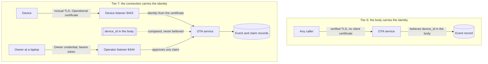

# Tier 7: Add owner-scoped operational identity and mutual TLS

## Scenario

Your beacon has a name of its own. Tier 6 gave it a private key generated on the board, a Factory certificate issued against a one-use Bootstrap credential, and a manufacturing record that never held a private key. Six tiers of hardening, and the device can prove which board it is.

It has never been asked to.

Here is what that means in practice. Someone on your network sends one HTTP request to your update service. The request names your board. It carries no certificate, no credential and no proof of anything. The service accepts it, and your board's history now contains a machine state your board never observed.

The same person then asks the service for the current release and downloads the firmware image, again with nothing to prove. Both requests are ordinary, both succeed, and neither of them is a break-in. The service has no way to tell them apart from your board, because nothing in the conversation ever establishes who is speaking.

That is `T0-W-02`, the weakness from Tier 0 that has survived every tier since. Tier 6 reduced it: the device now has an identity that could be checked. Tier 7 is where something finally checks it.

Three words below carry most of this tier, and the cryptography primer defines all three: [A certificate](../../cryptography-primer.md#a-certificate), [Certificate authorities, chains and trust anchors](../../cryptography-primer.md#certificate-authorities-chains-and-trust-anchors) and [Freshness and the nonce](../../cryptography-primer.md#freshness-and-the-nonce).

The work has two halves and they are easy to confuse, so name them now. The first half is a connection that proves who is calling, which is mutual TLS: the device presents a certificate, the service reads the identity out of it, and a name in a request body stops being an identity claim at all. The second half is deciding which certificate the device should hold, which is the claim: a physical action on the device, a code the device shows to a person, and a second party who proves they own it. Neither half is much use without the other.

You will build both. You will create an Operational certificate authority, mint an Owner credential for yourself, turn on mutual TLS, hold the BOOT button until the board opens a Claim window, read a nonce off its console, and approve the claim as the owner. Then you will run thirteen attacks against the result, each one holding a real certificate, and read which named check refuses each one.

You will also meet the limit this tier does not close. Your device cannot tell whether its own certificate has expired, because it has no trusted clock. The service enforces that on its behalf, and a device cut off from the service cannot know it has lost its authorization. That is written down as a weakness rather than hidden, and it is the opening argument of Tier 8.

At the end you will have a device whose reports are believed because of the connection that carried them, an owner who authorized that device by hand, and a clear account of what an attacker who steals a key, a credential or a whole certificate authority can still do.

## Learning result

After this tier, you can:

- Explain why an identity the service never checks is not an identity, and why the check belongs in the connection rather than in the request body.
- Separate three kinds of authority: the manufacturer's Factory identity, the device's routine Operational identity, and a person's Owner credential.
- Run a two-party claim end to end: a physical action on the device, a Claim nonce, an authenticated owner, and an owner-scoped Operational certificate.
- Configure mutual TLS on the update service and explain why the handshake, not the handler, is the first authorization decision.
- Read a refusal by its check name rather than by its HTTP status, and say which component refused you.
- Test thirteen bypasses, including two that hold a certificate signed by your own Operational authority.
- Say precisely what closing `T0-W-02` does and does not buy, and why `SC-04` still does not reach supported.

## Safety boundary

Run everything against your own reference product, your own update service and your own board, on the isolated lab network. Use only disposable course credentials, keys and images.

Three things in this tier are sharper than in earlier tiers, and each one is deliberate.

The attack fixture holds your Operational Device CA signing key. Four of the thirteen rows use it to mint certificates the service should still refuse. That is the point of those rows: they show what an insider with the authority's private half can make, which is different from what an outsider on the network can make. The module labels every such row so the two never blur. Never let a real certificate authority key anywhere near a fixture.

The fixture also holds a second Owner account, `rival-labs`, and it is a real entry in your own owner store. It has to be. An account that could not authenticate would be stopped at the credential checks and would never reach the authorization decision these rows exist to show. `./course service bypass reset` removes it, and you should run that reset when you are done.

`./course provision erase` destroys the device's private key and deletes its certificate, and there is no undo. You only need it if you choose to remanufacture. The manufacturing record is append only, so nothing removes the record of the identity that was erased, and the device comes back under a new identifier.

Two smaller rules. Your Claim nonce is a secret for the length of the window, so do not paste it anywhere outside your lab. Your Owner credential is printed once and never stored, so if you lose it you mint a new one, which supersedes the old one rather than recovering it.

## Starting state

You need:

- A [Tier 6](../tier-06-factory-identity/index.md) device: enrolled, holding its Factory identity, running a confirmed image.
- The local HTTPS OTA service and the course provisioning station.
- The isolated course network.
- The Tier 6 Security evidence pack.

The device can prove which board it is, and nothing has ever asked it to. The service still believes the device identifier it finds in a request body.

One note about the device output quoted in this module. Every serial line in it was recorded on the board the course used before, a nanoESP32-C6 1.0, and no tier has yet been run on the ESP32-C6-DevKitC-1 this course now targets. Treat the quoted lines as what to expect rather than as a result on your board, record what you actually see, and raise any difference with a Mentor instead of editing your observation to match the page.

## Weakness ledger before the work

Inherited from Tier 6. Not your own work yet.

| Identifier | Weakness | Attack vector | Expected result | Planned treatment |
| --- | --- | --- | --- | --- |
| T0-W-02 | The service trusts the device identifier in the request body, so any caller can report as any device | Send a status event naming a device you are not | The service accepts it and records it | This tier closes it |
| T1-W-08 | The device identifier can be read from flash or the serial console | Read the console, or dump the flash | The identifier is readable | Reduced by Tier 6, and this tier closes it |
| T2-W-09 | The device has no clock and checks no dates | Present an expired certificate to the device | The device accepts it | Tier 8 |
| T3-W-10 | The bootloader itself is unverified | Nothing checks MCUboot before it runs | The bootloader runs whatever is there | Advanced Tier A |
| T3-W-11 | One key signs the image and the manifest, so taking it defeats both | Sign anything with the release key | Both verifiers accept it | Tier 8 for lifecycle |
| T4-W-12 | Downgrade prevention does not protect the first install | Install onto a device whose primary image carries no counter | The install is accepted | Accepted for the core course |
| T4-W-13 | The security counter is compared, never remembered | Rewrite the primary slot | The device forgets what it was running | Advanced Tier A |
| T5-W-14 | A power cut during the health window forces a revert indefinitely | Power-cycle during the sixty second window | The device reverts each time | Residual availability risk |
| T5-W-15 | The watchdog depends on a driver quirk an upstream fix would change | Upgrade Zephyr | The behaviour changes silently | Recorded limit |
| T5-W-26 | A revert is reported once and nothing acknowledges it | Revert while the service is unreachable | The revert is never reported | Tier 8 revisits delivery |
| T6-W-16 | The Secure Storage encryption key is a hash of public values | Dump the flash and run the published derivation | The private key is recovered | Advanced Tier B |
| T6-W-17 | Stored records carry no freshness, so an older copy is accepted as authentic | Write back a superseded record from the same dump | The device accepts it | No tier on this course closes it |
| T6-W-18 | The private key is protected at rest only | Privileged firmware, the application, or a debugger reads it | The key is reachable | Advanced Tier B |
| T6-W-19 | The AES-GCM nonce is drawn once per boot while the record key never changes | Draw the nonce before the RF subsystem is up | The guarantee weakens | Recorded limit |
| T6-W-27 | The Wi-Fi passphrase is compiled into every image this course builds | Read the strings of any image you built | The passphrase is readable | Recorded limit. Tier 8 inherits it at decommissioning |

The row this tier is about is `T0-W-02`. Read it again and notice how little Tier 6 changed about it. Your device gained an identity. The service never asked for one.

## Reproduce the impersonation

### Predict

Before you run anything, write down your answers:

1. Your board proves possession of its Factory key every time it enrolls. What does it prove when it sends a status event?
2. A status event names a device in the path and again in the body. Who decides which one the service believes?
3. If you copy your board's identifier off the console and send a report under it from your laptop, what could the service compare it against?
4. The firmware image is signed and its release manifest is signed. Does that stop a stranger downloading it?

### Look before you act

Ask the service what it currently requires, before you send it anything:

```text
./course service status
```

```text
Result: OTA service is healthy
Transport: release records, firmware, and events on TLS port 8443, presenting ota.course.example
Transport: health and the Course environment marker stay on plain HTTP
```

Read that carefully, because it is the whole vulnerability. The service presents a certificate, which is Tier 2's work and still holding. It says nothing about what the caller presents, because the caller presents nothing. Every route on that port is open to anyone who trusts the course certificate authority, which is anyone who has your repository.

One note before you run them. The board these captures were recorded on is called `beacon-t07b-404cca5ea9fc` here and `beacon-t07c-404cca5ea9fc` later in the page, because it was remanufactured part of the way through the recording. Your board keeps one identifier throughout, and you use your own in every command.

The two attacks below are one `curl` each. They use the course certificate authority, so the connection is verified exactly as your device verifies it, and neither attack breaks TLS. Substitute your own device identifier for `beacon-t07b-404cca5ea9fc` throughout, because an identifier taken from this page names somebody else's board.

### Report as a device you are not

A status event is the device telling its history. The service writes it into an append-only record that a support engineer would later read to find out what a device was doing. Nothing in the request proves the device sent it.

```text
curl --cacert .course-secrets/pki/course-ca.crt.pem \
  --resolve ota.course.example:8443:127.0.0.1 \
  -i -X POST https://ota.course.example:8443/v1/devices/beacon-t07b-404cca5ea9fc/events \
  -H "Content-Type: application/json" \
  -d '{"device_id":"beacon-t07b-404cca5ea9fc","event_type":"status.observed","boot_id":"not-your-board","event_sequence":1,"firmware_version":"0.7.0-operational-identity","security_counter":3,"machine_state":"stopped","result":"ok","reason_code":"none"}'
```

```text
HTTP/2 202
content-type: application/json
x-course-environment: unsafe-tier-00

{"accepted":true,"accepted_device_id":"beacon-t07b-404cca5ea9fc","warning":"Tier 0 trusts the JSON body device_id"}
```

The service accepted it and told you why in the answer: `Tier 0 trusts the JSON body device_id`. That warning has been in every answer since Tier 0 and this is the tier that removes it.

Now read what it wrote, in `.course-state/ota/events.jsonl`:

```text
{
    "accepted_device_id": "beacon-t07b-404cca5ea9fc",
    "boot_id": "not-your-board",
    "device_id": "beacon-t07b-404cca5ea9fc",
    "event_sequence": 1,
    "event_type": "status.observed",
    "machine_state": "stopped",
    "path_device_id": "beacon-t07b-404cca5ea9fc",
    "reason_code": "none",
    "result": "ok",
    "security_counter": 3,
    "service_received_at": "2026-09-19T18:31:34.853830019Z",
    "tier_00_trust": "body_device_id"
}
```

The record is honest about itself. `tier_00_trust: body_device_id` says the service took the identity from the body, and `accepted_device_id` is the name it decided to believe. Your board reported `stopped` while it was running. Outside the lab this is how a maintenance record acquires an event that never happened, and nothing in the record marks it as different from the real ones.

This demonstrates `T0-W-02`, which this tier closes.

### Take the firmware without being anybody

The same connection, with no request body at all:

```text
curl --cacert .course-secrets/pki/course-ca.crt.pem \
  --resolve ota.course.example:8443:127.0.0.1 \
  -i https://ota.course.example:8443/v1/releases/current
```

```text
HTTP/2 200
content-type: application/json

{"schema_version":1,"release_id":"tier-07-operational-identity","version":"0.7.0-operational-identity","board":"esp32c6_devkitc/esp32c6/hpcore","image_path":"tier-07-operational-identity.bin","image_sha256":"b8e5fa4d4a81d62d224d1cddc02acd082f3e5f1ab553dd536162802c5c7d7477","image_size":758664,"mutable":true,"signed":true}
```

Then take the image itself:

```text
curl --cacert .course-secrets/pki/course-ca.crt.pem \
  --resolve ota.course.example:8443:127.0.0.1 \
  -o stolen.bin -w "status %{http_code}, %{size_download} bytes\n" \
  https://ota.course.example:8443/v1/firmware/tier-07-operational-identity.bin
```

```text
status 200, 758664 bytes
b8e5fa4d4a81d62d224d1cddc02acd082f3e5f1ab553dd536162802c5c7d7477  stolen.bin
```

That is your fleet's firmware, complete and byte for byte, fetched by a caller who proved nothing. The signature on it is intact, which is Tier 3 doing exactly its job: a signature says who made an image, and it never says who may have it.

Outside the lab this is how a shipping product's firmware reaches a researcher, a competitor or an attacker without anyone opening a device. It is also the first step of most embedded attacks, because a firmware image is where credentials, endpoints and unpatched libraries are found. Tier 6 already showed you an image giving up a private key.

### What the two attacks share

Neither attack broke anything. Both used the real service over a verified connection. Both succeeded because the service never establishes who is calling, so every caller is equally entitled.

Record the accepted event, the record line it produced, and the size and digest of the image you downloaded. You will run all three commands again at the end of the tier.

## Investigate the missing boundary

Answer these before you build anything:

1. The service checked a certificate on this connection. Whose certificate was it, and what did it prove?
2. Your board holds a Factory certificate it could have presented. Would presenting it have been enough to authorize a firmware download? What would it prove, and what would it leave undecided?
3. A device identifier appears in the path and in the body of a status event. If the service also learned an identifier from the connection, how many of the three have to agree, and what should happen when they do not?
4. Somebody has to decide which device belongs to you. Nothing in the device and nothing in a certificate can decide that on its own. Who decides, and what do they have to prove?
5. The device is in a cupboard and the person who owns it is at a laptop. What can pass between them that an attacker on the network cannot obtain?

The boundary this tier moves is the one around the identity in a request.



Before, the service authenticated itself to the caller and the caller authenticated nothing. The identity in the record came from a field anyone could type. After, the device's identity comes from the certificate it presented during the handshake, and the identifier in the body is only ever compared against it. A body that disagrees is refused rather than believed.

The second half of the diagram is the part with no cryptographic answer. A certificate can prove which board is calling. It cannot prove that the board is yours, because ownership is a fact about the world and not about the key. So a second party is needed: a person who authenticates with their own credential and says that this device, right now, is theirs. The device proves it is present by producing a nonce that only someone standing at it can read, and the person proves they are entitled by presenting an Owner credential. The service is the only place the two halves meet, and it issues the certificate only when they match.

Three actors, three different things proved. The provisioning station proved which board this is, once, at manufacture. The device proves possession of its own key on every connection. The owner proves that they are the person entitled to authorize this device, on the one request that matters. None of the three can stand in for another, which is why this tier adds three kinds of credential rather than one.

## Build the owner side

Three things have to exist before a device can be claimed: an authority that signs Operational certificates, an owner who can authorize a claim, and a service that asks callers who they are. Build them in that order, because each one is the input to the next.

### Create the Operational Device CA

Your course already has a manufacturer authority, from Tier 6, that signs Factory certificates. Operational certificates get their own, and it is a separate self-signed root rather than something issued underneath the manufacturer:

```text
./course keys create operational-ca
```

```text
The operational device CA. It signs Operational identities: one device,
one owner, ninety days. It is not the manufacturer device CA, which says
which board this is and says nothing about who owns it.

The update service signs with this key while it is running, so the key
and the service that uses it live on one machine. In a product they do
not, and the module says what that separation buys.
  Subject:      Learning Cyber Security Operational Device CA
  Issuer:       Learning Cyber Security Operational Device CA
  Valid from:   2026-09-19T17:43:59Z
  Valid until:  2036-09-16T18:43:59Z
  Key:          ECDSA
  Fingerprint:  e8994914789ec353

Result: operational device CA written to .course-secrets/pki
```

`Subject` and `Issuer` are the same string, which is what a self-signed root looks like. That is a design decision worth a minute of your time. An intermediate signed by the manufacturer authority would have been easy, and it would have encoded the opposite of what this tier teaches: that operational trust descends from manufacturing trust. It does not. Your manufacturer signs a certificate saying which board this is, once, and after that the question "may this board download firmware today" belongs to a different authority with a different lifetime and a different owner.

Now look at every role in one place. This inventory is the second part of the lab artifact and you should copy it into your evidence pack. It is a different command from the `./course keys list` you have run since Tier 3: that one answers which signing key is which, and this one answers who signs what in the whole course.

```text
./course keys inventory
```

```text
attacker  0b581c41543488edd57d2f8330a5b136c30bd2c92613cc963b16efadb673daa9
          .course-secrets/signing/attacker.pem
release   2f5fe5123abe8715ecde8cde2cac0e734969e5c0110d71eb839a15ceebd6c1e4
          .course-secrets/signing/release.pem

The bootloader is built against artifacts/generated/signing/release.pub.pem, and nothing else.

Both keys are ECDSA P-256 and both are equally valid.
Only the fingerprint compiled into the bootloader decides which one the device will run.

Authorities
  course-ca.crt.pem        the update service's own server certificate
                           .course-secrets/pki/course-ca.crt.pem
  device-ca.crt.pem        Factory identities: which board this is
                           .course-secrets/pki/device-ca.crt.pem
  operational-ca.crt.pem   Operational identities: which board, whose, for ninety days
                           .course-secrets/pki/operational-ca.crt.pem
  untrusted-ca.crt.pem     nothing this course trusts, on purpose
                           .course-secrets/pki/untrusted-ca.crt.pem

Leaf roles
  service certificate            Course CA                service.crt.pem
  wrong-name certificate         Course CA                wrong-name.crt.pem
  untrusted service certificate  Untrusted CA             untrusted-service.crt.pem
  shared development identity    Manufacturer Device CA   shared-identity.crt.pem
  Factory identity               Manufacturer Device CA   on the board, key never a file
  Operational identity           Operational Device CA    on the board, key never a file
  foreign client certificate     Untrusted CA             minted by the fixture at run time

The two signing keys above have no certificate at all, and that is the
point of listing them beside four authorities: a trust root does not have
to be a certificate authority. The bootloader anchors on a raw public key.
```

Your two Tier 3 signing keys come first, and the closing sentence says why a certificate inventory lists them at all. Read it, then ask the question it leaves open: if a raw public key has been a perfectly good trust root for four tiers, what does a certificate add? It adds a signed statement about **who** the key belongs to and **until when**. Tier 3 needed neither. This tier is built on both.

The inventory then lists four authorities and seven leaf roles, and two of the leaves have no file at all because their private halves have never left a board. That is the separation section 8 of the specification asks for, made concrete. Notice that the only authority the device carries as a trust anchor is the first one, which signs the service's own certificate. The device never verifies an Operational certificate: it presents one. There is therefore no device-side trust anchor to rotate for this authority, which is one less thing to go wrong and one less thing you can claim.

### Mint your Owner credential

An owner is a person, not a device. Mint one for yourself:

```text
./course owner new --name field-owner
```

```text
Minting one Owner credential. It authorizes a person, not a device, so
it never rides the mutual-TLS listener: you present it as a bearer token
on the operator port, and the store keeps only a verifier.
  owner:       field-owner
  credential:  228c7c70-4bef-4ddd-bf2d-8e78703a9857
  verifier:    sha256:a1edd38572a6ca76afed870e39985b2e621af37b651842d02824107ea9861cad
  expires:     2026-12-18T18:37:21Z
  recorded in: .course-state/provisioning/owners.jsonl

The credential itself is printed once and never stored. Run this command
again for the same owner and the new credential supersedes this one: the
old one stops matching. That is replacement, not revocation, and the
difference is what Tier 8 is for.

  43839de9d9b66a5aaf785c084200f597a6b99333e2161d5f266a8658a5de9353
```

Copy that last line somewhere you can reach for the next few minutes. It is thirty-two random bytes in hexadecimal and it is printed once. The store keeps only `sha256` of it, exactly as Tier 6's Bootstrap credential store does, so nothing on your disk can give it back to you.

Compare the two credentials while they are both fresh in your mind. A Bootstrap credential dies on its first successful use and only has to survive the walk to the bench. An Owner credential is reusable, so it cannot be bounded by use and is bounded by a lifetime instead: ninety days. A credential with neither bound is a standing secret, which is the thing this tier exists to argue against.

### Turn on mutual TLS

```text
./course service start --https --mutual-tls
```

```text
Result: OTA service is healthy
Devices, presenting a client certificate: https://ota.course.example:8443
Operators and the lab controls: https://ota.course.example:8444
Health and the Course environment marker stay on http://192.168.68.81:8080
```

Three listeners where Tier 6 had two, and the split is the design rather than a detail. Mutual TLS is decided in the handshake, before a single byte of the request has been read, so it cannot be applied per route. Any port that demands a client certificate demands it of everybody, including you at a laptop, and you hold no device certificate. So the routes a device uses live on 8443 behind mutual TLS, the routes a person uses live on 8444 with the server authenticated and no client certificate asked for, and health and the Course environment marker stay in the clear on 8080 because a targeting check must not depend on the control it is used to test.

Ask the plain port for something that has moved, and it tells you the whole shape:

```text
curl -i http://127.0.0.1:8080/v1/releases/current
```

```text
HTTP/1.1 404 Not Found

{"also_on":"https://ota.course.example:8444","error":"this endpoint is no longer served over plain HTTP","moved_to":"https://ota.course.example:8443","still_here":["/health","/.well-known/course-environment"],"who_may_ask":"a device holding a client certificate, and an operator on the lab bench","why":"Tier 7 split the authenticated listener in two, because the TLS handshake decides who may connect before any route is matched","why_still_here":"the Course environment marker is a fail-closed targeting check, not a credential, and it must not depend on the control it is used to test"}
```

One more thing about this flag before you move on. `--mutual-tls` is a flag, and with it off the service answers exactly as it did in Tier 6, byte for byte, which is why Tier 2's published output is still true. The flag exists so that earlier tiers keep working, not as an escape hatch. Your Weakness ledger records the configuration this tier runs in, as every tier's ledger has.

## Claim the device

Your board is enrolled and unclaimed, and it is about to tell you what that means. Reset it and read the identity lines in its boot output:

```text
identity.state provisioned device_id=beacon-t07c-404cca5ea9fc
identity.state factory certificate fingerprint=sha256:753b3bfe58d156a3e6ec80110af6e4e3c013ce0b25f358a38d767761a0fb24d3 key=0x00000601
identity.state no operational certificate held, owner unknown
identity.state this device will not download. It does not fall back to its factory
identity.state identity, which claims and recovers and does not authorize updates.
```

Then watch what it does when its update schedule comes round:

```text
ota.identity this device holds no Operational certificate, so it is not
ota.identity opening a connection to a restricted endpoint. Hold the BOOT
ota.identity button to open a Claim window and have this device claimed.
```

That is the sharpest line in the tier, and it is a design decision rather than a limitation. The board holds a perfectly good Factory certificate, signed by an authority the service trusts, and it does not present it. A device that fell back to a weaker credential when the stronger one was missing would give an attacker a reason to make the stronger one go missing. This device stops instead, says why, and waits for a person.

### Open the Claim window

Hold the BOOT button for ten seconds and release it. No reset is needed.

```text
provision.gate the button was held for 10 seconds.
provision.gate From Tier 7 this one act does two things: it opens the
provision.gate provisioning interface, which is remanufacturing, and it opens
provision.gate a Claim window, which is ownership. One physical act therefore
provision.gate reaches both, and physical access is the entire boundary. That
provision.gate is a trade Tier 6 already made and Tier 7 inherits.
identity.operational generated a pending P-256 key, volatile
identity.operational it is in RAM only. A reset destroys it, and so does the
identity.operational window closing. Nothing writes it to flash unless a
identity.operational certificate comes back for it.
identity.csr built a 225 byte Operational request for beacon-t07c-404cca5ea9fc
claim.window open for 600 seconds. This device times its own window and closes
claim.window it by destroying the nonce and the key. The service times its own,
claim.window starting when the request reaches it, and the service alone decides
claim.window that a claim has expired. A reset kills this window.
claim.nonce DK83-A6WK-TN48-DACE-BE8Z-5HXG
claim.nonce Read that to whoever is claiming this device. They present it with
claim.nonce their own Owner credential, from a machine this device never talks
claim.nonce to. Both halves have to arrive inside the same window.
claim.nonce A real product prints this on a label or a small screen. A serial
claim.nonce console is a weaker stand-in, not an equivalent one: a label needs
claim.nonce eyes on the device, and this needs a cable that grants far more
claim.nonce than the nonce.
tls.identity presenting the Factory certificate, signed by PSA key 0x00000601
ota.tls verified ota.course.example at 192.168.68.81:8443, TLSv1.2 TLS-ECDHE-ECDSA-WITH-AES-128-GCM-SHA256, mutually authenticated
claim.pending the request is with the service. Waiting for the operator
claim.pending half, polling every 5 seconds on a fresh connection.
```

Several things happened in that one press, and each is worth naming.

One physical act reached two different powers. It opened the provisioning interface, which is remanufacturing, and it opened a Claim window, which is ownership. The board says so itself, because a trade this large should not be a footnote: physical access to the device is the whole boundary here, and Tier 6 already made that trade when it let a BOOT hold reopen provisioning on an enrolled board.

The key the board generated is volatile. It is a P-256 private key in RAM and nothing writes it to flash. If the window closes, or the board resets, or you simply walk away, it is gone, and so is the nonce. `E-6-05` taught you that a flash dump gives up the device's private key; a dump taken during an open Claim window does not contain this one, because it is not there. It is written to Secure Storage only when a certificate comes back for it.

Two clocks are running and they are not the same clock. The device times its own ten minutes from the press and closes its window by destroying the nonce and the key. The service times its own, starting when the device's request reaches it, and the service alone decides that a claim has expired. Neither party is the other's clock. This is what "a device that cannot evaluate time" looks like when you have to build around it: the device can measure an interval, which needs only a timer, and it cannot place an instant, which needs a trusted source.

And the nonce went to a console. A real product prints it on a label, or shows it on a small screen, and the board says plainly that a serial console is a weaker stand-in rather than an equivalent one. A label needs eyes on the device. A console needs a cable, and that cable grants far more than the nonce.

### Approve the claim as the owner

The device has already sent its half. It authenticated with its Factory certificate over mutual TLS, submitted its Operational certification request and the nonce, and it is now polling every five seconds on a fresh connection, waiting for a person.

Approve it, as the owner, from the machine holding your Owner credential:

```text
./course claim approve --device beacon-t07c-404cca5ea9fc \
  --nonce DK83-A6WK-TN48-DACE-BE8Z-5HXG \
  --credential 43839de9...
```

```text
Approving a claim as the person who owns this device.

An Owner credential authorizes a person, so it cannot ride the listener
the device uses. That listener demands a client certificate during the
handshake, before any header is read, and a person holds no device
certificate. The credential goes to the operator listener instead, as a
bearer token, over a connection that authenticates the server only.
  operator listener: https://ota.course.example:8444
  device named:      beacon-t07c-404cca5ea9fc
  nonce presented:   DK83-A6WK-TN48-DACE-BE8Z-5HXG
  owner named:       nothing. This command sends no owner field, and there
                     is no flag for one. The service derives the owner from
                     the credential it verified.

+ POST https://ota.course.example:8444/v1/claim
  Authorization: Bearer <the credential, not printed>
  -> {"device_id":"beacon-t07c-404cca5ea9fc","nonce":"DK83-A6WK-TN48-DACE-BE8Z-5HXG"}
  <- 200 OK
     result:          claimed
     device:          beacon-t07c-404cca5ea9fc
     owner:           field-owner
     lifecycle state: claimed
     serial:          43923639592142046874239079550106062069
     fingerprint:     sha256:75c5cb088e2043f32e2fd1555a53c7ad028a1f30bb08b1b46f03d6334c0ae535
     not after:       2026-12-18T18:51:52Z

The owner on that line was never sent. It came from the credential.
The certificate is now waiting in the open claim window, and the device
collects it on its next poll. Nothing was sent to the device from here:
the two halves never meet except inside the service.
Result: beacon-t07c-404cca5ea9fc is claimed by field-owner, certificate sha256:75c5cb088e2043f3...
```

Read the flags on that command, and then read the flag that is missing. You named a device and a nonce, both of which the service checks against what it already holds. You did not name an owner, and there is no flag for one. The service works out which owner you are from the credential it verified, exactly as it works out which device is calling from the certificate on the connection. A field the caller fills in is not an authentication, in either half.

Read the port too. The Owner credential went to 8444, not 8443, and it had to. The device listener demands a client certificate during the handshake, before a single header is read, and you hold no device certificate. An owner and a device cannot use the same door, and noticing that early is what turned "add authorization to the service" into "split the listener in two".

### Watch the device collect its certificate

The certificate is not sent to the device. It is left in the open window, and the device collects it on its next poll:

```text
claim.issued the operator half landed and the service issued a certificate
identity.operational the pending key is destroyed
identity.store operational certificate held, device_id=beacon-t07c-404cca5ea9fc owner=field-owner
identity.store fingerprint=sha256:75c5cb088e2043f32e2fd1555a53c7ad028a1f30bb08b1b46f03d6334c0ae535 key=0x00000701
identity.store the key was copied into its persistent slot, not re-generated.
identity.store It is still the key that signed the request, and it is still
identity.store non-exportable: a copy cannot gain a flag its source lacked.
claim.window closed: this device is claimed
claim.window it now presents its Operational certificate on every connection
claim.window to a restricted endpoint, and its Factory certificate only when
claim.window it claims or recovers.
tls.identity presenting the Operational certificate, signed by PSA key 0x00000701
```

The two halves never met except inside the service. The person never talked to the device, the device never talked to the person, and neither one could have completed the claim alone. That is what makes the match two-party: the device proves it is physically present by producing a nonce that only somebody standing at it can read, the owner proves entitlement with a credential the device has never seen, and the service issues a certificate only when both arrive inside one window.

Confirm what the service wrote, which is the half a device cannot fake:

```text
./course provision record --device beacon-t07c-404cca5ea9fc
```

The claim record carries the device, the owner, the lifecycle state `claimed`, the certificate serial and fingerprint, and a verifier of the nonce rather than the nonce itself. A nonce is a secret that authorized a state change, so the record keeps a hash of it in the same way the credential stores do.

### Confirm the service is deciding from the certificate

Let the board run for a minute and then read the newest line your device wrote to `.course-state/ota/events.jsonl`:

```text
{
    "accepted_device_id": "beacon-t07c-404cca5ea9fc",
    "accepted_from": "client_certificate",
    "certificate_device_id": "beacon-t07c-404cca5ea9fc",
    "detail": "verified service, signed release metadata",
    "device_id": "beacon-t07c-404cca5ea9fc",
    "event": "status.observed",
    "machine_state": "steady",
    "path_device_id": "beacon-t07c-404cca5ea9fc",
    "running_release_id": "tier-07-operational-identity",
    "service_received_at": "2026-09-19T18:52:47.09020757Z",
    "synthetic_data": true
}
```

Compare it with the record from section 7, line by line, because this is the whole tier in two JSON objects.

`tier_00_trust: body_device_id` is gone and `accepted_from: client_certificate` has taken its place. There are now three identifiers where there used to be two: the one in the certificate, the one in the path, and the one in the body. They all agree, and that agreement is checked rather than assumed. The one the service acts on is `accepted_device_id`, and it is copied from the certificate.

Your board is reporting again, and this is `E-7-02`. Record this event, the handshake line from the console, and your claim record. Together they are the mutual TLS evidence your lab artifact asks for.

### Why the match has to be two-party

Take either half away and ask what is left.

Without the physical action, a claim is a request naming a device. Anyone who can guess or read a device identifier can send one, and identifiers are not secret: Tier 1 recorded that as `T1-W-08`, and your board prints its own on every boot. The press is what turns "I know this device's name" into "I am standing at this device".

Without the owner, the device is claiming itself. It has no way to know whose it is, and a device that decided its own ownership would be claimed by whoever powered it on first, including a stranger who found it in a skip. The record, not the device, is the authority on ownership, and that is why the refusal for an already-owned device comes from the record and is worded as `device-unowned`.

Ownership here is first come, and it is worth knowing the consequence rather than discovering it. The first party to complete a claim on an unclaimed device owns it, and the service will not take that back. In this course that means a second claim attempt on your own board is refused, which you can see for yourself: press BOOT on a claimed board and approve the nonce, and the operator half answers `device-unowned` while the device's own identity is left completely untouched. A press never damages an issued identity; it only ever creates a pending one that dies with the window.

### Why there is no phone and no SoftAP

Most consumer devices do this differently. The device starts its own Wi-Fi access point, your phone joins it, an app walks you through setup, and somewhere in there the device is claimed. Tier 6 promised that Tier 7 would explain what that shape adds, so here it is.

What a phone and a SoftAP genuinely add is connectivity bootstrap. A device fresh out of a box does not know your Wi-Fi network, and it cannot be told over a network it cannot reach. The access point is a temporary channel that exists to solve that one problem: it carries the network credentials in, and after that it has no reason to exist. That is a real problem and a reasonable answer to it.

What it does not add is proof of ownership. Joining a device's access point proves that you are within radio range of it, which is not the same as being entitled to it, and radio range reaches through walls, floors and car parks. A neighbour, a delivery driver or someone in the flat below can all be in range. If access to the access point were the authorization, the first person within range to run the app would own the device. Any serious design therefore still needs what this tier built: something the device shows that requires eyes or hands on it, and a person who authenticates as themselves.

This course takes the credentials in at build time, which is a teaching simplification recorded as `T6-W-27` in the Tier 6 Weakness ledger. This tier does not change that row, and Tier 8 inherits it at decommissioning. The connectivity problem is therefore already solved, and an access point would carry only a nonce over a worse channel. Section 8 of the specification routes the claim over the authenticated connection for that reason. If you build the phone shape in a product, treat the access point as a transport for credentials and keep the claim itself two-party.

### What this device cannot check, and who checks it instead

Your Operational certificate is valid for ninety days. Your board cannot tell when those ninety days are up. It has no trusted clock, `CONFIG_MBEDTLS_HAVE_TIME_DATE` is off in every tier of this course, and it will keep presenting an expired certificate until something refuses it. The board announces this in its own boot output rather than leaving you to find out:

```text
This device cannot evaluate a certificate validity window. It has no clock to
do it with, CONFIG_MBEDTLS_HAVE_TIME_DATE is off, and it will present an
expired Operational certificate until the service refuses it. That is a
published limit of this tier rather than an oversight: the service enforces
expiry, and device time stays evidence rather than an authorization input.
```

This is deliberate, and the reasoning is worth following because it recurs in every constrained product.

A device with no trusted time source has three options. It can trust whatever time it is told, which hands an attacker the ability to move its clock and therefore to control its expiry decisions. It can carry a battery-backed clock and a protocol to keep it honest, which is real work and real cost, and which the readings for this tier cover. Or it can decline to make time-based decisions at all and let the party that does have a trustworthy clock make them.

This course takes the third option, consistently. Section 7 of the specification already states the rule: device time is evidence, not an authorization input. The device reports the time it thinks it is, the service records that alongside the time it actually received the report, and only the service decides that a certificate has expired.

That has a consequence you should write into your ledger rather than admire. A device that is cut off from the service cannot know that it has lost its authorization. The expiry is real and enforced, and it is enforced in exactly one place. There is no certificate revocation list and no OCSP responder in this course either, for the same reason and one more: the service is both the issuer and the verifier here, so it finds out what it withdrew by reading its own record. Every genuinely hard problem in revocation begins on the day those two are different machines. That row is `T7-W-20`, and Tier 8 is where the lifecycle around it is built.

## Replay the impersonation

Run the same two commands you ran in section 7, unchanged. Neither one gets far enough to be refused by a check:

```text
curl --cacert .course-secrets/pki/course-ca.crt.pem \
  --resolve ota.course.example:8443:127.0.0.1 \
  -i https://ota.course.example:8443/v1/releases/current
```

```text
curl: (56) OpenSSL SSL_read: OpenSSL/3.0.13: error:0A00045C:SSL routines::tlsv13 alert certificate required, errno 0
```

```text
curl --cacert .course-secrets/pki/course-ca.crt.pem \
  --resolve ota.course.example:8443:127.0.0.1 \
  -i -X POST https://ota.course.example:8443/v1/devices/beacon-t07b-404cca5ea9fc/events \
  -H "Content-Type: application/json" \
  -d '{"device_id":"beacon-t07b-404cca5ea9fc","event_type":"status.observed","boot_id":"not-your-board","event_sequence":2,"machine_state":"stopped","result":"ok","reason_code":"none"}'
```

```text
curl: (56) OpenSSL SSL_read: OpenSSL/3.0.13: error:0A00045C:SSL routines::tlsv13 alert certificate required, errno 0
```

`certificate required` is the server telling the client, during the handshake, that it will not continue without one. Check your service's trail afterwards and you will find nothing: no line in `events.jsonl`, no refusal record, no name. The request was never read, so there is nothing to record about it.

That is the first thing to understand about this control, and it is not entirely good news. A refusal at the handshake is the cheapest refusal there is, which is why it is where the coarse decision belongs. It is also the least informative refusal there is. Nobody was told which property failed, because nothing had been read yet, and your own board will one day be on the wrong end of exactly this silence.

So run an attacker who does get through the handshake. This one holds a genuine, unexpired Factory certificate that your own provisioning station issued:

```text
./course service bypass e-7-03 --execute e-7-03
```

```text
  enrolled beacon-bypass-e7-03 through the real station, Factory certificate 313364947007135955037879793691395645718
  the certificate is genuine, unexpired and signed by the Manufacturer
  Device CA. Nothing about it is forged. It is simply the wrong role.
  refused at check identity-operational, HTTP 403
  this endpoint accepts only an Operational identity signed by the Operational Device CA, and the certificate presented is a Factory identity signed by the Manufacturer Device CA

Result: E-7-03 refused at identity-operational, as the tier requires
Observed on: host. This is a host result; a host result never stands in for a device result.
```

Read that refusal the way the module template asks you to read every refusal. Which check ran: `identity-operational`. What it compared: which authority signed the certificate presented, read out of the verified chain. What it rejected: a certificate whose role is Factory at an endpoint that serves owners. The connection succeeded, the request was read, and the answer names the property that failed.

Notice what the service did not do. It did not look at a `role` field in the certificate, because a field is a fact that can disagree with the signature, and on the day it does the service believes the wrong one. Role in this course is the issuer, and only the issuer.

What the attacker still controls. They can still reach the handshake with any certificate from either device authority, because that is what the handshake checks. They can still read your health endpoint and your Course environment marker. If they can dump your board's flash, they can still recover the Operational private key by the published derivation from `E-6-05`, and then they are your device, with nothing in this tier able to tell the difference.

What they no longer achieve. They cannot write a line into your device's history from a laptop. They cannot fetch an assignment or a firmware image without a certificate your service issued for a claimed device in the current ownership context. And a Factory identity, which is the credential a manufacturer holds for every board it ever made, buys nothing at all on the ordinary endpoints.

## Test bypass attempts

Fifteen rows. Two of them are successes you produce on the board and the fixture takes no part in them. The other thirteen run on the host, and each one crafts the request the service is meant to refuse and reads the refusal it makes.

Start by reading the whole set:

```text
./course service bypass list
```

Then run each row. The `Observed on` column matters as much as the expected result, and there are three values rather than two. `device` means your board produced it. `host` means the fixture produced it on this machine. `host, board required` means the refusal was read here but a board is what made the row possible at all, because the board is what opens a Claim window and prints a nonce. A host result never stands in for a device result, and that third value narrows nothing: it only records that hardware was needed for the result to exist.

The `CA key` column is the other one to read carefully. Four rows sign with your own Operational Device CA key. They show what an insider with the authority's private half can make, which is a different threat from what an outsider on your network can make, and a table that blurred the two would teach you to fear the wrong thing.

| Evidence ID | Test | Expected result | Observed on | CA key | Actual result |
| --- | --- | --- | --- | --- | --- |
| E-7-01 | Claim the board: BOOT hold, nonce, operator approval, Operational certificate stored | **Succeeds** | device | | |
| E-7-02 | Download an assignment and submit a status event on the Operational identity | **Succeeds** | device | | |
| E-7-03 | Factory certificate at the download endpoint | Refused at `identity-operational` | host | | |
| E-7-04 | Operational certificate at the claim endpoint | Refused at `identity-factory` | host | | |
| E-7-05 | Expired Operational certificate | Refused at `certificate-active`, clause 1 | host | needed | |
| E-7-06 | Revoked Operational certificate | Refused at `certificate-active`, clause 2 | host | | |
| E-7-07 | Certificate signed by the Operational CA that the service never issued | Refused at `certificate-active`, clause 3 | host | needed | |
| E-7-08 | Forged certificate: a recorded serial, the common name of an unclaimed device | Refused at `device-claimed` | host | needed | |
| E-7-09 | Status event whose body identifier disagrees with the path | Refused at `identifier-consistent` | host | | |
| E-7-10 | Forged certificate: the common name of a claimed device, the owner scope of the adversary | Refused at `ownership-context` | host, board required | needed | |
| E-7-11 | Replay a spent claim nonce | Refused at `nonce-unspent` | host, board required | | |
| E-7-12 | Approve after the claim window has closed | Refused at `claim-window-open` | host, board required | | |
| E-7-13 | Wrong nonce inside an open window | Refused at `nonce-match` | host, board required | | |
| E-7-14 | The adversary approves the correct nonce on an already-claimed device | Refused at `device-unowned` | host, board required | | |
| E-7-15 | Client certificate from a foreign issuer | The handshake closes. No status, no body, no check, nothing in the trail | host | | |

Ten distinct check names appear in that table, and the service has thirteen. The three the table never reaches are the Owner credential checks, because the adversary holds a credential that is genuinely valid: it passes authentication and then loses on authorization, every time, which is what makes each of its refusals a decision about entitlement rather than about identity.

Ten checks for six criteria is not padding. The specification asks for six kinds of rejection with distinct reason codes, and building them honestly needed more names than that, because a single criterion such as "the certificate is active" turns out to have three independent clauses: it has not expired, it has not been revoked, and this service issued it in the first place. Merging them would produce a refusal that cannot tell you which one failed, and a refusal you cannot read is worth very little.

Four rows deserve a closer look while you run them.

**`E-7-05` and `E-7-15` are the pair to sit with.** Both are correct refusals of a certificate. Only one of them can tell anybody what went wrong.

```text
./course service bypass e-7-15 --execute e-7-15
```

```text
  the Untrusted CA means, in this course's vocabulary, an authority
  nothing here trusts. Tier 7 adds no fifth authority to say it again.
  the connection closed: Get "https://ota.course.example:8443/v1/releases/current": remote error: tls: bad certificate
  There is no status. There is no body. There is no check name, because
  the layer that refused has nowhere to put one.
  the service's trail held 34 lines before and 34 after

Result: E-7-15 closed the handshake and left nothing behind, as the tier requires
```

The evidence for `E-7-15` is that there is no evidence, which is why the row counts the service's trail before and after. Compare it with `E-7-05`, whose certificate is signed by an authority the service does trust and is therefore read, checked and refused by name:

```text
  the window opened ninety-one days ago and closed yesterday. A device
  cannot read that: CONFIG_MBEDTLS_HAVE_TIME_DATE is off in every tier,
  and device time is evidence rather than an authorization input.
  refused at check certificate-active, HTTP 403
  the certificate presented expired at 2026-09-18T18:41:04Z by service clock
```

Which layer refuses decides how useful a refusal can be. That is worth knowing before you design a product, because a system that pushes every decision into the handshake is a system nobody can debug.

**`E-7-08` shows why a CA signature is not an authorization.** The forged certificate carries a serial number that really does appear in a claim record, so the clause asking whether this service ever issued that serial is satisfied. The name on the certificate belongs to a different device, one that has never been claimed:

```text
  serial 75303309969439976603523788221397747832 belongs to beacon-bypass-e7-08-donor, which really is claimed, so the serial really
  is in a claim record and certificate-active is satisfied. The name on
  the certificate is beacon-bypass-e7-08, which is not.
  refused at check device-claimed, HTTP 403
  this device carries no claim on record, and an unclaimed device is served nothing
```

**`E-7-10` is the row that needs your board.** It forges an Operational certificate for a device that the record says somebody else has claimed, and in an ordinary lab that device is your own beacon:

```text
  beacon-t07b-404cca5ea9fc is claimed, and not by the adversary. The forged certificate names
  the device correctly and carries owner scope "rival-labs" in its subject.
  refused at check ownership-context, HTTP 403
  the owner scope "rival-labs" in the certificate presented is not this device's current ownership context
  the refusal names device beacon-t07b-404cca5ea9fc, so the service had established which device it was talking to

Result: E-7-10 refused at ownership-context, as the tier requires
Note what the reason does not say: it never names who does own the device.
```

The certificate says who owns the device and the record decides. Read the last line twice: the refusal tells the caller that the device is owned, because it has to, and never tells them by whom. That distinction is a deliberate piece of design. The fact that a device is owned is an unavoidable consequence of refusing, and the identity of the owner is the one thing this caller could not otherwise obtain. In a real fleet it maps a device to a customer.

When you are finished, clear the adversary's live authorization state:

```text
./course service bypass reset
```

```text
Resetting the Tier 7 adversary. This is append only wherever it can be.
  removed:  1 owner entry for rival-labs from .course-state/provisioning/owners.jsonl
  removed:  1 serial(s) this fixture marked revoked from .course-state/provisioning/revoked.jsonl
  appended: one fixture_reset line to .course-state/provisioning/records.jsonl
  kept:     the keys for the 12 synthetic device(s) still in the record
  kept:     every synthetic device in the manufacturing record
  kept:     every line the service wrote to its own events.jsonl
  kept:     your own owner, your own claims, and any serial you marked yourself

A record of what happened is never rewound. A store that decides what
happens next is. That is the whole difference between the two lists above.

One row is spent in this environment and reset cannot give it back.
E-7-11 replays a nonce it watched being spent, and a nonce is spent once.
Discard the whole Course environment to run that row again.
```

That output is worth as much as any of the rows. Reset removes the adversary's owner account, because an account left behind is a live credential after the lab is over, and it removes the serials the fixture marked revoked, because those change how the service answers a later honest request. It removes nothing from the manufacturing record and nothing from the service's own trail, and it says so. A record of what happened is never rewound; a store that decides what happens next is.

One consequence to read rather than skip: the synthetic devices stay in your manufacturing record forever, with no field marking them as a fixture's work. The naming convention is the only tell, and anyone who can write the record can pick any name. That is `T7-W-25`.

Record any unexpected actual result before you troubleshoot it, and do not mark the Security claim supported on the strength of a result you have not seen.

## Weakness ledger after the work

This is the result you should expect to observe. Your own ledger lives in your workspace under `evidence/learner/`.

| Weakness | Result after this tier | Status | Evidence or next action |
| --- | --- | --- | --- |
| T0-W-02 | Closed. The body identifier is no longer an identity claim. The service derives the device from the client certificate and refuses a body that disagrees with it | Closed | `E-7-09` paired with `E-7-02`. Recorded for a service running with `--mutual-tls` |
| T1-W-08 | Closed. The identifier is still readable and that no longer buys anything: after mutual TLS a name is not an authorization input. Tier 6 reduced this in substance and never wrote the row Tier 1 promised | Closed | `E-7-02`, `E-7-03`. Tier 6's published ledger gains the missing row |
| T2-W-09 | Unchanged, and now narrower than it reads. It is about a certificate the device is shown. `T7-W-20` is about the certificate the device holds | Open | Tier 8 |
| T6-W-16 | Widened. A second private key now sits under the same public derivation, and it is the one that authorizes downloads | Open | Advanced Tier B. Counterpoint: the pending Operational key is volatile, so a dump taken during an open Claim window does not contain it |
| T6-W-17 | Widened. Record replay now restores authorization state and not only manufacturing state, because the Operational certificate is a settings record like any other | Open | No tier on this course closes it |
| T6-W-18 | Widened. The at-rest-only boundary now covers the credential that gates image download | Open | Advanced Tier B |
| T6-W-19 | Note only. The Operational key is written during a claim, which needs the network, so that write is necessarily after the RF subsystem is up. The mitigation is structural for this key and still advisory for the Factory key | Open | Recheck on any Zephyr upgrade |
| T7-W-20 | New. Authorization lifetime is enforced only by the service. The device cannot evaluate its own certificate's validity window, there is no revocation list and no OCSP, and a device cut off from the service cannot know it has lost authorization | Open | `E-7-05`, `E-7-06`. Tier 8 |
| T7-W-21 | New. The Owner credential is a bearer token on a server-authenticated listener. Whoever holds it is the owner, with no rotation and no second factor | Open | Tier 8 |
| T7-W-22 | New. With `--mutual-tls` the service holds a certificate authority signing key, so compromising the service mints devices | Open | Residual risk with an owner. Demonstrated by the four forging rows |
| T7-W-23 | New. The claim endpoint is an oracle. Distinguishable refusals reveal whether a device exists and whether it is owned | Open | Accepted. The refusals must stay distinguishable, which is the tier's subject |
| T7-W-24 | New. The Factory credential survives claiming permanently and reopens the claim path forever, by design | Open | Accepted. It is what a re-claim and a recovery need |
| T7-W-25 | New. Synthetic devices land in the real manufacturing record with no marker field. The naming convention is the only tell | Open | Recorded limit. `docs/fixture-safety-contract.md` states it as a limitation rather than a property |

Two rows closed and six opened, which is the shape a control tier's ledger usually takes and is sharper here than usual. The tier closes the weakness it was named for and opens six, five of which are about what happens after the certificate is issued. That is not a failure of the control. It is the control being honest about where its edges are, and it is why the next tier is about the lifecycle rather than about another check.

`T7-W-23` is the row most likely to be argued with, so it is worth stating why it is accepted rather than fixed. The claim endpoint tells a caller that a device is already owned, which tells them the device exists. Removing that would mean giving one answer for every failure, and then a Learner whose nonce was mistyped and a Learner whose board is already claimed would read the same sentence. The tier's whole subject is that refusals are distinguishable, so it keeps them distinguishable and records the consequence.

## Security claim and evidence status

Three claims move, one gains evidence without moving, and one is new.

**SC-03: The device exchanges updates and status only with the genuine update service, and the network can neither read nor change what they exchange.**

It becomes **supported**.

Tier 2 moved it to partly supported and said exactly what was missing: "Not supported for the status path, because the service still believes whatever device identifier appears in a request body: the connection is authenticated, the sender is not. That gap is `T0-W-02`, it closes in Tier 7, and it is why the claim does not reach supported here." The sender is now authenticated and that gap is closed, so a promise a published tier made four tiers ago falls due here. The evidence is `E-7-02`, observed on the board.

**SC-04: A status report can only be produced by the device it names.**

It becomes **partly supported**, and this is the claim to spend time on.

Supported against the attacker in your threat model, who is `R-02` and sits on the network: the service derives the identity from the verified Operational certificate, a body or path that disagrees is refused at `identifier-consistent`, and nobody on the network can produce a report in another device's name. `REQ-04` asked for exactly this, in words worth rereading: "A report naming a device other than the one on the connection is rejected and recorded as rejected." That is `E-7-09`.

Not supported against physical access. The Operational private key lives in the same Secure Storage as the Factory key, under the derivation `E-6-05` published, so anyone who can dump your flash can recover it and then genuinely is your device. The honest phrasing is worth memorising: **the service can no longer be told who you are, and it can still be shown a key that was copied off a board.**

Two tiers have now aimed squarely at `SC-04` and it has reached partly supported. That is a more useful result than a victory lap, and it is the same shape as `SC-06`, whose headline verb Tier 6's own bypass table disproved.

**SC-06: Each device's private key is generated on that device, never leaves it, and no credential permits enrolling a second device in its name.**

It stays **partly supported**, and one of its three gaps closes.

Tier 6 named three: the flash-dump recovery, the record replay, and "nothing at runtime yet requires the device to prove possession". The mutual TLS handshake is that runtime proof of possession, on every connection, so the third gap is gone. The status does not move because the first two remain. A claim can gain evidence without changing status, and a register that only ever records status changes hides most of the work.

**SC-07: A device obtains an operational identity only through a physical action on that device and an authenticated owner, and only that owner's authority applies to it.**

This claim is new and becomes **partly supported**.

It is new because nothing in `SC-01` to `SC-06` is about ownership, and the specification's learning result for this tier names human authorization as one of the three things to separate. Tier 6 set the precedent: a new observation produces a new claim, which is how the register is supposed to grow.

Supported for the first claim and for wrong-owner refusal, which are `E-7-01` and `E-7-10` with `E-7-14`. Not supported for what happens afterwards: revocation, transfer and decommissioning are Tier 8, and the Owner credential is a bearer token with no rotation, which is `T7-W-21`.

`SC-07` is new, and so is the requirement under it. `REQ-08` was not in Tier 1's table for the same reason `SC-07` was not: at Tier 1 no device had an owner, so nothing about ownership was observable. It reads in the form Tier 1 used.

| ID | Requirement | Acceptance criterion | Supports |
| --- | --- | --- | --- |
| REQ-08 | A device takes an operational identity only when a physical action on that device and an authenticated owner are both present, and afterwards only that owner's authority applies to it | A request made without the physical action is refused and recorded as refused, and so is a request made by an owner other than the one the device already holds | SC-07 |

Add that row to your own requirement table.

Like `SC-06`, it needs more than one control, so it gets a table rather than a sentence:

| Requirement | Control | What it does |
| --- | --- | --- |
| REQ-08 | CTL-10 | The physical Claim window, the one-use nonce, and the match that spends it |
| REQ-08 | CTL-11 | The Owner credential and the owner-scoped certificate, with `ownership-context` enforced on every connection |

**`CTL-04` was planned in Tier 1 and is implemented here.** Tier 1's control table already contained it: "A per-device identity generated on the device, then mutual TLS binding every report to the connection that carried it", meeting `REQ-04`, state planned, tier "Tier 6, Tier 7". Tier 6 built the first half and added its own two controls. This tier builds the second half. It is the first control in this course planned across two tiers and completed in the second, and the plan written before any hardware existed survived six tiers of contact with it.

**No control in this course has reached `verified`, and this tier does not change that.** The third state means an independent party has checked the evidence, and nothing in a course where the Learner writes the control, runs the attack and records the result can supply that. Leaving `verified` permanently empty and saying why is more useful than inventing a definition for it.

**Three claims you must not make.**

You must not claim that reports are now unforgeable. Closing `T0-W-02` means the service cannot be *told* who you are. Anyone holding a copy of the Operational key still *is* you, and `E-6-05` is the published recipe for getting one. A reader who thinks `T0-W-02` closing makes reports unforgeable has merged it with `SC-04`, and that merge is exactly what this tier exists to prevent.

You must not claim the device enforces its own authorization lifetime. It cannot read a clock. The service enforces expiry and revocation, alone, and a device that cannot reach the service knows nothing about either.

You must not claim that a compromised service is survivable here. With mutual TLS on, the service holds the Operational CA signing key, so whoever owns the service can mint a certificate for any device. That is `T7-W-22`, it is the price of running both the issuer and the verifier on one laptop, and a production design separates them.

## What this tier found in the tiers before it

Five control tiers out of five have now found something in the tier before them, counted the way [Tier 3 explains](../tier-03-signed-images/index.md#what-this-tier-found-in-tier-2). This tier found two things worth your attention.

**A control tested through a synthesized request can be unreachable over the wire.** The check that refuses an expired Operational certificate was written, tested and merged, and it could never run. Its seventeen tests built a request with a certificate attached to it. A real handshake never gets that far, because Go's `RequireAndVerifyClientCert` verifies the certificate chain, validity window included, before any handler is reached. So an expired certificate was refused by the handshake, as a closed connection with no name on it, which is `E-7-15`'s outcome. The fix was to ask the handshake only which authority signed the certificate, and to leave every other question to a check that can name itself.

**A ledger row can fall off and nothing will break.** Tier 1 recorded `T1-W-08`, the readable device identifier, and said Tier 6 would reduce it. Tier 2 carried it forward. From Tier 3 onwards it appears in no tier at all, including Tier 6, which reduced it in substance and never wrote the row Tier 1 had promised. Nothing broke, which is exactly why nobody noticed for four tiers. Evidence is only as good as the discipline of carrying every row forward, including the rows that are going well, so the failure is silent by construction. Tier 6's published ledger gains the missing row, and this tier closes it.

This tier also met Tier 5's stale trial record, which belongs to Tier 5's code and is fixed there, in the tree Tiers 6 and 7 carry. Tier 5 already tells that story twice, in [the prose under `T5-W-26` in its ledger](../tier-05-recovery/index.md#weakness-ledger-after-the-work) and in [the section where the device reports a revert](../tier-05-recovery/index.md#say-what-happened-once-there-is-somewhere-to-say-it), and `T5-W-26` is the row you inherited at the top of this tier.

## Update the Security evidence pack

The lab artifact for this tier has five parts. Add each one:

- **The claim sequence.** Both halves: the console output showing the window opening, the nonce and the request going out, and the operator approval with the certificate it returned. Note the times, so the window is visible in the evidence.
- **The certificate-role inventory.** The output of `./course keys inventory`: two signing keys with no certificate, four authorities, seven leaf roles, and the two leaves whose private halves have never been a file.
- **The mutual TLS evidence.** The device's own handshake line naming the certificate and key it presented, and the service's event record showing `accepted_from: client_certificate` with the certificate, path and accepted identifiers all agreeing.
- **The authorization tests.** The fifteen-row table with your actual results, the evidence records the runners wrote under `artifacts/generated/attacks/tier-07/`, and the service's own trail in `events.jsonl`.
- **The updated lifecycle model.** Your device's journey through `manufactured` and `claimed`, the records that mark each transition, and the states Tier 8 will add.

Also record the six new weaknesses, `T7-W-20` to `T7-W-25`, each with an owner, and the claim movements with their evidence.

Your requirement and control records move here as well. Add the new `REQ-08` row. Move `CTL-04` from `planned` to `implemented`, which is the Tier 1 plan this tier completes. Record `CTL-10` and `CTL-11` directly as `implemented`, because neither was planned in Tier 1.

Which records become `observed`: the claim sequence, the handshake evidence and the two success rows, once you have run them on the board. Which stay `pending`: anything you did not run on hardware.

The thirteen host rows are `host` results and they stay that way. A host result never stands in for a device result, and this tier makes that unusually tempting, because thirteen convincing refusals on your laptop can feel like a validated device. They are evidence about your service. `E-7-01` and `E-7-02` are the evidence about your device.

One closure in this tier rests on a pair rather than on a single row, and you should record it that way. `T0-W-02` closes on `E-7-09`, which is a host result, paired with `E-7-02`, which is a device result. `E-7-09` runs from the fixture because a board that fabricates a mismatched body would be a board running fixture firmware. The refusal is observed on the host, the replacement behaviour is observed on the board, and neither half alone closes the row.

## Troubleshooting

| Observation | First check |
| --- | --- |
| The operator half is refused at `claim-window-open` right after you pressed BOOT | The device half has to arrive first. The board sends it a few seconds after the press, so wait for `claim.pending` on the console and approve after that |
| The device says it holds no Operational certificate and will not connect | Expected on an unclaimed device. It does not fall back to its Factory identity. Hold BOOT for ten seconds and claim it |
| `curl` fails with `certificate required` | Expected against the device listener. Operator commands go to port 8444, and the device routes need a client certificate you do not have |
| A bypass row is refused at `identifier-unused` | That is Tier 6's provisioning check, not a Tier 7 check. The row is trying to enrol a synthetic device whose identifier is already in the record. Check that you are running against a Course environment you have not exhausted |
| The operator half is refused at `owner-credential-known` | The credential was printed once. If you lost it, mint a new one, which supersedes the old one rather than recovering it |
| The claim is refused at `identifier-consistent` | The request names one device and the Factory certificate names another. This happens after a remanufacture if a window was opened before the new enrollment |
| The board reports a revert of a release you never installed | A defect this tier found in Tier 5's code and fixed there, described above. A board flashed before that fix clears the stale record on its first boot afterwards and says so |

If a refusal names a check you did not expect, stop and read the check before you change anything. A refusal for the wrong reason has not tested what you think it has, and this tier has thirteen check names precisely so that you can tell. That is when to bring in a Mentor.

## Informal Mentor conversation

**Tier 7 ends at a required Mentor review gate: the identity-boundary gate.** It is the fourth of the six gates in this course, and it exists because per-device operational identity and mutual TLS have just replaced shared and factory-only access. It is an informal coaching conversation. There is no grade, no score and no pass or fail, and the only outcomes are ready to continue, continue with notes, or resolve a safety prerequisite first.

### Show

Run the current reference product and demonstrate the boundary you built. Your Mentor picks one success and one refusal; do not rehearse a fixed script, because a demonstration you have rehearsed checks nothing.

- The product working: your board reaching the service on its Operational identity, and the service's record showing the identity it accepted.
- The control: the claim, or the part of it your Mentor asks for. A press, a nonce, an approval, a certificate.
- One attack of your Mentor's choosing from the fifteen rows, with its refusal read aloud by check name.
- The records: your device's claim record, the service's trail, and your evidence pack.

### Explain

- Which asset is protected here, and which threat. Be precise about the difference between a report being attributed and a report being unforgeable.
- Which trust boundary moved. Before this tier the identity was in the request body; after it, the identity is in the connection.
- Why the attack worked before the change, in one sentence, without using the word "insecure".
- **What an attacker can still do.** Name three things. An attacker who owns your update service completely, an attacker who can dump your board's flash, and an attacker who steals your Owner credential each have a different set of powers, and if you cannot name one power for each you have overread the control.
- Why `SC-04` reaches only partly supported after two tiers aimed at it.

### Diagnose

Your Mentor selects one prepared failure and you work it through together, using the course material, the logs and any hints you need.

The prepared failure for this gate is **a revoked Operational certificate, diagnosed from the device**. Before the session your Mentor runs one command against your lab:

```text
./course claim revoke --serial <your board's Operational certificate serial>
```

Nothing is said to the device, because nothing can be. The device holds no revocation client in any tier of this course, for the reason its own boot output gives: a device that cannot check a date cannot check a list. Here is what your board says next:

```text
tls.identity presenting the Operational certificate, signed by PSA key 0x00000701
ota.tls verified ota.course.example at 192.168.68.81:8443, TLSv1.2 TLS-ECDHE-ECDSA-WITH-AES-128-GCM-SHA256, mutually authenticated
ota.report rejected status=403
tls.identity presenting the Operational certificate, signed by PSA key 0x00000701
ota.tls verified ota.course.example at 192.168.68.81:8443, TLSv1.2 TLS-ECDHE-ECDSA-WITH-AES-128-GCM-SHA256, mutually authenticated
ota.assignment missing release_id or image_path
```

Read those six lines as a Learner meeting them cold. The handshake succeeded and the board says so: `mutually authenticated`, twice. The certificate it presented was accepted, the service is up, the network is fine. Then the board reports that the release record it fetched has no `release_id` and no `image_path`, which points squarely at the service's release data or at the parser reading it. Every instinct says to go and look at `current-release.json`, and there is nothing wrong with it.

The cause is one line in a file the device has never heard of. The service refused the request at `certificate-active` and answered with a refusal body, which is a perfectly well-formed JSON object that simply has no `release_id` in it, and this firmware's assignment path never looks at the status code before parsing. So a correct authorization decision arrives at the device disguised as malformed data.

The diagnostic path runs from the device to the service and not the other way. The board can tell you only that a body did not parse. The service's own `events.jsonl` has the check name, and the manufacturing record and the revocation store have the reason. A Learner who reaches for the service's trail early gets there in a minute; a Learner who starts from the release record can lose half an hour, which is the half hour worth having.

Two questions to end on. The first is practical: where else does this firmware act on a body without first reading the status that describes it? The second is the one that generalises: a control that is enforced in one place and invisible in another is normal and often correct, so how would you make the device's account of this failure honest without giving the device a revocation client it cannot have?

### Plan

- Update your Weakness ledger with the two closures and the six new rows, and name an owner for each of `T7-W-20` to `T7-W-25`.
- Record which of your results are device results and which are host results, and any row you did not run.
- Write down your open questions, especially about anything you had to take on trust.
- Confirm the starting state for Tier 8: a claimed device holding an Operational identity whose ninety days have started, an Owner credential, and a service that is the only party able to say that either one has expired.

## Continue

**Tier 8 operates the credential lifecycle.** Your device holds a certificate that expires in ninety days and cannot tell when that happens. Your owner holds a credential that never rotates. Nothing here can transfer a device to a new owner, retire one, or take an identity back once it is issued, and the first claim on an unclaimed device wins permanently.

Tier 8 builds the operations around the identities this tier issued: renewal before expiry, revocation that takes effect, ownership transfer, and decommissioning that a factory reset does not undo.

Start it from a claimed device holding its Operational identity.

Tier 8 has not been published yet. Until it is, [the course page](../../index.md) lists every tier and where the work goes next.

## Primary references

| Reading | Level | Type | Learning question | Where to read |
| --- | --- | --- | --- | --- |
| Section 8, Identity and provisioning lifecycle | Required | Specification | What the three identity roles are, and what claiming must check | `docs/course-specification.md` |
| Section 7, Status reporting path | Required | Specification | Why device time is evidence and never an authorization input | `docs/course-specification.md` |
| RFC 8446, TLS 1.3, client authentication | Required | Standard | How a server requests and verifies a client certificate | Section 4.3.2 and Section 4.4.2 |
| RFC 7030, Enrollment over Secure Transport | Required | Standard | How a device enrolls and obtains an operational certificate | Sections 2 and 4 |
| Section 13, Mentor review gates | Required | Specification | What the identity-boundary gate asks of you | `docs/course-specification.md` |
| RFC 8995, BRSKI | Optional | Standard | How a device can use a factory identity to bootstrap trust with an owner | The architecture and voucher sections |
| RFC 5280, X.509 certificate profile | Optional | Standard | How an operational certificate is structured and validated | Section 4 and Section 6 |
| Why the device has no authenticated time | Optional | Course note | Why getting trustworthy time on a constrained device is hard | `research/course-readings.md`, section T7 |
| Tier 7 fixtures | Required | Contract | What the adversary may do with your certificate authority key, and what reset clears | `docs/fixture-safety-contract.md` |
