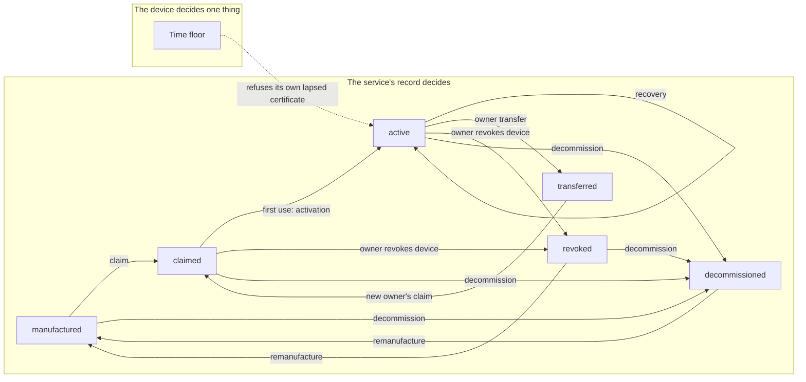

# Tier 8: Operate the credential lifecycle

## Scenario

Your beacon is claimed. It holds a Factory identity that says which board it is, and an Operational identity that says whose it is. Every report it sends is believed because of the connection that carried it, and a person had to stand at the board and approve the claim by hand. Tier 7 built all of that, and it works.

Now let time pass.

The Operational certificate your board holds lives ninety days. Nothing in Tier 7 replaces it, so on day ninety-one the service refuses it and the board stops updating. The board cannot see that coming. It has no clock, and it reads the signed date in every release and throws the date away.

Then suppose someone copies the board's Operational key out of a flash dump, as Tier 6 showed you can. You want to stop that key. Tier 7 gave you one tool for it, `./course claim revoke`, and it is a lab control. It writes a serial into a file for whoever runs it. It records nobody's authority and gives no reason.

Suppose instead that you sell the board. The certificate names you as the owner, and nothing in Tier 7 can give the board up. The buyer presses the button and is refused, because the first claim wins and nothing ever takes it back.

And suppose the board is lost, erased, or thrown away. The record keeps saying it is claimed, because only a written act changes the record, and Tier 7 has no such act. Your own board's record already shows this, as you will see in the first ten minutes of this tier.

None of these is a break-in. Each one is a credential that keeps its power after the authority behind it has gone. That is the subject of this tier: an identity is not a thing you issue once, it is a thing you operate for as long as the product lives.

You will operate it. You will renew the Operational identity onto a new key while the old one still works, and watch the service retire the old one only after it has seen the new one used. You will give the board to a second owner in two acts, recover an identity you broke on purpose, and revoke the device. You will let the device refuse its own certificate because of a signed date. Finally you will retire the board for good and bring it back under a new name.

Each of those operations stops something, and you will read, on the board's own console, the named check that stops it. Eleven attacks run on the host against the same checks. You will also meet what the operations cannot do: a revoked credential is not a dead key, a destroyed key is not an erased key, and the Time floor is not a clock.

At the end you will have a board that has been renewed, transferred, recovered, revoked, retired and brought back, a record that tells that whole story, and a clear account of what each operation withdrew and what it left behind.

## Learning result

After this tier, you can:

- Explain why an identity is a lifecycle rather than a provisioning step, and name the authority behind each operation.
- Renew an Operational identity with a new key and a bounded overlap, and prove from the records that the new identity worked before the old one was retired.
- Transfer a device to a new owner in two acts, and show that the Factory identity, the history and the anti-rollback state survive it.
- Recover a lost Operational identity through physical presence and the Factory identity, with no universal secret.
- Tell a certificate revocation from a device revocation by the check that refuses each one, and by whether the device can still recover.
- Decommission a board so that the record stops it, verify an erase from the flash rather than from the device's report, and bring the board back only by remanufacture.
- Read a Device lifecycle state out of the Provisioning record yourself, and say which operations move it and which do not.
- Say precisely what the Time floor proves and what it does not, and why `SC-08` reaches only partly supported.

## Safety boundary

Run everything against your own Reference product, your own update service and your own board, on the isolated lab network. Use only disposable course credentials, keys and images.

Several steps in this tier cannot be undone by the person who runs them, and that is deliberate. Each one is explained again before its command.

- `./course owner transfer` gives your board up. You cannot take it back. Only a new claim, with a press, gives the board an owner again.
- `./course owner revoke device` is one-way. Nothing the owner can send lifts it. Only `./course provision remanufacture`, the manufacturer's act, brings the board back.
- `./course provision decommission` retires the board for good, under every identifier it has ever carried. Only a remanufacture lifts it.
- `provision operational corrupt` is lab-only fault injection. It writes bad bytes over the board's stored Operational certificate on purpose. It sits behind the BOOT gate, like Tier 6's `provision export`.
- The time-floor lab image leaves the board's Time floor in the future. From then on the board refuses every Operational certificate that ends before that moment, and only a full flash erase clears it. The procedure places it immediately before the erase for that reason.
- `esptool erase-flash` erases the whole part, bootloader and images included. The board is blank afterwards until you flash it again.
- `./course device flash --tier 05 --destroy-identity` flashes an image whose first boot can erase the board's identities with no record. Run it only at the step that asks for it.

Burn no eFuse. Nothing in this tier needs one, and several of them end reflashing for good. `espefuse summary` reads the eFuses without burning anything, if you want to look.

The attack fixture is the Tier 7 adversary, one tier on. It holds the same single Owner account, `rival-labs`, in your own owner store. For some rows it also acts as the manufacturer of its own synthetic devices, at your station. It signs nothing with your Operational Device CA key or your Release signing key. `./course service bypass reset` removes its owner account. It cannot undo a revocation, a transfer or a decommissioning, because those are one-way by design.

Row `E-8-11` builds the firmware's own Time floor code for the host and runs it there. It signs its manifests with a throwaway key that only that host build trusts. A manifest dated in the future must never reach your board: the floor would stay ahead of real time, and every later certificate would be refused.

## Starting state

You need:

- A [Tier 7](../tier-07-operational-identity/index.md) board: claimed by an Owner of your own, running its confirmed Tier 7 image over mutual TLS.
- The Owner credential you minted in Tier 7, or a new one minted for the same owner.
- The local OTA service running with `--https --mutual-tls`, the course provisioning station, and the isolated course network.
- The Tier 7 Security evidence pack.

The [course landing page](../../index.md) carries the environment setup, the glossary and the list of every tier, if you need to go back to any of them.

The board these captures were recorded on started this tier as `beacon-t07b-206ef1170d64`, claimed by `field-owner`. It was remanufactured twice during the tier and ends it as `beacon-t08c-206ef1170d64`. Your identifiers will differ, and you use your own in every command. The host commands that the board does not need were captured against a synthetic device, `beacon-bypass-t08-020000000259`, in a throwaway Course environment, so their serials and times differ from the board captures too.

Every credential your board holds is still valid, and nothing in the course can take one back on anybody's authority.

## Weakness ledger before the work

Inherited from Tier 7. Not your own work yet.

| Identifier | Weakness | Attack vector | Expected result | Planned treatment |
| --- | --- | --- | --- | --- |
| T2-W-09 | The device has no clock and checks no dates | Present an expired certificate to the device | The device accepts it | Accepted for the core course: device time is evidence, not an authorization input (section 7), as RFC 8995 section 2.6.1 allows a clockless device |
| T3-W-10 | The bootloader itself is unverified | Nothing checks MCUboot before it runs | The bootloader runs whatever is there | Advanced Tier A |
| T3-W-11 | The Release signing key lives on the same machine as the build and the service. One key signs the image and the manifest, so taking it defeats both | Sign anything with the release key | Both verifiers accept it | Accepted for the core course: custody is a limit of a one-machine lab. Rotation in Advanced Tier A, section 6 |
| T4-W-12 | Downgrade prevention does not protect the first install | Install onto a device whose primary image carries no counter | The install is accepted | Accepted for the core course |
| T4-W-13 | The security counter is compared, never remembered | Rewrite the primary slot | The device forgets what it was running | Advanced Tier A |
| T5-W-14 | A power cut during the health window forces a revert indefinitely | Power-cycle during the sixty second window | The device reverts each time | Residual availability risk |
| T5-W-15 | The watchdog depends on a driver quirk an upstream fix would change | Upgrade Zephyr | The behavior changes silently | Recorded limit |
| T5-W-26 | A revert is reported once and nothing acknowledges it, so a board that restarts before it reaches the service never reports that revert | Revert with the service stopped, then restart the board before you start the service | The service never receives the revert report | Recorded limit. No later tier builds acknowledged delivery |
| T6-W-16 | The Secure Storage encryption key is a hash of public values | Dump the flash and run the published derivation | The private key is recovered | Advanced Tier B |
| T6-W-17 | Stored records carry no freshness, so an older copy is accepted as authentic | Write back a superseded record from the same dump | The device accepts it | No tier on this course closes it |
| T6-W-18 | The private key is protected at rest only | Privileged firmware, the application, or a debugger reads it | The key is reachable | Advanced Tier B |
| T6-W-19 | The AES-GCM nonce is drawn once per boot while the record key never changes | Draw the nonce before the RF subsystem is up | The guarantee weakens | Recorded limit |
| T6-W-27 | The Wi-Fi passphrase is compiled into every image this course builds | Read the strings of any image you built | The passphrase is readable | Recorded limit. This tier meets it at decommissioning |
| T7-W-20 | Authorization lifetime is enforced only by the service. The device cannot evaluate its own certificate's validity window, there is no revocation list and no OCSP, and a device cut off from the service cannot know it has lost authorization | Cut the device off and let its certificate expire | The device keeps presenting a dead certificate | This tier reduces it with the Time floor |
| T7-W-21 | The Owner credential is a bearer token on a server-authenticated listener. Whoever holds it is the owner, with no second factor | Present a copied Owner credential | The service accepts it | Accepted for the core course: the operator is the lab host's user |
| T7-W-22 | With `--mutual-tls` the service holds a certificate authority signing key, so compromising the service mints devices | Take the service and its key | Certificates the service accepts | Residual risk with an owner |
| T7-W-23 | The claim endpoint is an oracle. Distinguishable refusals reveal whether a device exists and whether it is owned | Approve a claim for a device you do not own | The refusal says the device is owned | Accepted |
| T7-W-24 | The Factory credential survives claiming permanently and reopens the claim path forever, by design | Press the button on a claimed device | A Claim window opens | Accepted. This tier decides where it ends |
| T7-W-25 | Synthetic devices land in the real manufacturing record with no marker field. The naming convention is the only sign | Read the record | Fixture devices look like real ones | Recorded limit |

The rows this tier is about are `T7-W-20` and `T7-W-24`. Behind both is a gap that Tier 7 had nothing to act on: every credential it issued stayed valid until its own date, whatever happened to the device. This tier gives that gap a Security claim of its own, `SC-08`.

## Predict

Before you run anything, write down your answers. These six questions are about the whole tier rather than about the attacks below, and the Reveal section, after Test bypass attempts, answers all six.

1. The service renews your board onto a new key. For how long will it accept both the old certificate and the new one, and what ends the overlap?
2. Five operations are in this tier's name: renewal, revocation, recovery, transfer and decommissioning. Which of them change the Device lifecycle state in the record?
3. You revoke your board's Operational certificate. What does the board still hold afterwards, and what can a copy of its key still do?
4. You transfer your board to a new owner. What does the new owner inherit from you?
5. Your board prints that every key has been destroyed. What is left in its flash?
6. Can your board ever know, without asking the service, that its own certificate has expired?

## Reproduce the credentials that outlive their authority

### Look before you act

Before you change anything, read what the record says about your board. The Provisioning record is the file `.course-state/provisioning/records.jsonl`, and from Tier 6 onward every lifecycle event for your board is a line in it.

```text
./course provision record --device beacon-t07b-206ef1170d64
```

The command prints a short summary of each line. Here are the last two lines the capture board's record held before this tier, read straight out of the file. The first is the Tier 7 claim, and the second was appended by the Tier 8 service the first time the board used that certificate.

```text
{
    "certificate_fingerprint": "sha256:b10495f8fa410343f19e203c8e5e3236eeb612b2c826e57c351c8f3e51745903",
    "certificate_public_key": "sha256:d1ce3f60ff2a7ecf4bfb3adc1fada565d1e7d6eb1712ddac4eb51e2f8766c576",
    "certificate_serial": "41876487873296771368167803920907785040",
    "claim_nonce_verifier": "sha256:ebc1902a403872e356e3c887b4602d659d04dbd37689471c6743be6f3a589364",
    "device_id": "beacon-t07b-206ef1170d64",
    "kind": "claim",
    "lifecycle_state": "claimed",
    "owner_id": "field-owner",
    "recorded_at": "2026-09-24T17:17:51.493908753Z",
    "station": "course-ota-service"
}
{
    "certificate_serial": "41876487873296771368167803920907785040",
    "device_id": "beacon-t07b-206ef1170d64",
    "kind": "activation",
    "lifecycle_state": "active",
    "owner_id": "field-owner",
    "recorded_at": "2026-09-29T20:44:08.480736068Z",
    "station": "course-ota-service"
}
```

Read the `lifecycle_state` field, and then stop trusting it. You have been reading that field since Tier 6. It is a copy, written for a person to read, and nothing decides anything from it. The state is the sequence of `kind` values: an `enrollment` makes a board `manufactured`, a `claim` makes it `claimed`, and an `activation` makes it `active`. The service works the state out by replaying those lines every time it needs to know, and it writes the field from the same derivation so that the two cannot disagree. `docs/adr/0003-device-lifecycle-state-is-derived.md` records why.

This matters for everything that follows. A record that stores a current state has to read, change and rewrite it, and a write that fails half way leaves a state that is neither the old one nor the new one. A record that only appends events cannot be half changed. So every operation in this tier appends one line to the record, and the state moves because the derivation reads the new line.

`active` is new in this tier, and it means something precise: the device has used its Operational identity at least once. `claimed` means it was issued one. The difference gives renewal a way to say "the new identity works", which you will need shortly.

Now three attacks. None of them breaks anything. Each one only shows a credential that keeps its power after the authority behind it has gone.

### A copied key that nobody with authority can stop

The first credential is a copy of the board's Operational key. Tier 6 showed that anyone who dumps the storage partition can recover the private key by a published derivation, and that is `E-6-05`. The copy is as good as the board: the service cannot tell a copied key from the original, and nothing in this course can.

So the question is what you can do once you suspect a copy. In Tier 7 the answer was one lab control. Here is the line it wrote on the capture board's service during Tier 7, as it still stands in `.course-state/provisioning/revoked.jsonl`:

```text
{"certificate_serial":"159307069163124795337050571888294605858","revoked_at":"2026-09-23T22:06:30.212069487Z"}
```

Read what the line does not say. It names no owner who asked for it, no reason, and no role. `./course claim revoke --serial` looks up the serial and writes it for whoever runs the command, with no Owner credential and no check that the caller has any authority over the device. It works because the lab host's user can write the file, which is exactly the authority an attacker on that host also has.

It is also the only tool Tier 7 has. An owner who suspects a copied key has no operation of their own to stop it. Nobody can stop the device itself either, only one certificate at a time. And once a certificate is gone, the owner has no way to give their own board a new one, because the first claim stands and nothing reopens it. Outside the lab, this is a fleet where only the people with shell access to the server can withdraw a credential, they leave no record of why, and the device they stopped can never come back.

### A certificate that dies where the device cannot see

The second credential is the board's own Operational certificate, and the attack is only time. The certificate expires ninety days after its claim. Your Tier 7 board prints its own end date nowhere, and here is what it does with the one signed date it is given. This is the capture board still running its Tier 7 image, verifying the manifest for the Tier 8 release that you install below:

```text
release.verified signature over 517 manifest bytes, ECDSA P-256 over SHA-256
release.verified nothing has parsed these bytes yet; that is the point
release.admitted release_id=tier-08-credential-lifecycle version=0.8.0-credential-lifecycle counter=4 channel=stable
release.admitted board=esp32c6_devkitc/esp32c6/hpcore hardware_revision 1..1 covers this product's 1
release.admitted created_at=2026-09-29T20:45:16Z supported_until=2031-09-29T20:45:16Z, carried and signed, not checked: this device has no clock
```

The last line is the whole weakness. The manifest carries `created_at`, the moment the manufacturer signed it. The signature over it has just been verified with the key compiled into the image, so the date is exactly as trustworthy as the release itself. The Tier 7 image reads it, says it is signed, and discards it.

Suppose this board is cut off from the service for four months. Its certificate has been dead for a month, and it keeps presenting it on every connection it tries. Only the service can say the certificate is dead, and the board is not talking to the service. That is `T7-W-20`, and Tier 7 wrote it down honestly: a device cut off from the service cannot know it has lost authorization. This tier finds out how much of that sentence is true.

### An identity that outlived its board

The third credential is an identity that no longer exists on any board. Search your own record for your board's MAC suffix, the last twelve characters of its identifier:

```text
grep 206ef1170d64 .course-state/provisioning/records.jsonl
```

The capture board's record answers with six identifiers for one board. Two of the lines tell the whole story. The first is a claim from the Tier 7 campaign:

```text
{
    "certificate_fingerprint": "sha256:38d9919a8ff0b74e7b6a8002529b535d2aa7fd0cc39cda39ca267d1c0553053d",
    "certificate_public_key": "sha256:c3f021b81a39bef7d288208a0b0a7541e6af7648089d2441d079c97ce264c573",
    "certificate_serial": "235462841561718215953025608984406644653",
    "claim_nonce_verifier": "sha256:1b4b0e9d8f852f8e09219fbfccad83fec0ec41ff21d22019ccf83b39932c8642",
    "device_id": "beacon-t07-206ef1170d64",
    "kind": "claim",
    "lifecycle_state": "claimed",
    "owner_id": "field-owner",
    "recorded_at": "2026-09-23T22:21:38.013154247Z",
    "station": "course-ota-service"
}
```

The second is the same board enrolling again the next morning, under a new name:

```text
{
    "certificate_fingerprint": "sha256:164cb62de59456fca9c32fc09c867a6e9c8620f73e8f3033542be3e1c42d9e47",
    "certificate_public_key": "sha256:14d5571a4c206e4cbaa151066e6680f114f18e6960dd7fddd5055ce034d4f89a",
    "certificate_serial": "59932536332440710870605308715720495322",
    "consumed_credential": "d3db7da3-e2a7-4502-99f5-344b6702d252",
    "device_id": "beacon-t07b-206ef1170d64",
    "hardware_revision": "1",
    "kind": "enrollment",
    "lifecycle_state": "manufactured",
    "recorded_at": "2026-09-24T06:25:44.659830107Z",
    "result": "issued",
    "station": "course-provisioning-station"
}
```

Between them, the board lost the whole `beacon-t07-206ef1170d64` identity. Nobody recorded why, and nothing in the record says it happened. The record still says `beacon-t07-206ef1170d64` is claimed by `field-owner`, and it went on saying so for six days. No command in Tier 7 could have written anything else. There is no operation that retires an identity, and there is none that retires a board.

The station did not notice either. It checks that an identifier has never been used and that a Bootstrap credential is fresh. It has never checked which board is enrolling, so a board that loses its identity can come back under any new name, as often as it likes. Outside the lab, that is a returned or scrapped unit re-entering service without anyone noticing, and a record that cannot be used to find out which of your devices are still real.

If your board was never remanufactured, your record has one identifier and you read this attack from the capture above. An identity can be lost this way by accident, which is why Tier 7's Safety boundary warns about flashing an image from an earlier tier.

### What the three share

Each credential kept working after its authority was gone. The copied key outlives the owner's wish to stop it. The certificate outlives the service's ability to reach the device. The identity outlives the board it named. And in all three cases the course had no act that a named authority could perform and a record could keep.

Record the three things you read: the shape of any line in your own `revoked.jsonl`, the `created_at` line your Tier 7 board discarded, and your board's history by MAC suffix. You will read all three again at the end of the tier.

## Investigate the missing boundaries

Answer these before you build anything:

1. A certificate has a date in it and a signature over the date. Who can tell that the date has passed, and what do they need that the board lacks?
2. Your board holds an Operational certificate that works. You want to stop it. Who should be allowed to, how does the service find out, and where should the record of that decision live?
3. You sell your board. What should the buyer be able to do on the first day, and what should you no longer be able to do?
4. Your board loses its Operational identity but keeps its Factory identity. What proves it is still your board, and what must not be enough to prove it?
5. A board is thrown away. What is the authority that keeps it out of service: the board's own flash, or something else?
6. A board says it destroyed a key. What would you have to read to believe it?

The boundaries this tier adds are between an authority and a credential it issued, over time.



Six states, and the service's record holds all of them. Three operations move a device between states: a transfer, a device revocation and a decommissioning. Renewal and recovery are loops on `active`: the device ends where it started, holding a different certificate. Only remanufacture leaves `revoked` or `decommissioned`. On the device side there is exactly one decision, and it can only take authorization away: the Time floor lets the board refuse its own certificate when it has signed proof that the certificate has expired.

A lifecycle state tracks what a device is authorized to do, not what it is holding. That is why renewal and recovery change no state. A renewal swaps one certificate for another under the same owner and the same authorization. A recovery replaces a certificate the device lost, and the record never knew it was lost. The log does not know what a device is holding, and that gap is exactly where recovery lives.

Four actors hold the authority here, and none of them can act for another. The Owner withdraws the Operational certificates of their own device, gives the device up, asks for its recovery, and revokes the device. The manufacturer blocks a Factory identity, decommissions a board, and remanufactures one. The service decides when a renewal is due and retires the old certificate when it sees the new one used. The device decides nothing except that its own certificate is dead, and only when a signed date proves it. Every one of those decisions is a line in the record, and the record is the authority rather than the device.

## Put Tier 8 on the board

The five operations need device code that Tier 7 does not have: a second Operational key slot for renewal, a Time floor, and a client that reads every refusal by its check name. So the tier starts by installing its own image, over the air, onto the board you claimed in Tier 7.

### Update over the air

On the host, from the repository root, build and publish the Tier 8 release:

```text
./course build firmware --tier 08
./course release sign --tier 08 --variant baseline
```

Your Tier 7 board picks the release up on its next poll, over mutual TLS, on its Operational identity. It checks the image the way Tier 4 and Tier 5 taught it to, and MCUboot checks it again. This is the capture board:

```text
release.admitted release_id=tier-08-credential-lifecycle version=0.8.0-credential-lifecycle counter=4 channel=stable
ota.install 832898 bytes are in the secondary slot and hash to the signed digest
I: course: slot=secondary header=ok tlv=ok signature=present key=match counter=4
```

Counter 4 is new. Tier 5 and Tier 7 carried security counter 3, so from now on this board refuses their releases. The reason is not a vulnerability in Tier 7. It is that the storage layout changed and an older image cannot read it, and Tier 7's Safety boundary told you what an older image does to an enrolled board at its first boot. That is `T8-W-28`, and Tier 7 boards stay exposed to it.

The Tier 8 image boots on trial and reads the identities the Tier 7 image left behind:

```text
Running release: tier-08-credential-lifecycle
Security counter of the running image: 4
identity.state provisioned device_id=beacon-t07b-206ef1170d64
identity.state factory certificate fingerprint=sha256:164cb62de59456fca9c32fc09c867a6e9c8620f73e8f3033542be3e1c42d9e47 key=0x00000601
identity.state operational certificate fingerprint=sha256:b10495f8fa410343f19e203c8e5e3236eeb612b2c826e57c351c8f3e51745903 key=0x00000701 owner=field-owner
identity.state operational slot A is current, because no operational-slot entry exists (a Tier 7 layout reads as slot A)
identity.state operational certificate valid_to=2026-12-23T17:17:51Z
time.floor 2026-09-29T20:44:16Z, set by the build seed
```

Compare both fingerprints with your Tier 7 evidence. They are the same, because the identities live in Secure Storage and not in the image. Tier 8 has two Operational key slots, `0x701` and `0x702`, and a Tier 7 board has only ever used the first, so the image reads it as slot A with no migration. The board also prints its certificate's end date for the first time, and a Time floor, which the next step explains.

Let the health gate run. Expected result on the board:

```text
health.gate passed
trial.confirm this image is now the one the device falls back to
```

Your board is `active` in the record. The first request it made on its Operational certificate to the Tier 8 service appended the `activation` line you read in section 7, whichever image made that request.

### Watch the Time floor rise

The Time floor is the one lifecycle control on the device, so look at it before anything depends on it. It is the latest moment the board has authenticated proof that the time has reached. It starts at a build time signed into the image, the `set by the build seed` line above. It rises to the `created_at` of every Release manifest whose signature verifies, and it never falls.

Publish Tier 8's second release, which fails one health check on purpose, so that a manifest reaches the board and the install is then undone:

```text
./course build firmware --tier 08 --variant fail-health
./course release sign --tier 08 --variant fail-health
```

The board fetches the manifest and verifies it. Read the order of the lines:

```text
ota.manifest fetched 490 manifest bytes and a 72 byte detached signature
release.verified signature over 490 manifest bytes, ECDSA P-256 over SHA-256
release.verified nothing has parsed these bytes yet; that is the point
time.floor raised to 2026-09-29T21:08:59Z by the signed created_at of release tier-08-fail-health
time.floor the signature is the evidence, whether or not the release installs
release.admitted release_id=tier-08-fail-health version=0.8.1-fail-health counter=4 channel=stable
release.admitted board=esp32c6_devkitc/esp32c6/hpcore hardware_revision 1..1 covers this product's 1
release.admitted created_at=2026-09-29T21:08:59Z supported_until=2031-09-29T21:08:59Z, both signed. created_at
release.admitted has already raised the Time floor if it was later; neither is
release.admitted checked against a clock, because this device has none
```

The floor rose after the signature verified and before the release policy decided anything. That order is the design. The signature is what makes the date trustworthy, so the date is used whether or not this release is ever installed. A manifest the board refuses for its counter or its hardware still proves that the manufacturer signed something at that moment.

The release installs, fails its gate, and MCUboot puts the confirmed image back:

```text
health.check update-client-ready  FAIL
health.gate refused by update-client-ready before the window started
trial.revert a health check failed at check update-client-ready
```

The image that comes back still holds the raised floor, because the floor lives in the storage partition and not in the image:

```text
time.floor 2026-09-29T21:08:59Z, set by release tier-08-fail-health
boot.state the previous boot gave up on release tier-08-fail-health at check update-client-ready
event.queued update.reverted release_id=tier-08-credential-lifecycle detail=tier-08-fail-health update-client-ready
```

Put the assignment back when you have seen it:

```text
./course release assign --tier 08 --variant baseline
```

Keep two limits in mind from now on. The floor is not a clock: it is a lower bound set by whoever signs releases, and it moves only when a release arrives. And it judges exactly one certificate, the board's own Operational certificate. It never judges the Factory certificate, because a release dated after 2036 would then make every board unrecoverable. It never judges a certificate the board is shown either, because no tier of this course has a verify callback in which to do it.

## Renew the Operational identity

Renewal replaces the board's Operational identity with one on a new key, before the old one expires, for the same owner. It is the first identity operation in this course with no person in it. The service decides when it is due, the device does the work on its own identity, and the service retires the old certificate when it has seen the new one used.

### Ask for a renewal

The service asks a device to renew when a third of its certificate's own lifetime is left, which for ninety days is day sixty. You do not want to wait sixty days, so ask for it now, as the owner, from the machine holding your Owner credential:

```text
./course claim renew --device beacon-t07b-206ef1170d64 --credential <your Owner credential>
```

Expected result, captured on the host against the synthetic device:

```text
Asking for a renewal now, as the owner of this device.

The service normally asks a device to renew when a third of its
certificate's lifetime is left. This moves that moment to now. It does not
renew anything: the device renews on its own Operational identity when it
next reads its assignment, and no person takes part in that.
  operator listener: https://ota.course.example:8444
  device named:      beacon-bypass-t08-020000000259

+ POST https://ota.course.example:8444/v1/devices/beacon-bypass-t08-020000000259/renewal-request
  Authorization: Bearer <the credential, not printed>
  <- 200 OK
     result: requested
     device: beacon-bypass-t08-020000000259

The device's next assignment carries renew: true. When it renews, both
certificates are accepted until the service sees the new one used. Then the
old one is revoked as superseded in .course-state/provisioning/revoked.jsonl.
Result: renewal is due now for beacon-bypass-t08-020000000259
```

Read the claim the command makes about itself: it renews nothing. It moves a date. The request is recorded as a `renewal_request` line, which changes no state.

### Watch the device renew itself

On its next poll the board reads `renew` in its assignment, generates a new key, and asks for a certificate for it on its current identity. The certificate comes back and goes into the other slot as a Renewal candidate, beside the identity the board already holds:

```text
identity.candidate stored in slot B key=0x00000702 fingerprint=sha256:9cfc0e7f1719530afbf3f39034f63cf79d1d8b5909a0eed4f8f507f628ab96c9
identity.candidate the current identity in slot A is untouched. The device now
identity.candidate holds two Operational identities, and it gives up the old one
identity.candidate only after the service has accepted a request on the new one.
renewal.prove presenting the Renewal candidate on an ordinary event
```

The candidate proves itself with an ordinary device event, `renewal.activated`, presented on the new certificate. When the service accepts it, the board makes slot B current and destroys the old key. The next boot says so:

```text
identity.state operational certificate fingerprint=sha256:9cfc0e7f1719530afbf3f39034f63cf79d1d8b5909a0eed4f8f507f628ab96c9 key=0x00000702 owner=field-owner
identity.state operational slot B is current
identity.state operational certificate valid_to=2026-12-28T21:11:50Z
```

A new key, a new fingerprint, a new ninety days, and the same owner. Two slots and a pointer is the shape this has to take on this board. The persistent Operational key was made without permission to copy it, so it cannot be moved aside. The new key has to be written somewhere else, and one small setting records which slot is current.

### Prove the order from the records

The claim this operation makes is that the new identity worked before the old one was retired. The board cannot prove that, because its account of its own success is exactly what is in question. The service's records can. Here are the two lines the service appended to the Provisioning record for the capture board's first renewal:

```text
{
    "certificate_fingerprint": "sha256:9cfc0e7f1719530afbf3f39034f63cf79d1d8b5909a0eed4f8f507f628ab96c9",
    "certificate_public_key": "sha256:c6525e93a6dc00cb0bc0ac8ee712ab1c5199062166d5d510aae96336e2db4bd9",
    "certificate_serial": "54436063370825345750239251229547677329",
    "device_id": "beacon-t07b-206ef1170d64",
    "kind": "renewal",
    "lifecycle_state": "active",
    "owner_id": "field-owner",
    "recorded_at": "2026-09-29T21:11:50.863227435Z",
    "renewed_from_serial": "41876487873296771368167803920907785040",
    "station": "course-ota-service"
}
{
    "certificate_serial": "54436063370825345750239251229547677329",
    "device_id": "beacon-t07b-206ef1170d64",
    "kind": "activation",
    "lifecycle_state": "active",
    "owner_id": "field-owner",
    "recorded_at": "2026-09-29T21:11:56.866687699Z",
    "station": "course-ota-service"
}
```

And here is the line the service wrote to `revoked.jsonl` for the old serial:

```text
{"by":"course-ota-service","certificate_serial":"41876487873296771368167803920907785040","reason":"superseded","revoked_at":"2026-09-29T21:11:56.866801663Z","role":"operational"}
```

Put the three times side by side. The renewal issued the new certificate at `21:11:50.863`. The service first accepted a request on it at `21:11:56.866687`, which is the `activation`. It revoked the old serial at `21:11:56.866801`, a tenth of a millisecond later, and only because of that activation. For those six seconds the service would have accepted either certificate. That is the overlap.

State the proof through the `activation` record, not through the device's event. The `renewal.activated` event the board sent is in `events.jsonl` too, carrying the new `certificate_serial`, but the service stamped it 52 microseconds after the `superseded` line, inside the same request. The event is the request that caused the activation. The activation record is the service's own observation that the new identity worked, and nothing else in the service writes a `superseded` line for a renewal.

If the new certificate is never used, nothing retires the old one, and it works until its own `valid_to`. There is no separate overlap timer. RFC 8739, the standard on short-lived certificates, names the price of an overlap in one sentence: "the cancellation is not completely effective until the 'next' certificate also expires". An overlap is a deliberate window in which a withdrawn authorization still works. Here it is usually six seconds, and at worst it is the old certificate's remaining life.

The service also keeps the overlap small in number. Before it issues a new renewal, it retires any earlier candidate for this device that was never used, so a device has at most two Operational certificates the service accepts.

### Reset in the middle of a renewal

A renewal has one dangerous moment: after the candidate is stored and before the pointer moves. Ask for a second renewal, and reset the board right after `renewal.prove` appears, with `./course device reset` or the board's reset button:

```text
./course claim renew --device beacon-t07b-206ef1170d64 --credential <your Owner credential>
```

The capture board was reset at exactly that point:

```text
renewal.due the service says this certificate should renew. The device does
renewal.due not decide that itself: the service holds the schedule.
identity.renewal generated a new P-256 key, volatile. A renewal is a new key
identity.renewal pair, never the old key re-certified.
identity.csr built a 225 byte renewal request for beacon-t07b-206ef1170d64
identity.candidate stored in slot A key=0x00000701 fingerprint=sha256:2eb56c6c8941161b3e79caa3186ae32899b1cad8b32106748d5a84b0079149f3
identity.candidate the current identity in slot B is untouched. The device now
identity.candidate holds two Operational identities, and it gives up the old one
identity.candidate only after the service has accepted a request on the new one.
renewal.prove presenting the Renewal candidate on an ordinary event
ESP-ROM:esp32c6-20220919
```

The slots alternate, so this candidate went into slot A. The board comes up holding two identities and knows which is which:

```text
identity.state operational certificate fingerprint=sha256:9cfc0e7f1719530afbf3f39034f63cf79d1d8b5909a0eed4f8f507f628ab96c9 key=0x00000702 owner=field-owner
identity.state operational slot B is current
identity.state operational certificate valid_to=2026-12-28T21:11:50Z
identity.state renewal candidate in slot A fingerprint=sha256:2eb56c6c8941161b3e79caa3186ae32899b1cad8b32106748d5a84b0079149f3 key=0x00000701
identity.state a renewal wrote it and was reset before it was proved.
identity.state The next poll presents it first.
```

And the next poll does:

```text
renewal.prove presenting the Renewal candidate on an ordinary event
tls.identity presenting the Renewal candidate's Operational certificate, signed by PSA key 0x00000701
renewal.activated the service accepted a request on the new identity. That
renewal.activated first use is its activation record, and on it the service
renewal.activated retires the old certificate as superseded. This device
renewal.activated gives up the old identity now, and not before.
identity.promote slot A is current now, key=0x00000701 fingerprint=sha256:2eb56c6c8941161b3e79caa3186ae32899b1cad8b32106748d5a84b0079149f3
identity.promote the old key 0x00000702 is destroyed and its certificate deleted.
identity.promote Destroyed means this firmware can no longer use it. The flash
identity.promote still holds a recoverable copy until NVS reclaims the sector.
```

A reset at the worst moment cost nothing. Had the service refused the candidate, the board would have discarded it and stayed on the identity it had. A failed renewal leaves the device on the identity it already had, and that is a requirement of section 8 of the specification, not luck. The last two lines are worth rereading now and remembering later: destroyed and erased are not the same word.

### Why the service decides when

It is tempting to let the device decide. A device could renew every so many hours of uptime. Then a board that reboots often renews all the time, and a board that stays up for a year renews once, and neither schedule has anything to do with the certificate. The device cannot know the certificate's age, because it has no clock, and the Time floor cannot help either: it moves only when a release arrives, so a trigger built on it would depend on how often you publish firmware. So the service holds the schedule, as it already holds the only enforcement of expiry. A device that cannot reach the service is not renewed, and its Time floor is what records the loss.

The service does not ask early either. Offer a fresh key before renewal is due and it is refused at `renewal-due`, which is `E-8-04`. Offer the key the board already has and it is refused at `key-unused`, because a renewal that keeps the key renews nothing, which is `E-8-03`. A real fleet adds random delay to the schedule so that ten thousand devices do not renew in the same minute. This lab has one device and does not need it.

Renewal also gives the owner a second way to withdraw a credential without revoking anything. Short certificates that the service must keep renewing are a quiet form of revocation: stop renewing and the credential dies on its own date. The trade is dependence. The shorter the certificate, the smaller the window a stolen credential has, and the more the whole fleet depends on the renewal path working every day.

There is no person in a renewal, and that is also its weakness. Whoever holds a copy of the Operational key can renew onto a fresh key of their own, on the owner's behalf, with no press. `ownership-context` still binds the copy to the same owner, revocation still stops it, and the owner can see it in the `activation` lines. But whichever copy renews first keeps the identity, and the loser is refused. That is `T8-W-31`, and it is also why renewal does not contradict `SC-07`. A renewal continues an identity rather than obtaining one. The current Operational identity authenticates it, and that identity came from a press.

## Transfer the device to a new owner

An ownership transfer moves a device from one owner to another in two acts. First the owner of record gives the device up. Then a new owner claims it with an ordinary claim, press and all. Between the two acts the device is `transferred`: owned by no one, and unable to reach the OTA service.

### Give the device up

Read the board's counter first, so you can compare it afterwards. It is in the boot banner:

```text
Security counter of the running image: 4
```

Now give the board up, as its owner of record. **This cannot be undone by you.** Only a new claim, with a press, gives the board an owner again:

```text
./course owner transfer --device beacon-t07b-206ef1170d64 --credential <your Owner credential>
```

Expected result, captured on the host against the synthetic device:

```text
Giving a device up, as its owner of record. This is the first of the two
acts of an ownership transfer. The service revokes the device's Operational
certificate, and the device is then owned by no one. It cannot reach the
service until a new owner claims it. You cannot undo this yourself.
  device: beacon-bypass-t08-020000000259
  reason: privilegeWithdrawn

+ POST https://ota.course.example:8444/v1/devices/beacon-bypass-t08-020000000259/transfer
  Authorization: Bearer <the credential, not printed>
  <- 200 OK
     result:                 transferred
     revoked:                242162765579039195735320957812524809538
     recovery authorization: none was open
     lifecycle state:        transferred

The second act belongs to the new owner. They press the device's button and
approve the claim with the nonce it prints and their own credential:
  ./course claim approve --device beacon-bypass-t08-020000000259 --nonce <nonce> --credential <their credential>
The transfer names no new owner. The person who presses the button becomes it.
Result: device beacon-bypass-t08-020000000259 is transferred
```

On the capture board, the service wrote this `transfer` line:

```text
{
    "device_id": "beacon-t07b-206ef1170d64",
    "kind": "transfer",
    "lifecycle_state": "transferred",
    "owner_id": "field-owner",
    "recorded_at": "2026-09-29T21:15:33.131877286Z",
    "revocation_reason": "privilegeWithdrawn",
    "revoked_certificate_serials": [
        "14305701196822648964432463396951880140"
    ],
    "station": "course-ota-service"
}
```

And this line in `revoked.jsonl`, which is what the board will meet on its next connection:

```text
{"by":"field-owner","certificate_serial":"14305701196822648964432463396951880140","reason":"privilegeWithdrawn","revoked_at":"2026-09-29T21:15:33.130859303Z","role":"operational"}
```

Compare it with the Tier 7 line you read in section 7. This one names who withdrew the certificate, and why. `privilegeWithdrawn` is one of the reason names from RFC 5280, the certificate profile standard, and the service accepts only a fixed set of them.

Try to do it again with the same credential, and the answer shows that you are no longer the owner:

```text
  <- 403 Forbidden
     refused at check owner-of-record
     reason: you are not the owner of record for this device
```

`owner-of-record` is the operator check every owner operation passes through: certificate and device revocation, recovery and transfer. The old owner fails it for every one of them now.

The board is now owned by no one. Keep `./course device logs` running, because what the board sees on its next connection is read in the Replay section.

### Claim it as the new owner

Mint a second owner. On a real sale this is somebody else's credential on somebody else's machine. Here it is yours:

```text
./course owner new --name harbor-owner
```

```text
Minting one Owner credential. It authorizes a person, not a device, so
it never rides the mutual-TLS listener: you present it as a bearer token
on the operator port, and the store keeps only a verifier.
  owner:       harbor-owner
  credential:  9c73f5b0-38c5-4619-9ab3-e264881069f6
  verifier:    sha256:1249574a979069e950b4d6606100dd57b6fbd7cec91a1326cdcde6567e78728b
  expires:     2026-12-28T21:15:21Z
  recorded in: .course-state/provisioning/owners.jsonl
```

That is the capture campaign's run. The credential line printed below it is omitted here, as it should be from anything you share.

Hold the BOOT button for ten seconds. The board opens a Claim window exactly as it did in Tier 7, and it says something new first:

```text
uart:~$ claim.window this device already holds an Operational certificate for
claim.window owner field-owner, and a press still generates.
claim.window The issued identity is not touched by this. The service is
claim.window the authority on who owns this device, and it will say so.
```

The board still believes it belongs to `field-owner`, because nothing told it otherwise and nothing could. The service is the authority on ownership, and the board is right to leave the question to it.

**Wait for `claim.pending` on the console before you approve.** The device half has to reach the service first. The capture campaign approved too early once, and the service's trail shows the refusal it earned twenty seconds before the device half arrived:

```text
{"check":"claim-window-open","path":"/v1/claim","reason":"no claim window is open for that device; press its button to open one","service_received_at":"2026-09-29T21:17:31.77348682Z","source":"service"}
{"claim_event":"opened","claim_nonce_verifier":"sha256:0f19d8392b218dfc480f3e89b10b75356a03655d18b8ad1d2d1170ab9b31b377","device_id":"beacon-t07b-206ef1170d64","service_received_at":"2026-09-29T21:17:52.05881754Z","source":"service"}
```

Then approve with the new owner's credential and the nonce the board printed, exactly as in Tier 7:

```text
./course claim approve --device beacon-t07b-206ef1170d64 --nonce <nonce> --credential <the new owner's credential>
```

The answer names the new owner, taken from the credential and never from the request. On the host capture it read:

```text
  <- 200 OK
     result:          claimed
     device:          beacon-bypass-t08-020000000259
     owner:           harbor-owner
     lifecycle state: claimed
```

The board collects its new certificate and, at its next boot, names its new owner:

```text
identity.state factory certificate fingerprint=sha256:164cb62de59456fca9c32fc09c867a6e9c8620f73e8f3033542be3e1c42d9e47 key=0x00000601
identity.state operational certificate fingerprint=sha256:ef65109975eabb87ba5df45484a5180164b4ff352a1c1dc3070637b0c2ca09d4 key=0x00000701 owner=harbor-owner
identity.state operational slot A is current
identity.state operational certificate valid_to=2026-12-28T21:18:10Z
```

The new owner's claim always generates a new key. The key the old owner's certificate named is not reused, and it is not recoverable through anything the new owner can do.

### What the transfer kept

A transfer keeps four things, and you can check each one:

- The Factory identity. The fingerprint above is the one the board printed before the transfer, `sha256:164cb62d...`.
- The Provisioning record. Nothing was deleted. The `transfer` line and the new `claim` line were appended after everything before them.
- The Time floor. It still reads `2026-09-29T21:08:59Z, set by release tier-08-fail-health` at this boot.
- The anti-rollback state of the running image. The boot banner reads `Security counter of the running image: 4` after the transfer and again after the new claim.

The counter is a constant compiled into the running image, not a value the transfer could reset, and the board proves that it still enforces it. Offer the transferred board a Tier 7 release at counter 3:

```text
./course release assign --tier 07 --variant baseline
```

```text
release.verified signature over 517 manifest bytes, ECDSA P-256 over SHA-256
release.verified nothing has parsed these bytes yet; that is the point
time.floor stays at 2026-09-29T21:08:59Z; release tier-07-operational-identity was created at 2026-09-24T06:23:52Z, which is not later
release.refused check=security-counter
release.refused   compared: the manifest's security_counter 3 against the counter 4 this running image was built with
release.refused   rejected: a release that would take this device backwards, version 0.7.0-operational-identity
release.refused   consequence: no image bytes were requested, and the running image is unchanged
release.refused   note: the bootloader refuses this too, and its refusal is the one that counts
```

Two refusals in one manifest. The counter refused the release. And the Time floor saw an older signed date and stayed where it was, which is what "it only rises" means on a real board. Put the assignment back:

```text
./course release assign --tier 08 --variant baseline
```

The limit is worth saying plainly. The service path preserves anti-rollback. A new owner with a USB cable does not have to use the service path, and can flash anything onto a board whose bootloader nothing verifies. That is `T3-W-10`, it belongs to Advanced Tier A, and a transfer does not change it.

A transfer also clears less than you might expect, because there is almost nothing to clear. The owner lives only in the Operational certificate, and the certificate is revoked. The one queued device event describes the device, not the owner. On the service, the owner store is keyed by owner rather than by device. The one exception is Wi-Fi. The passphrase is compiled into the image, it belongs to the old owner's network, and it survives the transfer. That is `T6-W-27`, and only a reflash replaces it.

Three design choices in this operation are worth naming, because each has a real cost.

The old owner's consent is required. Only the owner of record can start a transfer, and a new owner holding the board cannot force one. Consumer phones call this pattern an activation lock. Its cost is a second-hand device whose old owner never gave it up, which only the manufacturer can bring back, by remanufacture. Letting possession override the owner would have been the universal recovery path this course refuses.

The release is open. The transfer names no recipient, and the physical press binds the device to whoever holds it and presses the button, with any valid Owner credential. That is `T8-W-32`. On the lab host anyone with a shell can mint a credential, so on the lab host anyone with a shell can take a transferred board.

The new owner learns nothing about the old one through the service. There is no route that reads another owner's history. `./course provision record` shows everything, but it is the station's own unfiltered view of the record, and whoever runs it is the manufacturer. The one thing the service does reveal is that a device is owned, through a `device-unowned` refusal before the transfer, and that is `T7-W-23`, already accepted.

## Recover a lost Operational identity

Recovery replaces a lost or corrupted Operational identity for a device's current owner. It is a claim, with the same press, nonce and Claim window, in which the owner of record passes where a first claim would require an unowned device. It needs three things: physical presence, the Factory identity, and a Recovery authorization.

### Lose the identity on purpose

Break the board's Operational certificate. Hold BOOT for ten seconds to open the provisioning shell, then open the console with `./course device logs` and type the command at the `uart:~$` prompt. **This is lab-only fault injection, and it is what it sounds like.**

```text
uart:~$ provision operational corrupt
provision.operational LAB-ONLY: corrupting the stored Operational certificate
identity.corrupt LAB-ONLY FAULT INJECTION. Wrote 548 bad bytes over course/identity/operational-cert.
identity.corrupt This boot keeps running on the copy in RAM. Reset the board, and
identity.corrupt the next boot will refuse to parse the certificate and hold no
identity.corrupt Operational identity, while key 0x00000701 and the Factory identity
identity.corrupt survive. The way back is recovery: ./course claim recover.
provision.operational done. Reset the board to see the loss.
```

Reset the board. It has lost its Operational identity and says what it will not do about it:

```text
identity.load stored Operational certificate in slot A will not parse err=-8576
identity.state provisioned device_id=beacon-t07b-206ef1170d64
identity.state factory certificate fingerprint=sha256:164cb62de59456fca9c32fc09c867a6e9c8620f73e8f3033542be3e1c42d9e47 key=0x00000601
identity.state no operational certificate held, owner unknown
identity.state this device will not download. It does not fall back to its factory
identity.state identity, which claims and recovers and does not authorize updates.
```

Now read your record for the board. Its last line is still the new owner's `activation`, and the state is still `active`. The record cannot see this loss, because a lifecycle state tracks what a device is authorized to do and not what it is holding. The board is still authorized. It has nothing to present.

### Authorize the recovery

Recovery starts with a recorded act, before any press. Only the owner of record may make it. The old owner is refused at the same check as before:

```text
  <- 403 Forbidden
     refused at check owner-of-record
     reason: you are not the owner of record for this device, and only the owner of record may authorize a recovery
```

As the new owner:

```text
./course claim recover --device beacon-t07b-206ef1170d64 --credential <the new owner's credential>
```

Expected result, captured on the host against the synthetic device:

```text
Authorizing the recovery of a lost Operational identity, as the owner of
record. The service revokes the device's current Operational certificate and
allows one claim of this device by you within the next hour. Nothing is sent
to the device: you still press its button and approve the claim.
  device: beacon-bypass-t08-020000000259
  reason: superseded

+ POST https://ota.course.example:8444/v1/devices/beacon-bypass-t08-020000000259/recover
  Authorization: Bearer <the credential, not printed>
  -> {"reason":"superseded"}
  <- 200 OK
     result:        authorized
     authorization: recovery-9d4d015ef3399466
     revoked:       305561469312839058994159502110549293024
     expires at:    2026-09-29T23:09:43Z, by the service clock

Now press the device's button and approve the claim with the nonce it prints:
  ./course claim approve --device beacon-bypass-t08-020000000259 --nonce <nonce> --credential <your credential>
The device generates a new Operational key for the claim. The old key is
never certified again.
Result: recovery of beacon-bypass-t08-020000000259 is authorized until 2026-09-29T23:09:43Z
```

The authorization revokes the certificate the board lost, as `superseded`, and allows one claim within an hour on the service clock. Pass `--reason keyCompromise` instead if you think the board was stolen rather than broken. The capture board's record holds it as a `recovery_authorization` line, naming the serial it revoked and when it expires:

```text
{
    "device_id": "beacon-t07b-206ef1170d64",
    "expires_at": "2026-09-29T22:22:35.215157508Z",
    "kind": "recovery_authorization",
    "lifecycle_state": "active",
    "owner_id": "harbor-owner",
    "recorded_at": "2026-09-29T21:22:35.21576036Z",
    "recovery_authorization": "recovery-6816bb98e4d59259",
    "revocation_reason": "superseded",
    "revoked_certificate_serials": [
        "323963581370371684854245676494813889091"
    ],
    "station": "course-ota-service"
}
```

Nothing stops the owner authorizing their own recovery alone, and that is correct. Authority over the device belongs to the owner. Physical presence is the second party, and it is still required. There is no support desk that can override it, because a support override would be exactly a universal recovery credential.

### Claim it back

Hold BOOT for ten seconds, wait for `claim.pending`, and approve with the new owner's credential. The board does not know it is recovering. It opens a Claim window, generates a new pending key and sends its device half on its Factory identity, as it would for any claim. The service's trail marks the difference:

```text
{"claim_event":"opened","claim_nonce_verifier":"sha256:b71555ce63c8c00994cca0f654f3e61befcbba9c524ae211451ab9d50aa803ff","detail":"claim window opened by an owned device under a recovery authorization","device_id":"beacon-t07b-206ef1170d64","service_received_at":"2026-09-29T21:25:11.610205744Z","source":"service"}
```

The approval answers `recovered` rather than `claimed`. On the host capture it read:

```text
  <- 200 OK
     result:          recovered
     device:          beacon-bypass-t08-020000000259
     owner:           harbor-owner
     lifecycle state: active
```

```text
This claim was a recovery. Your Recovery authorization is now spent, and
the lifecycle state did not change.
```

On the board:

```text
claim.issued the operator half landed and the service issued a certificate
identity.operational the pending key is destroyed
identity.store operational certificate held, device_id=beacon-t07b-206ef1170d64 owner=harbor-owner
identity.store fingerprint=sha256:0373d75f6ecb9923399c040ef9cc9991231ea2d178af0aa676af1d993cdb0600 key=0x00000701 slot A
```

Read the record line the service appended. Its kind is `recovery`, its state is `active` as before, and it names the authorization it spent:

```text
{
    "certificate_fingerprint": "sha256:0373d75f6ecb9923399c040ef9cc9991231ea2d178af0aa676af1d993cdb0600",
    "certificate_public_key": "sha256:4828e26d88dd866a0bfe6b0e42664f8fe5620743a9e59d8f552b33f435644a16",
    "certificate_serial": "233109646110535630609806356585103207319",
    "claim_nonce_verifier": "sha256:b71555ce63c8c00994cca0f654f3e61befcbba9c524ae211451ab9d50aa803ff",
    "device_id": "beacon-t07b-206ef1170d64",
    "kind": "recovery",
    "lifecycle_state": "active",
    "owner_id": "harbor-owner",
    "recorded_at": "2026-09-29T21:25:12.063099529Z",
    "recovery_authorization": "recovery-6816bb98e4d59259",
    "station": "course-ota-service"
}
```

Three things about what recovery did not do.

It did not re-certify the key that survived. Key `0x701` was still in the board after the fault, and the board could have asked for a certificate over it. It did not. Every recovery generates a new key, and the old key is destroyed only when the new certificate is stored.

It did not use a universal secret. Two host rows try. `E-8-01` presents the Owner credential alone, a remote "recover my device" with no press, and is refused at `claim-window-open`. `E-8-02` presents Tier 6's shared-image identity, the one universal secret this course ever built, as the device half, and is refused at `identifier-consistent`.

It did not restore a copied key from the backend, because there is none to restore. Check it yourself:

```text
grep -rl "PRIVATE KEY" .course-state/provisioning .course-state/ota
```

On the host capture it printed nothing and exited 1. Neither the station nor the service holds an Operational private key, so neither can hand one back.

Replacing a lost Factory identity is not recovery. It is remanufacture, and the last operation in this tier does it.

## Revoke the device

Tier 7 could stop one certificate, for whoever ran a lab command. This tier gives the Owner two operations of their own, and they stop different things.

A certificate revocation stops one credential, named by its serial. The Owner revokes their own device's Operational certificate with `./course owner revoke certificate --serial <serial> --reason <reason> --credential <your Owner credential>`, and the service refuses it at clause 2 of `certificate-active` on every route. The device can still recover through its Factory identity, because only a credential was stopped.

A device revocation stops the device. It can neither use nor obtain an Operational identity, and it is refused on every route, claim and recovery included. Revoke yours now. **This is one-way, and nothing the owner can send lifts it.** Only a remanufacture, the manufacturer's act, brings the board back:

```text
./course owner revoke device --device beacon-t07b-206ef1170d64 --reason cessationOfOperation --credential <the new owner's credential>
```

Expected result, captured on the host against the synthetic device:

```text
Revoking one device. This stops the device itself: it can neither use nor
obtain an Operational identity, and it is refused on every route including
claim and recovery. It is one-way, and only a remanufacture leaves it.
  device: beacon-bypass-t08-020000000259
  reason: cessationOfOperation

+ POST https://ota.course.example:8444/v1/devices/beacon-bypass-t08-020000000259/revoke
  Authorization: Bearer <the credential, not printed>
  -> {"reason":"cessationOfOperation"}
  <- 200 OK
     result:          revoked
     device:          beacon-bypass-t08-020000000259
     lifecycle state: revoked
Result: device beacon-bypass-t08-020000000259 is revoked
```

Keep `./course device logs` running, because the board's answer is read in the Replay section. On the capture board the revocation is a `revocation` line in the Provisioning record, and nothing in `revoked.jsonl`:

```text
{
    "device_id": "beacon-t07b-206ef1170d64",
    "kind": "revocation",
    "lifecycle_state": "revoked",
    "owner_id": "harbor-owner",
    "reason": "cessationOfOperation",
    "recorded_at": "2026-09-29T21:26:14.013536011Z",
    "revoked_by": "harbor-owner",
    "station": "course-ota-service"
}
```

The two revocations are kept in two places on purpose, and each has its own check name, so a refusal tells you which thing was stopped. `E-8-05` and `E-8-07` are the pair. A revoked certificate is refused at `certificate-active`. A revoked device presenting a certificate that was never revoked is refused at `device-unrevoked`. Copying the device's serials into `revoked.jsonl` as well would put one fact in two places and make the second check name unreachable.

| Who | Stops what | Command | Refused at | Can the device recover |
| --- | --- | --- | --- | --- |
| Owner | One Operational certificate | `./course owner revoke certificate` | `certificate-active`, clause 2 | Yes, through its Factory identity |
| Owner | The device | `./course owner revoke device` | `device-unrevoked` | No, only remanufacture |
| Manufacturer | One Factory certificate | `./course provision revoke` | `certificate-active`, clause 2 | No, recovery needs the Factory identity |
| Device | Nothing | none | none | not applicable |

The third row is the manufacturer's, and it is the one to use on a device you believe is hostile. Recovery needs the Factory identity, so blocking the Factory certificate closes the recovery door. `E-8-06` shows it refused at the claim endpoint. It is one-way as well, and a remanufacture with a new Factory key is the way out.

None of the three has a hold. Public certificate authorities can suspend a certificate and lift the suspension later. This course does not build that, because a block that its own owner can lift is a suspension, and calling it revocation would be false. The record's extra meaning lives in the reason and in the record kind, not in a reversible status.

You chose `cessationOfOperation`. The service accepts a fixed set of reason names from RFC 5280, and nothing else: `keyCompromise`, `privilegeWithdrawn` and `cessationOfOperation` for the Owner, `keyCompromise` for the manufacturer, and `superseded`, which marks a certificate retired by a renewal or a recovery.

## Let the Time floor refuse a certificate

Your board is revoked, so the service will not serve it. That makes it the right board for this step, because the Time floor asks the service nothing.

This step uses a lab image whose Time floor starts later than your board's certificate ends. The board will then hold signed proof that its own certificate has expired, and refuse to present it, with no manifest from the future anywhere. Find your certificate's end date first. The board prints it at every boot, on the line that begins `identity.state operational certificate valid_to=`.

Build the lab image with a seed after that date, and flash it over USB. The capture board's certificate ended at `2026-12-28T21:25:12Z`, so it used the seed below. Use your own date:

```text
./course build firmware --tier 08 --variant time-floor --time-floor-seed 2026-12-29T00:00:00Z
./course device flash --tier 08 --variant time-floor
```

**Read this before you flash.** The floor never falls. After this image, your board refuses every Operational certificate that ends before the seed. Every certificate the service issues until ninety days before the seed is one of them, and a seed chosen carelessly far ahead makes that months. Returning to the baseline image does not lower the floor, and no lifecycle operation clears it. Only a full flash erase does, and the next operation in this tier performs one. Do not run this step on a board you want to keep claimed.

The board boots and reads its certificate's end date and its seed:

```text
identity.state operational certificate valid_to=2026-12-28T21:25:12Z
time.floor 2026-12-29T00:00:00Z, set by the build seed
```

Keep `./course device logs` running. What the board does next is read in the Replay section.

Why a seed and not a manifest? A manifest dated in the future would do the same thing on the board, by using the one power this step exists to warn you about. Whoever holds the Release signing key can end every Operational credential in the fleet by dating one release in the future. That is `T8-W-29`, and it is shown on the host only, as `E-8-11`, with a throwaway key only the host build trusts. It never reaches a board, because nothing would ever bring that board's floor back.

There is one more way to move the floor, and it runs the other way. The floor is a record in the same storage partition as everything else, so an attacker who can write back an older copy of that record lowers it. That widens `T6-W-17`: record replay now rewinds time as well as identity.

## Decommission the board

Decommissioning is the manufacturer retiring a board for good, so that no identifier on that board can claim, recover, renew, download or enroll again. The unit is the board, not the identifier, and the authority is the service's record, not the device. Erasing the board is part of the procedure. What stops re-entry is the record.

This section runs the whole life of a retired board: bring it back once, destroy its key and look for it, give it a new name, retire it, watch an accidental erase and then a real one, and bring it back again.

### Remanufacture the revoked board

Your board is revoked, and only the manufacturer can bring it back. Remanufacture it at the station, naming the identifier it carries and a reason:

```text
./course provision remanufacture --device beacon-t07b-206ef1170d64 --reason "revoked by its owner, returned to service"
```

Expected result, captured on the host against the synthetic device:

```text
Remanufacturing the board keyed by 020000000259, named here beacon-bypass-t08-020000000259.
  reason: revoked by its owner, returned to service

  the board returns to manufactured. The manufacturer is vouching for the
  board again, not lifting a block its owner could lift.

Result: enrol a new identifier with the suffix 020000000259 to bring the board back
into service. The old identifier beacon-bypass-t08-020000000259 stays retired.
It is recorded in .course-state/provisioning/records.jsonl
```

The board is keyed by the last twelve characters of its identifier, which are its MAC address. The capture board's record now holds a `remanufacture` line keyed to `206ef1170d64`. The old identifier stays retired: the board comes back under a new name, and only if the manufacturer enrolls it again. That is not a loophole in revocation. It is the manufacturer vouching for the board again, which is a different authority from the owner's.

### Destroy a key and look for it

A new name needs a new Factory identity, so the old one must go. Hold BOOT for ten seconds and erase it with the Tier 6 command:

```text
./course provision erase
```

The capture board reported that every key was destroyed. You have seen the same sentence already this tier, when the renewal retired its old key: "Destroyed means this firmware can no longer use it. The flash still holds a recoverable copy until NVS reclaims the sector." Now check it. Dump the storage partition:

```text
./course device dump
```

The campaign's dump after that erase held no live Secure Storage entry. It still held the record names: `its/2/601` twice, `its/2/701` four times and `its/2/702` once, with 14696 bytes of the partition that were not `0xFF`. Those names belong to encrypted records of the Factory key and the Operational keys, which is where their ciphertext was.

Here is why. Destroying a PSA key removes its entry so that it can no longer be found. The storage underneath is an append-only log in flash, and removing an entry appends a short marker saying so. It erases nothing. The old encrypted record stays until the log reuses that sector, which is many writes away, and Tier 6 published how to decrypt it from public values. A device can report a key destroyed while a recoverable copy of it is still in the flash. That is `T6-W-16` and `T6-W-17` meeting, and it is why this procedure does not end here.

### Enroll under a new identifier

The station now keys a board by its MAC, and a Tier 8 board reports its MAC when it enrolls. An identifier whose suffix does not match is refused. The capture campaign tried `beacon-t08x-aabbccddeeff` on purpose, and the station wrote:

```text
{"kind":"enrollment","recorded_at":"2026-09-29T21:32:17.291718164Z","device_id":"beacon-t08x-aabbccddeeff","station":"course-provisioning-station","hardware_revision":"1","result":"refused","detail":"identifier-matches-hardware: the board reported MAC 206ef1170d64, but the identifier beacon-t08x-aabbccddeeff names the board aabbccddeeff","board":"206ef1170d64"}
```

Enroll with a new identifier that ends in your board's MAC. The capture board used `beacon-t08a-206ef1170d64`:

```text
./course provision credential new --device beacon-t08a-206ef1170d64
./course provision enroll --device beacon-t08a-206ef1170d64 --credential <the credential it printed>
```

The enrollment reads the board's report and says what it trusts:

```text
  board returned a 326 byte certification request
  it is signed by the key the board generated, and the credential is
  inside that signature rather than beside it
  board reported its factory MAC: 206ef1170d64
  the station keys the board by this MAC, and the identifier's suffix
  must match it. The station trusts this report but cannot prove it:
  the firmware printed it, and esptool read-mac is the stronger source
```

The station trusts firmware to report its own hardware. Firmware that lies about its MAC can enroll under any suffix. That is `T8-W-30`. `esptool read-mac` reads the MAC out of the chip's eFuses through the ROM loader, which no application firmware controls, and it is the source to use when it matters.

Now read what the station appended after the enrollment, on the capture board:

```text
{
    "board": "206ef1170d64",
    "detail": "board re-enrolled as beacon-t08a-206ef1170d64 while beacon-t07-206ef1170d64 was still live; the earlier Factory identity was lost with no decommission or remanufacture on record",
    "device_id": "beacon-t08a-206ef1170d64",
    "kind": "factory_loss",
    "lifecycle_state": "manufactured",
    "recorded_at": "2026-09-29T21:32:27.075286912Z",
    "replaced_device_id": "beacon-t07-206ef1170d64",
    "station": "course-provisioning-station"
}
```

That is the identity you read in section 7, the one that outlived its board. The station found it on its own, because it now asks which board is enrolling and whether that board still has a live identity nobody retired. It observes the loss and records it. It does not refuse, because the board cannot know what it lost and an accidental erase looks exactly like a deliberate one. The `beacon-t07b-206ef1170d64` identity is not named, because you remanufactured it a minute ago. A remanufacture is the record of a loss someone chose.

If your record names a lost identity here, record its remanufacture yourself, with a reason that says what you know. Until you do, the station writes the same observation at every enrollment of that board. It names the most recent identity the record still shows as owned on the board, so recording one can uncover the next. The capture board's record still holds one more, `beacon-remfg-206ef1170d64`, enrolled in Tier 6, claimed in Tier 7 and never retired.

### Retire the board

Decommission the board under the identifier it now carries. **This retires the board for good, under every name it has ever carried or ever will.** Only a remanufacture lifts it:

```text
./course provision decommission --device beacon-t08a-206ef1170d64
```

Expected result, captured on the host against the synthetic board `020000000259`:

```text
Decommissioning the board keyed by 020000000259, named here beacon-bypass-t08b-020000000259.
The manufacturer retires the board for good. The authority is this record,
not the device: erasing the board is part of the procedure, but what stops
re-entry is the line written here, and only remanufacture lifts it.

  no certificate serial was revoked: certificate-active runs before
  device-in-service, so revoking the serials would refuse the certificate
  before the new check could name the real reason.

Result: the board is decommissioned. Every route is now refused for it,
on the service at device-in-service and at the station at hardware-in-service.
It is recorded in .course-state/provisioning/records.jsonl
```

Read the middle paragraph twice. It is a design decision that looks like an omission. Decommissioning revokes no certificate. It could, and then every request from the board would be refused at `certificate-active`, which runs first on every route, and the refusal would say "revoked" when the truth is "retired". One record, one check name, one reason. `device-in-service` on the service and `hardware-in-service` at the station both read the same line.

A second decommission writes nothing, and says so:

```text
Refused at check device-in-service
  the board keyed by 020000000259 is already decommissioned; one record is enough
  Nothing was written. Use ./course provision remanufacture to bring it back.
```

Now try to bring the board back without the manufacturer, twice. Keep `./course device logs` open for both, because the Replay section reads what the board and the station answered.

First, as the board. Hold BOOT for ten seconds, so that the board opens a Claim window on the Factory identity it still holds and sends its device half.

Second, as a new identity. Hold BOOT again to open the provisioning shell, erase the identity with `./course provision erase`, and enroll a new identifier with the same MAC suffix. The capture board tried `beacon-t08b-206ef1170d64`:

```text
./course provision credential new --device beacon-t08b-206ef1170d64
./course provision enroll --device beacon-t08b-206ef1170d64 --credential <the credential it printed>
```

The erase comes first because a provisioned board refuses to build a new certification request, even with the shell open. Without it you would meet that refusal, and never reach the station's.

### Watch the accidental erase

Tier 7 warned you that an earlier-tier image can erase an enrolled board's identities at its first boot. Tier 8 has you watch it, because it teaches something no deliberate erase can: an erase you cannot predict is neither an erase nor safe.

Ask to flash Tier 5 onto the board:

```text
./course device flash --tier 05 --variant healthy
```

The flash guard reads the board's storage partition before it writes anything, and refuses if it finds a live identity. On the capture board, after the refused enrollment, it found one:

```text
The storage partition holds the Secure Storage entries [its/2/601]
```

and refused, with nothing written. Now flash it anyway. **This is the step that destroys the identity with no record, on purpose.**

```text
./course device flash --tier 05 --variant healthy --destroy-identity
```

```text
--destroy-identity was given. Flashing, and the first boot may destroy them.
```

The Tier 5 image boots and reports on the storage partition it shares with the identities:

```text
recovery.state cannot mount the storage partition err=-45
recovery.state not mounted, so nothing survives a power cut
```

Read those two lines as a Learner who trusts the device. The image could not mount the partition, so it wrote nothing, so the identity is safe. Now dump the partition and look. On the capture board the dump held no live identity entry, and the last four sectors of the log read all `0xFF`. The boot erased the newest records and then reported that it could not mount.

Whether this happens at all depends on where the log's write position happens to be when the image first boots. Sometimes nothing is lost, sometimes one identity dies and the other survives, and sometimes both go. The service learns nothing either way, and goes on believing whatever its record says. The only honest result of an erase is the one you read back from the flash.

### Erase the part and verify it

Now the erase the procedure relies on. It is not a device command, because a device cannot be trusted to report its own erase, as you have just seen twice. It is the chip's own erase command, run from the host through the ROM loader. **It erases the bootloader and both images as well, and the board is blank until you flash it again.** Use the esptool in your Zephyr workspace's `.venv/bin`, which is the one `./course device flash` runs, and your board's `/dev/serial/by-id` path:

```text
esptool --chip esp32c6 -p /dev/serial/by-id/<your board> flash-id
esptool --chip esp32c6 -p /dev/serial/by-id/<your board> erase-flash
esptool --chip esp32c6 -p /dev/serial/by-id/<your board> read-flash 0 0x800000 erased.bin
```

Then count the bytes that are not `0xFF`:

```text
python3 -c "d = open('erased.bin', 'rb').read(); print(len(d), sum(b != 0xff for b in d))"
```

The capture board's `flash-id` reported 8 MB. Its read-back was 8388608 bytes, and not one of them was anything but `0xFF`.

Say which flash you mean. This board carries 8 MB, and the course builds a 4 MB partition map, so half of the part is outside every partition the course has ever defined. A claim about "the flash" after `erase-flash` covers all 8 MB. A claim made from `./course device dump` covers 192 KiB of it.

Be exact about what this proves, too. It proves what the chip's erase command guarantees: every cell reads erased. It says nothing about physical remanence, the faint traces a laboratory can sometimes read from erased memory, and this course claims nothing about them.

It also removed the Wi-Fi passphrase from this board, and the passphrase returns with the next flash, because it is compiled into every image. That is why `T6-W-27` stays open: the weakness is in the image, not in the board.

Flash Tier 8 back. The guard finds nothing to protect:

```text
./course device flash --tier 08
```

```text
The storage partition holds no Secure Storage identity entry. Flashing.
```

The erase also cleared the Time floor you left in the future, which is why the time-floor step came right before this one.

### Bring the board back

The board is still decommissioned in the record, and a blank flash does not change that. Only the manufacturer's remanufacture does. Name the identifier the board was retired under:

```text
./course provision remanufacture --device beacon-t08a-206ef1170d64 --reason "decommissioned, flash erased, returned to service"
```

Then enroll a third identifier, as you enrolled the second:

```text
./course provision credential new --device beacon-t08c-206ef1170d64
./course provision enroll --device beacon-t08c-206ef1170d64 --credential <the credential it printed>
```

The capture board became `beacon-t08c-206ef1170d64`. Its enrollment wrote the `factory_loss` observation for `beacon-t07-206ef1170d64` a second time, because that loss was still unrecorded, and the campaign then recorded it late:

```text
{
    "board": "206ef1170d64",
    "device_id": "beacon-t07-206ef1170d64",
    "kind": "remanufacture",
    "lifecycle_state": "manufactured",
    "reason": "Recorded late: lost in the Tier 7 campaign (#230, #240) and re-enrolled with no record; found as factory_loss in the Tier 8 campaign (#258)",
    "recorded_at": "2026-09-29T21:44:21.164272389Z",
    "station": "course-provisioning-station"
}
```

Hold BOOT, wait for `claim.pending`, and approve as the new owner. Expected result on the board:

```text
claim.issued the operator half landed and the service issued a certificate
identity.operational the pending key is destroyed
identity.store operational certificate held, device_id=beacon-t08c-206ef1170d64 owner=harbor-owner
identity.store fingerprint=sha256:95d5464c4863be388c42c09487d9e38640f26d5e368e04c4d5633bd0ca8a5182 key=0x00000701 slot A
claim.window closed: this device is claimed
```

The board leaves the tier claimed and, after its first poll, `active`. That is the starting state Tier 9 needs.

### What the record keeps

Nothing was deleted anywhere in this section. Every identifier the board ever carried is still in the record, with every line that was ever written about it, including the lost one. Section 8 of the specification asks a decommissioning to retain the manufacturing, support, vulnerability and decommissioning records that policy requires. In this course they are the record kinds you have been reading: `enrollment` and `remanufacture` for manufacturing, the claim and activation trail for support, `factory_loss` and the revocation lines for vulnerability, and `decommission` itself. A product would also delete what policy does not require it to keep, which is a data-minimization duty. This course explains that duty and does not build it.

Two further facts belong to a production design rather than this lab. Nothing a Learner runs here should burn an eFuse. And a verifiable erase without flash encryption does exist on this chip, through encryption keys derived from an eFuse key that can be destroyed, but it belongs to Espressif's own storage library rather than the Zephyr storage this course uses. It is the kind of hardware-rooted key provider that Advanced Tier B is about.

This section also ends `T7-W-24`. The Factory credential still reopens the claim path for as long as the board is in service, and decommissioning is where that ends, in the service's record rather than in the device's storage. The key itself survived on the board until the verified erase.

## Replay the credentials that outlive their authority

Go back to the three credentials from section 7. Each one now meets an authority that can withdraw it, and a named check that refuses it. The refusals below were printed by the capture board itself while you worked through the operations, which is why each work section asked you to keep `./course device logs` running.

### The certificate that is taken back

The transferred board still held its old certificate and its key, and presented them on its next connection:

```text
tls.identity presenting the Operational certificate, signed by PSA key 0x00000701
ota.tls verified ota.course.example at 192.168.68.77:8443, TLSv1.2 TLS-ECDHE-ECDSA-WITH-AES-128-GCM-SHA256, mutually authenticated
refused check=certificate-active status=403 path=/v1/devices/beacon-t07b-206ef1170d64/events
refused reason: certificate serial 14305701196822648964432463396951880140 is marked revoked
ota.report rejected status=403
tls.identity presenting the Operational certificate, signed by PSA key 0x00000701
ota.tls verified ota.course.example at 192.168.68.77:8443, TLSv1.2 TLS-ECDHE-ECDSA-WITH-AES-128-GCM-SHA256, mutually authenticated
refused check=certificate-active status=403 path=/v1/releases/current
refused reason: certificate serial 14305701196822648964432463396951880140 is marked revoked
```

Read the refusal the way you read every refusal. The check that ran is `certificate-active`. It compared the serial in the certificate presented with the serials in `revoked.jsonl`. It rejected serial `14305701196822648964432463396951880140`, which is the one the transfer line names, withdrawn by `field-owner` as `privilegeWithdrawn`. The handshake succeeded, the request was read, and the answer named the property that failed.

The service kept its own copy of the same refusal, in `.course-state/ota/events.jsonl`:

```text
{"certificate_serial":"14305701196822648964432463396951880140","certificate_subject":"beacon-t07b-206ef1170d64","check":"certificate-active","path":"/v1/devices/beacon-t07b-206ef1170d64/events","reason":"certificate serial 14305701196822648964432463396951880140 is marked revoked","service_received_at":"2026-09-29T21:15:49.679706575Z","source":"service"}
```

The revoked device met a different check:

```text
tls.identity presenting the Operational certificate, signed by PSA key 0x00000701
ota.tls verified ota.course.example at 192.168.68.77:8443, TLSv1.2 TLS-ECDHE-ECDSA-WITH-AES-128-GCM-SHA256, mutually authenticated
refused check=device-unrevoked status=403 path=/v1/devices/beacon-t07b-206ef1170d64/events
refused reason: this device is revoked, and a revoked device is served nothing until it is remanufactured
ota.report rejected status=403
tls.identity presenting the Operational certificate, signed by PSA key 0x00000701
ota.tls verified ota.course.example at 192.168.68.77:8443, TLSv1.2 TLS-ECDHE-ECDSA-WITH-AES-128-GCM-SHA256, mutually authenticated
refused check=device-unrevoked status=403 path=/v1/releases/current
refused reason: this device is revoked, and a revoked device is served nothing until it is remanufactured
```

Its certificate was never revoked. `certificate-active` passed, and `device-unrevoked` compared the device named in the certificate with the `revocation` line in the Provisioning record and refused it. Two checks, two records, two different things stopped.

Notice what the board does with a report that is refused. It keeps it and sends it again on every poll, which is why `ota.report rejected status=403` repeats. A revoked device's reports are refused and kept, not lost.

Now compare the board's side with Tier 7. A Tier 7 board refused at `certificate-active` reported that its release record was malformed, because three of its six routes read neither the status nor the check name, and [Tier 7's prepared failure](../tier-07-operational-identity/index.md#diagnose) is the half hour that costs. A Tier 8 board prints the check name on every route. That does not make the board behave better, because it stops either way. The standards say this outright: RFC 7009 gives a revoked token and an invalid one the same answer "since the client cannot handle such an error in a reasonable way". The case for naming the refusal is fleet diagnosability. An engineer reading a thousand consoles can tell a revocation from a broken release, and that is worth a line of output.

### The device that knows its certificate died

The board running the time-floor lab image read its seed, judged its own certificate against it, and stopped:

```text
time.floor expired valid_to=2026-12-28T21:25:12Z floor=2026-12-29T00:00:00Z
time.floor the Operational certificate expired at 2026-12-28T21:25:12Z, and this device has
time.floor signed proof that the time is at least 2026-12-29T00:00:00Z,
time.floor from the build seed. It stops presenting that certificate now. The product
time.floor keeps running; nothing is erased; the lifecycle state is the
time.floor service's to change, not this device's. The way back is recovery.
time.floor This proves a certain expiry only. A certificate that expired after
time.floor the last release this device verified still looks alive from here.
```

Then, on every poll:

```text
ota.suppressed the Operational certificate expired by the Time floor 2026-12-29T00:00:00Z,
ota.suppressed so this device asks the service nothing. The beacon carries on.
```

This time the check ran on the device. It compared the certificate's `valid_to`, which the board parsed out of its own certificate, with the Time floor, which the board holds as signed proof of a lower bound on the time. It rejected the board's own credential. No service took part, and no clock was needed, because proving that a date has passed needs only a lower bound on the time.

Read the last two `time.floor` lines as the limit of the control. The floor proves a certain expiry, never a validity. A certificate that expired after the last signed date the board has seen still looks alive to it, and a board that has seen no release for a year knows nothing about the year. It never sees a revocation at all. And it does nothing but stop: the device changes no lifecycle state and erases nothing, because the service's record is the authority on that. The way back is an ordinary recovery.

That is how much of `T7-W-20` was true. A device cut off from the service cannot know it has lost authorization, unless the loss happened before the last release it verified. Then it can.

### The identity that outlived its board

The retired board tried to come back as itself first. It opened a Claim window on the Factory identity it still held:

```text
tls.identity presenting the Factory certificate, signed by PSA key 0x00000601
ota.tls verified ota.course.example at 192.168.68.77:8443, TLSv1.2 TLS-ECDHE-ECDSA-WITH-AES-128-GCM-SHA256, mutually authenticated
refused check=device-in-service status=403 path=/v1/devices/beacon-t08a-206ef1170d64/claim
refused reason: this device is decommissioned, and a decommissioned device is refused on every route until it is remanufactured
claim.refused status=403 check=device-in-service
claim.refused reason: this device is decommissioned, and a decommissioned device is refused on every route until it is remanufactured
claim.refused that is a decision and not a delay, so this device stops
claim.refused asking. Which component refused it is half of what this
claim.refused check name tells you.
identity.operational the pending key is destroyed
claim.window closed: the service refused the claim
```

The Factory certificate was genuine, unexpired and unrevoked. `certificate-active` passed. `device-in-service` compared the device with the `decommission` line and refused it, on the claim route, which in Tier 7 a Factory identity could reopen forever.

Then it tried to come back as somebody new. The station appended this when the enrollment of `beacon-t08b-206ef1170d64` reached it:

```text
{"kind":"enrollment","recorded_at":"2026-09-29T21:37:51.653544521Z","device_id":"beacon-t08b-206ef1170d64","station":"course-provisioning-station","hardware_revision":"1","result":"refused","detail":"hardware-in-service: the board carrying beacon-t08b-206ef1170d64 is decommissioned; only ./course provision remanufacture lets it enrol again","board":"206ef1170d64"}
```

A new name, a new Bootstrap credential and a new key, and the station refused it, because it no longer asks only whether a name is new. It asks which board is enrolling, from the MAC the board reported, and whether that board is retired. `hardware-in-service` is the station's check, and the `decommission` line is the one it read.

The identity that outlived its board in section 7 is now visible to the station as a `factory_loss`, and the board that is retired cannot come back under any name until the manufacturer says so.

### What the attacker still controls

A copy of a key still works against anything that does not ask the service. Revocation is a status the service reads. It changes nothing in the key.

A copy of a key still renews. Whichever copy asks first keeps the identity, and the other is refused. The owner finds out from the refusals and from the `activation` lines, and recovers.

Whoever holds the Release signing key can move every board's Time floor, and therefore end every Operational credential, with one dated release.

Whoever holds an Owner credential can revoke and transfer that owner's devices without touching them. They still cannot take one over without standing at it.

Whoever can read the board over its USB cable reads what the software called destroyed: the public halves of its keys in SRAM, and in flash the encrypted private keys that Tier 6's derivation opens.

What they no longer achieve. A withdrawn credential no longer works at the service, on any route. The refusal names the check, and the record names the authority that withdrew it. A retired board no longer comes back under a new name. A board cut off from the service no longer presents a certificate that a signed date has already proved dead. And every withdrawal now has a named authority and a line in the record.

## Test bypass attempts

Thirty-two rows. Eleven run on the host, from the fixture or from a host build of the firmware's code. Twenty-one are results you produce with your board, most of them while you worked through the operations above.

Read the host set first:

```text
./course service bypass list --tier 08
```

```text
Tier 8 rows. The Tier 7 adversary drives E-8-01 to E-8-10. Here it is the
owner, or the manufacturer, of its own synthetic devices. It withdraws an
authority and then shows that the credential it kept is refused. No row
signs anything with your Operational Device CA key or your Release signing key.

Row       Observed on   Expected result                           Test
E-8-01    host          Refused at claim-window-open              Recovery with the Owner credential alone, and no press
E-8-02    host          Refused at identifier-consistent          Tier 6's shared-image identity as the device half of a recovery
E-8-03    host          Refused at key-unused                     Renewal onto the key that is already certified
E-8-04    host          Refused at renewal-due                    Renewal that nobody asked for, early in the certificate's life
E-8-05    host          Refused at certificate-active, clause 2   Operational certificate the owner revoked
E-8-06    host          Refused at certificate-active, clause 2   Factory certificate the manufacturer blocked, at the claim endpoint
E-8-07    host          Refused at device-unrevoked               Revoked device presenting its own unrevoked certificate
E-8-08    host          Refused at certificate-active, clause 2   Transferred device presenting its old certificate before a new claim
E-8-09    host          Refused at device-in-service              Decommissioned board presenting its own certificate
E-8-10    host          Refused at hardware-in-service            Decommissioned board enrolling again under a new identifier
E-8-11    host          Refused by the Time floor, on the host    A release dated far in the future ends the device's own Operational certificate

A host result never stands in for a device result. E-8-11 is the one row about
the Time floor, a device-side control. It builds the firmware's own floor code
for native_sim on this computer, and it never reaches the service or a board.

Reset: ./course service bypass reset
```

Run each host row twice, first as a dry run and then with its identifier repeated, for example `./course service bypass e-8-05` and then `./course service bypass e-8-05 --execute e-8-05`. The dry run prints the plan and changes nothing. Row `E-8-02` needs Tier 6's shared development identity, so run `./course keys create shared-identity` first if you no longer have it. Row `E-8-11` builds firmware for the host, so run it where `./course build firmware` runs.

The `Observed on` column has three values. `device` means your board produced it. `host` means the fixture or a host build produced it on this machine. `host, board required` means the station refused it on this machine, and a board is what made the row possible at all. A host result never stands in for a device result, and that third value narrows nothing.

No row in this tier signs anything with your Operational Device CA key, so the table has no column for it.

| Evidence ID | Test | Expected result | Observed on | Actual result |
| --- | --- | --- | --- | --- |
| E-8-01 | Recovery with the Owner credential alone, and no press | Refused at `claim-window-open` | host | |
| E-8-02 | Tier 6's shared-image identity as the device half of a recovery | Refused at `identifier-consistent` | host | |
| E-8-03 | Renewal onto the key that is already certified | Refused at `key-unused` | host | |
| E-8-04 | Renewal that nobody asked for, early in the certificate's life | Refused at `renewal-due` | host | |
| E-8-05 | Operational certificate the owner revoked | Refused at `certificate-active`, clause 2 | host | |
| E-8-06 | Factory certificate the manufacturer blocked, at the claim endpoint | Refused at `certificate-active`, clause 2 | host | |
| E-8-07 | Revoked device presenting its own unrevoked certificate | Refused at `device-unrevoked` | host | |
| E-8-08 | Transferred device presenting its old certificate before a new claim | Refused at `certificate-active`, clause 2 | host | |
| E-8-09 | Decommissioned board presenting its own certificate | Refused at `device-in-service` | host | |
| E-8-10 | Decommissioned board enrolling again under a new identifier | Refused at `hardware-in-service` | host | |
| E-8-11 | A release dated far in the future, on a native_sim build of the firmware's floor code | The device's own certificate is refused, and stays refused after a reset | host | |
| E-8-12 | Tier 8 over the air onto the Tier 7 identity | **Succeeds.** Both fingerprints unchanged, slot A current, an `activation` record | device | |
| E-8-13 | A verified manifest, then a trial revert | The Time floor rises to the manifest's `created_at` and keeps it after the revert | device | |
| E-8-14 | A forced renewal | **Succeeds.** The candidate is stored in the other slot, and the `activation` record comes before the `superseded` line | device | |
| E-8-15 | A reset between the candidate write and the pointer flip | The candidate is presented first after the reset, and activated | device | |
| E-8-16 | The transferred board presents its old certificate | Refused at `certificate-active` on the board's console, naming the revoked serial | device | |
| E-8-17 | The counter before the transfer, after it, and after the new claim, then a counter 3 release | Counter 4 all three times. Refused at `security-counter`, no image bytes requested | device | |
| E-8-18 | A second owner claims the transferred board | **Succeeds**, with a press | device | |
| E-8-19 | The Operational certificate is corrupted, then the board is reset | No Operational identity, no fallback to the Factory identity, and the record still shows the device in service | device | |
| E-8-20 | Recovery by the owner of record | **Succeeds** as `recovered`, with no change of lifecycle state | device | |
| E-8-21 | The revoked device presents its own certificate | Refused at `device-unrevoked` on the board's console | device | |
| E-8-22 | The time-floor lab image, seeded past the certificate's `valid_to` | The device refuses its own certificate and asks the service nothing | device | |
| E-8-23 | `provision erase`, then a storage dump | The device reports every key destroyed, and the dump still holds the Secure Storage record names | device | |
| E-8-24 | Enrolling an identifier whose suffix is not the board's MAC | Refused at `identifier-matches-hardware` | host, board required | |
| E-8-25 | Enrolling a new identifier while an older identity of the board is still owned in the record | Enrolled, and a `factory_loss` observation is written | host, board required | |
| E-8-26 | The decommissioned board opens a claim window | Refused at `device-in-service` on the board's console | device | |
| E-8-27 | The decommissioned board enrolls under a new identifier | Refused at `hardware-in-service` by the station | host, board required | |
| E-8-28 | Flashing a Tier 5 image onto the enrolled board | Refused by the flash guard, and nothing is written | host, board required | |
| E-8-29 | The same flash with `--destroy-identity`, then a dump | The first boot reports that it cannot mount the storage partition, and the dump holds no live identity | device | |
| E-8-30 | `esptool erase-flash` over the whole part, then a read-back | Every byte of the 8 MB reads `0xFF` | device | |
| E-8-31 | Remanufacture, enroll and claim | **Succeeds.** Claimed and active under a new identifier | device | |
| E-8-32 | Optional. An SRAM dump after a warm reset with a Claim window open | The public halves of the Factory, Operational and pending keys are readable | device | |

Every host row is refused at a check it names. Four rows deserve a closer look while you run them.

**`E-8-05` and `E-8-07` are the pair that shows two revocations.** In `E-8-05` the owner revokes the certificate, and the device still holds a key the service has certified:

```text
  revoking certificate 55439512519246252520648644665795326524 as its owner, on the operator listener:
    POST /v1/certificates/55439512519246252520648644665795326524/revoke: revoked
  the certificate is unexpired and correctly signed, and the device still
  holds its key. Only the service's status for the serial changed.
  refused at check certificate-active, HTTP 403
  certificate serial 55439512519246252520648644665795326524 is marked revoked
```

In `E-8-07` the owner revokes the device, and the certificate is untouched:

```text
  revoking the device as its owner, on the operator listener:
    POST /v1/devices/beacon-bypass-e8-07/revoke: revoked
  certificate 140629976927821080585075432898760797843 is not revoked.
  The device is revoked, and the record says so.
  refused at check device-unrevoked, HTTP 403
  this device is revoked, and a revoked device is served nothing until it is remanufactured
```

"Only the service's status for the serial changed" is the sentence to remember from this tier. It is the first of the three things you must not claim.

**`E-8-04` shows who decides when.** The fixture offers a fresh key that has never been certified, and only the timing is wrong:

```text
  refused at check renewal-due, HTTP 403
  renewal is not due for certificate serial 272663637912270664462322832358971902637: it is due at 2026-11-28T22:09:43Z by service clock, and the owner has not asked for one sooner
```

Sixty days after the claim, by the service's clock. The device's opinion is not asked.

**`E-8-11` shows the power a release key has over time.** It builds the firmware's own `time_floor.c` for the host, signs a manifest dated twenty years ahead with a throwaway key only that build trusts, and runs the image twice on one simulated flash:

```text
  | time.floor raised to 2046-09-29T22:11:06Z by the signed created_at of release tier-08-far-future-host
  | time.floor the signature is the evidence, whether or not the release installs
  | time.floor expired valid_to=2026-12-28T22:11:06Z floor=2046-09-29T22:11:06Z
```

And after a simulated reset, with a fresh certificate of the kind a recovery would issue:

```text
  | time.floor 2046-09-29T22:11:06Z, set by release tier-08-far-future-host
  | time.floor a lower bound on the time, never the time. It rises to the created_at
  | time.floor of every Release manifest whose signature verifies, and judges only
  | time.floor this device's own Operational certificate.
  | time.floor expired valid_to=2026-12-28T22:11:07Z floor=2046-09-29T22:11:06Z
```

```text
Result: the firmware's own Time floor refused the device's own Operational
certificate after one signed, far-future manifest, and kept refusing after a
reset and a fresh certificate. The release key has power over time.
```

A release you never installed, from a key you are meant to trust, ended every certificate the device could ever be given. This is why the row never touches the service or a board, and it is `T8-W-29`.

**`E-8-10` shows the station keying the board rather than the name.** Two synthetic identifiers share one locally administered MAC suffix that no real board carries:

```text
  beacon-bypass-e8-10b-02000000e810 is a new name with a new Bootstrap credential. Its MAC
  suffix is 02000000e810, the same board as beacon-bypass-e8-10-02000000e810.
  refused at check hardware-in-service, by the station
  the board carrying beacon-bypass-e8-10b-02000000e810 is decommissioned; only ./course provision remanufacture lets it enrol again
```

When you are finished, remove the adversary's owner account:

```text
./course service bypass reset
```

```text
Resetting the Tier 7 adversary. This is append only wherever it can be.
  removed:  1 owner entry for rival-labs from .course-state/provisioning/owners.jsonl
  removed:  0 serial(s) this fixture marked revoked from .course-state/provisioning/revoked.jsonl
  appended: one fixture_reset line to .course-state/provisioning/records.jsonl
  kept:     the keys for the 10 synthetic device(s) still in the record
  kept:     every synthetic device in the manufacturing record
  kept:     every line the service wrote to its own events.jsonl
  kept:     your own owner, your own claims, and any serial you marked yourself
```

Read the second line. In Tier 7 the reset removed the serials the fixture had marked revoked. Here it removes none, and it undoes no transfer, device revocation or decommissioning either. Those withdrawals were made through the real Tier 8 operations, and those operations are one-way by design. A reset that could reverse them would be a hold, and this course builds no hold. The synthetic devices stay revoked, transferred or retired in your record, under the same naming convention as Tier 7's, which is `T7-W-25`.

Record any unexpected actual result before you troubleshoot it, and do not mark the Security claim supported because of a result you have not seen.

## Reveal

Compare these against what you predicted.

1. For about six seconds on the capture board. The renewal issued the new certificate at `21:11:50.863`, the service first accepted it at `21:11:56.866687`, and it wrote `superseded` for the old serial at `21:11:56.866801`. What ends the overlap is the service's own observation that the new identity worked, the `activation` record, and not a timer. If the new certificate is never used, the old one works until its own `valid_to`.
2. Three: the transfer moved the board to `transferred`, the device revocation to `revoked`, and the decommission to `decommissioned`. Renewal and recovery left it `active`, and the recovery said so itself: "the lifecycle state did not change".
3. The board still holds the certificate and the key, both unchanged: "the certificate is unexpired and correctly signed, and the device still holds its key. Only the service's status for the serial changed." A copy of the key works against anything that does not ask the service. After a certificate revocation the board can still recover through its Factory identity. After a device revocation it cannot.
4. The Factory identity, fingerprint `sha256:164cb62d...` before and after; the whole history in the record; `Security counter of the running image: 4`; the Time floor; and the old owner's Wi-Fi passphrase. Not the certificate and not the key: the new owner's claim generated a new one.
5. Every key it named, in encrypted records. The dump after `provision erase` held no live entry and still held `its/2/601` twice, `its/2/701` four times and `its/2/702` once. Only the `erase-flash` read back as `0xFF` removed them.
6. Yes, but only a certain expiry: `time.floor expired valid_to=2026-12-28T21:25:12Z floor=2026-12-29T00:00:00Z`. It cannot know that a certificate is still valid, and it never learns of a revocation.

The wrong answer most engineers give is to question 3, and it is that a revoked certificate is dead. It is a natural belief, because in most software a revoked thing stops working everywhere at once. Here revocation is a line in a file that one service reads. The board went on presenting its revoked certificate on every poll, with a perfectly good key behind it, and was refused only because the party it asked had read that line. A verifier that does not read the service's status, such as a second service, a test rig, or anything cut off from this one, accepts the certificate as readily as it did the day before. That is why the first thing this tier's claim section says is that revoked is not dead, and why the second is that destroyed is not erased: both are the same mistake, reading a statement about a status as a statement about the key.

## Weakness ledger after the work

This is the result you should expect to observe. Your own ledger lives in your workspace under `evidence/learner/`.

| Weakness | Result after this tier | Status | Evidence or next action |
| --- | --- | --- | --- |
| T2-W-09 | Unchanged. The Time floor judges only the board's own Operational certificate, never a certificate the board is shown | Open | Accepted for the core course: device time is evidence, not an authorization input (section 7), as RFC 8995 section 2.6.1 allows a clockless device |
| T3-W-10 | Unchanged. A transfer does not reduce it: a new owner with a USB cable can flash any bootloader | Open | Advanced Tier A |
| T3-W-11 | Unchanged. The release key is not rotated in this tier, for the reason below | Open | Accepted for the core course: custody is a limit of a one-machine lab. Rotation in Advanced Tier A, section 6 |
| T4-W-12 | Unchanged | Open | Accepted for the core course |
| T4-W-13 | Unchanged. A transfer cannot reset the counter, because it is a constant in the running image, and a rewrite of the primary slot still can | Open | Advanced Tier A |
| T5-W-14 | Unchanged | Open | Residual availability risk |
| T5-W-15 | Unchanged | Open | Recorded limit |
| T5-W-26 | Unchanged. A revert is reported at most once. The device keeps the report in RAM and retries it on every poll, but it uses up the stored record when it queues the report, so a board that restarts before it reaches the service never reports that revert | Open | Recorded limit. No later tier builds acknowledged delivery |
| T6-W-16 | Widened. A destroyed key stays decryptable in flash, and renewal adds a second persistent Operational slot, `0x702` | Open | `E-8-23`. Advanced Tier B |
| T6-W-17 | Widened. Writing back an older record rewinds the Time floor | Open | No tier on this course closes it |
| T6-W-18 | Unchanged | Open | Advanced Tier B |
| T6-W-19 | Unchanged | Open | Recheck on any Zephyr upgrade |
| T6-W-27 | Removed from this board by the full erase, and returns with every reflash. Survives a transfer | Open | `E-8-30`. Recorded limit: the weakness is in every image, not on one board |
| T7-W-20 | Narrowed and reduced. No revocation list and no OCSP is transferred to the service by design, section 8. The device now judges its own Operational window against the Time floor, but cannot see an expiry later than the last release it verified. A cut-off device notices its credential died only if it died before that release | Open | `E-8-13`, `E-8-22`, `E-8-11`. Accepted for the core course |
| T7-W-21 | Rewritten. The Owner credential is a bearer token. Its holder can revoke and transfer the owner's devices without the device. Taking over a device still needs physical presence | Open | Accepted for the core course: the operator is the lab host's user |
| T7-W-22 | Unchanged in kind. Renewal is one more issuance path through the same service-held CA key, with no person in it | Open | Residual risk with an owner |
| T7-W-23 | Unchanged | Open | Accepted |
| T7-W-24 | Reduced. Decommissioning ends the Factory credential's power to reopen the claim path, in the service's record. The key survives on the board until a verified erase | Open | `E-8-26`, `E-8-30`. Accepted |
| T7-W-25 | Unchanged. The Tier 8 fixture's synthetic devices follow the same naming convention | Open | Recorded limit |
| T8-W-28 | New. A pre-Tier-6 image at an equal security counter erases a Tier 6 or Tier 7 board's identities | Open | Closed for Tier 8 boards by counter 4, which `E-8-17` shows. Open for Tier 7 boards. `E-8-28` and `E-8-29` |
| T8-W-29 | New. Whoever holds the Release signing key can end every Operational credential by dating a manifest in the future | Open | `E-8-11`, on the host only. Kept separate from `T3-W-11`, which is about custody and not about this power |
| T8-W-30 | New. The station trusts the firmware's own MAC report at enrollment | Open | `E-8-24`. `esptool read-mac` is the stronger source |
| T8-W-31 | New. A copied Operational key can renew onto a fresh key. If the copy renews first, its `activation` supersedes the genuine serial. The genuine device is then refused at `certificate-active`, cannot renew, and returns only through `claim recover`, which is how the owner learns of the theft. If the genuine device renews first, the copy dies. Renewal caps a copy's life at the next renewal unless the attacker wins the race | Open | Residual risk with an owner |
| T8-W-32 | New. A transfer names no recipient, so whoever next presses the button with any Owner credential becomes the owner. On the lab host anyone with a shell can mint one | Open | Accepted. The press is the binding |
| T8-W-33 | New. A warm reset leaves key material in readable SRAM. A dump over the USB cable, with the chip in its download loader and no debugger, reads the public halves of the Factory key, the Operational key and a pending key from an open Claim window | Open | `E-8-32`. Recorded limit. The private halves were not searched for |

No row closed and six opened. That is not a tier that failed. Every operation in it is a withdrawal, and each withdrawal has an edge the ledger has to name: what the withdrawn thing can still do, and who else can do the withdrawing.

Two rows need a paragraph each, because the honest engineering looks worse than the obvious fix.

`T3-W-11` is the Release signing key, and it is a credential with a lifecycle like any other, so a tier about the credential lifecycle might be expected to rotate it. It does not. Replacing that key means replacing the trust anchor in the bootloader, and on a board whose bootloader nothing verifies, a new bootloader that trusts a new key cannot be told apart from `T3-W-10`, in which whoever can flash a bootloader chooses the key. The honest procedure needs a verified bootloader to carry the new key in, and section 6 of the specification gives it to Advanced Tier A.

`T7-W-21` is the Owner credential, and it already rotates: minting a new one for the same owner supersedes the old one at once, and a person can switch tokens in the same minute without an overlap. What this tier changed is the token's power. Alone, with no press, it can now revoke and transfer the owner's devices. So a stolen token is denial of service, and a takeover still needs physical presence, because a claim still needs a press. A product adds what a lab host cannot: a phishing-resistant second factor such as WebAuthn, short-lived tokens issued after a login rather than one ninety-day secret, and separate operator roles so that the person who can transfer a device is not automatically the person who can revoke it. The real limit here is the host itself. Anyone with a shell on it can mint a credential for any owner, which is the same one-machine custody limit as `T3-W-11`.

## Security claim and evidence status

One claim is new, one keeps its status and closes two of its gaps, three gain evidence or lose ground without moving, and one is untouched. The three claims you must not make come first, before the flattering sentences.

**Three claims you must not make.**

You must not claim that a revoked credential is dead. Revocation is a status the service reads. A copy of the key still works against any verifier that does not read that status. A device cut off from the service knows only that its own certificate has expired, through the Time floor, and nothing about revocation.

You must not claim that a destroyed key is erased, or that a decommissioned board is clean. Only an `erase-flash` read back as `0xFF` counts, and the Wi-Fi passphrase returns with the next flash.

You must not claim that the Time floor is a clock. It is a lower bound set by whoever signs releases, which is `T8-W-29`.

**SC-08: A credential stops authorizing a device when the authority behind it is withdrawn, whether by revocation, renewal, transfer or decommissioning, and a device leaves service only by a recorded act.**

This claim is new and becomes **partly supported**.

It is new because nothing in `SC-01` to `SC-07` covers a credential ceasing to be valid. Every earlier claim is about who may obtain a credential or what a credential proves. This one is about what happens after.

Supported at the service, on every route, by named checks: `E-8-05` to `E-8-10` on the host, and `E-8-16`, `E-8-21` and `E-8-26` on the board. Not supported on the device, beyond the Time floor's expiry of the device's own Operational certificate, which is `E-8-22`. Not supported against a key copy that renews before it is revoked, which is `T8-W-31`. And not supported against the erase being real: only a verified `erase-flash` makes it real, which is `E-8-30`, and the device's own report is not evidence of it, which is `E-8-23` and `E-8-29`.

The requirement under it is new too, and it is stated here rather than backfilled into Tier 1:

| ID | Requirement | Acceptance criterion | Supports |
| --- | --- | --- | --- |
| REQ-09 | A credential the service has withdrawn no longer authorizes the device, and a device leaves service only by a recorded act | A request carrying a revoked, superseded or withdrawn credential, or from a decommissioned device, is refused by a named check and recorded as refused | SC-08 |

Add that row to your own requirement table.

It needs more than one control, so it gets a table rather than a sentence. None of these was planned in Tier 1, so each is recorded directly as `implemented`:

| Requirement | Control | What it does |
| --- | --- | --- |
| REQ-09 | CTL-12 | Revocation: the Owner revokes a certificate or a device, the manufacturer blocks a Factory serial, and `certificate-active` and `device-unrevoked` refuse them |
| REQ-09 | CTL-13 | Renewal with a bounded overlap: `renewal-due`, `key-unused`, and superseding the old certificate on `activation` |
| REQ-09 | CTL-14 | Decommissioning: the `decommission` record, `device-in-service` and `hardware-in-service`, and re-entry only through remanufacture |
| REQ-09 | CTL-15 | The Time floor: the device refuses its own lapsed Operational certificate |
| REQ-08 | CTL-16 | `owner-of-record`, which gates transfer and recovery authorization |

`CTL-16` sits under `REQ-08` and not `REQ-09`, because recovery and transfer are about who may act on a device, which is `SC-07`'s subject.

**SC-07: A device obtains an operational identity only through a physical action on that device and an authenticated owner, and only that owner's authority applies to it.**

It keeps its wording and stays **partly supported**, and two of its gaps close.

Renewal does not contradict "only through a physical action", because renewal continues an identity rather than obtaining one. The current Operational identity authenticates it, and that identity came from a press, so the chain back to a physical action is unbroken. `T8-W-31` is where that chain is abused.

The two gaps that close: the lifecycle after the claim is now under the owner's authority, through revocation, transfer and decommissioning, which is `E-8-16` to `E-8-21`; and Tier 7's statement that the Owner credential has no rotation was false, because re-minting has always superseded it. The gap that remains is that a stolen Owner token can destroy what it cannot take. The first claim is supported. "Only that owner's authority applies" is supported against takeover, and not against denial of service.

**SC-02 gains evidence without moving.** The anti-rollback counter survived a transfer and a new claim, and a replay was refused, which is `E-8-17`. The USB-flash limit stands, and it stays **partly supported**.

**SC-03 is untouched** and stays supported.

**SC-04 gains evidence for detection and response only.** Revocation and recovery answer a copied key. They do not prevent one, and a response is not support. It stays **partly supported**.

**SC-06 is weakened in substance, with its status unchanged.** A destroyed key is still in flash, which is `E-8-23`. That is a third gap beside the flash dump and the record replay that Tier 6 named, and the claim stays **partly supported**.

No control in this course has reached `verified`, and this tier does not change that.

## What this tier found in the tiers before it

Six control tiers out of six have now found something in the tier before them, counted the way [Tier 3 explains](../tier-03-signed-images/index.md#what-this-tier-found-in-tier-2). This tier found three things worth your attention.

**A device's report of what it did to its storage is not evidence of what it did.** The Tier 5 image's first boot on an enrolled board printed `cannot mount the storage partition err=-45`. A reader of that line, and the design review before this tier, took it to mean that the image had written nothing. The dumps before and after showed that it had erased the newest records and destroyed the live identity, and then reported that it could not mount. The defect belongs to Tier 5's code, which a Learner following Tier 5 never runs on an enrolled board, so Tier 5 is unchanged. This tier names it as `T8-W-28`, guards the flash path, and refuses Tier 5 releases by counter 4.

**A record can hold a live identity that no longer exists anywhere.** The capture board lost its `beacon-t07-206ef1170d64` identity during the Tier 7 campaign, and the record went on calling it claimed for six days. Nothing failed, because nothing asked. The station only ever checked whether a name was new, never which board was enrolling, so a lost identity was invisible by construction. This tier fixed it: the station keys a board by its MAC and writes a `factory_loss` observation when a board comes back while an identity of it is still owned. It found this loss the first time it ran.

**Destroyed is a statement about a key handle, not about the chip's memory.** A warm reset really does end the Claim window. The pending key's handle is destroyed and the device cannot finish a claim it began before the reset, and that is a guarantee of the PSA key API rather than cleanup code this course wrote. But "destroyed" is a statement about the key handle. Open a window, note the nonce, reset the board, and dump its SRAM over the same USB cable you flash it with, with the chip in its download loader and no debugger. The pending key's public half is still there, wrapped in the very certification request the device was about to send, sitting where the reset left it. The Factory and Operational keys read out of the same dump. A flash dump cannot find any of these keys, which is true and is `E-6-05`, and an SRAM dump in download mode can. The capture stopped at the public halves on purpose, because prying the private key out of that memory is the attacker's job and not the lesson. The lesson is `T6-W-16` and `T6-W-17` once more: destroyed and erased are not the same word, and here it reaches even a key that only ever lived in RAM. Tier 7's counterpoint, that a dump taken during an open Claim window does not contain the pending key, holds for the flash and not for the SRAM. This tier names it as `T8-W-33`.

## Update the Security evidence pack

Create the Tier 8 evidence directory and copy the templates, from the repository root:

```text
mkdir -p evidence/learner/tier-08
cp evidence/templates/tier-08/*.md evidence/learner/tier-08/
```

The lab artifact for this tier has five parts. Add each one:

- **The lifecycle event records.** Your board's journey through the record, one row per line it caused, with the state you derived from each kind. Include the renewal overlap times, the recovery, the two revocations and every Time floor reading.
- **The rotation and revocation tests.** The thirty-two-row table with your actual results, the evidence records the runners wrote under `artifacts/generated/attacks/tier-08/`, and the three rows refused at the same clause by three different authorities.
- **The transfer record.** Both acts, with the times, the revoked serial and the refusal the board printed between them, and what the transfer kept and did not clear.
- **The decommissioning statement.** The destroy that was not an erase, the accidental erase, the decommission record and its two checks, the verified `erase-flash`, and the remanufacture that brought the board back.
- **The claims and residual risks.** The three statements you must not make, the claim movements, the new requirement and controls, and the six new weaknesses, each with an owner.

Your requirement and control records move here as well. Add the new `REQ-09` row. Record `CTL-12` to `CTL-16` directly as `implemented`, because none of them was planned in Tier 1.

Which records become `observed`: every board row you ran, and the lifecycle records you read in your own `records.jsonl`. Which stay `pending`: anything you did not run on hardware, including `E-8-32` if you chose not to dump the SRAM.

The eleven host rows are `host` results and they stay that way. A host result never stands in for a device result. `E-8-11` is the row that most tempts you to forget this, because it runs the firmware's own code. It runs that code on your computer, with a key no board trusts, and it is evidence about the code and not about a device.

Check the structure of what you wrote with `./course evidence check --tier 08`. It reports an uncopied template, an empty metadata field, a placeholder left standing, and a row marked `observed` with no observation under it. It never reads what you wrote.

## Troubleshooting

| Observation | First check |
| --- | --- |
| The operator half is refused at `claim-window-open` right after you pressed BOOT | The device half has to arrive first. Wait for `claim.pending` on the console and approve after that |
| `./course provision enroll` gets no certification request from a board with the shell open | A provisioned board refuses to build a new request. Run `./course provision erase` first, with the shell open |
| The station reports a refusal the board never printed, straight after a BOOT hold | The same hold opened a Claim window, and the station's console reader took the window's refusal line for the board's answer. Run the enrollment again |
| Every certificate the board is given is refused locally, with `time.floor expired` | The time-floor lab image left the floor in the future, and no lifecycle operation clears it. Only a full flash erase does, which the decommissioning procedure performs |
| A `factory_loss` observation appears at every enrollment of your board | The record still holds an owned identity of this board that nobody retired. Record its remanufacture with `./course provision remanufacture --device <that identifier> --reason <what you know>` |
| An enrollment is refused at `identifier-matches-hardware` | The identifier's last twelve characters must be the board's MAC. Read it with `esptool read-mac` |
| `E-8-02` stops before it runs, asking for a shared development identity | Run `./course keys create shared-identity`, the credential Tier 6's shared image carries, and run the row again |

If a refusal names a check you did not expect, stop and read the check before you change anything. In this tier a refusal also tells you which authority withdrew the credential, so a refusal for the wrong reason usually means the wrong operation ran. That is when to bring in a Mentor.

## Informal Mentor conversation

Tier 8 has no required Mentor review gate. Section 13 of the specification adds one only when a course schedule combines this tier with Tier 7's identity-boundary gate.

You may still ask a Mentor to review the tier. Show one operation of their choosing on the board and the refusal it causes, read by its check name. Then explain what the withdrawn credential can still do, and name one thing an attacker who copies your board's key can still achieve after you revoke it. There is no grade.

If you want a prepared failure to work through together, use this one. Flash the time-floor lab image, go back to the baseline image without erasing, and run a recovery. The service issues a fresh certificate, the board refuses it at once, and every instinct says the service issued something wrong. The cause is a record in the board's storage partition that the recovery never touched.

## Continue

**Tier 9: Manage dependencies, vulnerabilities, and support.** Your board can now be renewed, handed on, recovered and retired, and every one of those operations is a line in a record. Nothing yet tells you what the firmware itself contains, which of its libraries has a known vulnerability, or how long the manufacturer promises to fix them.

Tier 9 builds the software bill of materials, handles a reported vulnerability through to a signed remediation release, and writes the support and reporting commitments a manufacturer owes. It ends at a required Mentor review gate.

Start it from a claimed and active board holding its Operational identity.

Continue with [Tier 9: Manage dependencies, vulnerabilities, and support](../tier-09-vulnerability-support/index.md).

## Primary references

| Reading | Level | Type | Learning question | Where to read |
| --- | --- | --- | --- | --- |
| Section 8, Identity and provisioning lifecycle | Required | Specification | What renewal, revocation, recovery, transfer and decommissioning must each do | `docs/course-specification.md`, from Rotation and renewal to Decommissioning |
| Device lifecycle state is derived | Required | Decision record | Why the state is replayed from the record rather than stored | `docs/adr/0003-device-lifecycle-state-is-derived.md` |
| [NIST SP 800-57 Part 1 Revision 5, Recommendation for Key Management](https://csrc.nist.gov/pubs/sp/800/57/pt1/r5/final) | Required | Standard | How long a key should live, and how rotation and retirement are planned | Section 5 on the key lifecycle, and Section 8 on transitions |
| [RFC 8739, Short-Term, Automatically Renewed (STAR) Certificates in ACME](https://www.rfc-editor.org/rfc/rfc8739) | Required | Standard | What an overlap costs, and why a short certificate is a form of revocation | The introduction and the security considerations |
| Tier 8 fixtures | Required | Contract | What the adversary may withdraw, and what reset cannot undo | `docs/fixture-safety-contract.md`, Tier 8 fixtures |
| [RFC 7030, Enrollment over Secure Transport](https://www.rfc-editor.org/rfc/rfc7030) | Optional | Standard | How a device re-enrolls on its current certificate | Section 4.2.2 |
| [RFC 5280, X.509 certificate profile](https://www.rfc-editor.org/rfc/rfc5280) | Optional | Standard | Where the revocation reason names come from | Section 5.3.1 |
| [RFC 6960, Online Certificate Status Protocol](https://www.rfc-editor.org/rfc/rfc6960) | Optional | Standard | How a verifier that is not the issuer asks about revocation, and why it needs a clock | Sections 2 and 4.2.2.1 |
| [RFC 8915, Network Time Security](https://www.rfc-editor.org/rfc/rfc8915) | Optional | Standard | Why a stored lower bound on the time is a recognized defense for a device with no clock | Section 8.5 |
| [RFC 8995, BRSKI](https://www.rfc-editor.org/rfc/rfc8995.html) | Optional | Standard | How ownership is established and transferred with a voucher | The voucher and ownership sections |
