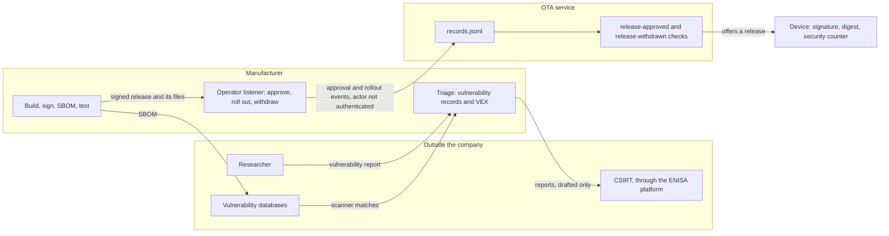

# Tier 9: Manage dependencies, vulnerabilities, and support

## Scenario

Your beacon has a whole life now. It boots only firmware you signed, refuses an older release, survives a failed update, and holds an identity that its owner can renew, transfer and retire. Tier 8 finished that work, and every control in it still runs.

Now a product ships, and it keeps shipping for years.

Harbor Devices, the fictional company that makes your beacon, has just released a new image at security counter 5. It adds one small feature for support engineers: a listener on the local network that answers an `inventory` request with the device's identity and release, and a `reboot` request by restarting the device. The release was built, signed and rolled out with care. Nobody asked who may send those two requests.

A few weeks later an email arrives from a security researcher. It says the listener answers anyone, and that a stranger on the network can restart every device. It also says every version of the firmware is affected. Some of what it says is true and some is not, and the email cannot tell you which.

The listener is not the only thing nobody reviewed. The image contains an operating system, a TLS library, a cryptography library, a bootloader, a Wi-Fi stack and five closed libraries from the chip vendor. The update service is built with a Go toolchain that its supplier has stopped fixing. Nobody at Harbor Devices has written down what the image contains, run a scanner against it, or read the advisories for the libraries in it.

And the law now asks for this work. Since 11 September 2026, the EU Cyber Resilience Act, the CRA, has required a manufacturer to report an actively exploited vulnerability and a severe incident within hours, not weeks. From December 2027 it also requires a support period, user information, and vulnerability handling with evidence behind it.

None of this is a single attack. It is the work a manufacturer does for as long as the product is on the market: know what you ship, triage what is reported, fix it through the release path you already trust, take the vulnerable release out of circulation, and tell the right people in time.

You will do that work. You will generate a software bill of materials for the firmware and the service, scan both against pinned vulnerability databases, and triage every match into a vulnerability record. You will reproduce the reported flaw on your board, withdraw the vulnerable release, and ship a Remediation release at counter 6 through a Release approval and a canary rollout. You will write the disclosure policy, the support statement and the user information. You will run two Article 14 reporting exercises on a Scenario clock.

At the end you will have a board on counter 6 that no longer answers strangers, a vulnerability record for every scanner match, and a release that links to its source, SBOM, tests and approval. You will also have a set of CRA records that say clearly what they do not prove.

## Learning result

After this tier, you can:

- Generate an SBOM for firmware and for a service, and say which components it describes well, which it cannot identify, and which it lists but the image does not contain.
- Scan an SBOM against a pinned, dated vulnerability database, and triage each scanner match into a vulnerability record with a justification you checked in the build.
- Name three kinds of vulnerability that no scanner can report, with an example of each from your own build.
- Write OpenVEX statements that a scanner applies, and show the reviewed matches leave the results.
- Reproduce a reported vulnerability on the device, and find the false claim in the report.
- Withdraw a vulnerable release, explain what a device still running it sees, and ship a Remediation release through a Release approval and a canary rollout.
- Show that the service refuses an unapproved release, a changed artifact and a withdrawn release, and say which party never checks any of them.
- Draft a Coordinated vulnerability disclosure policy, a support statement and user security information for the Reference product.
- Work out the awareness time and every reporting deadline for an actively exploited vulnerability and for a severe incident, from a Scenario clock.
- State plainly that your evidence does not show CRA conformity, and say why.

## Safety boundary

Run everything against your own Reference product, your own update service and your own board, on the isolated lab network. Use only disposable course credentials, keys and images.

The attack fixture sends one datagram to your board, at the address you record for it. Record only your own board's address. The `reboot` request restarts the board, so the fixture sends it only when you name it.

Harbor Devices Ltd, its addresses and its customers are fictional. Every email address on this page ends in `.example`, which no real mail server serves. The two Article 14 exercises produce drafts only. Never submit anything to ENISA's Single Reporting Platform or to any CSIRT, and never send a course draft to a real authority or a real researcher.

The records you write in this tier are course evidence. They do not show CRA conformity, and they are not a legal determination.

Several steps cannot be undone, and each is explained again before its command.

- Installing counter 5, and later counter 6, raises the lowest security counter your board will accept. From counter 6 the board refuses every earlier release over the air, including Tier 8 and the vulnerable counter 5. Repeating the tier from Tier 8 needs a serial flash, as Tier 8's Safety boundary describes.
- A Release approval is written once for each release. If you build, sign, describe or test a release again after approving it, the service refuses its rollout because a file changed, and a second approval is refused too. Approve a release only when you have finished building it.
- A Release withdrawal is permanent. The service never offers that release again.

`./course scan setup` downloads one file of 182 MB from Anchore, the company that publishes the grype scanner. It is the only large download in the required work, although the toolchain fix in section 9 may fetch one Go release. The optional live scan reaches the internet as well, and its result is never the one your triage is graded against.

One rule holds for the whole tier: a Tier 8 image never stands in for the vulnerable release. Tier 9 has its own firmware application at counter 5 and counter 6, and every board row comes from it.

## Starting state

You need:

- A [Tier 8](../tier-08-credential-lifecycle/index.md) board: claimed by an Owner of your own, `active`, running its confirmed Tier 8 image at security counter 4.
- The local OTA service, the course provisioning station and the isolated course network.
- The Tier 8 Security evidence pack.
- A clean working tree. Commit your changes before you build a Tier 9 release, because the service refuses to approve a release built from a tree with uncommitted changes.

The [course landing page](../../index.md) carries the environment setup, the glossary and the list of every tier, if you need to go back to any of them.

The board in these captures is `beacon-t08c-206ef1170d64`, claimed by `harbor-owner`. It was put back on Tier 8 by a serial flash for the capture, because it had already run counter 6 while the tier was being built. You arrive from Tier 8 and need no flash. Your device identifier, digests, serial numbers and times will all differ from the captures, and you use your own in every command.

Start the service in Tier 9's mode, from the repository root:

```text
./course service start --https --mutual-tls --release-approval
```

`--release-approval` turns on the service's approval check for the Fleet baseline. The Fleet baseline is the release the service offers a device that no rollout covers, which is normally the release the device already runs. Then watch the board with `./course device logs`, and keep it running for the whole tier.

Expected result on the board: it keeps polling on its Operational identity and refuses its own release, because it already runs it.

```text
ota.assignment release_id=tier-08-credential-lifecycle version=0.8.0-credential-lifecycle image=tier-08-credential-lifecycle.bin
ota.assignment it also claims size=832900 sha256=4190bc80224241b78da83bdfab5de0fd3a4e69f1d869433b1adf04cd4d5d1a49
ota.assignment this device believes neither; they are the service's claims
ota.assignment about itself. Only release_id is used, to know what to ask about.
ota.refused check=already-confirmed release_id=tier-08-credential-lifecycle
ota.refused this device confirmed that image and is running it
```

**Check the Fleet baseline whenever you run `./course setup` again.** Setup writes the Fleet baseline back to Tier 0. You may need setup during this tier, because the Course environment marker expires. The capture board was then offered the Tier 0 release, asked for its manifest, and installed nothing:

```text
ota.assignment release_id=tier-00-baseline version=0.0.0-insecure image=tier-00-baseline.bin
ota.assignment offers tier-00-baseline instead of the running tier-08-credential-lifecycle; asking for its signed manifest
refused check=none status=404 path=/v1/releases/tier-00-baseline/manifest
```

Nothing broke, and nothing on the board looks wrong unless you read these lines. Put the right baseline back. Before the remediation rollout completes, that is Tier 8, with `./course release assign --tier 08 --variant baseline`. After it completes, it is the remediation, with `./course release assign --tier 09 --variant remediation`.

Every control from Tier 8 still holds. What is missing is any record of what the firmware contains, any review of the vulnerabilities in it, and any way to take a release back once it has gone out.

## Weakness ledger before the work

Inherited from Tier 8. Not your own work yet.

| Identifier | Weakness | Attack vector | Expected result | Planned treatment |
| --- | --- | --- | --- | --- |
| T2-W-09 | The device has no clock and checks no dates on a certificate it is shown | Present an expired certificate to the device | The device accepts it | Accepted for the core course: device time is evidence, not an authorization input (section 7), as RFC 8995 section 2.6.1 allows a clockless device |
| T3-W-10 | The bootloader itself is unverified | Nothing checks MCUboot before it runs | The bootloader runs whatever is there | Advanced Tier A |
| T3-W-11 | The Release signing key lives on the same machine as the build and the service. One key signs the image and the manifest, so taking it defeats both | Sign anything with the release key | Both verifiers accept it | Accepted for the core course: custody is a limit of a one-machine lab. Rotation in Advanced Tier A, section 6 |
| T4-W-12 | Downgrade prevention does not protect the first install | Install onto a device whose primary image carries no counter | The install is accepted | Accepted for the core course |
| T4-W-13 | The security counter is compared, never remembered | Rewrite the primary slot | The device forgets what it was running | Advanced Tier A |
| T5-W-14 | A power cut during the health window forces a revert indefinitely | Power-cycle during the sixty second window | The device reverts each time | Residual availability risk |
| T5-W-15 | The watchdog depends on a driver quirk an upstream fix would change | Upgrade Zephyr | The behavior changes silently | Recorded limit |
| T5-W-26 | A revert is reported once and nothing acknowledges it, so a board that restarts before it reaches the service never reports that revert | Revert with the service stopped, then restart the board before you start the service | The service never receives the revert report | Recorded limit. No later tier builds acknowledged delivery |
| T6-W-16 | The Secure Storage encryption key is a hash of public values, and a destroyed key stays decryptable in flash | Dump the flash and run the published derivation | The private key is recovered | Advanced Tier B |
| T6-W-17 | Stored records carry no freshness, so an older copy is accepted as authentic, and an older record rewinds the Time floor | Write back a superseded record from the same dump | The device accepts it | No tier on this course closes it |
| T6-W-18 | The private key is protected at rest only | Privileged firmware, the application, or a debugger reads it | The key is reachable | Advanced Tier B |
| T6-W-19 | The AES-GCM nonce is drawn once per boot while the record key never changes | Draw the nonce before the RF subsystem is up | The guarantee weakens | Recorded limit |
| T6-W-27 | The Wi-Fi passphrase is compiled into every image this course builds | Read the strings of any image you built | The passphrase is readable | Recorded limit |
| T7-W-20 | Authorization lifetime is enforced by the service. The device judges only its own Operational certificate, against the Time floor, and cannot see an expiry later than the last release it verified | Cut the device off and let its certificate expire after that release | The device keeps presenting a dead certificate | Accepted for the core course |
| T7-W-21 | The Owner credential is a bearer token. Its holder can revoke and transfer the owner's devices without touching them | Present a copied Owner credential | The service accepts it | Accepted for the core course: the operator is the lab host's user |
| T7-W-22 | With `--mutual-tls` the service holds a certificate authority signing key, so compromising the service mints devices | Take the service and its key | Certificates the service accepts | Residual risk with an owner |
| T7-W-23 | The claim endpoint is an oracle. Distinguishable refusals reveal whether a device exists and whether it is owned | Approve a claim for a device you do not own | The refusal says the device is owned | Accepted |
| T7-W-24 | The Factory credential reopens the claim path until the board is decommissioned, and its key survives on the board until a verified erase | Press the button on a claimed device | A Claim window opens | Accepted |
| T7-W-25 | Synthetic devices land in the real manufacturing record with no marker field. The naming convention is the only sign | Read the record | Fixture devices look like real ones | Recorded limit |
| T8-W-28 | A pre-Tier-6 image at an equal security counter erases a Tier 6 or Tier 7 board's identities | Install a Tier 5 image on an enrolled Tier 7 board | The identities are gone | Closed for Tier 8 boards by counter 4. Open for Tier 7 boards |
| T8-W-29 | Whoever holds the Release signing key can end every Operational credential by dating a manifest in the future | Sign a manifest dated far ahead | The device refuses its own certificate from then on | Kept separate from `T3-W-11` |
| T8-W-30 | The station trusts the firmware's own MAC report at enrollment | Report another board's MAC | The station records the wrong board | Recorded limit. `esptool read-mac` is the stronger source |
| T8-W-31 | A copied Operational key can renew onto a fresh key, and whichever copy renews first keeps the identity | Renew from the copy before the genuine device does | The genuine device is refused until the owner recovers it | Residual risk with an owner |
| T8-W-32 | A transfer names no recipient, so whoever next presses the button with any Owner credential becomes the owner | Claim a transferred board with any Owner credential | The claim succeeds | Accepted. The press is the binding |
| T8-W-33 | A warm reset leaves key material in readable SRAM | Dump the SRAM over the USB cable in download mode | The public halves of the keys are readable | Recorded limit |

No row here is the subject of this tier. Every row above is a weakness in a control, and Tier 9 adds no control to the device. Its weaknesses are in the work around the product: what nobody wrote down, what nobody reviewed, and what nobody can take back. The first of them, `T9-W-34`, arrives with the counter 5 release you install in the next section. `T7-W-22` comes back as the severe incident in the second reporting exercise, and `T3-W-11` decides how much a Release approval is worth.

## Predict

Before you run anything, write down your answers. These five questions are about the whole tier rather than one attack, and the Reveal section, after Test bypass attempts, answers all five.

1. The grype scanner reports 28 matches against the counter 5 firmware. How many of them do you expect to be real vulnerabilities in this image?
2. Which vulnerabilities in this firmware do you expect no scanner to report at all, and why?
3. You approve a release, and the service records the approval. Which party checks that record before a release is installed: the service, the device, or both?
4. You withdraw counter 5 while your board is running it. What does the board run afterwards, and what is it offered?
5. After counter 6 is installed, the attack fixture gets no answer from the listener. Is that enough evidence that the listener is gone?

## Ship the support-listener release

The vulnerability report is about counter 5, so your board must run counter 5 first. This section is what Harbor Devices did before anyone reported anything. It uses the release path you will rely on later for the fix: build, sign, describe, test, approve, and roll out to a Canary group before the rest of the fleet. Section 9 examines each of those checks. Here you only use them.

### Prepare the fleet

A rollout offers a release to a Canary group first, then to every other claimed, active device. Your board is the only real device, so it is the canary. The rest of the fleet is four synthetic devices that the course enrolls and claims on the host. They hold real Factory and Operational identities, obtained through the station and real claims, owned by a separate account, `beacon-fleet-ops`. They poll the service over mutual TLS and print the release it offers each of them. They never download or install anything.

On the host, from the repository root:

```text
./course fleet enroll
./course fleet baseline
./course fleet poll
```

`enroll` gives `beacon-fleet-e9-01` to `beacon-fleet-e9-04` their identities. `baseline` has each one report the release the service offers it as its running release, which makes the service count it `active`. `poll` asks the service what it offers each device. Expected result: every device line is marked `HOST`, and all four devices are offered the Tier 8 release your board runs. The last lines are always these:

```text
Result: the release offered to each synthetic fleet device (HOST).
A host result never stands in for a device result: the board is the canary,
and only the board can show a release installing or being refused.
```

That sentence is the rule for every fleet row in this tier. A fleet line tells you what the service decided. Only the board tells you what a device did with it.

### Build, sign and describe counter 5

Build the counter 5 image and sign it:

```text
./course build firmware --tier 09 --variant support-listener
./course release sign --tier 09 --variant support-listener
```

Signing stores the release and publishes nothing. Every earlier tier published a release as it signed it. From Tier 9 the command says so itself:

```text
From Tier 9 a signed release is not an offered one. It reaches a device only
after it is described, tested and approved, and then through a rollout:
```

Describe it. A software bill of materials, or SBOM, is a machine-readable list of the components a piece of software contains, with a version and an identifier for each. The course writes SBOMs in CycloneDX 1.6, a JSON format that the German BSI's guideline TR-03183-2 accepts.

```text
./course sbom firmware --tier 09 --variant support-listener
./course sbom service
```

`sbom firmware` writes three files beside the release: the firmware SBOM, which describes the signed image, a second SBOM for the bootloader that ships, and a build manifest. The build manifest records the source revision, whether the tree was clean, the commit of every Zephyr module, and the hashes of every output, including the signed image. It is the only file that ties an SBOM to the bytes that are flashed. `sbom service` builds the OTA service with the toolchain it shipped with and writes its SBOM. Expected result: the firmware SBOM lists 11 components, the bootloader SBOM lists 4, and the service SBOM lists 1. Section 7 reads all three.

### Test and approve it

```text
./course release test --tier 09 --variant support-listener
```

The test runs eleven checks on the host. They check that the release's files agree with each other: the manifest's signature, digest, counter and release identifier, the build manifest's clean-tree flag and image hash, and the SBOM's top component, purls and backport record. It is not a test of the device. Its report says so in its own `scope` field, and the canary stage is the device test. Expected result: eleven `pass` lines and `Result: tier-09-support-listener passed every pre-release check`.

If you want to run row `E-9-07`, do it now, before this release's only approval. Make a small change to any tracked file without committing it, then build, sign, describe and test counter 5 again. Expected result: `sbom firmware` prints a note that the tree had uncommitted changes, the test reports `FAIL` for `build-manifest-clean-tree`, and `release approve` refuses locally and sends nothing. Undo the change, then build, sign, describe and test once more from the clean tree before you continue.

Now approve it. A Release approval is the manufacturer's recorded decision that one release, identified by the digests of its files, may be offered to devices. Approve only when you have finished building, because an approval is written once:

```text
./course release approve --tier 09 --variant support-listener --approver <your name>
```

The command checks locally that all six linked files exist and that the test passed, prints the request it sends, and posts it to the operator listener. The service then computes the SHA-256 of the image, the manifest, the signature, the build manifest, the SBOM and the test report from its own copies, and appends a `release.approved` line to `records.jsonl` with those six digests. Expected result: six digest lines and `Result: tier-09-support-listener is approved by <your name>`, then:

```text
The service computed those digests from its own store. A file changed after
this moment is refused by name when a rollout of this release starts or moves on.
```

On the capture service this approval was recorded at `2026-09-30T23:16:35Z`, while the tooling was being validated, and the campaign did not rebuild the release afterwards. A second `release approve` was refused with `409` at check `first-approval`. That is `E-9-01`.

### Roll it out to the board as the canary

Record your board's address first. The attack fixture later reads it from course state and never from its own command line. Read it from the board's console, the `wifi.address` line, and pass it here:

```text
./course device address <the board's address>
```

Then start the rollout with your board as the only member of the Canary group:

```text
./course rollout start --tier 09 --variant support-listener --canary <your device id> --actor <your name>
```

`--actor` is required, and it is a name you state. Nothing checks it. Expected result: the command prints its request, then `Result: tier-09-support-listener is offered to the Canary group:` and your device identifier. Run `./course fleet poll` again. The four synthetic devices are still offered the Tier 8 release.

Your board takes the release on its next poll. The capture's serial log missed this install, so here is the service's record of it instead. On 1 October 2026 the service wrote `rollout.started` at `16:42:43Z` and `rollout.served` for the board, at stage `canary`, at `16:43:29Z`. It recorded the board's `update.installed` at `16:44:10Z` and `update.confirmed`, with the detail `health gate passed`, at `16:45:38Z`.

On your own console, look for the same sequence the Remediation release prints in section 9: the release admitted at `counter=5`, the image hashing to the signed digest, MCUboot printing `counter=5`, the health gate, and `trial.confirm`. Then two lines that no earlier tier printed:

```text
support.listener listening on UDP 7700 for inventory and reboot
support.listener it asks no one who they are (T9-W-34)
```

When the canary is confirmed, offer the release to the rest of the fleet:

```text
./course rollout advance --actor <your name>
./course fleet poll
```

Expected result: all four synthetic devices are offered `tier-09-support-listener`, and `./course rollout status` shows `stage fleet` with the four fleet devices and your board as served. Leave the rollout open. Harbor Devices has shipped counter 5 to its whole fleet.

## Reproduce the vulnerabilities nobody reviewed

### Look before you act

This is the email Harbor Devices received. It is the prepared vulnerability report for this tier. A vulnerability report is a claim to be triaged, not a finding, so read it the way you would read a scanner's output: as something to check.

> **From:** an independent security researcher, `researcher@mail.example`
>
> **To:** `security@harbor-devices.example`
>
> **Date:** Tuesday 2 March 2027, 10:15 UTC
>
> **Subject:** Unauthenticated inventory and reboot on UDP port 7700
>
> Hello. I found that your status beacon answers two one-word requests on UDP port 7700, from any address, with no authentication. If I send `inventory`, the device answers with its device identifier, its running release and its security counter. If I send `reboot`, the device restarts at once.
>
> I tested one device that I bought for this purpose, on my own network. It was running the release with security counter 5. I believe all versions of your firmware are affected.
>
> I plan to publish my findings in 90 days. I am happy to wait longer if you need more time to ship a fix. Please tell me when you have received this message.

The report gives an affected release, a port and two requests. It contains no script, so reproducing it is your work, with the course's attack fixture. It also contains one claim you can already test without sending anything: "all versions". Your Tier 8 board's boot log never printed a `support.listener` line. Keep that in mind for the vulnerability record.

The fixture is registered, so it shows its plan before it acts. Run the dry run:

```text
./course attack run tier-09/support-listener --request inventory
```

The dry run reads the recorded board address and prints the plan: send one line, the named request, to the support-listener UDP port, and print exactly what was sent and what came back. It sends nothing.

The reported flaw is one of three things nobody reviewed. The other two are in the files you have already generated, so read those first.

### Read what the build contains

Open the firmware SBOM, `artifacts/generated/releases/tier-09-support-listener.firmware.cdx.json`. The course builds it from what was actually compiled and linked: the modules whose sources appear in the build's compile commands, plus the Espressif libraries the linker pulls in. On the capture build it lists 11 components: Zephyr 4.4.2, MCUboot 2.4.0, hal_espressif at commit `f0746505…`, the Espressif fork of `wpa_supplicant` 2.10, Mbed TLS 4.1.0, TF-PSA-Crypto 1.1.0, and five closed Espressif libraries, `libcore`, `libmesh`, `libnet80211`, `libphy` and `libpp`.

Each component carries up to two identifiers. A CPE is the name the US National Vulnerability Database, NVD, files advisories under, and grype matches C components only through it. A purl, or package URL, names where the component comes from, and an OpenVEX statement binds to a component only through its purl. Zephyr has both. Mbed TLS and TF-PSA-Crypto carry a second CPE as well, because NVD files Mbed TLS under two vendor names.

Now look for the property `course:identity-gap`. Seven components carry it. MCUboot has a CPE that matches nothing, because no vulnerability database holds a product called MCUboot. hal_espressif has only a commit as its version, and nothing says which ESP-IDF release it derives from, so no ESP-IDF advisory can be matched to it. The five closed libraries have no CPE at all. They are the Wi-Fi stack. An advisory about them could exist today, and no scanner could ever tell you.

Open the bootloader SBOM next, `tier-09-support-listener.bootloader.cdx.json`. It lists 4 components: Zephyr, MCUboot, hal_espressif, and TinyCrypt 0.2.8. TinyCrypt is the library that verifies every image signature in the bootloader you ship, and it is vendored inside MCUboot with no CPE and no repository of its own. The most security-critical code in the bootloader is the code a scanner can see least.

Notice what the bootloader SBOM does not list: Mbed TLS. Zephyr's own SBOM tool, `west spdx`, does list Mbed TLS 4.1.0 as a bootloader dependency, with a CPE, as the course's research found in [issue #266](https://github.com/tkEmLogic/learning-cyber-security/issues/266). Not one Mbed TLS file is compiled into that bootloader. `west spdx` lists the modules the build could see, not the ones it used. A scanner reading that SBOM would raise every Mbed TLS advisory against a bootloader that contains none of it. You can prove the absence yourself: the bootloader build's `compile_commands.json`, in the directory ending in `-bootloader` under the Zephyr workspace's `build` directory, names no Mbed TLS source.

Last, the service SBOM, `artifacts/generated/sbom/ota-service.cdx.json`. It lists one component, `pkg:golang/stdlib@1.24.0`. The OTA service has no third-party Go module at all, so its whole inventory is the Go standard library, at the version of whichever toolchain built it. Remember that version. You will meet it again in a moment.

### Read what the scanners report

The course scans offline, against databases pinned in `course.yml`, so every Learner triages the same matches on any day. The Go vulnerability database is committed to the repository. The grype database is a 182 MB archive, version `v6.1.9`, built `2026-09-29T06:32:31Z`, that `./course scan setup` downloads once, checks against the SHA-256 in `course.yml`, and imports into your user cache, where it takes about 3.1 GB.

```text
./course scan setup
```

**The archive lives on Anchore's server, and that is a risk the course carries.** Nobody knows how long Anchore keeps an old database at that address. If the download fails, find a copy of the same file and pass it with `./course scan setup --archive <file>`. The command checks it against the same SHA-256, so a wrong file is refused. If no copy exists any more, scan with `--live` and treat the result as a dated comparison: write down the database date, and do not expect it to match the triage key. The URL in `course.yml` is the one place a maintainer changes if the course hosts its own copy.

Scan the firmware:

```text
./course scan firmware --tier 09 --variant support-listener
```

The capture's result:

```text
Matches: 28 (13 High, 14 Medium, 1 Low)
```

Twenty-six are Zephyr advisories and two are `wpa_supplicant` advisories. There is no match for Mbed TLS or TF-PSA-Crypto. Thirteen High looks like a product in trouble. Write the number down and do not believe it yet.

Scan the service:

```text
./course scan service
```

It runs two scanners. govulncheck, the Go project's own scanner, reads the service's source and reports which vulnerable functions the code can actually reach. grype reads the service SBOM, as a customer's scanner would. The capture's result from govulncheck:

```text
31 vulnerabilities reachable from the service's code, 7 more in imported packages but not called, 15 more in required modules only
```

And from grype:

```text
Matches: 53 (2 Critical, 25 High, 24 Medium, 2 Low)
```

Both scans use the same Go release, go1.24.0, because the command sets `GOTOOLCHAIN=go1.24.0`. Without it, a machine with a newer Go would scan its own standard library and report nothing, which is the wrong answer about the service that shipped. The service's `go.mod` says `go 1.24` and names no toolchain, so the standard library inside it depends on which machine built it. Go 1.24 no longer receives security fixes. The difference between 53 and 31 is what reachability analysis is worth: 22 matches are real advisories against code the service never calls.

You now hold 81 scanner matches, and nobody has reviewed one of them.

### Take an inventory without asking

Back to the report. The listener runs on the board, so the request crosses the lab network to it. Send the inventory request:

```text
./course attack run tier-09/support-listener --request inventory --execute tier-09/support-listener
```

The fixture sends one datagram, `inventory`, to UDP port 7700 at the board's recorded address, and prints the reply exactly as it arrived:

```text
"device_id=beacon-t08c-206ef1170d64 release_id=tier-09-support-listener security_counter=5\n"
```

The board's own console says what it did:

```text
support.inventory answered 192.168.68.77:48075, unauthenticated
```

The sender proved nothing about who it was. It did not present a certificate, a token, or even an address the board had seen before. The board gave its device identifier, its release and its security counter to the first datagram that asked. Outside the lab, that is a fleet that tells anyone on the customer's network exactly which devices run the vulnerable release. This is `T9-W-34`, and section 9 closes it.

### Restart the board without asking

Now the request that does damage. Expect the board to restart.

```text
./course attack run tier-09/support-listener --request reboot --execute tier-09/support-listener
```

The fixture got `"rebooting\n"` back. The board:

```text
support.reboot requested by 192.168.68.77:53210, unauthenticated; resetting now
ESP-ROM:esp32c6-20220919
Build:Sep 19 2022
rst:0x3 (LP_SW_HPSYS),boot:0xc (SPI_FAST_FLASH_BOOT)
```

`rst:0x3` is a software reset, requested by the board's own code. The board then boots counter 5 again:

```text
I: course: slot=primary header=ok tlv=ok signature=present key=match counter=5
Running release: tier-09-support-listener
Security counter of the running image: 5
TF-PSA-Crypto is Zephyr's 1.1.0 as pinned, without the CVE-2026-50583 fix.
support.listener listening on UDP 7700 for inventory and reboot
support.listener it asks no one who they are (T9-W-34)
```

Read the fourth line. Counter 5 tells you about a second vulnerability on its own console, one that no scanner raised. You will meet it in the triage.

The beacon is non-actuating, so a restart costs a few seconds of status. A product that controls something would lose control for those seconds, as often as an attacker sends a datagram. Every signature check, counter and certificate from Tiers 2 to 8 passed while this happened. None of them was asked, because the listener was a feature, shipped on purpose, through the release path that all of those controls protect.

### What the attacks share

Nothing here broke a control. Each attack used something nobody reviewed. The SBOM showed components that nothing can identify. The scanners produced 81 matches that nobody had triaged. The release added an interface that nobody had threat-modeled, and the report about it carries a claim that nobody has checked.

Record four things: the component count of each SBOM and the seven identity gaps, the three scan counts, the inventory reply and the reset on your own console, and the report's claim about affected versions. You will need all four in the triage.

## Investigate the missing boundaries

Answer these before you change anything:

1. A scanner reports that Zephyr 4.4.2 is affected by an advisory. What would you need to read to know whether this image is affected?
2. A component has no CPE. Who could ever tell you about a vulnerability in it?
3. The service records a Release approval. Who reads that record, and who never does?
4. Anyone on the lab network can reach the operator listener. What can they do there that the Release signing key still stops?
5. You withdraw a release. What happens to a device that already runs it, and to one that never polls the service again?
6. When does a report from a researcher start a legal deadline, and what would?

The boundaries in this tier are between parties who make claims and parties who decide.



A scanner match and a vulnerability report are both claims from outside. Neither is a finding until someone triages it against the build, and that someone is the manufacturer. The scanner decides nothing, and it cannot see what has no identity in its database.

Inside the manufacturer, the boundary that matters is the operator listener. It is protected by the listener boundary and the Course environment marker header, and by nothing else: it has no identity. Whoever reaches it can approve, start, pause, advance, complete or withdraw, and the record names whatever actor they state.

The service is the only party that reads a Release approval. It refuses to offer a release without one, or a release whose files changed after it, or a release that was withdrawn. The device never sees the approval. It decides exactly what it decided in Tier 5: whether the manifest's signature verifies with the key compiled into it, whether the image matches the signed digest, and whether the security counter is not lower than its own. That is why an approval cannot make a release the device trusts, and why a forged approval cannot either.

Four parties hold the responsibilities here. The manufacturer triages, approves, rolls out, withdraws and reports. The service enforces the approval and the withdrawal, and it is the only party that can. The device accepts only what the Release signing key signed at a counter it has not passed. And the customer keeps the device connected, because a device that never polls never receives a fix.

## Triage what the scanners found

Triage turns a scanner match into a decision. Each match becomes a vulnerability record: the manufacturer's record of one vulnerability, with its triage, affected versions, reproduction, decision and remediation. Triage has four outcomes: `affected`, `not affected`, `under investigation` and `fixed`. A `not affected` record always needs a justification that you checked in this build.

Copy the templates first, from the repository root:

```text
mkdir -p evidence/learner/tier-09
cp evidence/templates/tier-09/*.md evidence/learner/tier-09/
```

### Write a vulnerability record for each row

Open your copy of [the vulnerability records](../../../evidence/templates/tier-09/vulnerability-records.md). It holds eleven records. You triage `VR-01` to `VR-09`. `VR-10` and `VR-11` arrive already triaged, and you check their reasoning against the build yourself. The remaining scanner matches arrive triaged in the Mentor material, and your Mentor will ask you to check one or two of them at the gate.

For every record, work through three questions in order, and write down the evidence for each answer:

1. **Is this version affected, by the supplier's own range?** Zephyr publishes advisories with affected ranges, and so does Mbed TLS. NVD often records a range such as "before 4.5.0" when the supplier fixed the issue in 4.4.1 or 4.4.2. A database range and a supplier range can disagree, and when they do, write both.
2. **Is the vulnerable code in this image?** The build's `.config` says which Kconfig options were set, and the link map says which functions were linked. An advisory about Bluetooth, userspace or IPv6 cannot affect an image that never built them.
3. **Can it be reached, and by whom?** Code that is present may still need an attacker who can already write the flash, or a feature the device never uses.

Two kinds of answer come up again and again. Many matches are false because a database range misses a supplier's backport. Others are true by version, but the code is not in the image. Neither kind is "affected", and neither can be decided from the scanner's output alone. A rarer third kind is affected and still not urgent, because the attacker it needs already owns the board. Affected is a statement about the code, and urgency is a separate decision.

`VR-06` and `VR-07` are different: no scanner raised them. You find them by reading the supplier advisories for the components your SBOM lists. `VR-06` is CVE-2026-50583, a one-byte read past the end of a buffer in TF-PSA-Crypto's parsing of an ECC public key. The device parses the server's public key in every TLS handshake, before it has decided to trust the server. Counter 5 told you on its console that it lacks the fix. Mbed TLS published the advisory on 7 July 2026, with the fix in TF-PSA-Crypto 1.1.1, and Zephyr's fork still pins 1.1.0. NVD had not processed the advisory when the database was built, so there is no CPE range for grype to match.

`VR-08` is one record for the whole group of Go matches. One cause, an unsupported toolchain, and one fix cover all 31 reachable ones.

`VR-09` is the support listener. Its source is the researcher's report, and its scanner field reads `no match possible`, because it is Harbor Devices' own code and no database can hold it. Check the report's claim about affected versions here. Tier 8 at counter 4 never printed a `support.listener` line, and the listener exists only in an image built with `CONFIG_COURSE_SUPPORT_LISTENER` set. Write the affected versions you can prove, not the ones the report asserts.

Those are the three things no scanner can see, and this build has a real example of each: the manufacturer's own code, components with no identity in any database, and advisories that the database has not processed yet. A clean scan is not a clean product.

### Export the decisions as OpenVEX

A VEX statement is a machine-readable statement of whether one product version is affected by one vulnerability, and why not if it is not. OpenVEX is one format for it, and grype reads it. Your vulnerability records hold the reasoning. The VEX document exports only the decisions, so that the next scan shows only the matches nobody has reviewed.

Open your copy of [the OpenVEX statements](../../../evidence/templates/tier-09/openvex-statements.md). Write one statement for every firmware record whose outcome is `not affected` or `fixed`, and save the JSON as `evidence/learner/tier-09/firmware.openvex.json`.

**The product in each statement must be the component's purl, copied exactly from the SBOM.** For Zephyr that is `pkg:github/zephyrproject-rtos/zephyr@v4.4.2`, with the `v`. grype binds a statement to a component only through an exact purl match. A statement that names a CPE, or a purl with a different version string, suppresses nothing and prints no warning. The course's research found a worse case of the same problem: a CycloneDX SBOM that gave Zephyr the component type `operating-system` made grype skip Zephyr entirely, with no message, which is why the course SBOM gives it the type `library`.

govulncheck can also write OpenVEX, and `./course scan service` saves its document as `artifacts/generated/sbom/ota-service.govulncheck.openvex.json`. Do not rely on it. When the course tested it, it bound nothing in grype: it names the product as an unknown product and spells the standard library `pkg:golang/stdlib@v1.24.0`, with a `v` the service SBOM does not have. A VEX document is only as good as its match to the SBOM, so you write it by hand against the SBOM's own purls. Row `E-9-18` lets you see this for yourself.

The replay in section 10 reruns the scan with your document.

### Fix the Unsupported component

An Unsupported component is one whose supplier no longer publishes security fixes for the version in use. Go 1.24 is one. It is affected by every later Go advisory, whether or not a scanner reports it, so triaging its 31 reachable matches one by one would miss the point. The fix is to build with a Go release that its supplier still fixes.

This is your fix to make, in your own fork. The course ships go1.24.0 on purpose so that you meet the finding.

1. Choose a Go release that still receives security fixes. The Go release policy, linked in the references, says which ones do on the day you read it.
2. Add a `toolchain` line naming that release to `go.mod`, below the `go 1.24` line.
3. Change `scanning.go_toolchain` in `course.yml` to the same release. **Both are needed.** The course builds and scans the service with `GOTOOLCHAIN` set to the pinned value, so that every machine describes the service the same way. A `toolchain` line alone changes nothing the scan sees.
4. Commit both changes, because `./course sbom service` refuses a binary whose recorded source revision is not your checkout's `HEAD`.
5. Run `./course sbom service`, then `./course scan service`.

If the release you chose is not already in your Go module cache, the `go` command downloads it, which needs the network once.

The course did not capture this rescan, because it is your change. Look for three things in your output. The first step's note names the release you chose, not go1.24.0. The service SBOM names that release in its purl. And the count of reachable vulnerabilities is what the pinned database holds for that release. When the course's research scanned the service with Go 1.26.8, govulncheck reported nothing reachable. Then update `VR-08` from `affected` to `fixed`, and name the commit that fixed it.

## Withdraw the vulnerable release and ship the remediation

The listener is affected, confirmed, and on every device in the fleet. Two acts answer it, and they are separate on purpose. A Release withdrawal stops the vulnerable release from being offered. A Remediation release, a signed release at a higher security counter, moves devices off the vulnerable version through the ordinary release path. Neither one is a patch to a running device, and the device trusts neither more than it trusts any other signed release.

### Withdraw counter 5

A withdrawal is permanent, and it names the vulnerability record it answers. Use the identifier of your record for the listener:

```text
./course release withdraw --tier 09 --variant support-listener --reason VR-09 --actor <your name>
```

The capture's answer:

```text
Result: tier-09-support-listener is withdrawn and will never be served again
Its open rollout is closed.
A device already running it is offered the Fleet baseline, which it refuses as a
rollback, until a rollout of a fix reaches it. That gap is the fix not yet available.
```

Run `./course fleet poll`. Expected result: all four synthetic devices are offered the Tier 8 release again, which is the Fleet baseline.

Now try to bring the withdrawn release back, both ways. A rollout start of `support-listener` and a baseline `./course release assign --tier 09 --variant support-listener` were each refused with `409` at check `release-withdrawn`. The service's reason is that the release `has been withdrawn, and a withdrawn release is never offered again`. Those are `E-9-04` and `E-9-05`. Withdrawal wins over the approval: the release still has its `release.approved` line, and it makes no difference.

### See the gap on the board

Your board still runs counter 5. The service now offers it the Fleet baseline, Tier 8 at counter 4. Read what the board does with it:

```text
ota.assignment offers tier-08-credential-lifecycle instead of the running tier-09-support-listener; asking for its signed manifest
ota.manifest fetched 517 manifest bytes and a 70 byte detached signature
release.verified signature over 517 manifest bytes, ECDSA P-256 over SHA-256
release.verified nothing has parsed these bytes yet; that is the point
time.floor stays at 2026-09-30T23:16:12Z; release tier-08-credential-lifecycle was created at 2026-09-30T22:29:45Z, which is not later
release.refused check=security-counter
release.refused   compared: the manifest's security_counter 4 against the counter 5 this running image was built with
release.refused   rejected: a release that would take this device backwards, version 0.8.0-credential-lifecycle
release.refused   consequence: no image bytes were requested, and the running image is unchanged
release.refused   note: the bootloader refuses this too, and its refusal is the one that counts
```

The check that ran is `security-counter`, Tier 4's check. It compared the counter in the signed manifest, 4, with the counter the running image was built with, 5, and refused to go backwards. That refusal is correct. It is also exactly why the board stays on the vulnerable release.

This is the fix not yet available. The withdrawal protected every device that had not yet installed counter 5. It did nothing for a device already running it, and it cannot, because the only way off a release is a newer one at a higher counter. Until counter 6 exists, every device on counter 5 keeps answering strangers. That is the window the firewall advice in the first reporting exercise exists for.

### Build the Remediation release

Counter 6 removes the listener entirely. The service already learns each device's release and counter from status events over mutual TLS, so the listener's one useful job was already done elsewhere. Code that is not in the image cannot be reached, which is a stronger answer than adding authentication to it.

Counter 6 also carries the fix for CVE-2026-50583. The fix is upstream TF-PSA-Crypto commit `c99519080`, a check that refuses a zero-length public key before reading it. It applies cleanly to the TF-PSA-Crypto 1.1.0 that Zephyr pins. The course carries it as a West patch under the Tier 9 application, with a SHA-256 in `patches.yml`. The remediation build applies the patch to the shared Zephyr module, builds, and always cleans the module again afterwards, so the tree is patched only during that build. A support-listener build refuses to run on a patched module, so counter 5 can never carry the fix by accident.

```text
./course build firmware --tier 09 --variant remediation
./course release sign --tier 09 --variant remediation
./course sbom firmware --tier 09 --variant remediation
./course release test --tier 09 --variant remediation
```

Expected result: the test passes every check, including `sbom-backport-matches-variant`. The counter 6 SBOM still says TF-PSA-Crypto `1.1.0`, because that is the version in the tree. It records the backport in the component's `pedigree.patches` field, as a patch that resolves CVE-2026-50583. Without that field, your VEX statement that counter 6 is `fixed` would contradict the version a scanner sees. The capture's remediation was built from `main` at source revision `053cddf…`, with `clean_tree` set to `true` in the build manifest.

### Try the side door

The remediation is signed and tested, and it is not approved. Try to make it the Fleet baseline directly:

```text
./course release assign --tier 09 --variant remediation
```

From Tier 9 this command goes through the service's own `PUT /v1/releases/current`, and the service checks that request for an approval. The capture's answer was `409` at check `release-approved`. The service's reason is that the release `has no approval record; approve it on the operator listener before it is offered`. This is `E-9-02`, the side door that this tier closes. Without it, the approval would guard the front of the release path and leave a second entrance beside it.

The command printed the exact request it sent, with the operator listener's address and the `X-Course-Environment-ID` header. The service makes every decision itself, so any client that sends the same request gets the same refusal. If you want to see that, send the same request with `curl`, with the course certificate authority as the trust anchor, as you did in Tier 7.

### Approve, then change one file

Approve the remediation:

```text
./course release approve --tier 09 --variant remediation --approver <your name>
```

Expected result: `200`, and six digests. On the capture, the image digest was `d32c1e3e…`.

Now prove that the approval binds the files and not the name. Change one byte of the test report in the release store, `artifacts/generated/releases/tier-09-remediation.test-report.json`, and keep a copy of the original first. Then try to start the rollout:

```text
./course rollout start --tier 09 --variant remediation --canary <your device id> --actor <your name>
```

The capture changed one byte, which moved the file's SHA-256 from `49df3d47…` to `145c0d47…`. The service refused the start with `409` at check `release-approved`, and named the file:

```text
artifact test_report (tier-09-remediation.test-report.json) has changed since release tier-09-remediation was approved
```

The check compared the SHA-256 it computed from the file now in its store with the SHA-256 it recorded at approval time, and rejected the release because one of six differed. It names the artifact so that an engineer knows which link in the chain broke. That is `E-9-03`.

Put the original file back, byte for byte, and run the same `rollout start` again. Expected result: `200`, and the release is offered to your board alone. Restoring a byte-identical file is not a way around the check. It satisfies the check, because the check is about content, not about who touched the file.

### Roll out to the canary, pause, complete

Your board takes counter 6 on its next poll:

```text
ota.assignment offers tier-09-remediation instead of the running tier-09-support-listener; asking for its signed manifest
ota.manifest fetched 490 manifest bytes and a 71 byte detached signature
release.verified signature over 490 manifest bytes, ECDSA P-256 over SHA-256
time.floor raised to 2026-10-01T16:51:22Z by the signed created_at of release tier-09-remediation
release.admitted release_id=tier-09-remediation version=0.9.1-remediation counter=6 channel=stable
release.admitted created_at=2026-10-01T16:51:22Z supported_until=2031-10-01T16:51:22Z, both signed. created_at
release.accepted sha256=d32c1e3e20def2cf164b2421d52d64f94a65a859eea2c8882b1c4bce4ddc79ce matches the signed manifest
ota.install 833364 bytes are in the secondary slot and hash to the signed digest
```

MCUboot checks it again, swaps it in on trial, and the image boots:

```text
I: course: slot=secondary header=ok tlv=ok signature=present key=match counter=6
Running release: tier-09-remediation
Security counter of the running image: 6
One module is patched in this build: TF-PSA-Crypto 1.1.0 carries the upstream
fix for CVE-2026-50583 (c99519080), applied by west patch for this build only.
```

The health gate passes and the image is confirmed:

```text
health.gate passed
trial.confirm this image is now the one the device falls back to
event.queued update.confirmed release_id=tier-09-remediation detail=health gate passed
```

Then the line this whole release exists to print:

```text
support.listener absent: removed in the remediation release (T9-W-34)
support.listener nothing on this image listens for inventory or reboot
```

And the board reaches the service over mutual TLS, as before:

```text
ota.tls verified ota.course.example at 192.168.68.77:8443, TLSv1.2 TLS-ECDHE-ECDSA-WITH-AES-128-GCM-SHA256, mutually authenticated
```

That handshake is the regression evidence for the CVE-2026-50583 fix. The patched parser read the server's public key and the handshake completed. The course did not send a malformed key to exercise the fixed path itself. Upstream's own tests cover it, and your vulnerability record says which evidence you relied on.

Look at the `supported_until` line too. It reads five years after this release's `created_at`, and counter 5's manifest carried five years after its own. The support statement, under the commitments below, comes back to it.

**Pause the rollout while it is still at the canary stage.** Pause stops new devices from receiving the release, and a device already served keeps it, so a download in progress can resume. At the canary stage you can see both halves. After an advance, every fleet device has been served, so there is nothing left to compare.

```text
./course rollout pause --actor <your name>
./course rollout status
./course fleet poll
```

The capture's status read `stage canary, paused`, with only the board as served. The board kept being offered counter 6, which it already runs:

```text
ota.assignment release_id=tier-09-remediation version=0.9.1-remediation image=tier-09-remediation.bin
ota.refused check=already-confirmed release_id=tier-09-remediation
ota.refused this device confirmed that image and is running it
```

The fleet, polled from the host, was offered the Fleet baseline. Try to advance while paused. The capture's answer was `409` at check `rollout-running`, and the service's reason says the rollout `is paused; resume it before advancing`. That is `E-9-06`.

Then finish the rollout:

```text
./course rollout resume --actor <your name>
./course rollout advance --actor <your name>
./course fleet poll
./course rollout complete --actor <your name>
./course rollout status
```

After `advance`, all four fleet devices are offered `tier-09-remediation`. `complete` re-checks the six digests, writes the release as the new Fleet baseline, and closes the rollout. Its result says `the release is the Fleet baseline now, and the rollout is closed`. The capture's final status read `No rollout is open. Every device is offered the Fleet baseline.`, with both releases approved and `tier-09-support-listener` withdrawn.

## Write the commitments a manufacturer owes

The release path is fixed. What remains is the paperwork a manufacturer owes, and in this tier every page of it rests on real evidence you just produced. The Reference product is first placed on the market in March 2027 in this course's story. Before 11 December 2027 only Article 14, the reporting duty, applies to it. The rest of these records are engineering practice for that date.

Every record below opens with the same line: "This is course evidence. It does not show CRA conformity, and it is not a legal determination." Keep it. The legal scope of a real product, its class, the manufacturer's role and the conformity route are for product-specific legal review, and the course never decides them for you.

### The Coordinated vulnerability disclosure policy

A Coordinated vulnerability disclosure policy is the manufacturer's public statement of how outside parties report a suspected vulnerability, how the manufacturer responds, and when the vulnerability is disclosed. Write it in your copy of [the CVD policy](../../../evidence/templates/tier-09/cvd-policy.md).

The course has fixed some facts: reports go to `security@harbor-devices.example`, acknowledgement is within 5 working days, and the default disclosure delay is 90 days, which matches what the researcher proposed. You write the rest. Write it so that the researcher who sent this tier's report could have followed it. Article 13(6) of the CRA also asks you to report a component vulnerability to whoever maintains the component, and CVE-2026-50583 is the live case. A promise not to take legal action against researchers is a legal commitment, so mark it for legal review rather than writing it as a promise.

### The support statement and the open finding

The Support period is the fixed span, counted from when the product is first placed on the market, during which the manufacturer handles vulnerabilities and issues security updates free of charge. For the Reference product it ends at the end of March 2032. Each issued security update stays available for at least ten years, or for the rest of the Support period if that is longer. Write the statement a customer reads in your copy of [the support statement](../../../evidence/templates/tier-09/support-statement.md).

Two things in it come directly from this tier. The Unsupported component you fixed belongs in it, as an example of what the Support period depends on. And it must say what happens to a device that never polls the service: it stays on the version it has, including counter 5. That is `T9-W-34`'s residual risk, stated to the people who carry it.

Then read `supported_until` in the counter 5 and counter 6 manifests and compare it with the Support period. The template asks you how it is computed, where, and whether the device checks it. Record what you find as an **open finding**, not as a code change. The device has no trusted clock, and the service must keep serving fixes after the date, so neither of them can refuse anything because a date has passed. The finding is that a signed field reads like a support promise and does not behave like one.

### The user security information

Annex II of the CRA lists what a user must be told. Your copy of [the user security information](../../../evidence/templates/tier-09/user-security-information.md) has one heading per row. The course has filled in the pure product facts, such as the manufacturer's address and the product identification. You write the security rows, in plain words for a customer who runs a small fleet and is not a security specialist. They say how to use the device securely, how updates are installed, when support ends, and how to decommission it. They also carry the firewall advice for UDP port 7700 until a device runs counter 6. Be honest where the product falls short. Annex II asks how to turn automatic updates off, and the Reference product has no way to do it.

### The Annex I control map, the CRA traceability matrix and the Annex VII index

Three records connect your Security evidence pack to the CRA's text. Each one says where the product stands, never that it meets a requirement.

- [The Annex I control map](../../../evidence/templates/tier-09/annex-i-control-map.md) has one row for each of the 22 Annex I requirements. The course has written the requirement text and, where the mapping is plain, the controls from Tiers 2 to 9. You set a status and an evidence link in every row, and you write the mapping yourself in four judgment rows: data minimization, impact on other devices and networks, attack surface, and secure removal of data. Counter 5 is a live failure of the attack surface row, so say what it was and what removed it.
- [The CRA traceability matrix](../../../evidence/templates/tier-09/cra-traceability-matrix.md) has one row for each CRA duty this tier touches, from the risk assessment to the technical documentation. Every row needs a legal source with the date you read it, and a legal-review cell that reads exactly `yes` or `no`.
- [The Annex VII index](../../../evidence/templates/tier-09/annex-vii-index.md) links each item of the technical documentation that Annex VII describes to its place in your evidence pack. It is the only conformity record this course drafts. There is no EU declaration of conformity, because even a blank one reads like a claim of conformity.

The evidence check described in the Security evidence pack section reports a matrix row that lacks any of those three cells.

### Two Article 14 reporting exercises

Article 14 of the CRA has applied since 11 September 2026. A manufacturer that becomes aware of an actively exploited vulnerability in its product, or of a severe incident affecting it, sends an early warning within 24 hours, a notification within 72 hours, and a final report later. The final report's deadline depends on which of the two it is. Reports go to the coordinating CSIRT through ENISA's Single Reporting Platform.

An actively exploited vulnerability is one for which there is reliable evidence that someone has exploited it without the owner's permission. A severe incident is an event that harms, or can harm, the product's ability to protect its data or functions. The awareness time is the moment, recorded in UTC, when the manufacturer has a reasonable degree of certainty, after a prompt assessment, that a reportable event has happened.

Each exercise runs on a Scenario clock: a script of timestamped events that you follow instead of the wall clock. The manufacturer is Harbor Devices Ltd in Cork, Ireland, whose coordinating CSIRT is NCSC Ireland. Read one stage, stop where the page tells you to, and write your submission in the report template before you read on. Do not read ahead, because the exercise works only if you decide with what the stage has told you.

1. [An actively exploited vulnerability](article-14-actively-exploited.md), built on the support listener you just reproduced. Write in your copy of [the exploited vulnerability report](../../../evidence/templates/tier-09/report-exploited-vulnerability.md).
2. [A severe incident](article-14-severe-incident.md), built on `T7-W-22`, the certificate authority key that the service holds. Write in your copy of [the severe incident report](../../../evidence/templates/tier-09/report-severe-incident.md).

For each one, you record the awareness time and why, the classification, the CSIRT you assume, the 24-hour and 72-hour submissions, the user communication, the mitigation, the final-report deadline with the event it counts from, and the points that need legal review. Your Mentor checks the deadlines with you at the gate. Nothing on this page tells you the answers, and nothing in the scenarios does either.

## Replay the vulnerabilities

Go back to the three things nobody reviewed, and to the board.

### The listener at counter 6

Send the same two requests to the board running counter 6:

```text
./course attack run tier-09/support-listener --request inventory --execute tier-09/support-listener
./course attack run tier-09/support-listener --request reboot --execute tier-09/support-listener
```

At `16:55:07Z` the capture got the same answer to both:

```text
port unreachable: the board's network stack says nothing listens on UDP 7700
```

Read the refusal the way you read every refusal in this course, and notice whose it is. No security check refused these requests. The board's network stack answered with an ICMP "port unreachable" message, which says only that no socket on that port is open. The serial log shows no reset after the counter 6 install. And the service kept receiving `status.observed` from `tier-09-remediation` at `16:53:57`, `16:54:45`, `16:55:31` and `16:56:19Z`, about every 47 seconds, with no gap across the moment of the reboot request.

On another run the same probe got no answer at all, and the fixture said so:

```text
no reply within 3 s
```

The board limits how often it sends "port unreachable", so both outcomes occur. Neither is strong evidence on its own. Silence over UDP looks exactly like a lost datagram, and "port unreachable" says nothing about what the image contains. The strong evidence is the board's own boot log, which states that the listener is absent and why, and the image itself, which no longer contains the listener's code. That is why the boot log line exists.

### The downgrade the security counter refuses

The weak evidence above needs independent checks beside it, and there are two. The first is the service: it refuses ever to offer the withdrawn counter 5 again, as a rollout or as the Fleet baseline, which is `E-9-04` and `E-9-05`. So the vulnerable release cannot reach your board through the service at all.

The second is the board. While it ran counter 5, it refused Tier 8 at `security-counter`, comparing 4 against 5, which you read in section 9. That is the same check that protects counter 6 now. The capture did not show a counter 6 board refusing counter 5, because the service never offered counter 5 again, so you could not offer it either. The refusal follows from the check you did watch run, and the bootloader holds the same rule. A device on counter 6 cannot be taken back to the listener by anyone who does not hold the Release signing key.

### The scan after triage

Rerun the firmware scan with your OpenVEX document:

```text
./course scan firmware --tier 09 --variant support-listener --vex evidence/learner/tier-09/firmware.openvex.json
```

The capture used a document with only two `not_affected` statements, both on Zephyr's purl, for two of the rows you triage. The result dropped from 28 to:

```text
Matches: 26
```

Neither suppressed advisory was in the list any more. Under `--vex`, grype moves every match a statement covers out of the results and into `ignoredMatches` in its output file, and the command prints how many. With a statement for every reviewed row, what remains is exactly the set of matches nobody has reviewed. That is the answer to the failure the course specification names for this tier: scanner output accepted without triage.

The VEX rerun has a limit, and it is the most important sentence in this section. A VEX statement is true as of the database date it was made against. A database a month newer may hold a new advisory, or a corrected range, and your statements say nothing about it. Triage is a process you repeat, not a state you reach.

If you want to see that, run the optional live comparison: the same scans with `--live`, against today's databases. Mark any new or changed row `under investigation` in a dated note at the end of your vulnerability records. Nobody grades it, and this page never quotes a live result, because it would be wrong by the time you read it.

### What the attacker still controls

A device that never polls the service still runs counter 5, and still answers anyone on its network. The withdrawal and the Remediation release reach only devices that ask.

Whoever can reach the operator listener can approve a release, in any name. They still cannot make the device accept a release that the Release signing key did not sign at a higher counter.

Whoever can reach the operator listener can also pause, advance, complete or withdraw, in any name. An unauthorized withdrawal or pause stops a fix from reaching the fleet. That is an attack on availability, and it needs no key.

Whoever can write the service's state directory can set the Fleet baseline without asking the service at all. `./course release assign --tier 08` still writes it that way, which is why it worked after setup. The approval check guards a request, not a file.

Whoever holds the Release signing key can still do everything `T3-W-11` says. An approval and a key on the same machine are one secret, not two.

And whoever ships a vulnerability in code that no database identifies is still invisible to every scanner in this tier.

What they no longer achieve: a device on counter 6 does not answer an inventory or a reboot request from anyone. The service no longer offers an unapproved release, a release whose files changed after approval, or a withdrawn release. A release can no longer reach the whole fleet before its canary has been reviewed. And every match the scanners raise now has a record that says who decided what about it, and on which date.

## Test bypass attempts

Twenty rows. Seven are refusals by the service, which runs on the host. Seven are results you produce with your board, most of them while you worked through the sections above. Six are scans on the host.

The `Observed on` column says who produced each result. `device` means your board produced it. `host` means the service, a scanner or the fixture produced it on this machine. A host result never stands in for a device result.

| Evidence ID | Test | Expected result | Observed on | Actual result |
| --- | --- | --- | --- | --- |
| E-9-01 | A second approval of a release that is already approved | Refused at `first-approval` | host | |
| E-9-02 | Setting an unapproved release as the Fleet baseline through the PUT, the side door | Refused at `release-approved`: no approval record | host | |
| E-9-03 | Starting a rollout after one linked file changed by one byte | Refused at `release-approved`, naming the file. Starts after a byte-for-byte restore | host | |
| E-9-04 | Starting a rollout of the withdrawn release | Refused at `release-withdrawn` | host | |
| E-9-05 | Setting the withdrawn release as the Fleet baseline | Refused at `release-withdrawn` | host | |
| E-9-06 | Advancing a paused rollout | Refused at `rollout-running` | host | |
| E-9-07 | Approving a release whose build manifest says the tree was not clean | Refused. The pre-release test fails `build-manifest-clean-tree`, so the command refuses locally, and the service refuses the same request at `build-tree-clean` | host | |
| E-9-08 | Counter 5 offered to the board as the only member of the Canary group | **Succeeds.** Installed over the air and confirmed, while the fleet is still offered the baseline | device | |
| E-9-09 | `inventory` sent to the counter 5 listener | **Succeeds.** The reply names the device, its release and counter 5, and the console logs `unauthenticated` | device | |
| E-9-10 | `reboot` sent to the counter 5 listener | **Succeeds.** The board resets with `rst:0x3` and boots counter 5 again | device | |
| E-9-11 | The board on withdrawn counter 5 is offered the Tier 8 baseline | Refused at `security-counter`, 4 against 5, and no image bytes requested | device | |
| E-9-12 | Counter 6 offered to the board as the canary | **Succeeds.** The boot log names the backport and `support.listener absent`, and mutual TLS completes | device | |
| E-9-13 | The rollout paused at the canary stage | The board is still offered counter 6. The fleet is offered the baseline | device | |
| E-9-14 | `inventory` and `reboot` sent to counter 6 | Port unreachable or no reply, no reset on serial, and status keeps arriving with no gap | device | |
| E-9-15 | The pinned grype scan of the counter 5 firmware SBOM | 28 matches, and none for Mbed TLS or TF-PSA-Crypto | host | |
| E-9-16 | The pinned service scan, built with go1.24.0 | 31 reachable, 7 imported but not called, 15 required only, and 53 grype matches | host | |
| E-9-17 | The firmware scan again, with your OpenVEX document | Only the matches nobody reviewed remain. The rest are under `ignoredMatches` | host | |
| E-9-18 | govulncheck's own OpenVEX document given to grype against the service SBOM | Suppresses nothing | host | |
| E-9-19 | The service rescanned after your `toolchain` line and the matching `go_toolchain` | The scan names your Go release, and `VR-08` moves to `fixed` | host | |
| E-9-20 | Optional. The same scans with `--live` | A dated result that may differ from the pinned one. Not graded | host | |

Run `E-9-18` with the firmware scan command, which accepts any SBOM:

```text
./course scan firmware --sbom artifacts/generated/sbom/ota-service.cdx.json --vex artifacts/generated/sbom/ota-service.govulncheck.openvex.json
```

The capture campaign did not run `E-9-07`, `E-9-18` or `E-9-19`. The service's own tests cover the check in `E-9-07`, `E-9-18` was run while the course tooling was built, and `E-9-19` is your own change, so your actual result is the first one recorded for it. "Test and approve it", in the section that ships counter 5, says when to run `E-9-07`, because it has to happen before a release's only approval.

Every service row is refused at a check it names. Two of those checks deserve a second look.

**`E-9-02` is the row that makes the approval worth having.** Before Tier 9, every tier published a release by having a course command write the service's state file. If Tier 9 had added the approval check to rollouts and left that path open, an unapproved release would have reached every device through the baseline. Closing the PUT is what makes the approval a gate instead of a suggestion. What remains open is the state file itself, which no request reaches, and section 10 says who can still write it.

**`E-9-03` shows what the approval actually binds.** The approval names six digests, not a release name. A release is "the approved release" only while its image, manifest, signature, build manifest, SBOM and test report hash to what the service recorded. Change the test report and the release is no longer approved, even though nothing the device checks has changed.

Record any unexpected actual result before you troubleshoot it, and do not mark the Security claim supported because of a result you have not seen.

## Reveal

Compare these against what you predicted.

1. None of the 28 is a real vulnerability in this image. Each is false, or describes code the image does not contain, or was already fixed in the supplier's release. The real ones were not among the 28. Thirteen High was a statement about the database, not about the product.
2. Three kinds: Harbor Devices' own code, such as the support listener; components with no identity in any database, such as TinyCrypt and the five Wi-Fi libraries; and advisories the database had not processed, such as CVE-2026-50583, which counter 5 announced on its own console as `without the CVE-2026-50583 fix`.
3. Only the service. It refused an unapproved release at `release-approved`, a changed file by name, and a withdrawn release at `release-withdrawn`. The device decided on the signature, the digest and the counter, exactly as before. It never saw an approval.
4. Counter 5, still. It was offered Tier 8, the Fleet baseline, and refused it: `release.refused check=security-counter`, comparing `the manifest's security_counter 4 against the counter 5`. That is the fix not yet available, and it lasted until counter 6 reached the board.
5. No. A timeout over UDP looks the same as a lost datagram, and the board answered `port unreachable` on one run and nothing on another. The evidence is the boot log, `support.listener absent: removed in the remediation release (T9-W-34)`. The status reports that kept arriving with no gap, and the service's refusal to offer counter 5 again, are independent checks beside it.

The wrong answer most engineers give is to question 2, and it is "none, if the scanner is good enough". It is a natural belief, because in most software work a tool that checks for problems checks for all of them. A scanner checks for something narrower: whether a name and version in your SBOM match a name and version in its database. Everything that has no name there, or no version range yet, passes with no warning. In this tier that included the flaw the researcher reported, the library that verifies every signature in the bootloader, and a TLS parsing bug reached in every handshake. That is why the first thing this tier's claim section says is that a clean scan is not a clean product.

## Weakness ledger after the work

This is the result you should expect to observe. Your own ledger lives in your workspace under `evidence/learner/`.

| Weakness | Result after this tier | Status | Evidence or next action |
| --- | --- | --- | --- |
| T2-W-09 | Unchanged. The `supported_until` date in a manifest is another date this device cannot check | Open | Accepted for the core course: device time is evidence, not an authorization input (section 7), as RFC 8995 section 2.6.1 allows a clockless device |
| T3-W-10 | Unchanged. The bootloader SBOM now names what it runs, TinyCrypt included, and nothing verifies it | Open | Advanced Tier A |
| T3-W-11 | Unchanged. A Release approval does not reduce it: the approval and the key live on the same machine | Open | Accepted for the core course: custody is a limit of a one-machine lab. Rotation in Advanced Tier A, section 6 |
| T4-W-12 | Unchanged | Open | Accepted for the core course |
| T4-W-13 | Unchanged. Counters 5 and 6 are constants in the images, and a rewrite of the primary slot still forgets them | Open | Advanced Tier A |
| T5-W-14 | Unchanged | Open | Residual availability risk |
| T5-W-15 | Unchanged | Open | Recorded limit |
| T5-W-26 | Unchanged | Open | Recorded limit. No later tier builds acknowledged delivery |
| T6-W-16 | Unchanged | Open | Advanced Tier B |
| T6-W-17 | Unchanged | Open | No tier on this course closes it |
| T6-W-18 | Unchanged | Open | Advanced Tier B |
| T6-W-19 | Unchanged | Open | Recheck on any Zephyr upgrade |
| T6-W-27 | Unchanged | Open | Recorded limit |
| T7-W-20 | Unchanged | Open | Accepted for the core course |
| T7-W-21 | Unchanged. The fleet owner `beacon-fleet-ops` holds one more such credential | Open | Accepted for the core course: the operator is the lab host's user |
| T7-W-22 | Unchanged in kind. It is now the severe incident in the second reporting exercise, so it carries a reporting consequence as well as a technical one | Open | Residual risk with an owner. The severe incident exercise |
| T7-W-23 | Unchanged | Open | Accepted |
| T7-W-24 | Unchanged | Open | Accepted |
| T7-W-25 | Unchanged. The synthetic fleet, `beacon-fleet-e9-01` to `beacon-fleet-e9-04`, follows the same naming convention | Open | Recorded limit |
| T8-W-28 | Unchanged. Counters 5 and 6 refuse Tier 5 releases as Tier 8 did | Open | Closed for Tier 8 and later boards. Open for Tier 7 boards |
| T8-W-29 | Unchanged | Open | Kept separate from `T3-W-11` |
| T8-W-30 | Unchanged | Open | Recorded limit |
| T8-W-31 | Unchanged | Open | Residual risk with an owner |
| T8-W-32 | Unchanged | Open | Accepted. The press is the binding |
| T8-W-33 | Unchanged | Open | Recorded limit |
| T9-W-34 | New. The support listener in the counter 5 release answers unauthenticated requests and accepts `reboot`. Counter 6 compiles it out | Closed | Closed for every device on counter 6, which `E-9-12` and `E-9-14` show. Residual risk: a device that never polls stays on counter 5. The support statement tells users so |
| T9-W-36 | New. Anyone who can reach the operator listener can approve a release, in any name | Accepted | Accepted for the core course. Limited: an approval cannot make a release the device trusts, because the Release signing key and the security counter still apply. Key separation and a second, device-checked approval belong to Advanced Tier A |
| T9-W-37 | New. Rollout actions name their actor but do not authenticate it. An unauthorized pause or withdrawal stops a fix from reaching the fleet | Accepted | Accepted for the core course. An availability consequence, with the same root cause as `T9-W-36`: the operator listener has a boundary and a marker header, but no identity |

One row closed and three opened, and the closed row was opened in this same tier. That is the honest shape of vulnerability handling: the release that fixed something shipped something, and the fix is only as complete as the fleet that receives it.

`T9-W-35` is not used, and it stays unused. It was kept for one case: if the CVE-2026-50583 fix could not be applied to Zephyr's TF-PSA-Crypto, the course would have recorded an affected component with no fix available. The fix applied. Following the course's rule that an identifier is never reused, recorded in [the identifier allocation decision](../../../docs/adr/0001-identifier-allocation.md), the next new weakness after this tier is numbered 38, and the gap at 35 is permanent.

Two decisions need a paragraph each, because the honest choice looks worse than the obvious one.

The rolling `supported_until` is not a ledger row. It is recorded as an open finding in your support statement. A ledger row records a risk that an attacker can use, stated as an attack vector and an expected result. This field misleads a reader, and nothing can attack it: the device checks no date, and the service must keep serving fixes after any date. Making it a row would give it an attack vector it does not have. Leaving it out would hide a signed promise that the product does not keep. An open finding is the place for something that is wrong and not exploitable.

CVE-2026-12634, in Zephyr's settings storage, is affected and is not fixed in counter 6, and it is not a ledger row either. Its code is in the image, so your vulnerability record says `affected`. But it needs an attacker who can write the board's settings flash. That attacker already owns the board through `T3-W-10`, and can already replace stored records through `T6-W-17`. The CVE gives them nothing they did not have. Affected is not the same as urgent, and shipping a release for it now would spend a counter on a risk that the ledger already carries. Your record says so and names its revisit date.

## Security claim and evidence status

One claim is new and two gain evidence without moving. The three claims you must not make come first.

**Three claims you must not make.**

You must not claim that a clean scan means a clean product. In this tier the scanners missed the manufacturer's own flaw, every component without a database identity, and an advisory that NVD had not processed. A VEX statement is also true only as of its database date.

You must not claim that the device checks the Release approval, or that the approval is a signature. The service checks it. The device never sees it, and anyone who can reach the operator listener can write one, which is `T9-W-36`.

You must not claim that any record in this tier shows CRA conformity. It is course evidence, and the legal questions it raises are for product-specific legal review.

**SC-09: A release reaches devices only after it is approved with its source, build manifest, SBOM, tests and signatures linked, and a vulnerability found in a released version is triaged, and answered by withdrawing that release and offering a signed Remediation release at a higher security counter.**

This claim is new and becomes **partly supported**.

It is new because nothing in `SC-01` to `SC-08` covers what the manufacturer does after a release ships. Every earlier claim is about what the device or the service refuses. This one is about the manufacturer's own process, and about evidence that the process happened.

Supported at the service: an unapproved release, a changed file and a withdrawn release are each refused by a named check, which is `E-9-02` to `E-9-05`, and a rollout reaches the fleet only after a separate step, which is `E-9-06`, `E-9-08` and `E-9-13`. Supported on the device for the remediation itself: the security counter refused a downgrade while counter 5 ran, counter 6 installed through the canary, and the listener is gone, which is `E-9-11`, `E-9-12` and `E-9-14`. Supported for triage, as of the pinned database date: every match is triaged, and a rerun shows only unreviewed matches, which is `E-9-15` to `E-9-17`.

Not supported against anyone who can reach the operator listener, which is `T9-W-36` and `T9-W-37`. Not supported for a device that never polls, which stays on counter 5. And not supported for any vulnerability a scanner cannot see, which only reading the advisories and your own code can find.

The requirement under it is new, and it is stated here rather than backfilled into Tier 1:

| ID | Requirement | Acceptance criterion | Supports |
| --- | --- | --- | --- |
| REQ-10 | The service offers a release to devices only while a recorded approval names the current digests of all its linked evidence, offers it to a named group of devices before the rest of the fleet, and never offers a withdrawn release again | An unapproved release, a release whose linked file changed after approval, and a withdrawn release are each refused by a named check, and no device outside the first group is offered a release before a separate, recorded step | SC-09 |

Add that row to your own requirement table.

It needs two controls, so it gets a table rather than a sentence. Neither was planned in Tier 1, so each is recorded directly as `implemented`:

| Requirement | Control | What it does |
| --- | --- | --- |
| REQ-10 | CTL-17 | Release approval: the `release.approved` record with six service-computed digests, the `release-approved` check at rollout start, advance, resume and complete and at the baseline PUT, `first-approval`, and `build-tree-clean` |
| REQ-10 | CTL-18 | Rollout and Release withdrawal: the Canary group, the separate advance, pause and resume, `rollout-running`, and `release-withdrawn` |

The Remediation release, the SBOM and the triage are not controls in this table. They are the process the claim describes, and the evidence for it.

**SC-02 gains evidence without moving.** Counter 5 refused the Tier 8 baseline at `security-counter`, which is `E-9-11`, and counter 6 holds the same rule against counter 5. SC-02 says the device installs only the release the manufacturer "currently approves". After this tier, read that word carefully: the device's idea of approval is still a signature at a counter it has not passed, never a Release approval. The USB-flash limit stands, and it stays **partly supported**.

**SC-01 gains a sharper reading without moving.** The SBOM shows that most of the code in a release signed by "the manufacturer" was written by others, including five closed libraries nobody at Harbor Devices can read. "Authored by the manufacturer" means signed and released by it. It stays **partly supported**, for the gap Tier 3 named.

**SC-03 to SC-08 are untouched.**

No control in this course has reached `verified`, and this tier does not change that.

## What this tier found in the tiers before it

Seven control tiers out of seven have now found something in the tier before them, counted the way [Tier 3 explains](../tier-03-signed-images/index.md#what-this-tier-found-in-tier-2). This tier found three things worth your attention.

**A gate is only as strong as the paths around it.** Every earlier tier published a release by having a course command write the service's state file directly, so a release reached devices without the service ever deciding anything. Nothing failed, because no tier before this one had a decision for the service to make. Tier 9 added one, and found that the old path would have gone around it. Tier 9's own commands now store a release on signing and set the baseline through the service's PUT, which checks the approval. The earlier tiers' commands still write the file, so section 10 names the state directory as something the approval cannot guard.

**A signed date is not a promise.** Tier 4 signed `supported_until` into every manifest and said that Tier 9 would read it. Tier 9 read it and found a date five years after each release's own `created_at`, so it moves forward with every release while the product's Support period stays fixed. No device ever checked it, so it silently misled every reader of every manifest from Tier 4 on. It is now an open finding in your support statement rather than a code change, and the reason is in section 12.

**What a service contains depends on who built it.** The OTA service's `go.mod` names no toolchain. On one machine its standard library was go1.24.0, which no longer receives fixes, and on another a newer Go with none of those 31 reachable vulnerabilities. Every earlier tier ran the service without noticing, because nothing ever asked what it contained. This tier pins the scan to the toolchain the course ships, so that you meet the finding, and you fix it in your own fork.

## Update the Security evidence pack

You created the Tier 9 evidence directory and copied the templates in section 9. If you have not, do it now, from the repository root:

```text
mkdir -p evidence/learner/tier-09
cp evidence/templates/tier-09/*.md evidence/learner/tier-09/
```

The lab artifact for this tier has seven parts. Each one has its templates:

- **The SBOM review.** [`sbom-review.md`](../../../evidence/templates/tier-09/sbom-review.md): both firmware SBOMs, the service SBOM and the build manifest, every component with its identifiers, one component listed that the image does not contain, and an example of each thing no scanner can see.
- **The vulnerability records.** [`vulnerability-records.md`](../../../evidence/templates/tier-09/vulnerability-records.md) and [`openvex-statements.md`](../../../evidence/templates/tier-09/openvex-statements.md): the pinned scan results, the eleven records, your VEX document and the rerun.
- **The Remediation release evidence.** [`remediation-release.md`](../../../evidence/templates/tier-09/remediation-release.md): every file the release links with its digest, the approval, the rollout events, the withdrawal, and every refusal from section 11.
- **The reporting exercises.** [`report-exploited-vulnerability.md`](../../../evidence/templates/tier-09/report-exploited-vulnerability.md) and [`report-severe-incident.md`](../../../evidence/templates/tier-09/report-severe-incident.md).
- **The support statement and the disclosure policy.** [`support-statement.md`](../../../evidence/templates/tier-09/support-statement.md) and [`cvd-policy.md`](../../../evidence/templates/tier-09/cvd-policy.md), with the open finding on `supported_until`.
- **The user information.** [`user-security-information.md`](../../../evidence/templates/tier-09/user-security-information.md).
- **The CRA traceability update.** [`annex-i-control-map.md`](../../../evidence/templates/tier-09/annex-i-control-map.md), [`cra-traceability-matrix.md`](../../../evidence/templates/tier-09/cra-traceability-matrix.md) and [`annex-vii-index.md`](../../../evidence/templates/tier-09/annex-vii-index.md), with the claims, controls and residual risks in [`claim-and-residual-risk.md`](../../../evidence/templates/tier-09/claim-and-residual-risk.md).

Your requirement and control records move here as well. Add the new `REQ-10` row and the new `SC-09` claim. Record `CTL-17` and `CTL-18` directly as `implemented`, because neither was planned in Tier 1. Name an owner for each of `T9-W-34`, `T9-W-36` and `T9-W-37`.

Which records become `observed`: every board row you ran, every scan you ran against the pinned databases, and every refusal the service gave you. Which stay `pending`: anything you did not run yourself, including `E-9-20` if you skip the live scan.

The scan rows, the service refusals and the fleet are `host` results, and they stay that way. A host result never stands in for a device result. The fleet is the row that most tempts you to forget it, because it holds real identities and polls the real service. It never installs anything, so it can show what the service decided and never what a device did.

Check the structure of what you wrote with `./course evidence check --tier 09`. It reports an uncopied template, an empty metadata field, a placeholder left standing, and a row marked `observed` with no observation under it. For Tier 9 it also reports a record that lost the boundary line, and a matrix row without a legal source, an access date or a `yes` or `no` for legal review. It never reads what you wrote.

## Troubleshooting

| Observation | First check |
| --- | --- |
| The board is offered `tier-00-baseline` and gets `status=404` for its manifest | You ran `./course setup` again, and it reset the Fleet baseline to Tier 0. Put back Tier 8 before the remediation rollout completes, or the remediation after it |
| `rollout start` is refused at `release-approved`, naming a file you did not mean to change | You built, signed, described or tested the release again after approving it. An approval is written once, and `first-approval` refuses a second. Restore the approved files if you kept them, and bring in a Mentor before you reset any service state |
| `release approve` is refused at `build-tree-clean` | The build manifest says the tree had uncommitted changes. Commit them, then build, sign, describe and test the release again before you approve it |
| The support-listener build refuses to start, naming a `west patch` command | The TF-PSA-Crypto module is still patched from a remediation build. Run the clean command the message names, then build again |
| At counter 6 the fixture sometimes reports `port unreachable` and sometimes `no reply within 3 s` | Expected. The board limits how often it sends "port unreachable". Both mean nothing answered. Read the boot log for `support.listener absent` |
| `./course scan setup` cannot download the grype archive | Anchore may no longer serve that file. Get a copy of the same archive and run `./course scan setup --archive <file>`, which checks its SHA-256. Without one, use `--live` and record the result as dated |
| Your OpenVEX statement suppresses nothing | Its product is not the SBOM's purl exactly. Copy it from the SBOM, including the `v` in `pkg:github/zephyrproject-rtos/zephyr@v4.4.2` |
| After your `toolchain` line, the service scan still says go1.24.0 | `scanning.go_toolchain` in `course.yml` still pins go1.24.0. Change it to the same release, commit both changes, and run `./course sbom service` before the scan |

If a refusal names a check you did not expect, stop and read the check before you change anything. In this tier a refusal from the service tells you which link in the release chain broke, and a refusal for the wrong reason usually means a file changed when you did not intend it to. That is when to bring in a Mentor.

## Informal Mentor conversation

**Tier 9 ends at a required Mentor review gate: the lifecycle and evidence gate.** It is the fifth of the six gates in this course, and it exists because dependency, vulnerability, support and CRA-related evidence has just been assembled for the first time. It is an informal coaching conversation. There is no grade, no score and no pass or fail, and the only outcomes are ready to continue, continue with notes, or resolve a safety prerequisite first.

### Show

Run the current Reference product and demonstrate the release path you used. Your Mentor picks one success and one refusal; do not rehearse a fixed script, because a demonstration you have rehearsed checks nothing.

- The product working: your board on counter 6, reaching the service over mutual TLS, and the boot log line that says the listener is absent.
- The release chain: the `release.approved` line for the remediation, and the six files it names, with the digests you computed yourself.
- One refusal of your Mentor's choosing from the twenty rows, read aloud by its check name.
- The records: one vulnerability record your Mentor picks, your VEX document and the rerun, your support statement and one of your Article 14 reports.

### Explain

- Which asset and which threat were involved in the support listener, and which trust boundary the remediation changed. Be precise: what changed on the device, and what changed only at the service.
- Why the attack worked before the change, in one sentence, without using the word "insecure".
- Which control stopped a vulnerable release from being offered again, and which party enforces it.
- **What an attacker can still do.** Name three things. A person who can reach the operator listener, a person with a shell on the lab host, and a customer whose device never polls each leave a different gap open. If you cannot name one for each, you have read more into the Release approval than it does.
- Why your Article 14 final-report deadline counts from the event you chose, and what a lawyer would have to decide about it.

### Diagnose

Your Mentor selects one prepared failure and you work it through together, using the course material, your evidence and any hints you need.

The prepared failure for this gate is **a misleading scanner match**. Your Mentor points at one row from the firmware scan that you did not triage yourself: CVE-2026-10849. It is an advisory against Zephyr's hawkBit client. hawkBit is an update client, and the Reference product is an update product, so the match looks like a flaw in the update path. It carries Zephyr's version and a severity worth worrying about.

Work out whether this image is affected. Your Mentor will ask you to prove your answer from the build, not from the advisory and not from this page. Every instinct says to start reading the advisory and the update client's code. A good first question is where the code would have to be for the match to matter at all.

The worked answer is in [the Tier 9 Mentor keys](mentor-keys.md), together with the deadline tables for both reporting exercises and the keys to the judgment rows. The page is public. Finish your own records first, then compare, and record the differences rather than copying the answers. A row repeated without its reason does not survive one follow-up question.

### Plan

- Update your Weakness ledger with the one closure and the three new rows, and name an owner for each of `T9-W-34`, `T9-W-36` and `T9-W-37`.
- Record which of your results are device results and which are host results, and any row you did not run.
- Write down your open questions, especially about anything you took from an advisory without checking it in the build, and every point you marked for legal review.
- Confirm the starting state for Tier 10: your board on `tier-09-remediation` at counter 6, claimed and `active`; the Fleet baseline set to the remediation, with no rollout open; `tier-09-support-listener` approved and withdrawn; the four synthetic fleet devices active; and the service running with `--release-approval`.

## Continue

**Tier 10: Defend the integrated reference product.** Your board now runs a release that every earlier tier's controls protect, with a record of how it got there. Nothing yet tests all of those controls together, against an attacker who mixes them with ordinary operator mistakes.

Tier 10 runs a prepared campaign of impersonation, malicious hosting, replay, interruption, credential misuse, a release that fails its health checks, and operator error. You diagnose each failure, ship one corrected release through a canary assignment, recover a failed test boot, and leave the evidence pack honest. It ends at the course completion gate.

Start it from the state you confirmed in the Plan above.

Tier 10 has not been published yet. Until it is, [the course page](../../index.md) lists every tier and where the work goes next.

## Primary references

| Reading | Level | Type | Learning question | Where to read |
| --- | --- | --- | --- | --- |
| Section 4, Legal context, and section 10, Security evidence model | Required | Specification | Which CRA duties apply when, and what a release must link to | `docs/course-specification.md` |
| [Regulation (EU) 2024/2847, the Cyber Resilience Act](https://eur-lex.europa.eu/eli/reg/2024/2847/oj/eng) | Required | Regulation | What Article 14 asks for, and what Annex I, Annex II and Annex VII contain | Article 13, Article 14, and Annexes I, II and VII |
| [ENISA, Single Reporting Platform](https://www.enisa.europa.eu/topics/product-security/single-reporting-platform-srp) | Required | Guidance | What each stage of an Article 14 report asks for | The field glossary and the submission guidance |
| [OpenVEX specification](https://github.com/openvex/spec) | Required | Standard | How a VEX statement names a product, a status and a justification | The statement and status sections |
| [Grype, filtering results](https://oss.anchore.com/docs/guides/vulnerability/filter-results/) | Required | Tool documentation | How grype applies a VEX document, and what it ignores | The VEX section |
| [govulncheck](https://pkg.go.dev/golang.org/x/vuln/cmd/govulncheck) | Required | Tool documentation | How reachability analysis differs from matching a version | The overview and the output formats |
| Tier 9 fixtures | Required | Contract | What the support-listener fixture may send, and why the fleet is not a fixture | `docs/fixture-safety-contract.md`, Tier 9 fixtures |
| Section 13, Mentor review gates | Required | Specification | What the lifecycle and evidence gate asks of you | `docs/course-specification.md` |
| [BSI TR-03183-2, version 2.1.0](https://www.bsi.bund.de/SharedDocs/Downloads/EN/BSI/Publications/TechGuidelines/TR03183/BSI-TR-03183-2_v2_1_0.pdf) | Optional | Standard | What an SBOM must contain, and where this course's SBOM falls short | The component fields and the accepted formats |
| [Zephyr security vulnerabilities](https://docs.zephyrproject.org/latest/security/vulnerabilities.html) | Optional | Supplier advisories | Where a supplier's affected range comes from, and how it can differ from NVD's | The list of advisories |
| [Mbed TLS security advisories](https://mbed-tls.readthedocs.io/en/latest/security-advisories/) | Optional | Supplier advisories | Which advisories a scanner did not raise for this build | The 2026 advisories |
| [Go release history and support policy](https://go.dev/doc/devel/release) | Optional | Supplier policy | Which Go releases still receive security fixes | The release policy |
| [NCSC Ireland, national CRA guidelines](https://www.ncsc.gov.ie/pdfs/National_CRA_Guidelines_v1.pdf) | Optional | Guidance | Where national guidance asks for more than the Regulation | The notification timelines |
| Generating SBOMs and scanning the pinned dependencies | Optional | Course research | What `west spdx` writes, and why each scanner was chosen | Issues [#266](https://github.com/tkEmLogic/learning-cyber-security/issues/266) and [#267](https://github.com/tkEmLogic/learning-cyber-security/issues/267) |
