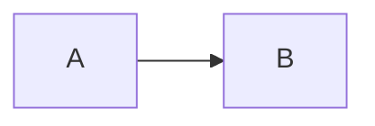
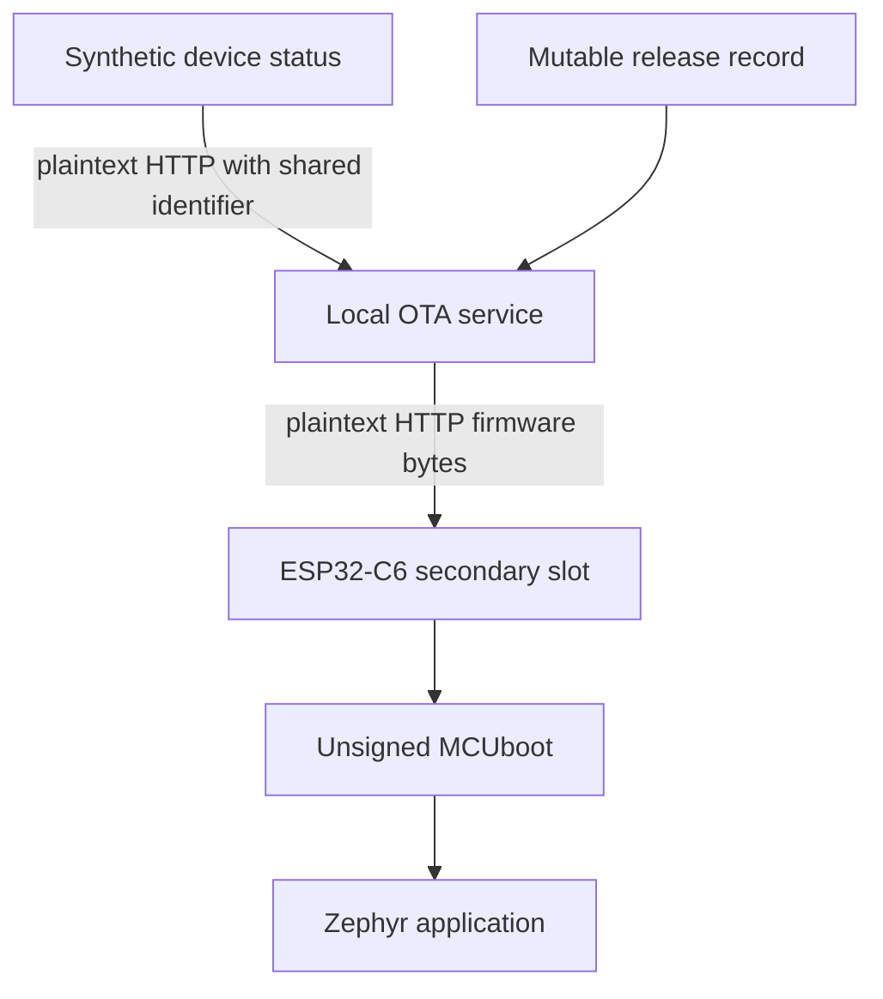
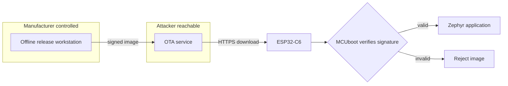

# Mermaid paste probe

## 1. Minimal

## 2. The real Tier 0 baseline architecture

No authenticated trust boundary exists in this Tier 0 path.

## 3. A trust boundary, which every control tier needs

## 4. Does a diagram survive a round trip

Export this page back to Markdown after pasting. Check whether section 2 comes
back as a `mermaid` fence or as something else.
