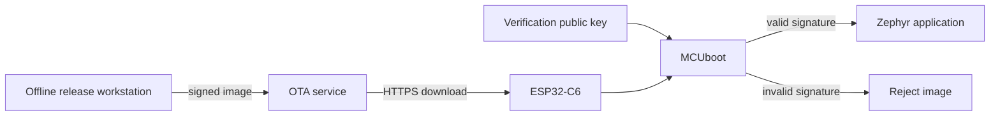

# Tier 3 review sheet: Firmware authenticity

> Prototype variant B: evidence-first review sheet. This is throwaway course
> material.

## Tier status

| Item | Value |
|---|---|
| Starting state | Tier 2 HTTPS transport |
| Security claim | The device boots only manufacturer-approved application images |
| Main attack | Altered firmware from a trusted OTA service |
| New control | MCUboot image signature |
| Core limitation | MCUboot is not hardware-authenticated on this ESP32-C6 path |
| Next open weakness | Replay of an older valid signed image |

## Claim under review

**Claim FW-AUTH-1**: The tested update path rejects an application image that
does not have a valid manufacturer signature.

Status before this tier: **unsupported**

Target status after this tier: **supported for the tested software-rooted update
path**

## Evidence board

Complete this board as you work.

| Evidence ID | Question | Required observation | Result |
|---|---|---|---|
| E-3-01 | Can an unsigned image boot before hardening? | Yes | Pending |
| E-3-02 | Can a correctly signed image boot after hardening? | Yes | Pending |
| E-3-03 | Is an unsigned image rejected after hardening? | Yes | Pending |
| E-3-04 | Is a modified signed image rejected? | Yes | Pending |
| E-3-05 | Is an image signed by the wrong key rejected? | Yes | Pending |
| E-3-06 | Is the private signing key absent from the OTA service? | Yes | Pending |

## Boundary map



The release workstation authorizes firmware. The OTA service distributes it.
MCUboot verifies it. HTTPS protects the connection but does not authorize the
firmware publisher.

## Attack card

**Permitted target**: Your local reference product and course OTA service.

**Attack vector**: Replace the application image on the trusted OTA service.

**Expected result before hardening**: The altered unsigned image runs.

**Expected result after hardening**: MCUboot rejects the image and keeps the
last accepted image.

Run:

```text
./course tier start 3
./course attack unsigned-image
./course device update --release attack-unsigned
```

Capture:

- Firmware version.
- LED behavior.
- Download result.
- Boot result.

## Control card

Create and apply a disposable release-signing key:

```text
./course keys create firmware-release
./course harden signed-images
./course build
./course release publish tier-3-signed
./course device update --release tier-3-signed
```

Expected result:

```text
signature verification: enabled
signed release: accepted
private signing key on OTA service: no
```

## Challenge matrix

```text
./course verify tier-3
```

| Challenge | Expected behavior | Evidence ID |
|---|---|---|
| Correctly signed image | Boot | E-3-02 |
| Unsigned image | Reject | E-3-03 |
| Modified image | Reject | E-3-04 |
| Image signed by another key | Reject | E-3-05 |
| Truncated image | Reject | E-3-04 |
| Search OTA service for private key | No key found | E-3-06 |

If a challenge produces another result, leave the claim unsupported. Record the
actual result before troubleshooting.

## Weakness ledger delta

| Weakness | Before | After | Disposition |
|---|---|---|---|
| Unsigned application accepted | Exploitable | Rejected in tested path | Closed |
| OTA host changes image | Exploitable | Changed image rejected | Reduced |
| Older signed image replay | Exploitable | Still exploitable | Tier 4 |
| Physical bootloader replacement | Exploitable | Still exploitable | Advanced Tier A |

## Residual risk

The application signature is anchored in MCUboot, but standard Zephyr MCUboot
is not anchored in ESP32-C6 Secure Boot v2 in the core course. A physical
attacker who replaces MCUboot can also replace its verification key.

Do not mark the claim as hardware-rooted.

## Evidence pack update

Attach:

- Signing and verification public-key fingerprint.
- Build manifest.
- Signed image digest.
- Challenge matrix output.
- Proof that the OTA service has no private signing key.
- Source revision and configuration.

Set **FW-AUTH-1** to supported only when E-3-02 through E-3-06 match the expected
results.

## Troubleshooting path

1. Confirm the active bootloader was rebuilt.
2. Compare the image signing key with the embedded verification key.
3. Clean the build and record the new build manifest.
4. Check that the attack fixture did not reuse a signed image.
5. Ask the mentor to inspect the boundary with you.

## Mentor conversation

Use the evidence board rather than a score.

- Show one accepted image and one rejected image.
- Explain why the OTA server does not hold the signing key.
- Diagnose one prepared wrong-key or stale-bootloader case.
- Agree whether to continue, continue with notes, or resolve a safety
  prerequisite first.

## Next tier

Tier 4 adds signed release metadata, hardware compatibility checks, and a
security counter. It addresses authentic-but-wrong firmware.

## References

- [Zephyr binary signing](https://docs.zephyrproject.org/latest/build/signing/index.html)
- [MCUboot design](https://docs.mcuboot.com/design.html)
- [MCUboot image tool](https://docs.mcuboot.com/imgtool.html)
